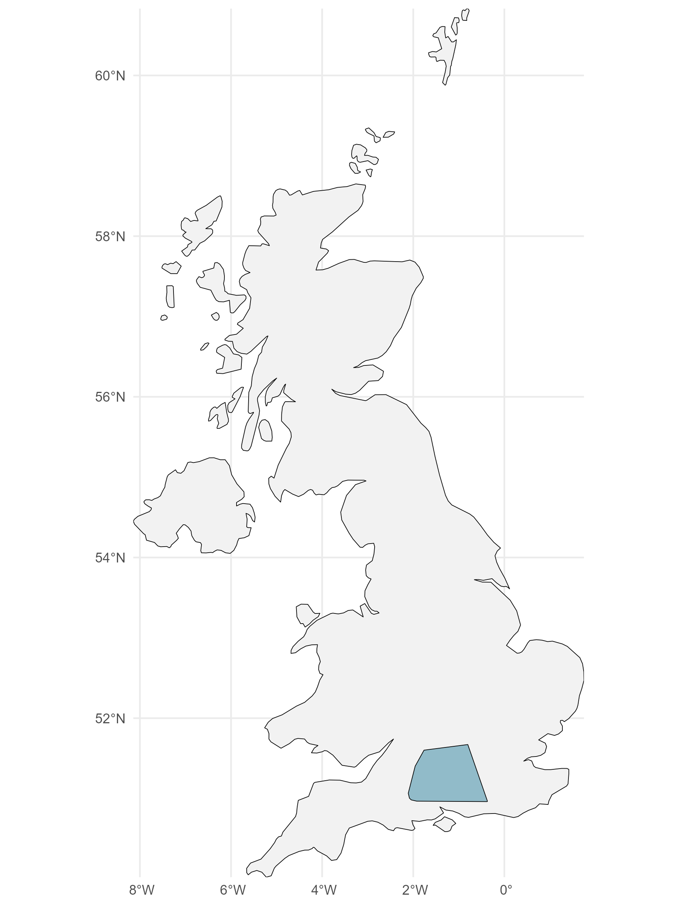
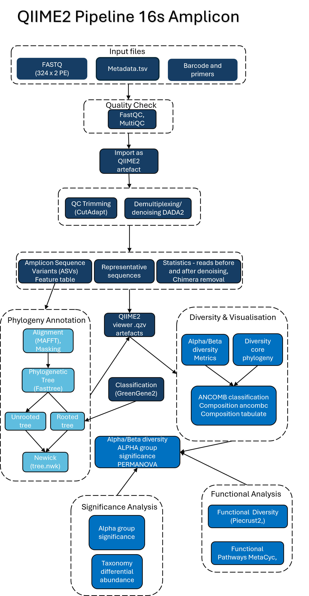
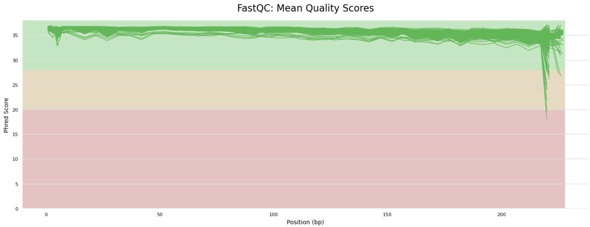
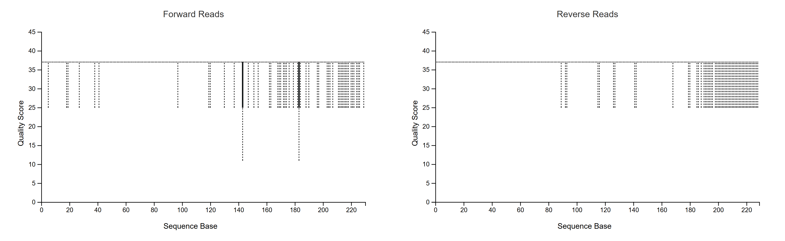
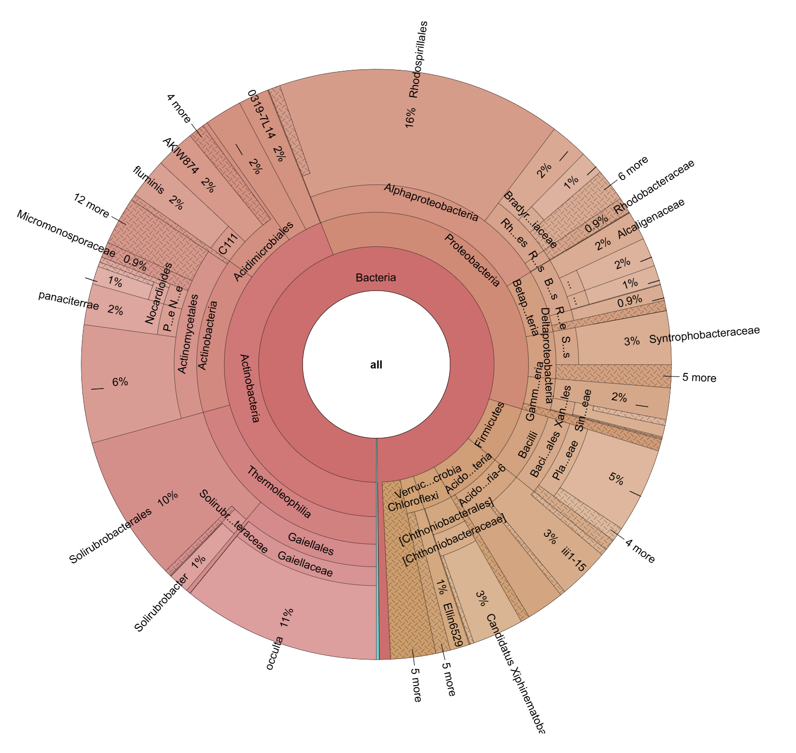
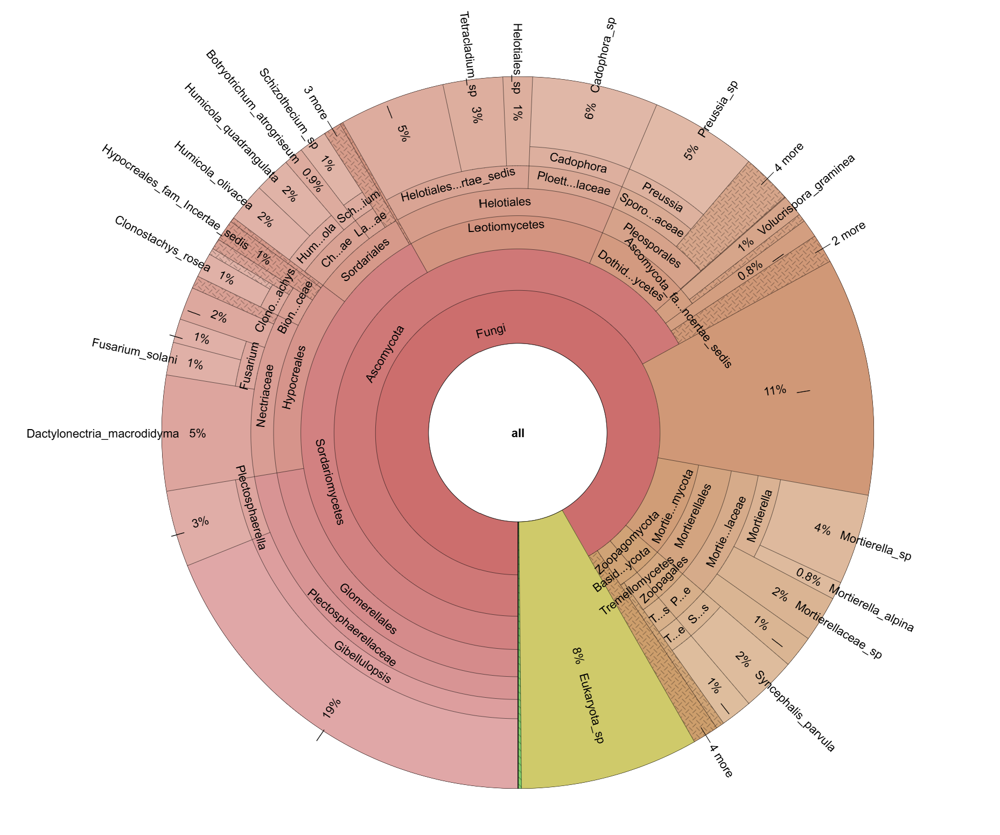

```{r title-centre, echo=FALSE, results='asis'}
cat('
<style>
h1.title {
  text-align: center;
}
iframe {
  max-width: 100%;
  width: 100%;
  min-width: 0;
  border: none;
}

</style>
')
```

```{r custom-header, echo=FALSE, results='asis'}
cat('


<style>

body {
  font-size: 18px;
  line-height: 1.6;
}

/* Agrandir les titres */
h1, h2, h3, h4, h5 {
  font-weight: bold;
}

h1 {
  font-size: 32px;
}

h2 {
  font-size: 26px;
}

h3 {
  font-size: 22px;
}

h4 {
  font-size: 20px;
}

h5 {
  font-size: 18px;
}

p {
  font-size: 18px;
}
ul, ol, li {
  font-size: 18px;
}

body, .main-container {
  max-width: 95%;
  margin: 0 auto;
  font-size: 1.05rem;
}


.header-bar {
  position: fixed;
  top: 0;
  left: 0;
  width: 100%;
  background-color: white;
  color: #3780AE; 
  display: flex;
  align-items: center;
  padding: 10px 20px;
  z-index: 9999;
  box-shadow: 0 2px 4px rgba(0,0,0,0.1);
  font-size: 22px;
  font-weight: bold;
}


.header-bar img {
  height: 45px;
  margin-right: 15px;
}


.header-text {
  text-align: left;
}


body {
  padding-top: 70px;
}


@media (max-width: 768px) {
  .header-bar {
    font-size: 18px;
    padding: 8px 10px;
  }
  .header-bar img {
    height: 35px;
    margin-right: 10px;
  }
}
</style>

<div class="header-bar">
  
  
  <div class="header-text">Dig Deeper - Microbial Community Analysis</div>
</div>
')
```

```{r setup, include=FALSE}
knitr::opts_chunk$set(plotly.use.cdn = TRUE)
knitr::opts_chunk$set(echo = FALSE, cache = FALSE, fig.width = 6, fig.height = 4, dpi = 100, warning = FALSE, message = FALSE)
```


```{r dependencies}
#loading the dependencies :
library(ggplot2)
library(plotly)
library(htmltools)
library(tidyverse)
library(dplyr)
library(jsonlite)
library(stringr)
library(tidyverse)
library(vegan)
library(readr)
library(DT)
library(FSA)
library(slickR)
library(glue)
library(sf)
library(RColorBrewer)
#library(rnaturalearth)
#library(rnaturalearthdata)
library(knitr)
library(kableExtra)
library(forcats)
```


## Introduction

Biodiversity loss, ecosystem degradation, and habitat destruction are increasingly linked to human-driven changes in land use, including **urbanisation**, **agriculture**, and the **exploitation of natural resources** (European Parliament, 2025; Jaureguiberry et al., 2022). In response, governments across Europe — including the EU — have introduced ambitious environmental strategies such as the **EU Biodiversity Strategy for 2030** (European Parliament, 2025) and the **30x30 target** (Markwick, 2023), which aims to protect *30% of land and sea* by the year 2030.

Ecological restoration plays a vital role in addressing these challenges. Rather than simply returning ecosystems to a previous state, modern approaches focus on **restoring ecological processes** and **enhancing ecosystem resilience** (Hicks, 2023).

### The **RestREco** Initiative

**RestREco** (*Restoring Resilient Ecosystems*) is a **NERC-funded** research project that adopts a *resilience-based* perspective on ecological restoration. The initiative brings together researchers from:

- **Cranfield University**  
- **University of Stirling**
- **UK Centre for Ecology & Hydrology**  
- **The National Trust**  
- **Forest Research**

Using a **natural experiment design**, RestREco studies a network of **133 ecological restoration sites** across **England and Scotland**. The project aims to identify key drivers of ecosystem development, such as:

- **Time since restoration began**  
- **Initial ecological conditions**  
- **Proximity to existing woodland and grassland**

The goal is to understand how these factors influence ecosystem **complexity**, **function**, and **resilience** to future pressures (RestREco, 2024).

### The **Dig Deeper** Study

As part of the RestREco initiative, the **Dig Deeper** study focused on how the *age of restoration*, *establishment type*, and *site management* affect **soil microbial communities**, specifically **bacteria** and **fungi**.

To explore this, high-throughput sequencing was conducted on:

- **16S rRNA gene** (for bacterial communities)  
- **ITS region** (for fungal communities)

The analysis focused on three main aspects:

- **Alpha and beta diversity**  
- **Taxonomic composition**  
- **Functional diversity**

These microbial assessments complement broader ecosystem-level measurements within the **RestREco project**, including **vegetation**, **invertebrates**, and ecosystem functions such as **litter decomposition**, **pollination services**, and **soil thermodynamic efficiency**.

The following sections describe the sampling design, metadata structure, and the processing pipeline used to characterise microbial communities.

### **Research Questions** and **Hypotheses**

This study investigates how **grassland site age**, **establishment method**, **management practices**, and **soil pH** influence the **diversity**, **taxonomic composition**, and **functional profiles** of bacterial and fungal communities during restoration. It also explores the **interactions between bacteria and fungi**, focusing on potential correlations between microbial taxa, functional pathways, and fungal guilds.

The following hypotheses were formulated:

1. **Site age**, **establishment method** (green hay/bush (GH), seed mix (SM), natural regeneration (NR)), **management type** (cutting, ploughing, sheep, cattle), and **pH** affect **alpha** and **beta diversity** in bacterial and fungal communities.
2. These same variables influence the **taxonomic composition** of soil microbial communities.
3. **Age**, **establishment method**, and **pH** influence the **functional diversity** of bacterial and fungal communities.
4. There are **correlations in taxon abundance** between bacterial and fungal groups.
5. There are **correlations in the abundance of functional pathways and guilds** between bacterial and fungal communities.

---


## Sample Design and Metadata Overview

### Sample Collection and Geographic Coverage


A total of **330 soil samples** were collected in 66 sites of England for each marker (5 per site). 


```{r table, echo=FALSE, message=FALSE, warning=FALSE, results='asis'}


sampling_summary <- data.frame(
  Metric = c(
    "Microbial group",
    "Region sampled",
    "Number of sites",
    "Samples per site",
    "Total samples",
    "Average reads per sample",
    "Read count range"
  ),
  `16S` = c(
    "Bacteria",
    "England",
    "66",
    "5",
    "330",
    "~65,000",
    "30,000–85,000"
  ),
  `ITS` = c(
    "Fungi",
    "England",
    "66",
    "5",
    "330",
    "~65,000",
    "10,000–90,000"
  ),
  check.names = FALSE
)


table_html <- kable(sampling_summary, "html", escape = FALSE, align = "lcc",
      caption = "Overview of the soil sampling and sequencing strategy for each microbial marker.") %>%
  kable_styling(bootstrap_options = c("striped", "hover", "condensed", "responsive", "bordered"),
                full_width = FALSE, position = "center") %>%
  column_spec(1, bold = TRUE) %>%
  row_spec(0, bold = TRUE, background = "#d9eaf7")

```


```{r map-table, echo=FALSE, message=FALSE, warning=FALSE}
htmltools::HTML('
<div style="display: flex; justify-content: center; align-items: flex-start; gap: 40px;">

  <div style="flex: 1; text-align: center;">
    
    <p style="font-weight: bold;">Sample Zone - Based on GPS coordinates</p>
  </div>

  <div style="flex: 1;text-align: center;">
    ', table_html, '
    <p style="font-weight: bold;">Sampling Summary</p>
  </div>

</div></br></br>
')

```

### Metadata Overview

Each sample collected was accompanied by metadata capturing key environmental and management variables. These contextual factors were essential for interpreting variation in microbial diversity.

```{r metadata-info, echo=FALSE, message=FALSE, warning=FALSE}
metadata_overview <- data.frame(
  Variable = c(
    "Site", "Plot number", "CU Code", "Year_est", "Age",
    "Latitude/Longitude", "Establishment", "pH", "EC",
    "Cutting", "Cattle", "Sheep", "Plough"
  ),
  Description = c(
    "Name of the sampling site",
    "Subdivision of each site (usually 5 plots per site)",
    "Unique code for each sample",
    "Year of establishment of the site",
    "Site age (ranging from 1 year to over 100 years )",
    "GPS coordinates of the sample",
    "Restoration type or land management",
    "Soil pH value at the time of sampling",
    "Electrical conductivity of the soil",
    "Whether the site is cut (1 = Yes, 0 = No)",
    "Presence of cattle grazing (1 = Yes, 0 = No)",
    "Presence of sheep grazing (1 = Yes, 0 = No)",
    "Whether the soil has been ploughed (1 = Yes, 0 = No)"
  )
)

kable(metadata_overview, format = "html", escape = FALSE,
      caption = "Description of metadata variables associated with soil samples") %>%
  kable_styling(bootstrap_options = c("striped", "hover", "condensed", "bordered"),
                full_width = FALSE, position = "center") %>%
  column_spec(1, bold = TRUE) %>%
  row_spec(0, bold = TRUE, background = "#d9eaf7")

HTML("</br><p style='text-align: center; font-weight: bold;'>Metadata Summary</p>")

```

---

## Analysis Pipeline

### Sample Processing and Sequencing Overview

A total of 330 soil samples were collected across 66 sites (five per site) by the **RestREco** team. After sieving (2 mm), all samples were frozen until DNA extraction, which was performed using the **QIAGEN PowerSoil** kit. Amplicon sequencing targeted two regions: the **V4–V5 region of the bacterial 16S rRNA gene** and the **ITS1 region of the fungal ITS gene**. Sequencing was carried out by **Novagene** using **Illumina paired-end reads** (2×250 bp), resulting in **660 FASTQ files per marker** (forward and reverse reads per sample). Metadata accompanying each sample included site characteristics (location, year of establishment, method), management practices (cutting, ploughing, grazing), and soil physicochemical properties.

### 16S Amplicon Processing

Quality control of 16S reads was performed using **FastQC v0.12.1** and summarised with **MultiQC v1.14**. A custom Bash script (`S02_qc.sh`) ensured correct pairing of reads and removed five incomplete samples. Sequences were then imported into **QIIME2 v2022.10** using the `PairedEndFastqManifestPhred33V2` format, and primers were removed with **CutAdapt v4.4**. Read quality was visualised using `qiime demux summarize`.

Denoising and read pairing were performed using the **DADA2 plugin (QIIME2 v2024.2)**, generating ASV feature tables, representative sequences, and denoising statistics. Low-abundance ASVs (<10 reads) and singletons were filtered out. Representative sequences were aligned using **MAFFT** and used to build phylogenetic trees with **FastTree**.

The ASV table was aggregated at the **site level** using a median-ceiling method, and rarefaction analysis was used to determine a sampling depth of **9473 reads/sample**. Alpha (Observed Features, Shannon, Evenness, Faith’s PD) and beta diversity (UniFrac, Jaccard, Bray-Curtis) metrics were calculated using this rarefied table and the rooted tree. Group comparisons (e.g., by establishment, livestock, pH) were assessed using **Kruskal-Wallis (alpha)** and **PERMANOVA (beta)**.

Taxonomy was assigned using a **Naive Bayes classifier trained on Greengenes 13_8 (515F/806R)**. Taxonomic barplots were created from feature tables grouped by site. Tables were then collapsed at genus and family levels for **ANCOM** differential abundance testing. Pseudocounts were added where required.

Predicted functional profiles were generated using **PICRUSt2** to infer KEGG Orthology (KO), EC numbers, and pathways. High-abundance pathways were retained (≥600,000 reads in ≥60 samples), and visualised with heatmaps across metadata variables. Functional differential abundance was assessed using **ANCOM**.

Functional alpha and beta diversity metrics were also computed, and significance was tested per metadata variable, using **Kruskal-Wallis** and **PERMANOVA**, respectively.

### ITS Amplicon Processing

Fungal ITS1 reads were processed using **ITSxpress v2.1.4**, which performed adapter trimming and retained fungal ITS1 regions. Quality was assessed with **FastQC** and summarised using **MultiQC v1.28** (`F01_itsexpress.sh`). Trimmed reads were imported into **QIIME2 v2024.10**, and denoised using **DADA2** with no truncation.

ASV tables were aggregated by site and taxonomic assignment was performed using a pre-trained classifier based on the **UNITE v10 database**. Diversity analyses (Observed Features, Shannon, Evenness, Jaccard, Bray-Curtis) were conducted using a rarefied depth of **30,000 reads/sample**, and visualised using **PCoA** and **Emperor** plots. Significance testing followed the same approach as for 16S (**Kruskal-Wallis** and **PERMANOVA**).

Taxonomic tables were collapsed at the genus level for **ANCOM** analyses. Ecological functional guilds were predicted using **FUNGuild v1.1**, based on collapsed species-level data formatted with custom Python scripts. Functional diversity metrics were then computed at the **guild level**, and visualised using core-metrics tools at a rarefied depth of **11,000 reads/sample**. Significance was assessed using **Kruskal-Wallis** and **PERMANOVA** (`F09` and `F10` scripts).

### 16S–ITS Correlation Analyses

To explore inter-kingdom interactions, **correlation analyses** were conducted between bacterial and fungal taxa and between predicted bacterial pathways (**PICRUSt2**) and fungal functional guilds (**FUNGuild**). Using **R v4.4.2** and the `psych::corr.test` function, **Pearson correlations** were calculated at the genus level. Results were adjusted using **Holm-Bonferroni** correction. Only strong and significant correlations (e.g., |r| > 0.7, adjusted p ≤ 0.05) were retained after filtering. Additional filters removed taxa/guilds with low overall abundance.

For functional correlations, similar thresholds were applied, but due to limited signal strength, analyses were interpreted conservatively and filtered results were reported alongside raw values when relevant.

### Summary of Pipeline

```{r 16S-pipeline, echo=FALSE, message=FALSE,warning=FALSE, results='asis'}

cat('
<div style="text-align: center;">
  
  </br><p style="font-weight: bold;">Workflow (16S)</p>
</div>
')

```

---

## Data Pre-Processing

### MutliQC on raw data {.tabset}

#### Bacteria (16S) {.unnumbered}

You can explore the full **MultiQC report** by **clicking** the image below:

```{r QC,echo=FALSE, message=FALSE, warning=FALSE, results='asis'}

cat('
<div style="text-align: center;">
  <a href="data/16S/Pre_processing/multiqc_report_16S.html" target="_blank">
    
  </a>
  <p style="font-style: bold;">MultiQC Plot (16S)</p>
</div>
')


```


#### Fungi (ITS) {.unnumbered}


You can explore the full **MultiQC report** by **clicking** the image below:

```{r QC-ITS,echo=FALSE, message=FALSE, warning=FALSE, results='asis'}

cat('
<div style="text-align: center;">
  <a href="data/ITS/Pre-processing/F01_multiqc_report.html" target="_blank">
    
  </a>
  <p style="font-style: bold;">MultiQC Plot (ITS)</p>
</div>
')


```

### QC after denoising

#### Statistics Table Summary {.tabset}

After denoising, quality control (QC) metrics provide essential insights into the effectiveness of the data processing steps and the overall quality of the resulting feature table. This summary table presents key statistics for each sample, including the number of input reads, filtered reads, and final feature counts after denoising. These metrics help assess sequencing success, identify potential outliers, and ensure that sufficient data remain for robust downstream analyses. Samples with unusually low read counts or feature richness may need to be excluded or interpreted with caution.

##### Bacteria (16S) {.unnumbered}

```{r denoising-stats-table, echo=FALSE, message=FALSE, results='asis'}


df <- read.delim("data/16S/Pre_processing/s04_stats_dada2/data/metadata.tsv", comment.char = "#")

cat('Here is a link to the **statistics after denoising** to view it on QIIME2 (16S) : <a href="data/16S/s04_stats_dada2/data/index.html" target="_blank">Statitics after denoising (16S)</a>')

datatable(
  df,
  options = list(
    pageLength = 10,
    scrollX = TRUE,
    autoWidth = TRUE,
    dom = 'tip',
    class = 'stripe hover row-border order-column',
    initComplete = JS(
      "function(settings, json) {",
      "$(this.api().table().header()).css({'background-color': '#d9eaf7', 'font-weight': 'bold'});",
      "}")
  ),
  class = "display nowrap compact",
  rownames = FALSE
) %>% 
  formatStyle(
    columns = names(df),
    `text-align` = 'center'
  )


HTML("<p style='text-align: center; font-weight: bold;'>Statitics after denoising (16S)</p>")

```

##### Fungi (ITS) {.unnumbered}

```{r denoising-stats-table-ITS, echo=FALSE, message=FALSE, results='asis'}


df <- read.delim("data/ITS/Pre-processing/F02_dada2-stats-summ/data/metadata.tsv", comment.char = "#")

cat('Here is a link to the **statistics after denoising** to view it on QIIME2 (ITS) : <a href="data/ITS/Pre-processing/F02_dada2-stats-summ/data/index.html" target="_blank">Statitics after denoising (16S)</a>')

datatable(
  df,
  options = list(
    pageLength = 10,
    scrollX = TRUE,
    autoWidth = TRUE,
    dom = 'tip',
    class = 'stripe hover row-border order-column',
    initComplete = JS(
      "function(settings, json) {",
      "$(this.api().table().header()).css({'background-color': '#d9eaf7', 'font-weight': 'bold'});",
      "}")
  ),
  class = "display nowrap compact",
  rownames = FALSE
) %>% 
  formatStyle(
    columns = names(df),
    `text-align` = 'center'
  )


HTML("<p style='text-align: center; font-weight: bold;'>Statitics after denoising (ITS)</p>")

```


#### QC Plots {.tabset }

These **Quality Control (QC) plots** were generated **after trimming** the sequencing reads. They provide a visual summary of the **base quality scores**, **read length distributions**, and other metrics, helping to assess whether the trimming step successfully removed low-quality regions and adapter contamination. Consistently high-quality reads across samples are essential for reliable downstream analysis.

##### Bacteria (16S) {.unnumbered}


<div style="text-align: center;">
  <a href="data/16S/Pre_processing/s03_pe_dmx_trim/data/index.html" target="_blank">
    
  </a>
  <p style="font-style: bold;">QC plot (16S)</p>
</div>


##### Fungi (ITS) {.unnumbered}


<div style="text-align: center;">
  <a href="data/ITS/Pre-processing/F02_sequence/data/index.html" target="_blank">
    
  </a>
  <p style="font-style: bold;">QC plot (ITS)</p>
</div>


#### Rarefication Curves {.tabset}

**Rarefaction** curves provide a visual tool to assess sequencing depth and compare species richness between samples. In this study, rarefaction curves were generated separately for bacterial (16S rRNA gene) and fungal (ITS) communities, using the number of observed features—i.e., unique ASVs—as a proxy for richness.

For both bacteria and fungi, the shape of each curve indicates whether sequencing depth was sufficient to capture most of the diversity in a given sample. Curves that level off suggest that a representative portion of the community has been sampled, whereas rising curves indicate that additional sequencing could reveal further diversity.

This step is crucial to ensure that downstream diversity analyses are not biased by unequal sampling effort.

##### Bacteria (16S) 

Here is a link to the **Rarefiction plots** for more flexibility on QIIME2: <a href="data/16S/alpha_rarefaction/data/index.html" target="_blank">Rarefiction plots (16S)</a>

<div style="margin-bottom: 20px;">
  <label for="variable_selector_rarefaction_16S"><b>Select variable:</b></label>
  <select id="variable_selector_rarefaction_16S" onchange="switchPlotRarefaction_16S()">
    <option value="Establishment" selected>Establishment</option>
    <option value="Age">Age</option>
    <option value="Year_est">Year of Establishment</option>
    <option value="OS_location">Os Location</option>
    <option value="Plough">Plough</option>
    <option value="Lat_long">Lat/long</option>
  </select>
</div>

```{r rarefication_est_16S, echo=FALSE, message=FALSE, warning=FALSE, results='asis'}
vars <- c("Establishment", "Age", "Year_est", "OS_location", "Lat_long", "Plough")

rare_df <- read_csv("data/16S/Pre_processing/alpha_rarefaction/data/observed_features.csv")
measure_cols <- grep("^depth-", names(rare_df), value = TRUE)
meta_cols <- setdiff(names(rare_df), c("sample-id", measure_cols))

rare_long <- rare_df %>%
  pivot_longer(cols = all_of(measure_cols), names_to = "depth_iter", values_to = "observed") %>%
  mutate(
    depth = as.integer(str_extract(depth_iter, "(?<=depth-)\\d+")),
    iter = as.integer(str_extract(depth_iter, "(?<=iter-)\\d+"))
  ) %>%
  left_join(rare_df[, c("sample-id", meta_cols)], by = "sample-id")


plotlist_rarefaction_16S <- list()

for (v in vars){
  var_col <- if (paste0(v, ".y") %in% names(rare_long)) paste0(v, ".y") else v
  
  rare_avg <- rare_long %>%
    group_by(.data[[var_col]], depth) %>%
    summarise(mean_obs = mean(observed, na.rm = TRUE), .groups = "drop") %>%
    rename(group_var = 1) 

  #visible <- ifelse(v == "Establishment", "block", "none")
  
  plot_rare <- plot_ly(
  data = rare_avg,
  x = ~depth,
  y = ~mean_obs,
  color = ~group_var,  
  type = 'scatter',
  mode = 'lines+markers',
  marker = list(size = 5, symbol = 'square-open'),
  line = list(width = 0.5)
) %>%
  layout(
    title = paste0("Rarefaction Curves by ", v, " (Mean per Depth)"),
    xaxis = list(title = "Sequencing Depth"),
    yaxis = list(title = "Mean Observed Features"),
    template = "plotly_white"
  )
  
  plotlist_rarefaction_16S[[v]] <- tags$div(
      id = paste0("plot_rarefaction_16S_", v),
      style = ifelse(v == "Establishment", "display:block;", "display:none; text-align:center;"),
      plot_rare,
      tags$br(),
      tags$p(
        style = "text-align: center; font-weight: bold;",
        sprintf("Rarefaction Curves of Observed Features by '%s' (16S)", v)
      )
    )
  
 
}


tagList(plotlist_rarefaction_16S)

```


<script>
function switchPlotRarefaction_16S() {
  var val = document.getElementById("variable_selector_rarefaction_16S").value;
  var all = ["Establishment", "Age", "Year_est", "OS_location", "Plough", "Lat_long"];
  
  all.forEach(function(v) {
    var el = document.getElementById("plot_rarefaction_16S_" + v);
    if (el) {
      el.style.display = (v === val) ? "block" : "none";
    }
  });
}
</script>


---

##### Fungi (ITS)

Here is a link to the **Rarefiction plots** for more flexibility on QIIME2: <a href="data/ITS/Pre-processing/F02_aggregated_rarefaction/data/index.html" target="_blank">Rarefiction plots (ITS)</a>

<div style="margin-bottom: 20px;">
  <label for="variable_selector_rarefaction_ITS"><b>Select variable:</b></label>
  <select id="variable_selector_rarefaction_ITS" onchange="switchPlotRarefaction_ITS()">
    <option value="OS_location">Os Location</option>
    <option value="CU Code">CU Code</option>
    <option value="Lat_long">Lat/long</option>
    
  </select>
</div>

```{r rarefication_est_itS, echo=FALSE, message=FALSE, warning=FALSE, results='asis'}
vars <- c( "OS_location", "CU Code", "Lat_long")

rare_df <- read_csv("data/ITS/Pre-processing/F02_aggregated_rarefaction/data/observed_features.csv")
measure_cols <- grep("^depth-", names(rare_df), value = TRUE)
meta_cols <- setdiff(names(rare_df), c("sample-id", measure_cols))

rare_long <- rare_df %>%
  pivot_longer(cols = all_of(measure_cols), names_to = "depth_iter", values_to = "observed") %>%
  mutate(
    depth = as.integer(str_extract(depth_iter, "(?<=depth-)\\d+")),
    iter = as.integer(str_extract(depth_iter, "(?<=iter-)\\d+"))
  ) %>%
  left_join(rare_df[, c("sample-id", meta_cols)], by = "sample-id")


plotlist_rarefaction_ITS <- list()

for (v in vars){
  var_col <- if (paste0(v, ".y") %in% names(rare_long)) paste0(v, ".y") else v
  
  rare_avg <- rare_long %>%
    group_by(.data[[var_col]], depth) %>%
    summarise(mean_obs = mean(observed, na.rm = TRUE), .groups = "drop") %>%
    rename(group_var = 1) 

  
   plot_rare <- plot_ly(
  data = rare_avg,
  x = ~depth,
  y = ~mean_obs,
  color = ~group_var,  
  type = 'scatter',
  mode = 'lines+markers',
  marker = list(size = 5, symbol = 'square-open'),
  line = list(width = 0.5)
) %>%
  layout(
    title = paste0("Rarefaction Curves by ", v, " (Mean per Depth)"),
    xaxis = list(title = "Sequencing Depth"),
    yaxis = list(title = "Mean Observed Features"),
    template = "plotly_white"
  )
  
  plotlist_rarefaction_ITS[[v]] <- tags$div(
      id = paste0("plot_rarefaction_ITS_", v),
      style = ifelse(v == "OS_location", "display:block;", "display:none; text-align:center;"),
      plot_rare,
      tags$br(),
      tags$p(
        style = "text-align: center; font-weight: bold;",
        sprintf("Rarefaction Curves of Observed Features by '%s' (ITS)", v)
      )
    )
  
 
}


tagList(plotlist_rarefaction_ITS)

```


<script>
function switchPlotRarefaction_ITS() {
  var val = document.getElementById("variable_selector_rarefaction_ITS").value;
  var all = ["OS_location", "CU Code", "Lat_long"];
  
  all.forEach(function(v) {
    var el = document.getElementById("plot_rarefaction_ITS_" + v);
    if (el) {
      el.style.display = (v === val) ? "block" : "none";
    }
  });
}
</script>


---

## **Taxonomic Diversity** (Bacteria & Fungi)

**Summary**  
Microbial taxonomic diversity revealed clear responses to restoration strategies. For bacteria, establishment method was the strongest driver of alpha and beta diversity, followed by pH and grazing. For fungi, pH and age were more influential. NR sites generally showed lower bacterial diversity and functional richness than GH and SM.


### Alpha Diversity {.tabset}

Alpha diversity refers to the variety of organisms within a particular sample or environment. It reflects both **richness**—the number of distinct taxa—and **evenness**—how evenly individuals are distributed among those taxa. One of the most widely used measures for assessing alpha diversity is the **Shannon index**.

The Shannon index takes into account not only the number of species present, but also how evenly their abundances are distributed. A higher Shannon value generally indicates a more diverse and ecologically balanced community.

Another important metric is **Faith’s Phylogenetic Diversity (Faith PD)**, which measures the total branch length of the phylogenetic tree that spans the species in a sample. Unlike the Shannon index, Faith PD incorporates evolutionary relationships, providing a phylogenetic perspective on diversity.

We also include **Pielou’s Evenness index**, which specifically quantifies how equally individual organisms are distributed across taxa. While Shannon integrates both richness and evenness, this metric isolates the evenness component, providing a complementary view of diversity patterns.


To allow interactive exploration of alpha diversity metrics across different environmental variables, we implemented a drop-down menu that dynamically displays the corresponding plots. Some variables, such as `pH category`, are only present in the ITS dataset, while others, like `Year group`, are specific to the 16S dataset. Internally, variables are mapped to their dataset-specific equivalents where needed (e.g. `Age group` in 16S becomes `Age category` in ITS). It is important to note, however, that these variables are not always directly comparable: for instance, `Age group` (16S) divides sites into multiple discrete intervals based on restoration age, while `Age category` (ITS) is a binary classification based on whether a site is above or below the median age. Despite these differences, the interface ensures that only available and relevant plots are shown for each selection.


**Summary**  
Bacterial alpha diversity (Shannon, Faith PD, Evenness) significantly varied with establishment method. GH and SM showed greater diversity than NR. For fungi, alpha diversity was more sensitive to pH and site age, with lower diversity observed in alkaline and older soils.


```{r alpha-plots, echo=FALSE, message=FALSE, warning=FALSE, results='asis'}
read_and_clean <- function(path, column) {
  df <- read_tsv(path, col_types = cols())[-1, ]
  df[[column]] <- as.numeric(df[[column]])
  return(df)
}

# 16S data
df_shannon_16S <- read_and_clean("data/16S/alpha_diversity/s08_alpha_shannon_per_group/data/metadata.tsv", "shannon_entropy")
df_faith_16S   <- read_and_clean("data/16S/alpha_diversity/s08_alpha_faith_pd_per_group/data/metadata.tsv", "faith_pd")
df_even_16S    <- read_and_clean("data/16S/alpha_diversity/s08_alpha_evenness_per_group/data/metadata.tsv", "pielou_evenness")


# ITS data
df_shannon_ITS1 <- read_and_clean("data/ITS/Alpha_Diversity/F03_shannon_significance/data/metadata.tsv", "shannon_entropy")
df_even_ITS1  <- read_and_clean("data/ITS/Alpha_Diversity/F03_evenness_vector/data/metadata.tsv", "pielou_evenness")


df_shannon_ITS1 <- df_shannon_ITS1[ , ! colnames(df_shannon_ITS1) %in% c("site_code", "plot_number", "OS_location", "Lat_long")]


get_mode <- function(x) {
  ux <- na.omit(unique(x))
  ux[which.max(tabulate(match(x, ux)))]
}

df_shannon_ITS1 <- df_shannon_ITS1 %>%
  group_by(Site) %>%
  summarise(
    shannon_entropy = mean(shannon_entropy, na.rm = TRUE),
    pH_category = get_mode(pH_category),
    across(c(Establishment, Age_category, Cutting, Plough, Sheep, Cattle, Year_est), ~ first(.x)),
    .groups = "drop"
  )

df_even_ITS1 <- df_even_ITS1[ , ! colnames(df_even_ITS1) %in% c("site_code", "plot_number", "OS_location", "Lat_long")]
df_even_ITS1 <- df_even_ITS1 %>%
  group_by(Site) %>%
  summarise(
    pielou_evenness = mean(pielou_evenness, na.rm = TRUE),
    pH_category = get_mode(pH_category),
    across(c(Establishment, Age_category, Cutting, Plough, Sheep, Cattle, Year_est), ~ first(.x)),
    .groups = "drop"
  )

df_shannon_Plough <- df_shannon_16S %>% filter(Plough != "unknown")
df_faith_Plough <- df_faith_16S %>% filter(Plough != "unknown")
df_even_Plough <- df_even_16S %>% filter(Plough != "unknown")

df_shannon_ITS_Plough <- df_shannon_ITS1 %>% filter(!is.na(Plough))
df_even_ITS_Plough <- df_even_ITS1 %>% filter(!is.na(Plough))

vars16S <- c("Establishment", "Cutting", "Cattle", "Sheep", "Plough", "Year_group", "Age_group", "pH_binary", "Age_binary")
varsITS <- c("Establishment", "Cutting", "Cattle", "Sheep", "Plough", "Age_category", "pH_category")


```


#### Bacteria (16S) {.tabset}

In the plots below, we examine how the Shannon index, Faith PD and Evenness vary across different environmental and experimental conditions for the 16S (bacteria).

<label for="variable_selector_Alpha16S">Select variable:</label>
<select id="variable_selector_Alpha16S" onchange="switchPlotAlpha16S()">
  <option value="Establishment" selected>Establishment</option>
  <option value="Cutting">Cutting</option>
  <option value="Cattle">Cattle</option>
  <option value="Sheep">Sheep</option>
  <option value="Plough">Plough</option>
  <option value="Year_group">Year group</option>
  <option value="Age_group">Age group</option>
  <option value="pH_binary">pH binary</option>
  <option value="Age_binary">Age binary</option>
</select>


##### Shannon Index Boxplot 

The boxplot below illustrate differences in Shannon diversity across groups. This metric reflects both species richness and how balanced the community is in terms of species abundance.

Here is a link to the <strong>full QIIME2 results (16S)</strong> : 
<a href="data/16S/alpha_diversity/s08_alpha_shannon_per_group/data/index.html" target="_blank">Shannon Index (16S)</a>

Shannon entropy revealed significant overall differences, with green hay/bush sites showing higher diversity than both natural regeneration and seed mix sites. Seed mix sites also had higher Shannon diversity than natural regeneration.

```{r shannon-16S-plots, echo=FALSE, message=FALSE, warning=FALSE, results='asis'}


for (var in vars16S) {
  
  
  
  df_shannon <- if (var == "Plough") get("df_shannon_Plough") else get("df_shannon_16S")
  
  summary_stats <- df_shannon %>%
    group_by(.data[[var]]) %>%
    summarise(
      mean = round(mean(shannon_entropy, na.rm = TRUE), 2),
      median = round(median(shannon_entropy, na.rm = TRUE), 2),
      Q1 = round(quantile(shannon_entropy, 0.25, na.rm = TRUE), 2),
      Q3 = round(quantile(shannon_entropy, 0.75, na.rm = TRUE), 2)
    )

  display_style <- ifelse(var == "Establishment", "block", "none")
  cat(paste0('<div id="plot_', var, '_shannon" style="display:', display_style, ';">'))
  
  p1 <- ggplot(df_shannon, aes(x = .data[[var]], y = shannon_entropy)) +
    geom_boxplot(fill = "deepskyblue3") +
    stat_summary(fun = mean, geom = "point", shape = 20, size = 3, color = "darkblue") +
    geom_text(data = summary_stats, 
              aes(x = .data[[var]], y = mean, label =mean),
              color = "darkblue", vjust = 1.5, size = 3, inherit.aes = FALSE) +
    geom_text(data = summary_stats, 
              aes(x = .data[[var]], y = Q3, label = Q3),
              color = "black", vjust = -0.5, size = 3, inherit.aes = FALSE) +
    geom_text(data = summary_stats, 
              aes(x = .data[[var]], y = median, label = median),
              color = "black", vjust = -0.5, size = 3, inherit.aes = FALSE) +
    geom_text(data = summary_stats, 
              aes(x = .data[[var]], y = Q1, label = Q1),
              color = "black", vjust = 1.5, size = 3, inherit.aes = FALSE) +
    theme_minimal() +
    labs(x = var, y = "Shannon Index (16S)") +
    theme(axis.text.x = element_text(angle = 45, hjust = 1))

  kw <- kruskal.test(df_shannon$shannon_entropy ~ df_shannon[[var]])

  cat("<div style='text-align: center;'>") 
  print(p1)
  cat('</div>')
  cat(paste0("<p style='text-align: center;'>Kruskal-Wallis p-value: ", signif(kw$p.value, 3), "</p>"))
  cat('</div>')
}

```


##### Faith PD Boxplot 

The following plots show Faith’s Phylogenetic Diversity, which integrates evolutionary relationships to capture how phylogenetically broad each microbial community is.

Here is a link to the <strong>full QIIME2 results (16S)</strong> : 
<a href="data/16S/alpha_diversity/s08_alpha_faith_pd_per_group/data/index.html" target="_blank">Faith PD (16S)</a>

Pielou’s evenness differed significantly across establishment methods (p = 0.0148), with green hay/bush sites being significantly more even than natural regeneration (q = 0.0148). The difference between seed mix and natural regeneration approached significance (q = 0.0597), while no significant difference was found between green hay/bush and seed mix.

```{r faith-plots, echo=FALSE, message=FALSE, warning=FALSE, results='asis'}

for (var in vars16S) {
  df_faith <- if (var == "Plough") get("df_faith_Plough") else get("df_faith_16S")

  summary_stats <- df_faith %>%
    group_by(.data[[var]]) %>%
    summarise(
      mean = round(mean(faith_pd, na.rm = TRUE), 2),
      median = round(median(faith_pd, na.rm = TRUE), 2),
      Q1 = round(quantile(faith_pd, 0.25, na.rm = TRUE), 2),
      Q3 = round(quantile(faith_pd, 0.75, na.rm = TRUE), 2)
    )
   
   
  display_style <- ifelse(var == "Establishment", "block", "none")
  cat(paste0('<div id="plot_', var, '_faith" style="display:', display_style, ';">'))
  p1 <- ggplot(df_faith, aes(x = .data[[var]], y = faith_pd)) +
      geom_boxplot(fill = "deepskyblue3") +
    stat_summary(fun = mean, geom = "point", shape = 20, size = 3, color = "darkblue") +
    geom_text(data = summary_stats, 
              aes(x = .data[[var]], y = mean, label =mean),
              color = "darkblue", vjust = 1.5, size = 3, inherit.aes = FALSE) +
    geom_text(data = summary_stats, 
              aes(x = .data[[var]], y = Q3, label = Q3),
              color = "black", vjust = -0.5, size = 3, inherit.aes = FALSE) +
    geom_text(data = summary_stats, 
              aes(x = .data[[var]], y = median, label = median),
              color = "black", vjust = -0.5, size = 3, inherit.aes = FALSE) +
    geom_text(data = summary_stats, 
              aes(x = .data[[var]], y = Q1, label = Q1),
              color = "black", vjust = 1.5, size = 3, inherit.aes = FALSE) +
      theme_minimal() +
      labs(x = var, y = "Faith PD (16S)") +
      theme(axis.text.x = element_text(angle = 45, hjust = 1))
  kw <- kruskal.test(df_faith$faith_pd ~ df_faith[[var]])
  cat("<div style='text-align: center;'>")  
  print(p1)
  cat("</div>")
    cat(paste0("<p style='text-align: center;'>Kruskal-Wallis p-value: ", signif(kw$p.value, 3), "</p>"))
  cat('</div>')
  
  
  
}

```


##### Evenness Boxplot

These boxplots display Pielou’s Evenness, highlighting how uniformly taxa are represented in each community. It allows us to isolate imbalance in dominance from richness effects.

Here is a link to the <strong>full QIIME2 results (16S)</strong> : 
<a href="data/16S/alpha_diversity/s08_alpha_evenness_per_group/data/index.html" target="_blank">Pielou Evenness (16S)</a>

Faith’s PD also varied significantly by establishment method (p = 0.0106), with both green hay/bush (q = 0.0148) and seed mix sites (q = 0.043) exhibiting greater phylogenetic diversity than natural regeneration. No significant difference was observed between green hay/bush and seed mix.


```{r evenness-16S-plots, echo=FALSE, message=FALSE, warning=FALSE, results='asis'}


for (var in vars16S) {
  df_even <- if (var == "Plough") get("df_even_Plough") else get("df_even_16S")

  summary_stats <- df_even %>%
    group_by(.data[[var]]) %>%
    summarise(
      mean = round(mean(pielou_evenness, na.rm = TRUE), 2),
      median = round(median(pielou_evenness, na.rm = TRUE), 2),
      Q1 = round(quantile(pielou_evenness, 0.25, na.rm = TRUE), 2),
      Q3 = round(quantile(pielou_evenness, 0.75, na.rm = TRUE), 2)
    )
  display_style <- ifelse(var== "Establishment", "block", "none")
   
  
  cat(paste0('<div id="plot_', var, '_even" style="display:', display_style, ';">'))
  p1 <- ggplot(df_even, aes(x = .data[[var]], y = pielou_evenness)) +
      geom_boxplot(fill = "deepskyblue3") +
    stat_summary(fun = mean, geom = "point", shape = 20, size = 3, color = "darkblue") +
    geom_text(data = summary_stats, 
              aes(x = .data[[var]], y = mean, label =mean),
              color = "darkblue", vjust = 1.5, size = 3, inherit.aes = FALSE) +
    geom_text(data = summary_stats, 
              aes(x = .data[[var]], y = Q3, label = Q3),
              color = "black", vjust = -0.5, size = 3, inherit.aes = FALSE) +
    geom_text(data = summary_stats, 
              aes(x = .data[[var]], y = median, label = median),
              color = "black", vjust = -0.5, size = 3, inherit.aes = FALSE) +
    geom_text(data = summary_stats, 
              aes(x = .data[[var]], y = Q1, label = Q1),
              color = "black", vjust = 1.5, size = 3, inherit.aes = FALSE) +
      theme_minimal() +
      labs(x = var, y = "Evenness Significance (16S)") +
      theme(axis.text.x = element_text(angle = 45, hjust = 1))
  kw <- kruskal.test(df_even$pielou_evenness ~ df_even[[var]])
  cat("<div style='text-align: center;'>")  
  print(p1)
  cat("</div>")
    cat(paste0("<p style='text-align: center;'>Kruskal-Wallis p-value: ", signif(kw$p.value, 3), "</p>"))
  cat('</div>')
}
```


<script>
function switchPlotAlpha16S() {
  var val = document.getElementById("variable_selector_Alpha16S").value;
  var all = ["Establishment", "Cutting", "Cattle", "Sheep", "Plough", "Year_group", "Age_group", "pH_binary", "Age_binary"];
  
  all.forEach(function(v) {
    var el_shannon = document.getElementById("plot_" + v + "_shannon");
    var el_faith = document.getElementById("plot_" + v + "_faith");
    var el_even = document.getElementById("plot_" + v + "_even");
    
    if (el_shannon) el_shannon.style.display = (v === val) ? "block" : "none";
    if (el_faith) el_faith.style.display = (v === val) ? "block" : "none";
    if (el_even) el_even.style.display = (v === val) ? "block" : "none";
    
  });
}
</script>


---

#### Fungi (ITS) {.tabset}

For the ITS dataset, the alpha diversity was done per sample. In order to align it with the 16S analysis—where samples were already grouped by site—we aggregated the alpha diversity values by computing the **mean per site**. Categorical metadata was simplified using the most common (modal) value per site. This ensures consistency across datasets in the visual outputs. However, users interested in the original, unaggregated sample-level data can explore the **full QIIME 2 results** via the links provided under each section.

For the variable **pH_category**, the median is **7.94** and for **Age_category** it's **14 years**.

<label for="variable_selector_AlphaITS">Select variable:</label>
<select id="variable_selector_AlphaITS" onchange="switchPlotAlphaITS()">
  <option value="Establishment" selected>Establishment</option>
  <option value="Cutting">Cutting</option>
  <option value="Cattle">Cattle</option>
  <option value="Sheep">Sheep</option>
  <option value="Plough">Plough</option>
  <option value="Age_category">Age category</option>
  <option value="pH_category">pH category</option>
</select>

##### Shannon Index Boxplot 

The boxplot below illustrate differences in Shannon diversity across groups. This metric reflects both species richness and how balanced the community is in terms of species abundance.

Here is a link to the <strong>full QIIME2 results (ITS)</strong> : 
<a href="data/ITS/Alpha_diversity/F03_shannon_significance/data/index.html" target="_blank">Shannon Index (ITS)</a>

Fungal alpha diversity did not differ significantly between establishment methods or management types. However, Shannon diversity was significantly lower in alkaline soils (pH > 7.9, p < 0.02) and significantly higher in older sites (age > 14 years, p < 0.02), indicating that both soil pH and site age influence fungal richness and evenness.

```{r shannon-ITS-plots, echo=FALSE, message=FALSE, warning=FALSE, results='asis'}

for (var in varsITS) {
  df_shannon_ITS <- if (var == "Plough") get("df_shannon_ITS_Plough") else get("df_shannon_ITS1")

  summary_stats <- df_shannon_ITS %>%
    group_by(.data[[var]]) %>%
    summarise(
      mean = round(mean(shannon_entropy, na.rm = TRUE), 2),
      median = round(median(shannon_entropy, na.rm = TRUE), 2),
      Q1 = round(quantile(shannon_entropy, 0.25, na.rm = TRUE), 2),
      Q3 = round(quantile(shannon_entropy, 0.75, na.rm = TRUE), 2)
    )
  
  display_style <- ifelse(var == "Establishment", "block", "none")
   
  
  cat(paste0('<div id="plot_', var, '_shannon_ITS" style="display:', display_style, ';">'))
  p1 <- ggplot(df_shannon_ITS, aes(x = .data[[var]], y = shannon_entropy)) +
      geom_boxplot(fill = "deepskyblue3") +
    stat_summary(fun = mean, geom = "point", shape = 20, size = 3, color = "darkblue") +
    geom_text(data = summary_stats, 
              aes(x = .data[[var]], y = mean, label =mean),
              color = "darkblue", vjust = 1.5, size = 3, inherit.aes = FALSE) +
    geom_text(data = summary_stats, 
              aes(x = .data[[var]], y = Q3, label = Q3),
              color = "black", vjust = -0.5, size = 3, inherit.aes = FALSE) +
    geom_text(data = summary_stats, 
              aes(x = .data[[var]], y = median, label = median),
              color = "black", vjust = -0.5, size = 3, inherit.aes = FALSE) +
    geom_text(data = summary_stats, 
              aes(x = .data[[var]], y = Q1, label = Q1),
              color = "black", vjust = 1.5, size = 3, inherit.aes = FALSE) +
      theme_minimal() +
      labs(x = var, y = "Shannon Index (ITS)") +
      theme(axis.text.x = element_text(angle = 45, hjust = 1))
  kw <- kruskal.test(df_shannon_ITS$shannon_entropy ~ df_shannon_ITS[[var]])
  cat("<div style='text-align: center;'>")  
  print(p1)
  cat("</div>")
    cat(paste0("<p style='text-align: center;'>Kruskal-Wallis p-value: ", signif(kw$p.value, 3), "</p>"))
  cat('</div>')
}
```

##### Evenness Boxplot

These boxplots display Pielou’s Evenness, highlighting how uniformly taxa are represented in each community. It allows us to isolate imbalance in dominance from richness effects.

Here is a link to the <strong>full QIIME2 results (ITS)</strong> : 
<a href="data/ITS/Alpha_diversity/F03_evenness_vector/data/index.html" target="_blank">Pielou Evenness (ITS)</a>

Sheep grazing was the only factor significantly affecting fungal evenness (p = 0.03), with grazed sites showing slightly higher Pielou’s Evenness. No significant effects were observed for establishment method, site age, or soil pH.

```{r evenness-ITS-plots, echo=FALSE, message=FALSE, warning=FALSE, results='asis'}

for (var in varsITS) {
  df_even_ITS <- if (var == "Plough") get("df_even_ITS_Plough") else get("df_even_ITS1")
  summary_stats <- df_even_ITS %>%
    group_by(.data[[var]]) %>%
    summarise(
      mean = round(mean(pielou_evenness, na.rm = TRUE), 2),
      median = round(median(pielou_evenness, na.rm = TRUE), 2),
      Q1 = round(quantile(pielou_evenness, 0.25, na.rm = TRUE), 2),
      Q3 = round(quantile(pielou_evenness, 0.75, na.rm = TRUE), 2)
    )
  display_style <- ifelse(var == "Establishment", "block", "none")
  
  
  
  cat(paste0('<div id="plot_', var, '_even_ITS" style="display:', display_style, ';">'))
  p1 <- ggplot(df_even_ITS, aes(x = .data[[var]], y = pielou_evenness)) +
      geom_boxplot(fill = "deepskyblue3") +
    stat_summary(fun = mean, geom = "point", shape = 20, size = 3, color = "darkblue") +
    geom_text(data = summary_stats, 
              aes(x = .data[[var]], y = mean, label =mean),
              color = "darkblue", vjust = 1.5, size = 3, inherit.aes = FALSE) +
    geom_text(data = summary_stats, 
              aes(x = .data[[var]], y = Q3, label = Q3),
              color = "black", vjust = -0.5, size = 3, inherit.aes = FALSE) +
    geom_text(data = summary_stats, 
              aes(x = .data[[var]], y = median, label = median),
              color = "black", vjust = -0.5, size = 3, inherit.aes = FALSE) +
    geom_text(data = summary_stats, 
              aes(x = .data[[var]], y = Q1, label = Q1),
              color = "black", vjust = 1.5, size = 3, inherit.aes = FALSE) +
      theme_minimal() +
      labs(x = var, y = "Evenness Significance (ITS)") +
      theme(axis.text.x = element_text(angle = 45, hjust = 1))
  kw <- kruskal.test(df_even_ITS$pielou_evenness ~ df_even_ITS[[var]])
  cat("<div style='text-align: center;'>")  
  print(p1)
  cat("</div>")
    cat(paste0("<p style='text-align: center;'>Kruskal-Wallis p-value: ", signif(kw$p.value, 3), "</p>"))
  cat('</div>')
  
}
```


<script>
function switchPlotAlphaITS() {
  var val = document.getElementById("variable_selector_AlphaITS").value;
  var all = ["Establishment", "Cutting", "Cattle", "Sheep", "Plough", "Age_category", "pH_category"];
  
  all.forEach(function(v) {
    var el_shannon = document.getElementById("plot_" + v + "_shannon_ITS");
    var el_even = document.getElementById("plot_" + v + "_even_ITS");
    if (el_shannon) el_shannon.style.display = (v === val) ? "block" : "none";
    if (el_even) el_even.style.display = (v === val) ? "block" : "none";
  });
}
</script>


---

### Comparative Microbial Community Composition (Beta Diversity)


To explore differences in microbial communities, we often rely on dimensionality reduction techniques such as *Principal Coordinates Analysis* (PCoA), visualised through **Emperor plots**. Two commonly used distance metrics in this context are **Bray-Curtis** and **Jaccard**.

While both metrics can reveal meaningful clustering and separation in microbial data, they capture complementary aspects of community structure.

**Summary**  
Beta diversity patterns confirmed that establishment type, pH, and grazing significantly shaped microbial community composition. For bacteria, strong clustering by method and significant PERMANOVA results support distinct assemblages. Fungal beta diversity followed similar trends but with additional sensitivity to site age.

#### Bray-Curtis

##### Emperor Plot {.tabset}

The **Bray-Curtis Emperor plot** is a 3D visualisation of microbial community dissimilarities between samples, based on the Bray-Curtis distance. This distance metric quantifies how different two samples are in terms of species abundance, taking into account both presence/absence and relative abundances. It does *not* incorporate evolutionary relationships between features.

Using **Principal Coordinates Analysis (PCoA)**, the high-dimensional Bray-Curtis distance matrix is projected into a lower-dimensional space—typically three axes—to capture the main patterns of variation across samples.

The Emperor plot is an **interactive 3D tool** developed for QIIME 2 that allows users to explore these PCoA results. Samples are represented as points in space, and their spatial proximity reflects ecological similarity:

- Samples that are closer together have more similar microbial communities.
- Samples that are further apart differ more strongly in community composition.

This type of plot is particularly useful for identifying clustering by experimental or environmental factors—such as establishment type, land management practices, or age group—and for detecting gradients or patterns in microbial community composition.

###### Bacteria (16S) 

Bray-Curtis beta diversity analysis identified establishment method, pH, and sheep grazing as the strongest drivers of differences in bacterial community composition across sites. Site age also showed a significant effect with this metric.

PCoA plots based on Bray-Curtis distances revealed clustering of samples according to establishment method, with visible separation between natural regeneration, green hay/bush, and seed mix groups, although some overlap was observed.

Here is a link to the **Bray-Curtis Emperor Plot** for more flexibility on QIIME2: <a href="data/16S/Beta_Diversity/Emperor_plot/bray_curtis_emperor/data/index.html" target="_blank">Bray-Curtis Emperor Plot (16S)</a>

```{r emperor-plot-interactive, echo=FALSE, results='asis', message=FALSE, warning=FALSE}


json <- fromJSON("data/16S/Beta_Diversity/Emperor_plot/bray_curtis_emperor/data/emperor.json")

coords <- json$plot$decomposition$coordinates

coord_df <- as.data.frame(coords)

colnames(coord_df) <- paste0("PC", seq_len(ncol(coords)))
coord_df$SampleID <- json$plot$decomposition$sample_ids


metadata <- as.data.frame(json$plot$metadata, stringsAsFactors = FALSE)
colnames(metadata) <- json$plot$metadata_headers


df <- left_join(coord_df, metadata, by = "SampleID")


b <- plot_ly(
  df,
  x = ~PC1,
  y = ~PC2,
  z = ~PC3,
  color = ~Establishment,
  text = ~SampleID,
  type = "scatter3d",
  mode = "markers",
  marker = list(size = 4)
  
)

htmltools::div(style = "text-align: center;", b)

HTML("<p style='text-align: center; font-weight: bold;'>Bray-Curtis Emperor Plot</p>")


```


###### Fungi (ITS) {.unnumbered}

Bray-Curtis analysis identified establishment method, soil pH, and site age as the primary drivers of fungal community differences, followed by sheep grazing, ploughing, and cutting. In PCoA plots, natural regeneration sites formed a loose cluster near seed mix sites, while green hay/bush sites clustered more distinctly along Axis 1. 


Here is a link to the **Bray-Curtis Emperor Plot** for more flexibility on QIIME2: <a href="data/ITS/Beta_Diversity/F03_agg_bray_curtis_emperor/data/index.html" target="_blank">Bray-Curtis Emperor Plot (ITS)</a>

```{r emperor-plot-16S, echo=FALSE, results='asis', message=FALSE, warning=FALSE}


json <- fromJSON("data/ITS/Beta_Diversity/F03_agg_bray_curtis_emperor/data/emperor.json")

coords <- json$plot$decomposition$coordinates

coord_df <- as.data.frame(coords)

colnames(coord_df) <- paste0("PC", seq_len(ncol(coords)))
coord_df$SampleID <- json$plot$decomposition$sample_ids


metadata <- as.data.frame(json$plot$metadata, stringsAsFactors = FALSE)
colnames(metadata) <- json$plot$metadata_headers


df <- left_join(coord_df, metadata, by = "SampleID")


b <- plot_ly(
  df,
  x = ~PC1,
  y = ~PC2,
  z = ~PC3,
  color = ~Establishment,
  text = ~SampleID,
  type = "scatter3d",
  mode = "markers",
  marker = list(size = 4)
  
)

htmltools::div(style = "text-align: center;", b)

HTML("<p style='text-align: center; font-weight: bold;'>Bray-Curtis Emperor Plot (ITS) </p>")


```

##### Permanova using Bray-Curtis distance – Taxonomic Level {.tabset}

The **Bray–Curtis** distance takes into account the **relative abundance** of taxonomic features, making it suitable for detecting **quantitative differences** in microbial communities across groups. When used in a **PERMANOVA**, this metric tests whether the overall **structure and abundance** of taxa vary significantly according to explanatory variables such as **establishment type, age of the grassland, year of establishment, or management practices including cutting, ploughing, and the presence of grazing animals.**. This approach highlights shifts in dominant or highly represented taxa.

###### Bacteria (16S) 

Bray-Curtis-based PERMANOVA revealed significant differences in bacterial community composition across establishment methods, with all pairwise comparisons between methods also significant. These results indicate that restoration strategy has a strong influence on both the composition and abundance structure of bacterial communities.

Site age also had a significant but weaker effect. However, clustering by age in Bray-Curtis PCoA plots was less pronounced, suggesting more subtle shifts in community structure over time.

Soil pH significantly shaped bacterial community composition, with Bray-Curtis PCoA plots showing clear clustering between high and low-to-neutral pH soils


You can **click on the images** below to access the **full QIIME2 report**.

<div style="margin-bottom: 20px;">
  <label for="variable_selector_Permanova_16S_bray"><b>Select variable:</b></label>
  <select id="variable_selector_Permanova_16S_bray" onchange="switchPlotPermanova_16S_bray()">
    <option value="Establishment" selected>Establishment</option>
    <option value="Cutting">Cutting</option>
    <option value="Cattle">Cattle</option>
    <option value="Sheep">Sheep</option>
    <option value="Plough">Plough</option>
    <option value="Year_group">Year group</option>
    <option value="pH_binary">pH binary</option>
    <option value="Age_binary">Age binary</option>
  </select>
</div>


```{r permanova_16S_bray, results='asis'}
vars <- c("Establishment", "Cutting", "Cattle", "Sheep", "Plough", "Year_group","pH_binary","Age_binary")

for (v in vars) {
  img_path <- paste0("images/permanova/Bray_Curtis/16S/bray_permanova_", v, ".png")
  link_path <- paste0("data/16S/Beta_Diversity/Permanova/bray_permanova_", v, "/data/index.html")
  display_style <- ifelse(v == "Establishment", "block", "none")

  cat(sprintf('<div id="plot_permanova_bray_%s" style="display:%s; text-align:center;"><p><a href="%s" target="_blank">View full QIIME2 results (Bray–Curtis – %s)</a></p><a href="%s" target="_blank"></a><p style="font-weight:bold;">Figure: PERMANOVA Bray–Curtis for "%s" (16S)</p></div>', v, display_style, link_path, v, img_path, img_path, v))
}

```

<script>
function switchPlotPermanova_16S_bray() {
  var val = document.getElementById("variable_selector_Permanova_16S_bray").value;
  var all = ["Establishment", "Cutting", "Cattle", "Sheep", "Plough", "Year_group", "pH_binary","Age_binary"];

  all.forEach(function(v) {
    var el = document.getElementById("plot_permanova_bray_" + v);
    if (el) {
      el.style.display = (v === val) ? "block" : "none";
    }
  });
}
</script>


###### Fungi (ITS) 

PERMANOVA analysis identified pH category (p = 0.001) and establishment method (p = 0.002) as the strongest drivers of differences in fungal communities. Site age (p = 0.024) and sheep grazing (p = 0.025) also had significant effects.

Pairwise comparisons showed the strongest differences between green hay/bush and seed mix sites (p = 0.008), followed by green hay/bush vs. natural regeneration (p = 0.011). Natural regeneration sites exhibited the highest variation in community composition, with Bray-Curtis distances ranging from 0.25 to 0.95.

You can **click on the images** below to access the **full QIIME2 report**.

<div style="margin-bottom: 20px;">
  <label for="variable_selector_Permanova_ITS_bray"><b>Select variable:</b></label>
  <select id="variable_selector_Permanova_ITS_bray" onchange="switchPlotPermanova_ITS_bray()">
    <option value="Establishment" selected>Establishment</option>
    <option value="Cutting">Cutting</option>
    <option value="Cattle">Cattle</option>
    <option value="Sheep">Sheep</option>
    <option value="Plough">Plough</option>
    <option value="pH_category">pH category</option>
    <option value="Age_category">Age category</option>
  </select>
</div>

```{r permanova_ITS_bray, results='asis'}
vars <- c("Establishment", "Cutting", "Cattle", "Sheep", "Plough", "pH_category", "Age_category")

for (v in vars) {
  img_path <- paste0("images/permanova/Bray_Curtis/ITS/F03_",v,"_bray_curtis_significance.png")
  link_path <- paste0("data/ITS/Beta_Diversity/F03_",v,"_bray_curtis_significance/data/index.html")
  
  display_style <- ifelse(v == "Establishment", "block", "none")
  
  cat(sprintf('<div id="plot_permanova_ITS_bray_%s" style="display:%s; text-align:center;"><p><a href="%s" target="_blank">View full QIIME2 results (Bray–Curtis – %s)</a></p><a href="%s" target="_blank"></a><p style="font-weight:bold;">Figure: PERMANOVA Bray–Curtis for "%s" (ITS)</p></div>', v, display_style, link_path, v, img_path, img_path, v))
}

```

<script>
function switchPlotPermanova_ITS_bray() {
  var val = document.getElementById("variable_selector_Permanova_ITS_bray").value;
  var all = ["Establishment", "Cutting", "Cattle", "Sheep", "Plough", "pH_category", "Age_category"];
  
  all.forEach(function(v) {
    var el = document.getElementById("plot_permanova_ITS_bray_" + v);
    if (el) {
      el.style.display = (v === val) ? "block" : "none";
    }
  });
}
</script>


#### Jaccard 


##### Emperor Plot {.tabset}

The **Jaccard Emperor plot** provides a 3D visualisation of microbial community dissimilarities based on the **Jaccard distance**. Unlike *Bray-Curtis*, the Jaccard metric considers **only the presence or absence** of features (e.g., microbial taxa) in each sample, ignoring their relative abundances.

This makes the Jaccard distance particularly suited for assessing *community membership* rather than *abundance structure*—focusing on **which species are present**, regardless of how abundant they are.

Using **Principal Coordinates Analysis (PCoA)**, the high-dimensional **Jaccard distance matrix** is projected into a lower-dimensional space—usually three principal axes—to reveal major patterns in sample composition.

As with *Bray-Curtis*, the **Emperor plot** allows for *interactive exploration* of these ordinations:

- Samples **positioned closely** together share *more taxa in common* (i.e., similar membership).
- Samples **far apart** have *fewer shared taxa*, reflecting *greater differences* in species presence.

The **Jaccard plot** is useful when exploring factors that influence *community membership*, such as **habitat type**, **land use**, or **environmental filtering**—especially in studies where *presence/absence patterns* are more meaningful than *relative abundances*.

###### Bacteria (16S) {.unnumbered}

Here is a link to the **Jaccard Emperor Plot** for more flexibility on QIIME2: <a href="data/16S/Beta_Diversity/Emperor_plot/jaccard_emperor/data/index.html" target="_blank">Jaccard Emperor Plot (16S)</a>

```{r jaccard-plot-interactive, echo=FALSE, results='asis', message=FALSE, warning=FALSE}


json <- fromJSON("data/16S/Beta_Diversity/Emperor_plot/jaccard_emperor/data/emperor.json")

coords <- json$plot$decomposition$coordinates

coord_df <- as.data.frame(coords)

colnames(coord_df) <- paste0("PC", seq_len(ncol(coords)))
coord_df$SampleID <- json$plot$decomposition$sample_ids


metadata <- as.data.frame(json$plot$metadata, stringsAsFactors = FALSE)
colnames(metadata) <- json$plot$metadata_headers

df <- left_join(coord_df, metadata, by = "SampleID")


b <- plot_ly(
  df,
  x = ~PC1,
  y = ~PC2,
  z = ~PC3,
  color = ~Establishment,
  text = ~SampleID,
  type = "scatter3d",
  mode = "markers",
  marker = list(size = 4)
  
)

htmltools::div(style = "text-align: center;", b)
HTML("<p style='text-align: center; font-weight: bold;'>Jaccard Emperor Plot (16S) </p>")


```

###### Fungi (ITS) {.unnumbered}

Jaccard analysis confirmed similar drivers of community structure—establishment method, pH, and age—with natural regeneration, seed mix, and green hay/bush sites forming distinguishable but overlapping clusters in higher dimensions. This suggests that both presence/absence and abundance-based differences in fungal communities are shaped by restoration strategy and site conditions.

Here is a link to the **Jaccard Emperor Plot** for more flexibility on QIIME2: <a href="data/ITS/Beta_Diversity/F03_agg_jaccard_emperor/data/index.html" target="_blank">Jaccard Emperor Plot (ITS)</a>

```{r jaccard-plot-ITS, echo=FALSE, results='asis', message=FALSE, warning=FALSE}


json <- fromJSON("data/ITS/Beta_Diversity/F03_agg_jaccard_emperor/data/emperor.json")

coords <- json$plot$decomposition$coordinates

coord_df <- as.data.frame(coords)

colnames(coord_df) <- paste0("PC", seq_len(ncol(coords)))
coord_df$SampleID <- json$plot$decomposition$sample_ids


metadata <- as.data.frame(json$plot$metadata, stringsAsFactors = FALSE)
colnames(metadata) <- json$plot$metadata_headers

df <- left_join(coord_df, metadata, by = "SampleID")


b <- plot_ly(
  df,
  x = ~PC1,
  y = ~PC2,
  z = ~PC3,
  color = ~Establishment,
  text = ~SampleID,
  type = "scatter3d",
  mode = "markers",
  marker = list(size = 4)
  
)

htmltools::div(style = "text-align: center;", b)

cat("<p style='text-align: center; font-weight: bold;'>Jaccard Emperor Plot (ITS)</p>")


```

##### Permanova using Jaccard distance – Taxonomic Level {.tabset}

The **Jaccard** distance considers only the **presence or absence** of features, offering a more **qualitative perspective** on microbial community differences. In this **PERMANOVA**, the focus is on whether the **composition** of taxa — regardless of their abundance — differs significantly between groups. This metric is particularly useful for identifying patterns in **taxon occurrence**, including rare or transient species that may not strongly influence abundance-based distances.

###### Bacteria (16S) {.unnumbered}

You can **click on the images** below to access the **full QIIME2 report**.

<div style="margin-bottom: 20px;">
  <label for="variable_selector_Permanova_16S_jacc"><b>Select variable:</b></label>
  <select id="variable_selector_Permanova_16S_jacc" onchange="switchPlotPermanova_16S_jacc()">
    <option value="Establishment" selected>Establishment</option>
    <option value="Cutting">Cutting</option>
    <option value="Cattle">Cattle</option>
    <option value="Sheep">Sheep</option>
    <option value="Plough">Plough</option>
    <option value="Year_group">Year_group</option>
    <option value="pH_binary">pH binary</option>
    <option value="Age_binary">Age binary</option>
  </select>
</div>


```{r permanova_16S_jacc, results='asis'}
vars <- c("Establishment", "Cutting", "Cattle", "Sheep", "Plough", "Year_group","pH_binary","Age_binary")

for (v in vars) {
  img_path <- paste0("images/permanova/Jaccard/16S/jaccard_permanova_", v, ".png")
  link_path <- paste0("data/16S/Beta_Diversity/Permanova/jaccard_permanova_", v, "/data/index.html")
  
  display_style <- ifelse(v == "Establishment", "block", "none")
  
  
  cat(sprintf('<div id="plot_permanova_jacc_%s" style="display:%s; text-align:center;"><p><a href="%s" target="_blank">View full QIIME2 results (Jaccard – %s)</a></p><a href="%s" target="_blank"></a><p style="font-weight:bold;">Figure: PERMANOVA Jaccard for "%s" (16S)</p></div>', v, display_style, link_path, v, img_path, img_path, v))
}

```

<script>
function switchPlotPermanova_16S_jacc() {
  var val = document.getElementById("variable_selector_Permanova_16S_jacc").value;
  var all = ["Establishment", "Cutting", "Cattle", "Sheep", "Plough", "Year_group", "pH_binary", "Age_binary"];
  
  all.forEach(function(v) {
    var el = document.getElementById("plot_permanova_jacc_" + v);
    if (el) {
      el.style.display = (v === val) ? "block" : "none";
    }
  });
}
</script>


---

###### Fungi (ITS) {.unnumbered}

With Jaccard dissimilarity, establishment method (p = 0.001) and pH (p = 0.002) remained the strongest drivers, followed by site age (p = 0.006), ploughing (p = 0.024), and cutting (p = 0.04).

Pairwise comparisons showed the most significant differences between green hay/bush and both natural regeneration and seed mix sites (p = 0.001), and also between natural regeneration and seed mix (p = 0.004). Median Jaccard dissimilarity values were high across all establishment methods (0.75–0.85), indicating substantial variation in taxon presence/absence.

You can **click on the images** below to access the **full QIIME2 report**.

<div style="margin-bottom: 20px;">
  <label for="variable_selector_Permanova_ITS_jacc"><b>Select variable:</b></label>
  <select id="variable_selector_Permanova_ITS_jacc" onchange="switchPlotPermanova_ITS_jacc()">
    <option value="Establishment" selected>Establishment</option>
    <option value="Cutting">Cutting</option>
    <option value="Cattle">Cattle</option>
    <option value="Sheep">Sheep</option>
    <option value="Plough">Plough</option>
    <option value="pH_category">pH category</option>
    <option value="Age_category">Age category</option>
  </select>
</div>

```{r permanova_ITS_jacc, results='asis'}
vars <- c("Establishment", "Cutting", "Cattle", "Sheep", "Plough", "pH_category", "Age_category")

for (v in vars) {
  img_path <- paste0("images/permanova/Jaccard/ITS/F03_",v,"_jaccard_significance.png")
  link_path <- paste0("data/ITS/Beta_Diversity/F03_",v,"_jaccard_significance/data/index.html")
  
  display_style <- ifelse(v == "Establishment", "block", "none")
  
  
  cat(sprintf('<div id="plot_permanova_ITS_jacc_%s" style="display:%s; text-align:center;"><p><a href="%s" target="_blank">View full QIIME2 results (Jaccard – %s)</a></p><a href="%s" target="_blank"></a><p style="font-weight:bold;">Figure: PERMANOVA Jaccard for "%s" (ITS)</p></div>', v, display_style, link_path, v, img_path, img_path, v))
}

```

<script>
function switchPlotPermanova_ITS_jacc() {
  var val = document.getElementById("variable_selector_Permanova_ITS_jacc").value;
  var all = ["Establishment", "Cutting", "Cattle", "Sheep", "Plough", "pH_category", "Age_category"];
  
  all.forEach(function(v) {
    var el = document.getElementById("plot_permanova_ITS_jacc_" + v);
    if (el) {
      el.style.display = (v === val) ? "block" : "none";
    }
  });
}
</script>

#### Unweighted Unifrac - Only for Bacteria (16S)

##### Emperor Plot

Here is a link to the **Unweighted Unifrac Emperor Plot** for more flexibility on QIIME2: <a href="data/16S/Beta_Diversity/Emperor_plot/unweighted_unifrac_emperor/data/index.html" target="_blank">Unweighted Unifrac Emperor Plot (16S)</a>

```{r uwunifrac-plot-interactive, echo=FALSE, results='asis', message=FALSE, warning=FALSE}


json <- fromJSON("data/16S/Beta_Diversity/Emperor_plot/unweighted_unifrac_emperor/data/emperor.json")

coords <- json$plot$decomposition$coordinates

coord_df <- as.data.frame(coords)

colnames(coord_df) <- paste0("PC", seq_len(ncol(coords)))
coord_df$SampleID <- json$plot$decomposition$sample_ids


metadata <- as.data.frame(json$plot$metadata, stringsAsFactors = FALSE)
colnames(metadata) <- json$plot$metadata_headers

df <- left_join(coord_df, metadata, by = "SampleID")


b <- plot_ly(
  df,
  x = ~PC1,
  y = ~PC2,
  z = ~PC3,
  color = ~Establishment,
  text = ~SampleID,
  type = "scatter3d",
  mode = "markers",
  marker = list(size = 4)
  
)

htmltools::div(style = "text-align: center;", b)
HTML("<p style='text-align: center; font-weight: bold;'>Unweighted Unifrac Emperor Plot (16S) </p>")


```

##### PERMANOVA


You can **click on the images** below to access the **full QIIME2 report**.

<div style="margin-bottom: 20px;">
  <label for="variable_selector_Permanova_16S_uwunifrac"><b>Select variable:</b></label>
  <select id="variable_selector_Permanova_16S_uwunifrac" onchange="switchPlotPermanova_16S_uwunifrac()">
    <option value="Establishment" selected>Establishment</option>
    <option value="Cutting">Cutting</option>
    <option value="Cattle">Cattle</option>
    <option value="Sheep">Sheep</option>
    <option value="Plough">Plough</option>
    <option value="Year_group">Year_group</option>
    <option value="pH_binary">pH binary</option>
    <option value="Age_binary">Age binary</option>
  </select>
</div>


```{r permanova_16S_uwunifrac, results='asis'}
vars <- c("Establishment", "Cutting", "Cattle", "Sheep", "Plough", "Year_group","pH_binary","Age_binary")

for (v in vars) {
  img_path <- paste0("images/permanova/Uwunifrac/uwunifrac_permanova_", v, ".png")
  link_path <- paste0("data/16S/Beta_Diversity/Permanova/uwunifrac_permanova_", v, "/data/index.html")
  
  display_style <- ifelse(v == "Establishment", "block", "none")
  
  
  cat(sprintf('<div id="plot_permanova_uwunifrac_%s" style="display:%s; text-align:center;"><p><a href="%s" target="_blank">View full QIIME2 results (Unweighted Unifrac – %s)</a></p><a href="%s" target="_blank"></a><p style="font-weight:bold;">Figure: PERMANOVA Unweighted Unifrac for "%s" (16S)</p></div>', v, display_style, link_path, v, img_path, img_path, v))
}

```

<script>
function switchPlotPermanova_16S_uwunifrac() {
  var val = document.getElementById("variable_selector_Permanova_16S_uwunifrac").value;
  var all = ["Establishment", "Cutting", "Cattle", "Sheep", "Plough", "Year_group", "pH_binary", "Age_binary"];
  
  all.forEach(function(v) {
    var el = document.getElementById("plot_permanova_uwunifrac_" + v);
    if (el) {
      el.style.display = (v === val) ? "block" : "none";
    }
  });
}
</script>


#### Weighted Unifrac - Only for Bacteria (16S)

##### Emperor Plot

Here is a link to the **Weighted Unifrac Emperor Plot** for more flexibility on QIIME2: <a href="data/16S/Beta_Diversity/Emperor_plot/weighted_unifrac_emperor/data/index.html" target="_blank">Weighted Unifrac Emperor Plot (16S)</a>

```{r wunifrac-plot-interactive, echo=FALSE, results='asis', message=FALSE, warning=FALSE}


json <- fromJSON("data/16S/Beta_Diversity/Emperor_plot/weighted_unifrac_emperor/data/emperor.json")

coords <- json$plot$decomposition$coordinates

coord_df <- as.data.frame(coords)

colnames(coord_df) <- paste0("PC", seq_len(ncol(coords)))
coord_df$SampleID <- json$plot$decomposition$sample_ids


metadata <- as.data.frame(json$plot$metadata, stringsAsFactors = FALSE)
colnames(metadata) <- json$plot$metadata_headers

df <- left_join(coord_df, metadata, by = "SampleID")


b <- plot_ly(
  df,
  x = ~PC1,
  y = ~PC2,
  z = ~PC3,
  color = ~Establishment,
  text = ~SampleID,
  type = "scatter3d",
  mode = "markers",
  marker = list(size = 4)
  
)

htmltools::div(style = "text-align: center;", b)
HTML("<p style='text-align: center; font-weight: bold;'>Weighted Unifrac Emperor Plot (16S) </p>")


```

##### PERMANOVA


You can **click on the images** below to access the **full QIIME2 report**.

<div style="margin-bottom: 20px;">
  <label for="variable_selector_Permanova_16S_wunifrac"><b>Select variable:</b></label>
  <select id="variable_selector_Permanova_16S_wunifrac" onchange="switchPlotPermanova_16S_wunifrac()">
    <option value="Establishment" selected>Establishment</option>
    <option value="Cutting">Cutting</option>
    <option value="Cattle">Cattle</option>
    <option value="Sheep">Sheep</option>
    <option value="Plough">Plough</option>
    <option value="Year_group">Year_group</option>
    <option value="pH_binary">pH binary</option>
    <option value="Age_binary">Age binary</option>
  </select>
</div>


```{r permanova_16S_wunifrac, results='asis'}
vars <- c("Establishment", "Cutting", "Cattle", "Sheep", "Plough", "Year_group","pH_binary","Age_binary")

for (v in vars) {
  img_path <- paste0("images/permanova/Wunifrac/wunifrac_permanova_", v, ".png")
  link_path <- paste0("data/16S/Beta_Diversity/Permanova/wunifrac_permanova_", v, "/data/index.html")
  
  display_style <- ifelse(v == "Establishment", "block", "none")
  
  
  cat(sprintf('<div id="plot_permanova_wunifrac_%s" style="display:%s; text-align:center;"><p><a href="%s" target="_blank">View full QIIME2 results (Weighted Unifrac – %s)</a></p><a href="%s" target="_blank"></a><p style="font-weight:bold;">Figure: PERMANOVA Weighted Unifrac for "%s" (16S)</p></div>', v, display_style, link_path, v, img_path, img_path, v))
}

```

<script>
function switchPlotPermanova_16S_wunifrac() {
  var val = document.getElementById("variable_selector_Permanova_16S_wunifrac").value;
  var all = ["Establishment", "Cutting", "Cattle", "Sheep", "Plough", "Year_group", "pH_binary", "Age_binary"];
  
  all.forEach(function(v) {
    var el = document.getElementById("plot_permanova_wunifrac_" + v);
    if (el) {
      el.style.display = (v === val) ? "block" : "none";
    }
  });
}
</script>


---

### Taxonomy Composition

**Summary**  
Bacterial communities were dominated by Actinobacteria and Proteobacteria, with variation by establishment and pH. Verrucomicrobia was more frequent in NR sites. For fungi, Ascomycota, Mortierellomycota, and Basidiomycota dominated, though many taxa remained unclassified. Guilds such as saprotrophs, pathogens, and parasites varied with site conditions.

#### Taxonomy Barplot {.tabset}

##### Bacteria (16S) 

Microbial community composition varied notably across establishment methods :

- Green hay/bush soils were dominated by Alphaproteobacteria, Actinobacteria, and Bacilli

- Natural regeneration sites had higher abundances of Acidobacteria-6 and Thermoleophilia, suggesting adaptation to low-nutrient conditions

- Seed mix sites showed increased proportions of Alphaproteobacteria, Gammaproteobacteria, and Betaproteobacteria, indicating more copiotrophic (resource-demanding) communities typical of early-successional stages

Here is a link to the **Taxonomy Barplots** for more flexibility on QIIME2: <a href="data/16S/Taxonomy/s10_taxa_barplot_by_site/data/index.html" target="_blank">Taxonomy Barplot (16S)</a>

```{r barplot-16S, echo =FALSE, message=FALSE, warning=FALSE, results='asis'}


custom_blues <- c(
  "#08306B",  
  "#08519C",  
  "#3182BD",  
  "#6BAED6",  
  "#C6DBEF"
)


```


<div style="margin-bottom: 20px;">
  <label for="variable_selector_taxobar_16S"><b>Select variable:</b></label>
  <select id="variable_selector_taxobar_16S" onchange="switchPlottaxobar_16S()">
    <option value="Establishment" selected>Establishment</option>
    <option value="Cutting">Cutting</option>
    <option value="Cattle">Cattle</option>
    <option value="Sheep">Sheep</option>
    <option value="Plough">Plough</option>
    <option value="Age_group">Age group</option>
    <option value="pH_binary">pH binary</option>
    <option value="Year_group">Year group</option>
    <option value="Age_binary">Age binary</option>
  </select>
</div>


```{r test-taxo-barplot}
taxa_df <- read_csv("data/16S/Taxonomy/s10_taxa_barplot_by_site/data/level-2.csv")
colnames(taxa_df)[1] <- "index"

meta_cols <- c("index", "Age", "OS_location", "pH", "Year_est", "Lat_long", 
               "Cutting", "Cattle", "Sheep", "Plough", "EC", "Establishment", 
               "pH_binary", "Age_group", "Age_binary", "Year_group")


taxa_long <- taxa_df %>%
  pivot_longer(
    cols = -all_of(meta_cols),
    names_to = "Taxon",
    values_to = "Abundance"
  )


taxa_rel <- taxa_long %>%
  group_by(index) %>%
  mutate(Abundance = Abundance / sum(Abundance, na.rm = TRUE)) %>%
  ungroup() %>%
  rename(Site = index)

vars <- c("Establishment", "Cutting", "Cattle", "Sheep", "Plough", 
          "Age_group", "pH_binary", "Year_group", "Age_binary")

plotlist_taxobar_16S <- list()

for (var in vars) {

  if (var == "Age_group") {
    desired_order <- c("0-10", "11-20", "21-30", "31-40", "61-70", "71-100", "100+")
    taxa_rel[[var]] <- factor(taxa_rel[[var]], levels = desired_order, ordered = TRUE)
  }
  
  site_groups <- taxa_rel %>%
    distinct(Site, .data[[var]]) %>%
    arrange(.data[[var]], Site)
  
  if (var == "Age_group") {
    site_groups[[var]] <- factor(site_groups[[var]], levels = desired_order, ordered = TRUE)
  }
  
  
  
  site_order <- site_groups$Site
  
  
  taxa_rel <- taxa_rel %>%
    mutate(Site = factor(Site, levels = site_order))
  
  
  taxon_order <- taxa_rel %>%
    group_by(Taxon) %>%
    summarise(Total = sum(Abundance), .groups = "drop") %>%
    arrange(desc(Total)) %>%
    pull(Taxon)
  
  
  taxa_rel <- taxa_rel %>%
    mutate(Taxon = factor(Taxon, levels = taxon_order))
  
  
  group_breaks <- site_groups %>%
    group_by(.data[[var]]) %>%
    summarise(n = n(), .groups = "drop") %>%
    mutate(position = cumsum(n) + 0.5) %>%
    filter(row_number() < n())
  
  site_groups <- site_groups %>%
    mutate(pos_index = match(Site, site_order))


group_labels <- site_groups %>%
  group_by(.data[[var]]) %>%
  summarise(position = median(pos_index), .groups = "drop")
  plot <- ggplot(taxa_rel, aes(x = Site, y = Abundance * 100, fill = Taxon)) +
    geom_bar(stat = "identity") +
    scale_fill_manual(values = rep(custom_blues, length.out = n_distinct(taxa_rel$Taxon))) +
    geom_vline(data = group_breaks, aes(xintercept = position), linetype = "dashed", colour = "black") +
    geom_text(data = group_labels, aes(x = position, y = 105, label = .data[[var]]),
              inherit.aes = FALSE, size = 3, fontface = "bold") +
    labs(
      x = "Site", 
      y = "Relative Abundance (%)", 
      fill = "Taxon", 
      title = paste0("Relative abundance of taxa across sites at phylum level (16S), ordered by ", var)
    ) +
    theme_minimal() +
    theme(
      axis.text.x = element_text(angle = 90, hjust = 1, size = 5),
      axis.ticks.x = element_blank(),
      legend.text = element_text(size = 5)
    )

  plotlist_taxobar_16S[[var]] <- tags$div(
    id = paste0("plot_taxobar_16S_", var),
    style = ifelse(var == "Establishment", "display:block; text-align:center; margin-bottom:50px; padding-bottom:20px;", 
  "display:none; text-align:center; margin-bottom:50px; padding-bottom:20px;"
),
    ggplotly(plot) %>% layout(width = 900, height = 500),
    tags$br(),
    tags$p(
      style = "text-align: center; font-weight: bold;",
      sprintf("Taxonomy Barplots Associated with '%s' (16S)", var)
    )
  )
}

tagList(plotlist_taxobar_16S)

```

<script>
function switchPlottaxobar_16S() {
  var val = document.getElementById("variable_selector_taxobar_16S").value;
  var all = ["Establishment", "Cutting", "Cattle", "Sheep", "Plough", "Age_group", "pH_binary", "Year_group", "Age_binary"];
  
  all.forEach(function(v) {
    var el = document.getElementById("plot_taxobar_16S_" + v);
    if (el) {
      el.style.display = (v === val) ? "block" : "none";
    }
  });
}
</script>


##### Fungi (ITS) 

Here is a link to the **Taxonomy Barplots** for more flexibility on QIIME2: <a href="data/ITS/Taxonomy/Taxa_barplot/F03_taxa_barplot/data/index.html" target="_blank">Taxonomy Barplot (ITS)</a>

<div style="margin-bottom: 20px;">
  <label for="variable_selector_taxobar_ITS"><b>Select variable:</b></label>
  <select id="variable_selector_taxobar_ITS" onchange="switchPlottaxobar_ITS()">
    <option value="Establishment" selected>Establishment</option>
    <option value="Cutting">Cutting</option>
    <option value="Cattle">Cattle</option>
    <option value="Sheep">Sheep</option>
    <option value="Plough">Plough</option>
    <option value="Age_category">Age category</option>
    <option value="pH_category">pH category</option>
  </select>
</div>


```{r barplot-ITS}
taxa_df <- read_csv("data/ITS/Taxonomy/Taxa_barplot/F03_taxa_barplot/data/level-2.csv")

meta_cols <- c("Site", "Age", "OS_location", "pH", "Year_est","site_code", "Lat_long", "Cutting","Cattle","Sheep", "Plough", "pH_category", "Age_category", "EC", "Establishment")

colnames(taxa_df)[1] <- "Site"

taxa_long <- taxa_df %>%
  pivot_longer(
    cols = -all_of(meta_cols),
    names_to = "Taxon",
    values_to = "Abundance"
  )


taxa_rel <- taxa_long %>%
  group_by(Site) %>%
  mutate(Abundance = Abundance / sum(Abundance, na.rm = TRUE)) %>%
  ungroup() 

vars <- c("Establishment", "Cutting", "Cattle", "Sheep", "Plough", 
          "Age_category", "pH_category")

plotlist_taxobar_ITS <- list()

for (var in vars) {

  
  
  site_groups <- taxa_rel %>%
    distinct(Site, .data[[var]]) %>%
    arrange(.data[[var]], Site)
 
  
  
  
  site_order <- site_groups$Site
  
  
  taxa_rel <- taxa_rel %>%
    mutate(Site = factor(Site, levels = site_order))
  
  
  taxon_order <- taxa_rel %>%
    group_by(Taxon) %>%
    summarise(Total = sum(Abundance), .groups = "drop") %>%
    arrange(desc(Total)) %>%
    pull(Taxon)
  
  
  taxa_rel <- taxa_rel %>%
    mutate(Taxon = factor(Taxon, levels = taxon_order))
  
  
  group_breaks <- site_groups %>%
    group_by(.data[[var]]) %>%
    summarise(n = n(), .groups = "drop") %>%
    mutate(position = cumsum(n) + 0.5) %>%
    filter(row_number() < n())
  
  site_groups <- site_groups %>%
    mutate(pos_index = match(Site, site_order))


group_labels <- site_groups %>%
  group_by(.data[[var]]) %>%
  summarise(position = median(pos_index), .groups = "drop")

  plot <- ggplot(taxa_rel, aes(x = Site, y = Abundance * 100, fill = Taxon)) +
    geom_bar(stat = "identity") +
    scale_fill_manual(values = rep(custom_blues, length.out = n_distinct(taxa_rel$Taxon))) +
    geom_vline(data = group_breaks, aes(xintercept = position), linetype = "dashed", colour = "black") +
    geom_text(data = group_labels, aes(x = position, y = 105, label = .data[[var]]),
              inherit.aes = FALSE, size = 3, fontface = "bold") +
    labs(
      x = "Site", 
      y = "Relative Abundance (%)", 
      fill = "Taxon", 
      title = paste0("Relative abundance of taxa across sites at phylum level (ITS), ordered by ", var)
    ) +
    theme_minimal() +
    theme(
      axis.text.x = element_text(angle = 90, hjust = 1, size = 5),
      axis.ticks.x = element_blank(),
      legend.text = element_text(size = 5)
    )

  plotlist_taxobar_ITS[[var]] <- tags$div(
    id = paste0("plot_taxobar_ITS_", var),
    style = ifelse(var == "Establishment", "display:block; text-align:center; margin-bottom:50px; padding-bottom:20px;", 
  "display:none; text-align:center; margin-bottom:50px; padding-bottom:20px;"
),
    ggplotly(plot) %>% layout(width = 900, height = 500),
    tags$br(),
    tags$p(
      style = "text-align: center; font-weight: bold;",
      sprintf("Taxonomy Barplots Associated with '%s' (ITS)", var)
    )
  )
}

tagList(plotlist_taxobar_ITS)

```

<script>
function switchPlottaxobar_ITS() {
  var val = document.getElementById("variable_selector_taxobar_ITS").value;
  var all = ["Establishment", "Cutting", "Cattle", "Sheep", "Plough", "Age_category", "pH_category"];
  
  all.forEach(function(v) {
    var el = document.getElementById("plot_taxobar_ITS_" + v);
    if (el) {
      el.style.display = (v === val) ? "block" : "none";
    }
  });
}
</script>


#### Krona Plots {.tabset}

To explore the composition of soil microbial communities, we used **Krona plots** — interactive, circular charts that display taxonomic abundances in a hierarchical manner.

These plots allow users to intuitively navigate from broader taxonomic levels (such as *Phylum*) to more specific ones (like *Genus*), while simultaneously comparing relative abundances across taxa.

In this study, Krona plots provide a powerful and user-friendly way to:

- Visualise which microbial groups dominate each site
- Explore the taxonomic diversity present in bacterial, archaeal, and fungal communities

You can **click on the images** below to access the **Krona plots** for each site.

##### Bacteria (16S) {.unnumbered}

<div style="text-align: center;">
  <a href="data/16S/Taxonomy/Krona/krona_by_site_16S.html" target="_blank">
    
  </a>
  <p style="font-style: bold;">Krona Plot for Baltic_farm_1 (16S)</p>
</div>


##### Fungi (ITS) {.unnumbered}

<div style="text-align: center;">
  <a href="data/ITS/Taxonomy/Krona/krona_by_site_ITS.html" target="_blank">
    
  </a>
  <p style="font-style: bold;">Krona Plot for Baltic_farm_1 (ITS)</p>
</div>


#### Differential Abundance Analysis with ANCOM {.tabset}

We used ANCOM to identify taxa whose relative abundances significantly differed across groups. This method accounts for the compositional nature of microbiome data by comparing log-ratios between taxa. The results are shown as volcano-like plots, where the W statistic reflects how many pairwise comparisons a taxon was found to differ in. Significant taxa are highlighted accordingly.

##### Bacteria (16S) 

ANCOM analysis revealed that while most bacterial taxa did not vary significantly across establishment methods, a subset—including Intrasporangiaceae and Blastococcus (both Actinobacteria)—showed strong differential abundance (W > 300, clr > 15). These taxa responded notably to restoration strategy, indicating that establishment method can drive specific shifts in bacterial community structure.

Similarly, the ANCOM volcano plot for pH showed that although most bacterial taxa remained stable across the pH gradient, several taxa were strongly pH-responsive (W > 200). These results suggest that soil pH exerts a selective influence, favouring distinct bacterial groups in either more acidic or alkaline conditions.

<div style="margin-bottom: 20px;">
  <label for="variable_selector_ANCOM_16S"><b>Select variable:</b></label>
  <select id="variable_selector_ANCOM_16S" onchange="switchPlotANCOM_16S()">
    <option value="Establishment" selected>Establishment</option>
    <option value="Cutting">Cutting</option>
    <option value="Cattle">Cattle</option>
    <option value="Sheep">Sheep</option>
    <option value="Plough">Plough</option>
    <option value="Age_group">Age_group</option>
    <option value="pH_binary">pH_binary</option>
    <option value="Year_group">Year_group</option>
    <option value="Age_binary">Age_binary</option>
  </select>
</div>


```{r ancom-16s, echo=FALSE, message=FALSE, warning=FALSE, results='asis' }

vars <- c("Establishment", "Cutting", "Cattle", "Sheep", "Plough", "Age_group", "pH_binary", "Year_group", "Age_binary")

plotlist_ANCOM_16S <- list()

for (v in vars) {
  
  path_ancom <- paste0("data/16S/Taxonomy/genus_ancom_results/genus_ancom_", v, "/data/ancom.tsv")
  path_data <- paste0("data/16S/Taxonomy/genus_ancom_results/genus_ancom_", v, "/data/data.tsv")
  path_link <- paste0("data/16S/Taxonomy/genus_ancom_results/genus_ancom_", v, "/data/index.html")
  
  if (file.exists(path_ancom) && file.exists(path_data)) {
    
    df_ancom <- read.delim(path_ancom)
    df_data <- read.delim(path_data)
    
    df_data$X <- df_data$id
    df_data <- df_data[, -1]
    
    df <- dplyr::left_join(df_ancom, df_data)
    
    p <- ggplot(df, aes(x = clr, y = W, color = `Reject.null.hypothesis`, text = X)) +
      geom_point() +
      scale_color_manual(values = c("grey", "cyan3")) +
      theme_minimal() +
      labs(
        title = paste("ANCOM Volcano-like plot (16S) for", v),
        x = "Centered Logarithmic (clr)",
        y = "W statistic"
      ) +
      theme(
        axis.text.x = element_blank(),
        axis.ticks.x = element_blank(),
        legend.position = "bottom"
      )
    
    plotlist_ANCOM_16S[[v]] <- tags$div(
      id = paste0("plot_ANCOM_16S_", v),
      style = ifelse(v == "Establishment", "display:block;", "display:none; text-align:center;"),
      tags$p(
        style = "text-align: center;",
        tags$a(href = path_link, target = "_blank",
               paste("View interactive volcano-like plot in QIIME2 (16S -", v, ")"))
      ),
      ggplotly(p) %>%
        layout(
          legend = list(
            orientation = "h",        
            x = 0.5, xanchor = "center",
            y = -0.2, yanchor = "top" 
          )
        ),
      tags$br(),
      tags$p(
        style = "text-align: center; font-weight: bold;",
        sprintf("Differences in Taxa Abundance Associated with '%s' (ANCOM Results) (16S)", v)
      )
    )
  }
}

tagList(plotlist_ANCOM_16S)

```

<script>
function switchPlotANCOM_16S() {
  var val = document.getElementById("variable_selector_ANCOM_16S").value;
  var all = ["Establishment", "Cutting", "Cattle", "Sheep", "Plough", "Age_group", "pH_binary", "Year_group", "Age_binary"];
  
  all.forEach(function(v) {
    var el = document.getElementById("plot_ANCOM_16S_" + v);
    if (el) {
      el.style.display = (v === val) ? "block" : "none";
    }
  });
}
</script>


##### Fungi (ITS)

ANCOM analysis identified several fungal taxa as differentially abundant in relation to soil pH, site age, and establishment method:

- Metapochonia (W = 386) was significantly more abundant in acidic soils, suggesting a preference for low-pH environments.

- Two taxa were age-responsive: a Lasiosphaeriaceae taxon (W = 366) was more abundant in younger soils, while Paraphaeosphaeria (W = 320) was enriched in older soils, indicating shifts in fungal community structure with site maturation.

- Regarding establishment method, Gibellulopsis (W = 596) was predominantly found in green hay/bush and seed mix sites, but rare in natural regeneration sites. In contrast, Metarhizium (W = 535) was most abundant in naturally regenerating sites, likely reflecting adaptation to less-disturbed, self-organising ecosystems.

These findings highlight how restoration strategy, pH, and time since restoration can drive specific taxonomic responses, shaping fungal community composition in grassland soils.


<div style="margin-bottom: 20px;">
  <label for="variable_selector_ANCOM_ITS"><b>Select variable:</b></label>
  <select id="variable_selector_ANCOM_ITS" onchange="switchPlotANCOM_ITS()">
    <option value="Establishment" selected>Establishment</option>
    <option value="Cutting">Cutting</option>
    <option value="Cattle">Cattle</option>
    <option value="Sheep">Sheep</option>
    <option value="Plough">Plough</option>
    <option value="Age_category">Age_category</option>
    <option value="pH_category">pH_category</option>
  </select>
</div>


```{r ancom-its, results='asis' }
vars <- c("Establishment", "Cutting", "Cattle", "Sheep", "Plough", "Age_category", "pH_category")

plotlist_ITS <- list()

for (v in vars) {
  
  path_ancom <- paste0("data/ITS/Taxonomy/Taxonomic_Abundance/F03_", v, "_ancom/data/ancom.tsv")
  path_data <- paste0("data/ITS/Taxonomy/Taxonomic_Abundance/F03_", v, "_ancom/data/data.tsv")
  path_link <- paste0("data/ITS/Taxonomy/Taxonomic_Abundance/F03_", v, "_ancom/data/index.html")

  if (file.exists(path_ancom) && file.exists(path_data)) {
    
    df_ancom <- read.delim(path_ancom)
    df_data <- read.delim(path_data)
    
    df_data$X <- df_data$id
    df_data <- df_data[, -1]
    
    df <- dplyr::left_join(df_ancom, df_data)
    
    p <- ggplot(df, aes(x = clr, y = W, color = `Reject.null.hypothesis`, text = X)) +
      geom_point() +
      scale_color_manual(values = c("grey", "cyan3")) +
      theme_minimal() +
      labs(
        title = paste("ANCOM Volcano-like plot (ITS) for", v),
        x = "Centered Logarithmic (clr)",
        y = "W statistic"
      ) +
      theme(
        axis.text.x = element_blank(),
        axis.ticks.x = element_blank(),
        legend.position = "bottom"
      )
    
    plotlist_ITS[[v]] <- tags$div(
      id = paste0("plot_ANCOM_ITS_", v),
      style = ifelse(v == "Establishment", "display:block;", "display:none; text-align:center;"),
      tags$p(
        style = "text-align: center;",
        tags$a(href = path_link, target = "_blank",
               paste("View interactive volcano-like plot in QIIME2 (ITS -", v, ")"))
      ),
      ggplotly(p)  %>%
        layout(
          legend = list(
            orientation = "h",        
            x = 0.5, xanchor = "center",
            y = -0.2, yanchor = "top" 
          )
        ),
      tags$br(),
      tags$p(
        style = "text-align: center; font-weight: bold;",
        sprintf("Differences in Taxa Abundance Associated with '%s' (ANCOM Results) (ITS)", v)
      )
    )
  }
}

# Print all plots
tagList(plotlist_ITS)

```


<script>
function switchPlotANCOM_ITS() {
  var val = document.getElementById("variable_selector_ANCOM_ITS").value;
  var all = ["Establishment", "Cutting", "Cattle", "Sheep", "Plough", "Age_category", "pH_category"];
  
  all.forEach(function(v) {
    var el = document.getElementById("plot_ANCOM_ITS_" + v);
    if (el) {
      el.style.display = (v === val) ? "block" : "none";
    }
  });
}
</script>

---

## **Functional Diversity** (Bacteria & Fungi) {.tabset}


Functional diversity refers to the variety of biological functions present in microbial communities. Unlike taxonomic analysis, which identifies *who is there*, functional analysis explores *what they can do*. This section includes two parallel analyses:

- **Bacteria (16S)**: Functional profiles were inferred using **PICRUSt2**, predicting gene family and pathway abundance.
- **Fungi (ITS)**: Functional roles were explored using **FUNGuild**, which assigns taxa to ecological guilds based on literature.

Alpha and beta diversity were analysed, along with differentially abundant functions or pathways.


**Summary**  
Functional diversity revealed strong effects of establishment method and pH on microbial pathway composition. Core metabolic functions were consistent across sites, but specific biosynthetic and degradation pathways differed by age, pH, and grazing. Saprotrophic functions were dominant in fungi, with guild shifts linked to disturbance and soil chemistry.

### Bacteria (16S)

**Summary**  
Bacterial functional alpha and beta diversity varied significantly across establishment types, with GH and SM plots showing enhanced diversity. Functional profiles also responded to pH and age. Several metabolic pathways, including heme and amino acid biosynthesis, were enriched in specific conditions, reflecting adaptive responses to restoration.


#### Functional Alpha Diversity {.tabset}

The following metrics are based on **PICRUSt2-inferred pathways.**

We examined three complementary metrics: **Shannon diversity** (richness and evenness), **Observed Features** (richness only), and **Evenness** (dominance balance). You can use the menu below to explore how each metric varies according to different experimental variables.

<div style="margin-bottom: 20px;">
  <label for="variable_selector_SignAlpha_16S"><b>Select variable:</b></label>
  <select id="variable_selector_SignAlpha_16S" onchange="switchPlotSignAlpha_16S()">
    <option value="Establishment" selected>Establishment</option>
    <option value="Cutting">Cutting</option>
    <option value="Cattle">Cattle</option>
    <option value="Sheep">Sheep</option>
    <option value="Plough">Plough</option>
    <option value="Age_group">Age_group</option>
    <option value="pH_binary">pH_binary</option>
    <option value="Age_binary">Age_binary</option>
  </select>
</div>

##### Shannon Index Boxplots

Here is a link to the **Shannon Index Boxplot** for more flexibility on QIIME2: <a href="data/16S/Functional_analysis/Functional_alpha/pathway_shannon_significance/data/index.html" target="_blank">Shannon Index Boxplot - Functional (16S)</a>


```{r shannon-significance-16S, results='asis'}

read_and_clean <- function(path, column) {
  df <- read_tsv(path, col_types = cols())[-1, ]
  df[[column]] <- as.numeric(df[[column]])
  return(df)
}
# 16S data
df_shannon_16S <- read_and_clean("data/16S/Functional_analysis/Functional_alpha/pathway_shannon_significance/data/metadata.tsv", "shannon_entropy")
df_obs_features_16S   <- read_and_clean("data/16S/Functional_analysis/Functional_alpha/pathway_observed_features_significance/data/metadata.tsv", "observed_features")
df_even_16S <- read_and_clean("data/16S/Functional_analysis/Functional_alpha/pathway_pielou_e_significance/data/metadata.tsv", "pielou_evenness")

df_shannon_Plough <- df_shannon_16S %>% filter(Plough != "unknown")
df_obs_features_Plough <- df_obs_features_16S %>% filter(Plough != "unknown")
df_even_Plough <- df_even_16S %>% filter(Plough != "unknown")

vars <- c("Establishment", "Cutting", "Cattle", "Sheep", "Plough", "Age_group", "pH_binary", "Age_binary")

for (var in vars){
  df_shannon <- if (var == "Plough") get("df_shannon_Plough") else get("df_shannon_16S")

  summary_stats <- df_shannon %>%
    group_by(.data[[var]]) %>%
    summarise(
      mean = round(mean(shannon_entropy, na.rm = TRUE), 2),
      median = round(median(shannon_entropy, na.rm = TRUE), 2),
      Q1 = round(quantile(shannon_entropy, 0.25, na.rm = TRUE), 2),
      Q3 = round(quantile(shannon_entropy, 0.75, na.rm = TRUE), 2)
    )
  display_style <- ifelse(var == "Establishment", "block", "none")
  cat(paste0('<div id="plot_', var, '_shannon_sig" style="display:', display_style, ';">'))
  p1 <- ggplot(df_shannon, aes(x = .data[[var]], y = shannon_entropy)) +
      geom_boxplot(fill = "deepskyblue3") +
    stat_summary(fun = mean, geom = "point", shape = 20, size = 3, color = "darkblue") +
    geom_text(data = summary_stats, 
              aes(x = .data[[var]], y = mean, label =mean),
              color = "darkblue", vjust = 1.5, size = 3, inherit.aes = FALSE) +
    geom_text(data = summary_stats, 
              aes(x = .data[[var]], y = Q3, label = Q3),
              color = "black", vjust = -0.5, size = 3, inherit.aes = FALSE) +
    geom_text(data = summary_stats, 
              aes(x = .data[[var]], y = median, label = median),
              color = "black", vjust = -0.5, size = 3, inherit.aes = FALSE) +
    geom_text(data = summary_stats, 
              aes(x = .data[[var]], y = Q1, label = Q1),
              color = "black", vjust = 1.5, size = 3, inherit.aes = FALSE) +
      theme_minimal() +
      labs(x = var, y = "Shannon Significance (16S)") +
      theme(axis.text.x = element_text(angle = 45, hjust = 1))
  kw <- kruskal.test(df_shannon$shannon_entropy ~ df_shannon[[var]])
  cat("<div style='text-align: center;'>") 
  print(p1)
  cat('</div>')
  cat(paste0("<p style='text-align: center;'>Kruskal-Wallis p-value: ", signif(kw$p.value, 3), "</p>"))
  cat('</div>')
}


```

##### Observed Features Boxplots

Here is a link to the **Observed features Boxplot** for more flexibility on QIIME2: <a href="data/16S/Functional_analysis/Functional_alpha/pathway_observed_features_significance/data/index.html" target="_blank">Observed Features Boxplot - Functional (16S)</a>


```{r obs-features, results='asis'}
for (var in vars){
  df_obs_features <- if (var == "Plough") get("df_obs_features_Plough") else get("df_obs_features_16S")

  summary_stats <- df_obs_features %>%
    group_by(.data[[var]]) %>%
    summarise(
      mean = round(mean(observed_features, na.rm = TRUE), 2),
      median = round(median(observed_features, na.rm = TRUE), 2),
      Q1 = round(quantile(observed_features, 0.25, na.rm = TRUE), 2),
      Q3 = round(quantile(observed_features, 0.75, na.rm = TRUE), 2)
    )
  display_style <- ifelse(var == "Establishment", "block", "none")
  cat(paste0('<div id="plot_', var, '_obs_features_sig" style="display:', display_style, ';">'))
  p1 <- ggplot(df_obs_features, aes(x = .data[[var]], y = observed_features)) +
      geom_boxplot(fill = "deepskyblue3") +
    stat_summary(fun = mean, geom = "point", shape = 20, size = 3, color = "darkblue") +
    geom_text(data = summary_stats, 
              aes(x = .data[[var]], y = mean, label =mean),
              color = "darkblue", vjust = 1.5, size = 3, inherit.aes = FALSE) +
    geom_text(data = summary_stats, 
              aes(x = .data[[var]], y = Q3, label = Q3),
              color = "black", vjust = -0.5, size = 3, inherit.aes = FALSE) +
    geom_text(data = summary_stats, 
              aes(x = .data[[var]], y = median, label = median),
              color = "black", vjust = -0.5, size = 3, inherit.aes = FALSE) +
    geom_text(data = summary_stats, 
              aes(x = .data[[var]], y = Q1, label = Q1),
              color = "black", vjust = 1.5, size = 3, inherit.aes = FALSE) +
      theme_minimal() +
      labs(x = var, y = "Obeserved Features Significance (16S)") +
      theme(axis.text.x = element_text(angle = 45, hjust = 1))
  kw <- kruskal.test(df_obs_features$observed_features ~ df_obs_features[[var]])
  cat("<div style='text-align: center;'>") 
  print(p1)
  cat('</div>')
  cat(paste0("<p style='text-align: center;'>Kruskal-Wallis p-value: ", signif(kw$p.value, 3), "</p>"))
  cat('</div>')
}
```

##### Evenness Significance Boxplots

Here is a link to the **Evenness Boxplot** for more flexibility on QIIME2: <a href="data/16S/Functional_analysis/Functional_alpha/pathway_pielou_e_significance/data/index.html" target="_blank">Evenness Boxplot - Functional (16S)</a>


```{r evenness-sig, results='asis'}

for (var in vars){
  
  df_even <- if (var == "Plough") get("df_even_Plough") else get("df_even_16S")

  summary_stats <- df_even %>%
    group_by(.data[[var]]) %>%
    summarise(
      mean = round(mean(pielou_evenness, na.rm = TRUE), 2),
      median = round(median(pielou_evenness, na.rm = TRUE), 2),
      Q1 = round(quantile(pielou_evenness, 0.25, na.rm = TRUE), 2),
      Q3 = round(quantile(pielou_evenness, 0.75, na.rm = TRUE), 2)
    )
  display_style <- ifelse(var == "Establishment", "block", "none")
  cat(paste0('<div id="plot_', var, '_even_sig" style="display:', display_style, ';">'))
  p1 <- ggplot(df_even, aes(x = .data[[var]], y = pielou_evenness)) +
      geom_boxplot(fill = "deepskyblue3") +
    stat_summary(fun = mean, geom = "point", shape = 20, size = 3, color = "darkblue") +
    geom_text(data = summary_stats, 
              aes(x = .data[[var]], y = mean, label =mean),
              color = "darkblue", vjust = 1.5, size = 3, inherit.aes = FALSE) +
    geom_text(data = summary_stats, 
              aes(x = .data[[var]], y = Q3, label = Q3),
              color = "black", vjust = -0.5, size = 3, inherit.aes = FALSE) +
    geom_text(data = summary_stats, 
              aes(x = .data[[var]], y = median, label = median),
              color = "black", vjust = -0.5, size = 3, inherit.aes = FALSE) +
    geom_text(data = summary_stats, 
              aes(x = .data[[var]], y = Q1, label = Q1),
              color = "black", vjust = 1.5, size = 3, inherit.aes = FALSE) +
      theme_minimal() +
      labs(x = var, y = "Evenness Significance (16S)") +
      theme(axis.text.x = element_text(angle = 45, hjust = 1))
  kw <- kruskal.test(df_even$pielou_evenness ~ df_even[[var]])
  cat("<div style='text-align: center;'>")  
  print(p1)
  cat("</div>")
    cat(paste0("<p style='text-align: center;'>Kruskal-Wallis p-value: ", signif(kw$p.value, 3), "</p>"))
  cat('</div>')
}

```

<script>
function switchPlotSignAlpha_16S() {
  var val = document.getElementById("variable_selector_SignAlpha_16S").value;
  var all = ["Establishment", "Cutting", "Cattle", "Sheep", "Plough", "Age_group", "pH_binary", "Age_binary"];
  
  all.forEach(function(v) {

    var el_shannon = document.getElementById("plot_" + v + "_shannon_sig");
    if (el_shannon) {
      el_shannon.style.display = (v === val) ? "block" : "none";
    }
    
    var el_obs = document.getElementById("plot_" + v + "_obs_features_sig");
    if (el_obs) {
      el_obs.style.display = (v === val) ? "block" : "none";
    }

    var el_even = document.getElementById("plot_" + v + "_even_sig");
    if (el_even) {
      el_even.style.display = (v === val) ? "block" : "none";
    }
  });
}
</script>

#### Functional Beta Diversity {.tabset}

##### Emperor Plot – Bray-Curtis Distance

*Based on predicted pathway abundance from PICRUSt2.*


Here is a link to the **Bray-Curtis Emperor Plot** for more flexibility on QIIME2: <a href="data/16S/Functional_analysis/Functional_beta/pathway_emperor/data/index.html" target="_blank">Bray-Curtis Emperor Plot (16S)</a>

```{r emperor-bray-func-16s}


json <- fromJSON("data/16S/Functional_analysis/Functional_beta/pathway_emperor/data/emperor.json")

coords <- json$plot$decomposition$coordinates

coord_df <- as.data.frame(coords)

colnames(coord_df) <- paste0("PC", seq_len(ncol(coords)))
coord_df$SampleID <- json$plot$decomposition$sample_ids


metadata <- as.data.frame(json$plot$metadata, stringsAsFactors = FALSE)
colnames(metadata) <- json$plot$metadata_headers


df <- left_join(coord_df, metadata, by = "SampleID")


b <- plot_ly(
  df,
  x = ~PC1,
  y = ~PC2,
  z = ~PC3,
  color = ~Establishment,
  text = ~SampleID,
  type = "scatter3d",
  mode = "markers",
  marker = list(size = 4)
  
)

htmltools::div(style = "text-align: center;", b)

HTML("<p style='text-align: center; font-weight: bold;'>Bray-Curtis Emperor Plot (Functional)</p>")


```


##### PERMANOVA – Bray-Curtis


<div style="margin-bottom: 20px;">
  <label for="variable_selector_Permanova_16S_bray_func"><b>Select variable:</b></label>
  <select id="variable_selector_Permanova_16S_bray_func" onchange="switchPlotPermanova_16S_bray_func()">
    <option value="Establishment" selected>Establishment</option>
    <option value="Cutting">Cutting</option>
    <option value="Cattle">Cattle</option>
    <option value="Sheep">Sheep</option>
    <option value="Plough">Plough</option>
    <option value="Year_group">Year group</option>
    <option value="Age_group">Age group</option>
    <option value="Age_binary">Age Binary </option>
    <option value="pH_binary">pH Binary </option>
  </select>
</div>


```{r permanova_16S_bray_func, results='asis'}
vars <- c("Establishment", "Cutting", "Cattle", "Sheep", "Plough", "Year_group","Age_group", "Age_binary","pH_binary")

for (v in vars) {
  img_path <- paste0("images/permanova/Functional/Bray_Curtis/16S/pathway_permanova_", v, ".png")
  link_path <- paste0("data/16S/Functional_analysis/Functional_beta/pathway_permanova_", v, "/data/index.html")
  
  display_style <- ifelse(v == "Establishment", "block", "none")
  
  cat(sprintf('<div id="plot_permanova_bray_func_%s" style="display:%s; text-align:center;"><p><a href="%s" target="_blank">View full QIIME2 results (Bray–Curtis – %s)</a></p><a href="%s" target="_blank"></a><p style="font-weight:bold;">Figure: PERMANOVA Bray-Curtis for "%s" (ITS)</p></div>', v, display_style, link_path, v, img_path, img_path, v))

}

```

<script>
function switchPlotPermanova_16S_bray_func() {
  var val = document.getElementById("variable_selector_Permanova_16S_bray_func").value;
  var all = ["Establishment", "Cutting", "Cattle", "Sheep", "Plough", "Year_group","Age_group", "Age_binary","pH_binary"];
  
  all.forEach(function(v) {
    var el = document.getElementById("plot_permanova_bray_func_" + v);
    if (el) {
      el.style.display = (v === val) ? "block" : "none";
    }
  });
}
</script>

#### Differentially Abundant Pathways

*To identify pathways with significantly different abundances between groups, ANCOM was applied to PICRUSt2 pathway predictions.*


<div style="margin-bottom: 20px;">
  <label for="variable_selector_FunctDiv_16S"><b>Select variable:</b></label>
  <select id="variable_selector_FunctDiv_16S" onchange="switchPlotFunctDiv_16S()">
    <option value="Establishment" selected>Establishment</option>
    <option value="Cutting">Cutting</option>
    <option value="Cattle">Cattle</option>
    <option value="Sheep">Sheep</option>
    <option value="Plough">Plough</option>
    <option value="Age_group">Age_group</option>
    <option value="pH_binary">pH_binary</option>
    <option value="Age_binary">Age_binary</option>
  </select>
</div>

```{r for-loop-ancom}

vars <- c("Establishment", "Cutting", "Cattle", "Sheep", "Plough", "Age_group", "pH_binary", "Age_binary")

plotlist <- list()

for (v in vars) {
  
  ancom_path <- paste0("data/16S/Functional_analysis/ancom_pathway/pathway_ancom_", v, "/data/ancom.tsv")
  data_path <- paste0("data/16S/Functional_analysis/ancom_pathway/pathway_ancom_", v, "/data/data.tsv")
  
  df_ancom <- read.delim(ancom_path)
  df_data <- read.delim(data_path)
  
  df_data$X <- df_data$id
  df_data <- df_data[, -1]
  
  df <- dplyr::left_join(df_ancom, df_data)
  
  p <- ggplot(df, aes(x = clr, y = W, color = `Reject.null.hypothesis`, text = X)) +
    geom_point() +
    scale_color_manual(values = c("grey", "cyan3")) +
    theme_minimal() +
    labs(
      title = paste("ANCOM Volcano Plot for", v),
      x = "Centered Log Ratio (clr)",
      y = "W statistic"
    ) +
    theme(
      axis.text.x = element_blank(),
      axis.ticks.x = element_blank(),
      legend.position = "bottom"
    )
  
  plotlist[[v]] <- tags$div(
    id = paste0("plot_fun16S_", v),
    style = ifelse(v == "Establishment", "display:block;", "display:none;"),
    ggplotly(p) %>%
        layout(
          legend = list(
            orientation = "h",        
            x = 0.5, xanchor = "center",
            y = -0.2, yanchor = "top" 
          )
        ),
    tags$br(),
      tags$p(
        style = "text-align: center; font-weight: bold;",
        sprintf("Differences in Pathway Abundance Associated with '%s' (ANCOM Results) (ITS)", v)
      )
  )
}
tagList(plotlist)

```


<script>
function switchPlotFunctDiv_16S() {
  var val = document.getElementById("variable_selector_FunctDiv_16S").value;
  var all = ["Establishment", "Cutting", "Cattle", "Sheep", "Plough", "Age_group", "pH_binary", "Age_binary"];
  
  all.forEach(function(v) {
    var el = document.getElementById("plot_fun16S_" + v);
    if (el) {
      el.style.display = (v === val) ? "block" : "none";
    }
  });
}
</script>


#### Heatmaps

These **heatmaps** display the **relative abundance** of predicted functional pathways across different samples, based on **PICRUSt2-inferred** metagenomic profiles from 16S rRNA gene data. Generated using QIIME2, each **row** represents a **metabolic pathway** (from MetaCyc), and each **column** corresponds to a **sample group**. The **colour intensity** indicates the **predicted abundance** of each functional pathway in the respective group.

You can **click on each image** to view a **larger** version in a new tab.

```{r heatmaps}
imgs <- list.files("images/Heatmaps", full.names = TRUE)

imgs <- c("images/Heatmaps/feature-table-heatmap_Establishment.png", setdiff(imgs, "images/Heatmaps/feature-table-heatmap_Establishment.png"))

img_labels <- gsub("feature-table-heatmap_(.*).png", "\\1", basename(imgs))


slides <- mapply(function(img, label) {
  tags$div(
    tags$p(style = "text-align:center; font-size:16px; font-weight:bold;", 
       paste0("Feature Table Heatmap for ", label)),
    tags$a(
      href = img, target = "_blank",  
      tags$img(src = img, style = "display:block; margin:auto; max-width:70%; height:auto;")
    )
  )
}, imgs, img_labels, SIMPLIFY = FALSE)
slickR(obj = slides, slideType = 'html', height = 500) + 
  settings(arrows = TRUE, dots = TRUE, infinite = FALSE)

```

---

### Fungi (ITS)

**Summary**  
Fungal functional diversity was primarily influenced by pH and establishment method. Lower functional diversity was observed in alkaline soils. Guild analysis showed dominance of undefined saprotrophs, with dung-associated and pathogenic guilds more prevalent in managed or disturbed sites.


#### Functional Alpha Diversity {.tabset}

For fungal communities (ITS), functional diversity was assessed using metrics derived from predicted ecological functions (e.g., trophic modes, symbiosis potential).

The metrics below—**Shannon diversity** and **Evenness**—summarise the variability of ecological roles across different experimental conditions. Use the dropdown menu to explore patterns by variable.

<div style="margin-bottom: 20px;">
  <label for="variable_selector_SignAlpha_ITS"><b>Select variable:</b></label>
  <select id="variable_selector_SignAlpha_ITS" onchange="switchPlotSignAlpha_ITS()">
    <option value="Establishment" selected>Establishment</option>
    <option value="Cutting">Cutting</option>
    <option value="Cattle">Cattle</option>
    <option value="Sheep">Sheep</option>
    <option value="Plough">Plough</option>
    <option value="Age_category">Age category</option>
    <option value="pH_category">pH category</option>
    <option value="Age">Age</option>
  </select>
</div>


##### Shannon Index Boxplots

Here is a link to the **Shannon Index Boxplot** for more flexibility on QIIME2: <a href="data/ITS/Functional_analysis/Functional_alpha/alpha_shannon_ITS/data/index.html" target="_blank">Shannon Index Boxplot - Functional (ITS)</a>

```{r shannon-significance-ITS, results='asis'}


# ITS data
df_shannon_ITS <- read_and_clean("data/ITS/Functional_analysis/Functional_alpha/alpha_shannon_ITS/data/metadata.tsv", "shannon_entropy")
df_even_ITS <- read_and_clean("data/ITS/Functional_analysis/Functional_alpha/alpha_evenness_ITS/data/metadata.tsv", "pielou_evenness")

df_shannon_Plough <- df_shannon_ITS %>% filter(Plough != "nan")
df_even_Plough <- df_even_ITS %>% filter(Plough != "nan")

get_mode <- function(x) {
  ux <- na.omit(unique(x))
  ux[which.max(tabulate(match(x, ux)))]
}

vars <- c("Establishment", "Cutting", "Cattle", "Sheep", "Plough", "Age", "pH_category", "Age_category")

for (var in vars){
  df_shannon <- if (var == "Plough") get("df_shannon_Plough") else get("df_shannon_ITS")

  summary_stats <- df_shannon %>%
    group_by(.data[[var]]) %>%
    summarise(
      mean = round(mean(shannon_entropy, na.rm = TRUE), 2),
      median = round(median(shannon_entropy, na.rm = TRUE), 2),
      Q1 = round(quantile(shannon_entropy, 0.25, na.rm = TRUE), 2),
      Q3 = round(quantile(shannon_entropy, 0.75, na.rm = TRUE), 2)
    )
  display_style <- ifelse(var == "Establishment", "block", "none")
  cat(paste0('<div id="plot_', var, '_shannon_sig_ITS" style="display:', display_style, ';">'))
  p1 <- ggplot(df_shannon, aes(x = .data[[var]], y = shannon_entropy)) +
      geom_boxplot(fill = "deepskyblue3") +
    stat_summary(fun = mean, geom = "point", shape = 20, size = 3, color = "darkblue") +
    geom_text(data = summary_stats, 
              aes(x = .data[[var]], y = mean, label =mean),
              color = "darkblue", vjust = 1.5, size = 3, inherit.aes = FALSE) +
    geom_text(data = summary_stats, 
              aes(x = .data[[var]], y = Q3, label = Q3),
              color = "black", vjust = -0.5, size = 3, inherit.aes = FALSE) +
    geom_text(data = summary_stats, 
              aes(x = .data[[var]], y = median, label = median),
              color = "black", vjust = -0.5, size = 3, inherit.aes = FALSE) +
    geom_text(data = summary_stats, 
              aes(x = .data[[var]], y = Q1, label = Q1),
              color = "black", vjust = 1.5, size = 3, inherit.aes = FALSE) +
      theme_minimal() +
      labs(x = var, y = "Shannon Significance (ITS)") +
      theme(axis.text.x = element_text(angle = 45, hjust = 1))
  kw <- kruskal.test(df_shannon$shannon_entropy ~ df_shannon[[var]])
  cat("<div style='text-align: center;'>") 
  print(p1)
  cat('</div>')
  cat(paste0("<p style='text-align: center;'>Kruskal-Wallis p-value: ", signif(kw$p.value, 3), "</p>"))
  cat('</div>')
}


```

##### Evenness Significance Boxplots

Here is a link to the **Evenness Boxplot** for more flexibility on QIIME2: <a href="data/ITS/Functional_analysis/Functional_alpha/alpha_evenness_ITS/data/index.html" target="_blank">Evenness Boxplot - Functional (ITS)</a>


```{r evenness-sig-ITS, results='asis'}

for (var in vars){
  df_even <- if (var == "Plough") get("df_even_Plough") else get("df_even_ITS")
  
  summary_stats <- df_even %>%
    group_by(.data[[var]]) %>%
    summarise(
      mean = round(mean(pielou_evenness, na.rm = TRUE), 2),
      median = round(median(pielou_evenness, na.rm = TRUE), 2),
      Q1 = round(quantile(pielou_evenness, 0.25, na.rm = TRUE), 2),
      Q3 = round(quantile(pielou_evenness, 0.75, na.rm = TRUE), 2)
    )
  display_style <- ifelse(var == "Establishment", "block", "none")
  cat(paste0('<div id="plot_', var, '_even_sig_ITS" style="display:', display_style, ';">'))
  p1 <- ggplot(df_even, aes(x = .data[[var]], y = pielou_evenness)) +
      geom_boxplot(fill = "deepskyblue3") +
    stat_summary(fun = mean, geom = "point", shape = 20, size = 3, color = "darkblue") +
    geom_text(data = summary_stats, 
              aes(x = .data[[var]], y = mean, label =mean),
              color = "darkblue", vjust = 1.5, size = 3, inherit.aes = FALSE) +
    geom_text(data = summary_stats, 
              aes(x = .data[[var]], y = Q3, label = Q3),
              color = "black", vjust = -0.5, size = 3, inherit.aes = FALSE) +
    geom_text(data = summary_stats, 
              aes(x = .data[[var]], y = median, label = median),
              color = "black", vjust = -0.5, size = 3, inherit.aes = FALSE) +
    geom_text(data = summary_stats, 
              aes(x = .data[[var]], y = Q1, label = Q1),
              color = "black", vjust = 1.5, size = 3, inherit.aes = FALSE) +
      theme_minimal() +
      labs(x = var, y = "Evenness Significance (ITS)") +
      theme(axis.text.x = element_text(angle = 45, hjust = 1))
  kw <- kruskal.test(df_even$pielou_evenness ~ df_even[[var]])
  cat("<div style='text-align: center;'>")  
  print(p1)
  cat("</div>")
    cat(paste0("<p style='text-align: center;'>Kruskal-Wallis p-value: ", signif(kw$p.value, 3), "</p>"))
  cat('</div>')
}

```

<script>
function switchPlotSignAlpha_ITS() {
  var val = document.getElementById("variable_selector_SignAlpha_ITS").value;
  var all = ["Establishment", "Cutting", "Cattle", "Sheep", "Plough", "Age_category", "pH_category", "Age"];
  
  all.forEach(function(v) {

    var el_shannon = document.getElementById("plot_" + v + "_shannon_sig_ITS");
    if (el_shannon) {
      el_shannon.style.display = (v === val) ? "block" : "none";
    }

    var el_even = document.getElementById("plot_" + v + "_even_sig_ITS");
    if (el_even) {
      el_even.style.display = (v === val) ? "block" : "none";
    }
  });
}
</script>


#### Functional Beta Diversity {.tabset}

##### Bray-Curtis

###### Emperor Plot 


Here is a link to the **Bray-Curtis Emperor Plot** for more flexibility on QIIME2: <a href="data/ITS/Functional_analysis/Functional_beta/Emperor_Plot/bray_curtis_emperor/data/index.html" target="_blank">Bray-Curtis Emperor Plot (16S)</a>

```{r emperor-bray-func-its}


json <- fromJSON("data/ITS/Functional_analysis/Functional_beta/Emperor_Plot/bray_curtis_emperor/data/emperor.json")

coords <- json$plot$decomposition$coordinates

coord_df <- as.data.frame(coords)

colnames(coord_df) <- paste0("PC", seq_len(ncol(coords)))
coord_df$SampleID <- json$plot$decomposition$sample_ids


metadata <- as.data.frame(json$plot$metadata, stringsAsFactors = FALSE)
colnames(metadata) <- json$plot$metadata_headers


df <- left_join(coord_df, metadata, by = "SampleID")


b <- plot_ly(
  df,
  x = ~PC1,
  y = ~PC2,
  z = ~PC3,
  color = ~Establishment,
  text = ~SampleID,
  type = "scatter3d",
  mode = "markers",
  marker = list(size = 4)
  
)

htmltools::div(style = "text-align: center;", b)

HTML("<p style='text-align: center; font-weight: bold;'>Bray-Curtis Emperor Plot (Fungi - ITS, Functional)</p>")


```


###### PERMANOVA 


<div style="margin-bottom: 20px;">
  <label for="variable_selector_Permanova_ITS_bray_func"><b>Select variable:</b></label>
  <select id="variable_selector_Permanova_ITS_bray_func" onchange="switchPlotPermanova_ITS_bray_func()">
    <option value="Establishment" selected>Establishment</option>
    <option value="pH">pH category</option>
    <option value="Age">Age category</option>
  </select>
</div>

```{r permanova_ITS_bray_func, results='asis'}
vars <- c("Establishment", "pH", "Age")

for (v in vars) {
  img_path <- paste0("images/permanova/Functional/Bray_Curtis/ITS/bray_curtis_significance_",v,"_ITS.png")
  link_path <- paste0("data/ITS/Functional_analysis/Functional_beta/bray_curtis_significance_",v,"_ITS/data/index.html")
  
  display_style <- ifelse(v == "Establishment", "block", "none")
  
  cat(sprintf('<div id="plot_permanova_ITS_bray_func_%s" style="display:%s; text-align:center;"><p><a href="%s" target="_blank">View full QIIME2 results (Bray–Curtis – %s)</a></p><a href="%s" target="_blank"></a><p style="font-weight:bold;">Figure: PERMANOVA Bray-Curtis for "%s" (ITS)</p></div>', v, display_style, link_path, v, img_path, img_path, v))
  
  
}

```

<script>
function switchPlotPermanova_ITS_bray_func() {
  var val = document.getElementById("variable_selector_Permanova_ITS_bray_func").value;
  var all = ["Establishment", pH", "Age"];
  
  all.forEach(function(v) {
    var el = document.getElementById("plot_permanova_ITS_bray_func_" + v);
    if (el) {
      el.style.display = (v === val) ? "block" : "none";
    }
  });
}
</script>

##### Jaccard

###### Emperor Plot 

Here is a link to the **Jaccard Emperor Plot** for more flexibility on QIIME2: <a href="data/ITS/Functional_analysis/Functional_beta/Emperor_Plot/jaccard_emperor/data/index.html" target="_blank">Bray-Curtis Emperor Plot (16S)</a>

```{r emperor-jaccard-func-its}


json <- fromJSON("data/ITS/Functional_analysis/Functional_beta/Emperor_Plot/jaccard_emperor/data/emperor.json")

coords <- json$plot$decomposition$coordinates

coord_df <- as.data.frame(coords)

colnames(coord_df) <- paste0("PC", seq_len(ncol(coords)))
coord_df$SampleID <- json$plot$decomposition$sample_ids


metadata <- as.data.frame(json$plot$metadata, stringsAsFactors = FALSE)
colnames(metadata) <- json$plot$metadata_headers


df <- left_join(coord_df, metadata, by = "SampleID")


b <- plot_ly(
  df,
  x = ~PC1,
  y = ~PC2,
  z = ~PC3,
  color = ~Establishment,
  text = ~SampleID,
  type = "scatter3d",
  mode = "markers",
  marker = list(size = 4)
  
)

htmltools::div(style = "text-align: center;", b)

HTML("<p style='text-align: center; font-weight: bold;'>Jaccard Emperor Plot (Fungi - ITS, Functional)</p>")


```


###### PERMANOVA

You can **click on the images** below to access the **full QIIME2 report**.

<div style="margin-bottom: 20px;">
  <label for="variable_selector_Permanova_ITS_jacc_func"><b>Select variable:</b></label>
  <select id="variable_selector_Permanova_ITS_jacc_func" onchange="switchPlotPermanova_ITS_jacc_func()">
    <option value="Establishment" selected>Establishment</option>
    <option value="pH">pH category</option>
    <option value="Age">Age category</option>
  </select>
</div>

```{r permanova_ITS_jacc_func, results='asis'}
vars <- c("Establishment", "pH", "Age")

for (v in vars) {
  img_path <- paste0("images/permanova/Functional/Jaccard/ITS/jaccard_significance_",v,"_ITS.png")
  link_path <- paste0("data/ITS/Functional_analysis/Functional_beta/jaccard_significance_",v,"_ITS/data/index.html")
  
  display_style <- ifelse(v == "Establishment", "block", "none")
  
  cat(sprintf('<div id="plot_permanova_ITS_jacc_func_%s" style="display:%s; text-align:center;"><p><a href="%s" target="_blank">View full QIIME2 results (Jaccard – %s)</a></p><a href="%s" target="_blank"></a><p style="font-weight:bold;">Figure: PERMANOVA Jaccard for "%s" (ITS)</p></div>', v, display_style, link_path, v, img_path, img_path, v))
  
}

```

<script>
function switchPlotPermanova_ITS_jacc_func() {
  var val = document.getElementById("variable_selector_Permanova_ITS_jacc_func").value;
  var all = ["Establishment", pH", "Age"];
  
  all.forEach(function(v) {
    var el = document.getElementById("plot_permanova_ITS_jacc_func_" + v);
    if (el) {
      el.style.display = (v === val) ? "block" : "none";
    }
  });
}
</script>

#### Fungal Functional Guilds (FUNGuild)

In microbial ecology, a *guild* refers to a group of organisms that fulfil similar ecological roles, regardless of their taxonomic identity. Understanding functional guilds allows researchers to move beyond taxonomic profiles and assess the ecological roles that microbial communities may play in an environment.

To investigate the ecological roles of fungal communities, we used **FUNGuild**, a tool that assigns fungi to functional guilds based on curated databases and literature. These guilds represent ecological strategies such as:

- **Saprotrophs**: decomposers of organic matter  
- **Mycorrhizal fungi**: symbionts associated with plant roots  
- **Pathogens**: organisms that cause disease in plants or animals
- **Ectomycorrhizal**: symbionts that assist plant roots by enhancing nutrient and water uptake, especially nitrogen and phosphorus, while contributing to carbon cycling and soil nutrient mobilisation
- **Arbuscular Mycorrhizal**: symbionts that contribute to nutrient uptake
- **Endophyte**: microorganisms that promote the growth and development of the plants
- **Lichenized**: fungi that form symbiotic associations with algae or cyanobacteria, creating lichens that can survive in harsh environments by combining structural support and photosynthetic ability
- **Parasites**: fungi that live on or inside a host organism, extracting nutrients and often causing harm
- **Symbiotrophs**: fungi that engage in mutually beneficial relationships with host organisms, typically exchanging nutrients for resources like carbon or protection

This functional classification provides valuable insights into what fungi are likely *doing* in the ecosystem, beyond simply *who* they are.


This section explores the functional roles of fungi within each site, based on guild-level annotations provided by **FUNGuild**. Fungal guilds reflect ecological functions such as **saprotrophy**, **symbiosis** (e.g., mycorrhizal fungi), or **pathogenicity**. This approach provides insight into how fungal communities may contribute to ecosystem processes, complementing traditional taxonomic analyses.


##### Top 20 Most Abundant Guilds


The plot below highlights the top 20 most abundant fungal guilds identified using **FUNGuild**. To avoid clutter, the guild names are hidden on the y-axis; however, users can **hover over each bar to reveal the full name**, enabling interactive and detailed exploration of fungal functional diversity.

```{r its-fun-div, echo = FALSE, message=FALSE, warning=FALSE, results='asis'}
df <- read.delim("data/ITS/Functional_analysis/F04_Results/F04_funguild_input.guilds.txt", check.names = FALSE)

# Identify site columns
site_cols <- names(df)[3:(which(names(df) == "Taxon") - 1)]

# Extract Guild information between pipes (|...|)
df$Guild_Extracted <- str_extract(df$Guild, "\\|[^|]+\\|") %>%
  str_replace_all("\\|", "") %>%
  trimws()

# converts NA to Unassigned
df$Guild_Extracted[is.na(df$Guild_Extracted)] <- "Unassigned"

# Set factor level so "Unassigned" appears first
df$Guild_Extracted <- factor(df$Guild_Extracted, levels = c("Unassigned", sort(unique(df$Guild_Extracted[df$Guild_Extracted != "Unassigned"]))))

# Filter out rows without pipe-delimited guilds
df_filtered <- df %>% filter(!is.na(Guild_Extracted))


guild_counts <- df_filtered %>%
  filter(!is.na(Guild), `Confidence Ranking` %in% c("Probable", "Highly Probable")) %>%
  count(Guild, sort = TRUE) %>%
  slice_max(n, n = 20)

cat('<div style="text-align: center;">')
ggplot(guild_counts, aes(x = reorder(Guild, n), y = n, text = Guild)) +
  geom_col(fill = "#3780AE") +
  
  labs(x = NULL,
       y = "Number of ASVs") +
  theme_minimal() +
theme(
    axis.text.x = element_text(angle = 45, hjust = 1, size = 5),
    axis.ticks.x = element_blank(),
    legend.text = element_text(size = 5)
  )

HTML("<p style='text-align: center; font-weight: bold;'>Top 20 functional guilds</p>")

cat('</div>')
```


##### Guild Abundance Across Sites

The figure below shows the total abundance of fungal ASVs across sites, aggregated by **functional guild**. This provides an overview of how **guild-level composition** varies between locations, which may reflect differences in land use, soil conditions, or restoration histories.

Fungal communities were dominated by **Undefined Saprotrophs**, **Plant Pathogens**, and **Dung Saprotrophs**. A high proportion of Unassigned fungi highlights **limits** in current taxonomic resolution.


```{r fun-ab-total, echo=FALSE, message=FALSE, warning=FALSE, results='asis'}
meta <- read.delim("data/agg_metadata.txt", check.names = FALSE)

df <- read.delim("data/ITS/Functional_analysis/F04_Results/F04_funguild_input.guilds.txt", check.names = FALSE)

# Identify site columns
site_cols <- names(df)[3:(which(names(df) == "Taxon") - 1)]

# Extract Guild information between pipes (|...|)
df$Guild_Extracted <- str_extract(df$Guild, "\\|[^|]+\\|") %>%
  str_replace_all("\\|", "") %>%
  trimws()

# converts NA to Unassigned
df$Guild_Extracted[is.na(df$Guild_Extracted)] <- "Unassigned"

# Set factor level so "Unassigned" appears first
df$Guild_Extracted <- factor(df$Guild_Extracted, levels = c("Unassigned", sort(unique(df$Guild_Extracted[df$Guild_Extracted != "Unassigned"]))))

# Filter out rows without pipe-delimited guilds
df_filtered <- df %>% filter(!is.na(Guild_Extracted))


df_filtered <- df %>% filter(!is.na(Guild_Extracted))
meta$Site <- meta$`sample-id`

# Joining metadata to abundances
df_filtered_meta <- df_filtered %>%
  pivot_longer(cols = all_of(site_cols), names_to = "Site", values_to = "Abundance") %>%
  left_join(meta, by = "Site")

# Relative abundances by site and guild
guild_data_per <- df_filtered_meta %>%
  filter(Abundance > 0) %>%
  group_by(Site, Guild_Extracted) %>%
  summarise(Abundance = sum(Abundance), .groups = "drop") %>%
  group_by(Site) %>%
  mutate(Abundance_percent = Abundance / sum(Abundance) * 100) %>%
  ungroup()

# Order Sites by Establishment
site_groups <- guild_data_per %>%
  distinct(Site) %>%
  left_join(meta[, c("Site", "Establishment")], by = "Site") %>%
  arrange(Establishment, Site)

site_order <- site_groups %>% pull(Site)


guild_data_per <- guild_data_per %>%
  mutate(Site = factor(Site, levels = site_order))

group_breaks <- site_groups %>%
  group_by(Establishment) %>%
  summarise(n = n()) %>%
  mutate(position = cumsum(n) + 0.5) %>%
  filter(row_number() < n())

group_labels <- site_groups %>%
  mutate(Site_num = as.numeric(factor(Site, levels = site_order))) %>%
  group_by(Establishment) %>%
  summarise(position = median(Site_num), .groups = "drop")

# Alternating the colors to have a better seperation
guild_names <- levels(factor(df$Guild_Extracted))
guild_main <- setdiff(guild_names, "Unassigned")

blues18 <- colorRampPalette(brewer.pal(9, "Blues"))(18)
light_blues <- blues18[1:9]
dark_blues <- blues18[10:18]
alternance <- as.vector(rbind(light_blues, dark_blues))[seq_along(guild_main)]

guild_colors <- setNames(rep(NA, length(guild_names)), guild_names)
guild_colors["Unassigned"] <- "gray70"
guild_colors[guild_main] <- alternance

p <- ggplot(guild_data_per, aes(x = Site, y = Abundance_percent, fill = Guild_Extracted)) +
  geom_bar(stat = "identity") +
  geom_vline(data = group_breaks, aes(xintercept = position), color = "black", linetype = "dashed") +
  geom_text(data = group_labels, aes(x = position, y = max(guild_data_per$Abundance_percent) + 5, label = Establishment), inherit.aes = FALSE, size = 3, fontface = "bold") +
  scale_fill_manual(values = guild_colors) +
  theme_minimal() +
  theme(
    axis.text.x = element_text(angle = 90, hjust = 1, size = 5),
    axis.ticks.x = element_blank(),
    legend.text = element_text(size = 5)
  ) +
  labs(
    title = "Fungal Guild Abundance by Site",
    x = "Site",
    y = "Abundance (%)",
    fill = "Guild"
  )

htmltools::div(
  style = "display: block; margin-left: auto; margin-right: auto; width: 80%;",
  ggplotly(p)
)
cat("<p style='text-align: center; font-weight: bold;'>Fungal Guild Abundance by Site</p>")


```


##### Guild Abundance by Variable

###### Establishment

**Natural regeneration** had the **highest** proportion of **Undefined Saprotrophs**, while **Green Hay/Bush** and **Seed Mix** had **more Plant Pathogens** and **Dung Saprotrophs**.

###### pH

**Alkaline** sites showed dominance of **Undefined Saprotrophs**; **acidic** sites had more **Animal Parasites**.

###### Age

**Older** sites had more **Undefined Saprotrophs**; **younger** sites showed higher proportions of **Plant Pathogens** and **Dung Saprotrophs**.

```{r fun-abundance-est-ph-age, echo=FALSE, results='asis'}
vars <- c("pH_category", "Age_category", "Establishment")
cat('
<label for="variable_selector_funAbundance"><b>Select variable:</b></label>
<select id="variable_selector_funAbundance" onchange="switchPlotfunAbundance()">
  <option value="Establishment" selected>Establishment</option>
  <option value="Age_category">Age</option>
  <option value="pH_category">pH</option>
</select>


<script>
function switchPlotfunAbundance() {
  var val = document.getElementById("variable_selector_funAbundance").value;
  var all = ["Establishment", "Age_category", "pH_category"];
  all.forEach(function(v) {
    var el = document.getElementById("guild_" + v +"_plot_percent");
    el.style.display = (v === val) ? "block" : "none";
  });
}
</script>

')

#Calculate medians from the original pH and Age columns

pH_median <- median(as.numeric(meta$pH), na.rm = TRUE)
Age_median <- median(as.numeric(meta$Age), na.rm = TRUE)


for (v in vars) {
    div_style <- ifelse(v == "Establishment", "block", "none")
    if (v == "pH_category") {
    ttl <- paste0("Fungal Guild Relative Abundance by pH category (Median pH = ", round(pH_median, 2), ")")
  } else if (v == "Age_category") {
    ttl <- paste0("Fungal Guild Relative Abundance by Age category (Median Age = ", round(Age_median, 2), ")")
  } else {
    ttl <- "Fungal Guild Relative Abundance by Establishment"
  }

    guild_data_per <- df_filtered %>%
      pivot_longer(cols = all_of(site_cols), names_to = "sample-id", values_to = "Abundance") %>%
      filter(Abundance > 0 & Guild_Extracted != "Unassigned") %>%
      left_join(meta[, c("sample-id", v)], by = "sample-id") %>%
      group_by(.data[[v]], Guild_Extracted) %>%
      summarise(Abundance = sum(Abundance), .groups = "drop") %>%
      group_by(.data[[v]]) %>%
      mutate(Abundance_percent = Abundance / sum(Abundance) * 100) %>%
      ungroup()
    
    p <- ggplot(guild_data_per, aes_string(x = v, y = "Abundance_percent", fill = "Guild_Extracted")) +
      geom_bar(stat = "identity", position = "stack") +
      theme_minimal() +
      scale_fill_manual(values = guild_colors) +
      theme(axis.text.x = element_text(angle = 90, hjust = 1, vjust = 0.5)) +
      labs(
        title = ttl,
        x = v,
        y = "Relative Abundance (%)",
        fill = "Guild"
      )
    
    cat(sprintf('<div id="guild_%s_plot_percent" style="display:%s;">\n', v, div_style))
    cat(as.character(htmltools::div(style = "text-align: center;", ggplotly(p))))
    cat(sprintf("<p style='text-align: center; font-weight: bold;'>Fungal Guild Relative Abundance by %s </p>", v))
    
    cat('</div>')
}

```

---

## **Bacterial and Fungal Comparison**

**Summary**  
Correlations between bacterial and fungal taxa and functions revealed potential ecological links, particularly between saprotrophic/pathogenic fungi and sugar-degrading or nitrogen-associated bacterial pathways. Most associations were site-specific and stronger in NR plots, with nutrient cycling emerging as a shared functional axis.


### Taxonomic level


```{r corr_taxa}

df_corr <- read.delim("data/bac_fun/taxa_corr_abundant.txt")
df_corr <- df_corr %>%
  arrange(desc(r)) %>%
  mutate(
    Bacteria = case_when(
      row_number() == 7 ~ sub(".*c__", "", Bacteria),                    
      row_number() %in% c(3, 5, 6) ~ sub(".*f__", "", Bacteria),            
      TRUE ~ sub(".*o__", "", Bacteria)                               
    ),
    Fungi = sub(".*o__", "", Fungi),
    label = paste(Bacteria, Fungi, sep = ": "),
    correlation_sign = factor(r > 0, levels = c(TRUE, FALSE), labels = c("Positive", "Negative"))
  )

g <- ggplot(df_corr, aes(
  x = label, 
  y = r, 
  fill = correlation_sign,
  text = paste(label, "<br>r =", round(r, 3))
)) +
  geom_col() +
  coord_flip() +
  scale_fill_manual(values = c("Positive" = "skyblue", "Negative" = "darkblue")) +
  theme_minimal() +
  theme(axis.text.y = element_blank()) +
  labs(
    title = "Correlation between Bacteria and Fungi",
    x = "Bacteria:Fungi",
    y = "Correlation Coefficient (r)",
    fill = "Correlation"
  )

htmltools::div(
  style = "display: block; margin-left: auto; margin-right: auto; width: 80%;",
  ggplotly(g, tooltip = "text")
)
```


### Functional level


```{r corr_func}
df_corr_fun <- read.delim("data/bac_fun/func_corr.txt")


df_corr_fun <- df_corr_fun %>%
  arrange(desc(r)) %>%
  mutate(
    label = paste(Guild, Pathway, sep = ": "),
    correlation_sign = factor(r > 0, levels = c(TRUE, FALSE), labels = c("Positive", "Negative"))
  )


g <- ggplot(df_corr_fun, aes(
  x = label, 
  y = r, 
  fill = correlation_sign,
  text = paste( label, "<br>r =", round(r, 3))
)) +
  geom_col() +
  coord_flip() +
  scale_fill_manual(values = c("Positive" = "skyblue", "Negative" = "darkblue")) +
  theme_minimal() +
  theme(axis.text.y = element_blank()) +
  labs(
    title = "Correlation between Guilds and Pathways",
    x = "Guild:Pathway",
    y = "Correlation Coefficient (r)",
    fill = "Correlation"
  )

htmltools::div(
  style = "display: block; margin-left: auto; margin-right: auto; width: 80%;",
  ggplotly(g, tooltip = "text")
)
```

## Discussion 

**Summary**  
Microbial diversity patterns strongly support the role of restoration strategy and environmental variables in shaping both community composition and function. Bacterial alpha diversity responded mainly to establishment method, while beta diversity was influenced by pH, grazing, and site age. Functional profiles mirrored these patterns, with restoration type being the strongest driver. Despite these shifts, core microbial functions remained stable, indicating a conserved metabolic backbone across conditions.

## Limitations

**Summary**  
Correlation analyses were limited by the complexity and abundance of fungal-bacterial interactions. Filtering was required to manage the volume of pairwise comparisons, which may have excluded meaningful associations. The ambiguity of FUNGuild annotations also constrained ecological interpretation. Alternative modelling approaches like GLMs may yield more robust insights into cross-kingdom interactions.

