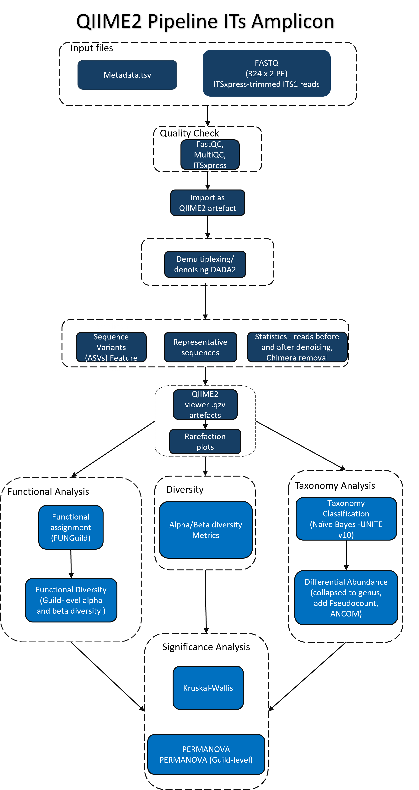

```{r title-centre, echo=FALSE, results='asis'}
cat('
<style>
h1.title {
  text-align: center;
}
iframe {
  max-width: 100%;
  width: 100%;
  min-width: 0;
  border: none;
}

</style>
')
```

```{r custom-header, echo=FALSE, results='asis'}
cat('


<style>

body {
  font-size: 12px;
  line-height: 1.6;
}


h1, h2, h3, h4, h5, h6 {
  font-weight: bold;
}

h1 {
  font-size: 32px;
}

h2 {
  font-size: 26px;
}

h3 {
  font-size: 22px;
}

h4 {
  font-size: 20px;
}

h5 {
  font-size: 18px;
}

h6 {
  font-size: 16px;
}

p {
  font-size: 13px;
}
ul, ol, li {
  font-size: 13px;
}
summary {
  font-size: 15px;
}

body, .main-container {
  max-width: 95%;
  margin: 0 auto;
  font-size: 1.05rem;
}


.header-bar {
  position: fixed;
  top: 0;
  left: 0;
  width: 100%;
  background-color: white;
  color: #3780AE; 
  display: flex;
  align-items: center;
  padding: 10px 20px;
  z-index: 9999;
  box-shadow: 0 2px 4px rgba(0,0,0,0.1);
  font-size: 22px;
  font-weight: bold;
}


.header-bar img {
  height: 45px;
  margin-right: 15px;
}


.header-text {
  text-align: left;
}


body {
  padding-top: 70px;
}


@media (max-width: 768px) {
  .header-bar {
    font-size: 18px;
    padding: 8px 10px;
  }
  .header-bar img {
    height: 35px;
    margin-right: 10px;
  }
}
</style>

<div class="header-bar">
  
  
  <div class="header-text">Dig Deeper - Microbial Community Analysis</div>
</div>
')
```

```{r setup, include=FALSE}
knitr::opts_chunk$set(plotly.use.cdn = TRUE)
knitr::opts_chunk$set(echo = FALSE, cache = FALSE, fig.width = 6, fig.height = 4, dpi = 100, warning = FALSE, message = FALSE)
```


```{r dependencies}
#loading the dependencies :
library(ggplot2)
library(plotly)
library(htmltools)
library(tidyverse)
library(dplyr)
library(jsonlite)
library(stringr)
library(tidyverse)
library(vegan)
library(readr)
library(DT)
library(FSA)
library(slickR)
library(glue)
library(sf)
library(RColorBrewer)
#library(rnaturalearth)
#library(rnaturalearthdata)
library(knitr)
library(kableExtra)
library(forcats)
```


## Introduction

Biodiversity loss, ecosystem degradation, and habitat destruction are increasingly linked to human-driven changes in land use, including **urbanisation**, **agriculture**, and the **exploitation of natural resources** (European Parliament, 2025; Jaureguiberry et al., 2022). In response, governments across Europe — including the EU — have introduced ambitious environmental strategies such as the **EU Biodiversity Strategy for 2030** (European Parliament, 2025) and the **30x30 target** (Markwick, 2023), which aims to protect *30% of land and sea* by the year 2030.

Ecological restoration plays a vital role in addressing these challenges. Rather than simply returning ecosystems to a previous state, modern approaches focus on **restoring ecological processes** and **enhancing ecosystem resilience** (Hicks, 2023).

</br>

### The **RestREco** Initiative

**RestREco** (*Restoring Resilient Ecosystems*) is a **NERC-funded** research project that adopts a *resilience-based* perspective on ecological restoration. The initiative brings together researchers from:

- **Cranfield University**  
- **University of Stirling**
- **UK Centre for Ecology & Hydrology**  
- **The National Trust**  
- **Forest Research**

Using a **natural experiment design**, RestREco studies a network of **133 ecological restoration sites** across **England and Scotland**. The project aims to identify key drivers of ecosystem development, such as:

- **Time since restoration began**  
- **Initial ecological conditions**  
- **Proximity to existing woodland and grassland**

The goal is to understand how these factors influence ecosystem **complexity**, **function**, and **resilience** to future pressures (RestREco, 2024).

</br>

### The **Dig Deeper** Study

As part of the RestREco initiative, the **Dig Deeper** study focused on how the *age of restoration*, *establishment type*, and *site management* affect **soil microbial communities**, specifically **bacteria** and **fungi**.

To explore this, high-throughput sequencing was conducted on:

- **16S rRNA gene** (for bacterial communities)  
- **ITS region** (for fungal communities)

The analysis focused on three main aspects:

- **Alpha and beta diversity**  
- **Taxonomic composition**  
- **Functional diversity**

These microbial assessments complement broader ecosystem-level measurements within the **RestREco project**, including **vegetation**, **invertebrates**, and ecosystem functions such as **litter decomposition**, **pollination services**, and **soil thermodynamic efficiency**.

The following sections describe the sampling design, metadata structure, and the processing pipeline used to characterise microbial communities.

</br>

### **Research Questions** and **Hypotheses**

This study investigates how **grassland site age**, **establishment method**, **management practices**, and **soil pH** influence the **diversity**, **taxonomic composition**, and **functional profiles** of bacterial and fungal communities during restoration. It also explores the **interactions between bacteria and fungi**, focusing on potential correlations between microbial taxa, functional pathways, and fungal guilds.

The following hypotheses were formulated:

1. **Site age**, **establishment method** (green hay/bush (GH), seed mix (SM), natural regeneration (NR)), **management type** (cutting, ploughing, sheep, cattle), and **pH** affect **alpha** and **beta diversity** in bacterial and fungal communities.
2. These same variables influence the **taxonomic composition** of soil microbial communities.
3. **Age**, **establishment method**, and **pH** influence the **functional diversity** of bacterial and fungal communities.
4. There are **correlations in taxon abundance** between bacterial and fungal groups.
5. There are **correlations in the abundance of functional pathways and guilds** between bacterial and fungal communities.

</br>

---


## Sample Design and Metadata Overview

### Sample Collection and Geographic Coverage


A total of **330 soil samples** were collected in 66 sites of England for each marker (5 per site). Although some were removed due to being incomplete (missing from the metadata).


```{r table, echo=FALSE, message=FALSE, warning=FALSE, results='asis'}


sampling_summary <- data.frame(
  Metric = c(
    "Microbial group",
    "Region sampled",
    "Number of sites",
    "Samples per site",
    "Total samples",
    "Average reads per sample",
    "Read count range"
  ),
  `16S` = c(
    "Bacteria",
    "England",
    "66",
    "5",
    "330",
    "~65,000",
    "30,000–85,000"
  ),
  `ITS` = c(
    "Fungi",
    "England",
    "66",
    "5",
    "330",
    "~65,000",
    "10,000–90,000"
  ),
  check.names = FALSE
)


table_html <- kable(sampling_summary, "html", escape = FALSE, align = "lcc",
      caption = "Overview of the soil sampling and sequencing strategy for each microbial marker.") %>%
  kable_styling(bootstrap_options = c("striped", "hover", "condensed", "responsive", "bordered"),
                full_width = FALSE, position = "center") %>%
  column_spec(1, bold = TRUE) %>%
  row_spec(0, bold = TRUE, background = "#d9eaf7")

```


```{r map-table, echo=FALSE, message=FALSE, warning=FALSE}
htmltools::HTML('
<div style="display: flex; justify-content: center; align-items: flex-start; gap: 40px;">

  <div style="flex: 1; text-align: center;">
    
    <p style="font-weight: bold;">Sample Zone - Based on GPS coordinates</p>
  </div>

  <div style="flex: 1;text-align: center;">
    ', table_html, '
    <p style="font-weight: bold;">Sampling Summary</p>
  </div>

</div></br></br>
')

```

### Metadata Overview

Each sample collected was accompanied by metadata capturing key environmental and management variables. These contextual factors were essential for interpreting variation in microbial diversity.

```{r metadata-info, echo=FALSE, message=FALSE, warning=FALSE}
metadata_overview <- data.frame(
  Variable = c(
    "Site", "Plot number", "CU Code", "Year_est", "Age",
    "Latitude/Longitude", "Establishment", "pH", "EC",
    "Cutting", "Cattle", "Sheep", "Plough"
  ),
  Description = c(
    "Name of the sampling site",
    "Subdivision of each site (usually 5 plots per site)",
    "Unique code for each sample",
    "Year of establishment of the site",
    "Site age (ranging from 1 year to over 100 years )",
    "GPS coordinates of the sample",
    "Restoration type or land management",
    "Soil pH value at the time of sampling",
    "Electrical conductivity of the soil",
    "Whether the site is cut (1 = Yes, 0 = No)",
    "Presence of cattle grazing (1 = Yes, 0 = No)",
    "Presence of sheep grazing (1 = Yes, 0 = No)",
    "Whether the soil has been ploughed (1 = Yes, 0 = No)"
  )
)

kable(metadata_overview, format = "html", escape = FALSE,
      caption = "Description of metadata variables associated with soil samples") %>%
  kable_styling(bootstrap_options = c("striped", "hover", "condensed", "bordered"),
                full_width = FALSE, position = "center") %>%
  column_spec(1, bold = TRUE) %>%
  row_spec(0, bold = TRUE, background = "#d9eaf7")

HTML("</br><p style='text-align: center; font-weight: bold;'>Metadata Summary</p>")

```

---

## Methods

### Source data

A total of **330 soil samples across 66 sites** (five samples per site) were collected by the **RestREco** project. Soil was sieved to **2 mm** and then frozen before DNA extraction. DNA was extracted using a **QIAGEN PowerSoil kit**. The **V4–V5 region of the bacterial 16S gene** and the **ITS1–1F region of the fungal ITS gene** were sequenced by **Novagene** using Illumina paired-end reads (250 bp) on **Illumina NovaSeq 6000**. The primer sequences used were:

- `GTGCCAGCMGCCGCGGTAA` / `CCGTCAATTCCTTTGAGTTT`

A total of **330 paired FASTQ files** were provided for each amplicon. Metadata files included Ordinance Survey location, latitude and longitude, year of establishment, age, establishment method, chemical and physical soil properties, and management method (cutting, cattle, sheep, plough).

### 16S

Initial quality control was performed using **FastQC v0.12.1** (Andrews, 2010) and summarised with **MultiQC v1.14** (Ewels et al., 2016). A custom Bash script created a QIIME2-compatible manifest (see `S02_qc.sh`). **Some samples** not in metadata were removed.

Raw sequences were imported into **QIIME2 v2022.10** (Bolyen et al., 2019). Primer/barcode removal was done using **CutAdapt v4.4** (Martin, 2011). Quality profiles were visualised with `qiime demux summarize`.

Denoising and merging were done using **DADA2 (QIIME2 v2024.2)** (Callahan et al., 2016). ASVs with <10 reads and singletons were filtered. Sequences were aligned using **MAFFT v7.505** (Katoh & Standley, 2013), and trees were built with **FastTree v2.1.11** (Price et al., 2010).

Feature tables were grouped by site using **median-ceiling values**. Rarefaction was applied at **9473 reads/sample**. Diversity metrics calculated included:

- **Alpha**: Observed Features, Shannon, Evenness, Faith’s PD
- **Beta**: Bray-Curtis, Jaccard, Unweighted/Weighted UniFrac

Statistical tests included **Kruskal-Wallis** for alpha, **PERMANOVA** for beta.

Taxonomy was assigned using a **Naive Bayes classifier** trained on **Greengenes 13_8** (DeSantis et al., 2006). Differential abundance was analysed via **ANCOM**, collapsed to **genus** and **family** levels.

Functional predictions were generated using **PICRUSt2 (QIIME2 v2024.5)** (Douglas et al., 2020), followed by relative abundance, heatmaps, and differential testing. **Alpha** and **beta functional diversity** metrics were also calculated.

### ITS

ITS reads were processed with **ITSxpress v2.1.4** (Einarsson & Rivers, 2024), quality-checked via **FastQC** and **MultiQC**. Trimmed reads were imported into **QIIME2 v2024.10**, denoised with **DADA2**, and classified using a **Naive Bayes classifier** trained on **UNITE v10** (Abarenkov et al., 2025).

Diversity metrics were computed at **30,000 reads/sample**, visualised via **Emperor plots**, and tested using **Kruskal-Wallis** (alpha) and **PERMANOVA** (beta).

Taxa tables were collapsed to **genus level** and analysed with **ANCOM**. **Fungal ecological roles** were assigned using **FUNGuild v1.1** (Nguyen et al., 2016), with classifications handled by a custom Python script (`FUN_Search.py`).

Functional diversity (alpha and beta) based on fungal guilds was assessed at a rarefaction depth of **11,000 reads/sample**, with statistics via Kruskal-Wallis and PERMANOVA.

### 16S–ITS correlations

Correlations were computed in **R v4.4.2** using `psych::corr.test` (Revelle, 2025). Data came from genus-level **ASV feature tables** and **functional assignments** (PICRUSt2 and FUNGuild).

Correlations were filtered based on:

- **Strength**: \( r > 0.7 \) or \( r < -0.4 \)
- **Significance**: adjusted \( p < 1 \times 10^{-20} \)

Low-abundance taxa (< median counts) were excluded for robustness. For functional correlations, thresholds of:

- Bacterial pathways: mean > 269,508
- Fungal guilds: mean > 3946

were applied.

Final analyses were performed on both strict and extended filtered datasets.

Scripts are available at: [GitHub – dig-deeper-project](https://github.com/kerrycranfield/dig-deeper-project)

</br>

### Summary of Pipeline


<div style="display: flex; justify-content: center; gap: 40px; margin-bottom: 1em;">
  <div style="text-align: center;">
  <a href = "images/16S_workflow.png" target ="_blank"></a>
  
  </br><p style="font-weight: bold;">Workflow (16S)</p>
</div>
  <div style="text-align: center;">
  <a href = "images/ITS_workflow.png" target ="_blank"></a>
  </br><p style="font-weight: bold;">Workflow (ITS)</p>
</div>
</div>


---

## Data Pre-Processing

### MutliQC on raw data {.tabset}

#### Bacteria (16S) 

You can explore the full **MultiQC report** by **clicking** the image below:

<div style="text-align: center;">
  <a href="data/16S/Pre_processing/multiqc_report_16S.html" target="_blank">
    
  </a>
  <p style="font-style: bold;">MultiQC Plot (16S)</p>
</div>
')


#### Fungi (ITS) 


You can explore the full **MultiQC report** by **clicking** the image below:


<div style="text-align: center;">
  <a href="data/ITS/Pre-processing/F01_multiqc_report.html" target="_blank">
    
  </a>
  <p style="font-style: bold;">MultiQC Plot (ITS)</p>
</div>
')


### QC after denoising

#### Statistics Table Summary {.tabset}

After denoising, quality control (QC) metrics provide essential insights into the effectiveness of the data processing steps and the overall quality of the resulting feature table. This summary table presents key statistics for each sample, including the number of input reads, filtered reads, and final feature counts after denoising. These metrics help assess sequencing success, identify potential outliers, and ensure that sufficient data remain for robust downstream analyses. Samples with unusually low read counts or feature richness may need to be excluded or interpreted with caution.

##### Bacteria (16S)

```{r denoising-stats-table, echo=FALSE, message=FALSE, results='asis'}


df <- read.delim("data/16S/Pre_processing/s04_stats_dada2/data/metadata.tsv", comment.char = "#")

cat('Here is a link to the **statistics after denoising** to view it on QIIME2 (16S) : <a href="data/16S/Pre_processing/s04_stats_dada2/data/index.html" target="_blank">Statitics after denoising (16S)</a>')

datatable(
  df,
  options = list(
    pageLength = 10,
    scrollX = TRUE,
    autoWidth = TRUE,
    dom = 'tip',
    class = 'stripe hover row-border order-column',
    initComplete = JS(
      "function(settings, json) {",
      "$(this.api().table().header()).css({'background-color': '#d9eaf7', 'font-weight': 'bold'});",
      "}")
  ),
  class = "display nowrap compact",
  rownames = FALSE
) %>% 
  formatStyle(
    columns = names(df),
    `text-align` = 'center'
  )


HTML("<p style='text-align: center; font-weight: bold;'>Statitics after denoising (16S)</p>")

```

##### Fungi (ITS) 

```{r denoising-stats-table-ITS, echo=FALSE, message=FALSE, results='asis'}


df <- read.delim("data/ITS/Pre-processing/F02_dada2-stats-summ/data/metadata.tsv", comment.char = "#")

cat('Here is a link to the **statistics after denoising** to view it on QIIME2 (ITS) : <a href="data/ITS/Pre-processing/F02_dada2-stats-summ/data/index.html" target="_blank">Statitics after denoising (16S)</a>')

datatable(
  df,
  options = list(
    pageLength = 10,
    scrollX = TRUE,
    autoWidth = TRUE,
    dom = 'tip',
    class = 'stripe hover row-border order-column',
    initComplete = JS(
      "function(settings, json) {",
      "$(this.api().table().header()).css({'background-color': '#d9eaf7', 'font-weight': 'bold'});",
      "}")
  ),
  class = "display nowrap compact",
  rownames = FALSE
) %>% 
  formatStyle(
    columns = names(df),
    `text-align` = 'center'
  )


HTML("<p style='text-align: center; font-weight: bold;'>Statitics after denoising (ITS)</p>")

```


#### QC Plots {.tabset }

These **Quality Control (QC) plots** were generated **after trimming** the sequencing reads. They provide a visual summary of the **base quality scores**, **read length distributions**, and other metrics, helping to assess whether the trimming step successfully removed low-quality regions and adapter contamination. Consistently high-quality reads across samples are essential for reliable downstream analysis.

##### Bacteria (16S)


<div style="text-align: center;">
  <a href="data/16S/Pre_processing/s03_pe_dmx_trim/data/index.html" target="_blank">
    
  </a>
  <p style="font-style: bold;">QC plot (16S)</p>
</div>


##### Fungi (ITS)


<div style="text-align: center;">
  <a href="data/ITS/Pre-processing/F02_sequence/data/index.html" target="_blank">
    
  </a>
  <p style="font-style: bold;">QC plot (ITS)</p>
</div>


#### Rarefication Curves {.tabset}

**Rarefaction** curves provide a visual tool to assess sequencing depth and compare species richness between samples. In this study, rarefaction curves were generated separately for bacterial (16S rRNA gene) and fungal (ITS) communities, using the number of observed features—i.e., unique ASVs—as a proxy for richness.

For both bacteria and fungi, the shape of each curve indicates whether sequencing depth was sufficient to capture most of the diversity in a given sample. Curves that level off suggest that a representative portion of the community has been sampled, whereas rising curves indicate that additional sequencing could reveal further diversity.

This step is crucial to ensure that downstream diversity analyses are not biased by unequal sampling effort.

</br>

##### Bacteria (16S) 

Here is a link to the **Rarefiction plots** for more flexibility on QIIME2: <a href="data/16S/Pre_processing/alpha_rarefaction/data/index.html" target="_blank">Rarefiction plots (16S)</a>

</br>

<div style="margin-bottom: 20px;">
  <label for="variable_selector_rarefaction_16S"><b>Select variable:</b></label>
  <select id="variable_selector_rarefaction_16S" onchange="switchPlotRarefaction_16S()">
    <option value="Establishment" selected>Establishment</option>
    <option value="Age">Age</option>
    <option value="Year_est">Year of Establishment</option>
    <option value="OS_location">Os Location</option>
    <option value="Plough">Plough</option>
    <option value="Lat_long">Lat/long</option>
  </select>
</div>

```{r rarefication_est_16S, echo=FALSE, message=FALSE, warning=FALSE, results='asis'}
vars <- c("Establishment", "Age", "Year_est", "OS_location", "Lat_long", "Plough")

rare_df <- read_csv("data/16S/Pre_processing/alpha_rarefaction/data/observed_features.csv")
measure_cols <- grep("^depth-", names(rare_df), value = TRUE)
meta_cols <- setdiff(names(rare_df), c("sample-id", measure_cols))

rare_long <- rare_df %>%
  pivot_longer(cols = all_of(measure_cols), names_to = "depth_iter", values_to = "observed") %>%
  mutate(
    depth = as.integer(str_extract(depth_iter, "(?<=depth-)\\d+")),
    iter = as.integer(str_extract(depth_iter, "(?<=iter-)\\d+"))
  ) %>%
  left_join(rare_df[, c("sample-id", meta_cols)], by = "sample-id")


plotlist_rarefaction_16S <- list()

for (v in vars){
  var_col <- if (paste0(v, ".y") %in% names(rare_long)) paste0(v, ".y") else v
  
  rare_avg <- rare_long %>%
    group_by(.data[[var_col]], depth) %>%
    summarise(mean_obs = mean(observed, na.rm = TRUE), .groups = "drop") %>%
    rename(group_var = 1) 

  #visible <- ifelse(v == "Establishment", "block", "none")
  
  plot_rare <- plot_ly(
  data = rare_avg,
  x = ~depth,
  y = ~mean_obs,
  color = ~group_var,  
  type = 'scatter',
  mode = 'lines+markers',
  marker = list(size = 5, symbol = 'square-open'),
  line = list(width = 0.5)
) %>%
  layout(
    title = paste0("Rarefaction Curves by ", v, " (Mean per Depth)"),
    xaxis = list(title = "Sequencing Depth"),
    yaxis = list(title = "Mean Observed Features"),
    template = "plotly_white"
  )
  
  plotlist_rarefaction_16S[[v]] <- tags$div(
      id = paste0("plot_rarefaction_16S_", v),
      style = ifelse(v == "Establishment", "display:block;", "display:none; text-align:center;"),
      plot_rare,
      tags$br(),
      tags$p(
        style = "text-align: center; font-weight: bold;",
        sprintf("Rarefaction Curves of Observed Features by '%s' (16S)", v)
      )
    )
  
 
}


tagList(plotlist_rarefaction_16S)

```


<script>
function switchPlotRarefaction_16S() {
  var val = document.getElementById("variable_selector_rarefaction_16S").value;
  var all = ["Establishment", "Age", "Year_est", "OS_location", "Plough", "Lat_long"];
  
  all.forEach(function(v) {
    var el = document.getElementById("plot_rarefaction_16S_" + v);
    if (el) {
      el.style.display = (v === val) ? "block" : "none";
    }
  });
}
</script>


---

##### Fungi (ITS)

Here is a link to the **Rarefiction plots** for more flexibility on QIIME2: <a href="data/ITS/Pre-processing/F02_aggregated_rarefaction/data/index.html" target="_blank">Rarefiction plots (ITS)</a>

</br>

<div style="margin-bottom: 20px;">
  <label for="variable_selector_rarefaction_ITS"><b>Select variable:</b></label>
  <select id="variable_selector_rarefaction_ITS" onchange="switchPlotRarefaction_ITS()">
    <option value="OS_location">Os Location</option>
    <option value="CU Code">CU Code</option>
    <option value="Lat_long">Lat/long</option>
    
  </select>
</div>

```{r rarefication_est_itS, echo=FALSE, message=FALSE, warning=FALSE, results='asis'}
vars <- c( "OS_location", "CU Code", "Lat_long")

rare_df <- read_csv("data/ITS/Pre-processing/F02_aggregated_rarefaction/data/observed_features.csv")
measure_cols <- grep("^depth-", names(rare_df), value = TRUE)
meta_cols <- setdiff(names(rare_df), c("sample-id", measure_cols))

rare_long <- rare_df %>%
  pivot_longer(cols = all_of(measure_cols), names_to = "depth_iter", values_to = "observed") %>%
  mutate(
    depth = as.integer(str_extract(depth_iter, "(?<=depth-)\\d+")),
    iter = as.integer(str_extract(depth_iter, "(?<=iter-)\\d+"))
  ) %>%
  left_join(rare_df[, c("sample-id", meta_cols)], by = "sample-id")


plotlist_rarefaction_ITS <- list()

for (v in vars){
  var_col <- if (paste0(v, ".y") %in% names(rare_long)) paste0(v, ".y") else v
  
  rare_avg <- rare_long %>%
    group_by(.data[[var_col]], depth) %>%
    summarise(mean_obs = mean(observed, na.rm = TRUE), .groups = "drop") %>%
    rename(group_var = 1) 

  
   plot_rare <- plot_ly(
  data = rare_avg,
  x = ~depth,
  y = ~mean_obs,
  color = ~group_var,  
  type = 'scatter',
  mode = 'lines+markers',
  marker = list(size = 5, symbol = 'square-open'),
  line = list(width = 0.5)
) %>%
  layout(
    title = paste0("Rarefaction Curves by ", v, " (Mean per Depth)"),
    xaxis = list(title = "Sequencing Depth"),
    yaxis = list(title = "Mean Observed Features"),
    template = "plotly_white"
  )
  
  plotlist_rarefaction_ITS[[v]] <- tags$div(
      id = paste0("plot_rarefaction_ITS_", v),
      style = ifelse(v == "OS_location", "display:block;", "display:none; text-align:center;"),
      plot_rare,
      tags$br(),
      tags$p(
        style = "text-align: center; font-weight: bold;",
        sprintf("Rarefaction Curves of Observed Features by '%s' (ITS)", v)
      )
    )
  
 
}


tagList(plotlist_rarefaction_ITS)

```


<script>
function switchPlotRarefaction_ITS() {
  var val = document.getElementById("variable_selector_rarefaction_ITS").value;
  var all = ["OS_location", "CU Code", "Lat_long"];
  
  all.forEach(function(v) {
    var el = document.getElementById("plot_rarefaction_ITS_" + v);
    if (el) {
      el.style.display = (v === val) ? "block" : "none";
    }
  });
}
</script>


---

Throughout the report, the **median pH value** used to define both **pH_binary** and **pH_category** is **7.94**, while the threshold for both **Age_binary** and **Age_category** is **13 years**.

</br>

## **Taxonomic Diversity** (Bacteria & Fungi)

**Results Summary**  
Microbial taxonomic diversity revealed clear responses to restoration strategies. For bacteria, establishment method was the strongest driver of alpha and beta diversity, followed by pH and grazing. For fungi, pH and age were more influential. NR sites generally showed lower bacterial diversity and functional richness than GH and SM.

</br>

### Alpha Diversity {.tabset}

Alpha diversity refers to the variety of organisms within a particular sample or environment. It reflects both **richness**—the number of distinct taxa—and **evenness**—how evenly individuals are distributed among those taxa.

</br>

To allow interactive exploration of alpha diversity metrics across different environmental variables, we implemented a drop-down menu that dynamically displays the corresponding plots. Some variables, such as `pH category`, are only present in the ITS dataset, while others, like `Year group`, are specific to the 16S dataset. Internally, variables are mapped to their dataset-specific equivalents where needed (e.g. `Age group` in 16S becomes `Age category` in ITS). It is important to note, however, that these variables are not always directly comparable: for instance, `Age group` (16S) divides sites into multiple discrete intervals based on restoration age, while `Age category` (ITS) is a binary classification based on whether a site is above or below the median age ( `Age_binary` for bacteria). Despite these differences, the interface ensures that only available and relevant plots are shown for each selection.

For the bacteria plots, the data was aggragated by sites, while they were not for the fungi.


```{r alpha-plots, echo=FALSE, message=FALSE, warning=FALSE, results='asis'}
read_and_clean <- function(path, column) {
  df <- read_tsv(path, col_types = cols())[-1, ]
  df[[column]] <- as.numeric(df[[column]])
  return(df)
}

# 16S data
df_shannon_16S <- read_and_clean("data/16S/alpha_diversity/s08_alpha_shannon_per_group/data/metadata.tsv", "shannon_entropy")
df_faith_16S   <- read_and_clean("data/16S/alpha_diversity/s08_alpha_faith_pd_per_group/data/metadata.tsv", "faith_pd")
df_even_16S    <- read_and_clean("data/16S/alpha_diversity/s08_alpha_evenness_per_group/data/metadata.tsv", "pielou_evenness")


# ITS data
df_shannon_ITS1 <- read_and_clean("data/ITS/Alpha_Diversity/F03_shannon_significance/data/metadata.tsv", "shannon_entropy")
df_even_ITS1  <- read_and_clean("data/ITS/Alpha_Diversity/F03_evenness_vector/data/metadata.tsv", "pielou_evenness")


df_shannon_ITS1 <- df_shannon_ITS1[ , ! colnames(df_shannon_ITS1) %in% c("site_code", "plot_number", "OS_location", "Lat_long")]


get_mode <- function(x) {
  ux <- na.omit(unique(x))
  ux[which.max(tabulate(match(x, ux)))]
}


df_shannon_Plough <- df_shannon_16S %>% filter(Plough != "unknown")
df_faith_Plough <- df_faith_16S %>% filter(Plough != "unknown")
df_even_Plough <- df_even_16S %>% filter(Plough != "unknown")

df_shannon_ITS_Plough <- df_shannon_ITS1 %>% filter(!is.na(Plough))
df_even_ITS_Plough <- df_even_ITS1 %>% filter(!is.na(Plough))

vars16S <- c("Establishment", "Cutting", "Cattle", "Sheep", "Plough", "Year_group", "Age_group", "pH_binary", "Age_binary")
varsITS <- c("Establishment", "Cutting", "Cattle", "Sheep", "Plough", "Age_category", "pH_category")


```

</br>

#### Bacteria (16S) {.tabset}


**Results Summary**

Within group diversity was assessed using Faith’s Phylogenetic Diversity (PD), Shannon entropy, and Pielou’s evenness. Significant differences were observed between **establishment methods** across all three metrics, while pH, management type, and site age showed no significant effects.

**Shannon entropy** differed significantly among establishment methods (p = 0.001), with green hay/bush (GH) sites showing higher diversity than natural regeneration (NR) (p-adjusted = 0.0019) and seed mix (SM) sites (p-adjusted = 0.036). SM also had higher diversity than NR (q = 0.0199).

**Pielou’s evenness** was also affected by establishment method (p = 0.0148). Pairwise differences were significant between GH and NR (p-adjusted = 0.0148), while the SM–NR comparison approached significance (p-adjusted = 0.0597). No significant difference was found between GH and SM

**Faith’s PD** also showed significant variation across establishment types (p = 0.0106), with GH sites exhibiting higher phylogenetic diversity than NR (q = 0.0148), and SM also higher than NR (q = 0.043). The difference between GH and SM was not significant. 

</br>

<label for="variable_selector_Alpha16S">Select variable:</label>
<select id="variable_selector_Alpha16S" onchange="switchPlotAlpha16S()">
  <option value="Establishment" selected>Establishment</option>
  <option value="Cutting">Cutting</option>
  <option value="Cattle">Cattle</option>
  <option value="Sheep">Sheep</option>
  <option value="Plough">Plough</option>
  <option value="Year_group">Year group</option>
  <option value="Age_group">Age group</option>
  <option value="pH_binary">pH binary</option>
  <option value="Age_binary">Age binary</option>
</select>

</br>

##### Shannon Index Boxplots 

<details><summary><strong>Click for more information on Shannon index</strong></summary>

The **Shannon index** takes into account not only the number of species present, but also how evenly their abundances are distributed. A higher Shannon value generally indicates a more diverse and ecologically balanced community.

</details>

</br>

Here is a link to the <strong>full QIIME2 results (16S)</strong> : 
<a href="data/16S/alpha_diversity/s08_alpha_shannon_per_group/data/index.html" target="_blank">Shannon Index (16S)</a>


```{r shannon-16S-plots, echo=FALSE, message=FALSE, warning=FALSE, results='asis'}


for (var in vars16S) {
  
  
  
  df_shannon <- if (var == "Plough") get("df_shannon_Plough") else get("df_shannon_16S")
  
  summary_stats <- df_shannon %>%
    group_by(.data[[var]]) %>%
    summarise(
      mean = round(mean(shannon_entropy, na.rm = TRUE), 2),
      median = round(median(shannon_entropy, na.rm = TRUE), 2),
      Q1 = round(quantile(shannon_entropy, 0.25, na.rm = TRUE), 2),
      Q3 = round(quantile(shannon_entropy, 0.75, na.rm = TRUE), 2)
    )

  display_style <- ifelse(var == "Establishment", "block", "none")
  cat(paste0('<div id="plot_', var, '_shannon" style="display:', display_style, ';">'))
  
  p1 <- ggplot(df_shannon, aes(x = .data[[var]], y = shannon_entropy)) +
    geom_boxplot(fill = "deepskyblue3") +
    stat_summary(fun = mean, geom = "point", shape = 20, size = 3, color = "darkblue") +
    geom_text(data = summary_stats, 
              aes(x = .data[[var]], y = mean, label =mean),
              color = "darkblue", vjust = 1.5, size = 3, inherit.aes = FALSE) +
    geom_text(data = summary_stats, 
              aes(x = .data[[var]], y = Q3, label = Q3),
              color = "black", vjust = -0.5, size = 3, inherit.aes = FALSE) +
    geom_text(data = summary_stats, 
              aes(x = .data[[var]], y = median, label = median),
              color = "black", vjust = -0.5, size = 3, inherit.aes = FALSE) +
    geom_text(data = summary_stats, 
              aes(x = .data[[var]], y = Q1, label = Q1),
              color = "black", vjust = 1.5, size = 3, inherit.aes = FALSE) +
    theme_minimal() +
    labs(x = var, y = "Shannon Index (16S)") +
    theme(axis.text.x = element_text(angle = 45, hjust = 1))

  kw <- kruskal.test(df_shannon$shannon_entropy ~ df_shannon[[var]])

  cat("<div style='text-align: center;'>") 
  print(p1)
  cat('</div>')
  cat(paste0("<p style='text-align: center;'>Kruskal-Wallis p-value: ", signif(kw$p.value, 3), "</p>"))
  cat('</div>')
}

```


##### Faith's PD Boxplots 

<details><summary><strong>Click for more information on Faith's PD</strong></summary>

**Faith’s Phylogenetic Diversity (Faith's PD)** measures the total branch length of the phylogenetic tree that spans the species in a sample. Unlike the Shannon index, Faith PD incorporates evolutionary relationships, providing a phylogenetic perspective on diversity. (Bacteria only)

</details>

</br>

Here is a link to the <strong>full QIIME2 results (16S)</strong> : 
<a href="data/16S/alpha_diversity/s08_alpha_faith_pd_per_group/data/index.html" target="_blank">Faith PD (16S)</a>


```{r faith-plots, echo=FALSE, message=FALSE, warning=FALSE, results='asis'}

for (var in vars16S) {
  df_faith <- if (var == "Plough") get("df_faith_Plough") else get("df_faith_16S")

  summary_stats <- df_faith %>%
    group_by(.data[[var]]) %>%
    summarise(
      mean = round(mean(faith_pd, na.rm = TRUE), 2),
      median = round(median(faith_pd, na.rm = TRUE), 2),
      Q1 = round(quantile(faith_pd, 0.25, na.rm = TRUE), 2),
      Q3 = round(quantile(faith_pd, 0.75, na.rm = TRUE), 2)
    )
   
   
  display_style <- ifelse(var == "Establishment", "block", "none")
  cat(paste0('<div id="plot_', var, '_faith" style="display:', display_style, ';">'))
  p1 <- ggplot(df_faith, aes(x = .data[[var]], y = faith_pd)) +
      geom_boxplot(fill = "deepskyblue3") +
    stat_summary(fun = mean, geom = "point", shape = 20, size = 3, color = "darkblue") +
    geom_text(data = summary_stats, 
              aes(x = .data[[var]], y = mean, label =mean),
              color = "darkblue", vjust = 1.5, size = 3, inherit.aes = FALSE) +
    geom_text(data = summary_stats, 
              aes(x = .data[[var]], y = Q3, label = Q3),
              color = "black", vjust = -0.5, size = 3, inherit.aes = FALSE) +
    geom_text(data = summary_stats, 
              aes(x = .data[[var]], y = median, label = median),
              color = "black", vjust = -0.5, size = 3, inherit.aes = FALSE) +
    geom_text(data = summary_stats, 
              aes(x = .data[[var]], y = Q1, label = Q1),
              color = "black", vjust = 1.5, size = 3, inherit.aes = FALSE) +
      theme_minimal() +
      labs(x = var, y = "Faith PD (16S)") +
      theme(axis.text.x = element_text(angle = 45, hjust = 1))
  kw <- kruskal.test(df_faith$faith_pd ~ df_faith[[var]])
  cat("<div style='text-align: center;'>")  
  print(p1)
  cat("</div>")
    cat(paste0("<p style='text-align: center;'>Kruskal-Wallis p-value: ", signif(kw$p.value, 3), "</p>"))
  cat('</div>')
  
  
  
}

```


##### Evenness Index Boxplots

<details><summary><strong>Click for more information on Pielou's Evenness Index</strong></summary>

**Pielou’s Evenness index** specifically quantifies how equally individual organisms are distributed across taxa. While Shannon integrates both richness and evenness, this metric isolates the evenness component, providing a complementary view of diversity patterns.

</details>

</br>

Here is a link to the <strong>full QIIME2 results (16S)</strong> : 
<a href="data/16S/alpha_diversity/s08_alpha_evenness_per_group/data/index.html" target="_blank">Pielou Evenness (16S)</a>


```{r evenness-16S-plots, echo=FALSE, message=FALSE, warning=FALSE, results='asis'}


for (var in vars16S) {
  df_even <- if (var == "Plough") get("df_even_Plough") else get("df_even_16S")

  summary_stats <- df_even %>%
    group_by(.data[[var]]) %>%
    summarise(
      mean = round(mean(pielou_evenness, na.rm = TRUE), 2),
      median = round(median(pielou_evenness, na.rm = TRUE), 2),
      Q1 = round(quantile(pielou_evenness, 0.25, na.rm = TRUE), 2),
      Q3 = round(quantile(pielou_evenness, 0.75, na.rm = TRUE), 2)
    )
  display_style <- ifelse(var== "Establishment", "block", "none")
   
  
  cat(paste0('<div id="plot_', var, '_even" style="display:', display_style, ';">'))
  p1 <- ggplot(df_even, aes(x = .data[[var]], y = pielou_evenness)) +
      geom_boxplot(fill = "deepskyblue3") +
    stat_summary(fun = mean, geom = "point", shape = 20, size = 3, color = "darkblue") +
    geom_text(data = summary_stats, 
              aes(x = .data[[var]], y = mean, label =mean),
              color = "darkblue", vjust = 1.5, size = 3, inherit.aes = FALSE) +
    geom_text(data = summary_stats, 
              aes(x = .data[[var]], y = Q3, label = Q3),
              color = "black", vjust = -0.5, size = 3, inherit.aes = FALSE) +
    geom_text(data = summary_stats, 
              aes(x = .data[[var]], y = median, label = median),
              color = "black", vjust = -0.5, size = 3, inherit.aes = FALSE) +
    geom_text(data = summary_stats, 
              aes(x = .data[[var]], y = Q1, label = Q1),
              color = "black", vjust = 1.5, size = 3, inherit.aes = FALSE) +
      theme_minimal() +
      labs(x = var, y = "Evenness Significance (16S)") +
      theme(axis.text.x = element_text(angle = 45, hjust = 1))
  kw <- kruskal.test(df_even$pielou_evenness ~ df_even[[var]])
  cat("<div style='text-align: center;'>")  
  print(p1)
  cat("</div>")
    cat(paste0("<p style='text-align: center;'>Kruskal-Wallis p-value: ", signif(kw$p.value, 3), "</p>"))
  cat('</div>')
}
```


<script>
function switchPlotAlpha16S() {
  var val = document.getElementById("variable_selector_Alpha16S").value;
  var all = ["Establishment", "Cutting", "Cattle", "Sheep", "Plough", "Year_group", "Age_group", "pH_binary", "Age_binary"];
  
  all.forEach(function(v) {
    var el_shannon = document.getElementById("plot_" + v + "_shannon");
    var el_faith = document.getElementById("plot_" + v + "_faith");
    var el_even = document.getElementById("plot_" + v + "_even");
    
    if (el_shannon) el_shannon.style.display = (v === val) ? "block" : "none";
    if (el_faith) el_faith.style.display = (v === val) ? "block" : "none";
    if (el_even) el_even.style.display = (v === val) ? "block" : "none";
    
  });
}
</script>


---

#### Fungi (ITS) {.tabset}


</br>

**Results Summary**

**Fungal alpha diversity was moderately influenced by environmental variables, particularly soil pH and site age.**  
Although median Shannon diversity appeared slightly higher in **natural regeneration (NR)** plots, no significant differences were observed between establishment methods (GH, SM, NR). Similarly, management practices such as **sheep grazing, cattle grazing, ploughing, and cutting** had no detectable effect on fungal Shannon diversity.

However, **soil pH** showed a significant influence: **alkaline soils (pH > 7.9)** had significantly **lower Shannon diversity** compared to neutral or slightly acidic soils (*p* < 0.02, Kruskal-Wallis).  
**Site age** also impacted fungal diversity, with **older sites (age > 13 years)** exhibiting a **lower median Shannon index** (*p* < 0.02), suggesting a reduction in taxonomic richness or evenness over time.

Regarding **community evenness**, only **sheep grazing** had a statistically significant effect. Sites with sheep showed a **slightly higher median Pielou’s Evenness index** (*p* = 0.03). No significant differences were detected for other variables.


</br>

<label for="variable_selector_AlphaITS">Select variable:</label>
<select id="variable_selector_AlphaITS" onchange="switchPlotAlphaITS()">
  <option value="Establishment" selected>Establishment</option>
  <option value="Cutting">Cutting</option>
  <option value="Cattle">Cattle</option>
  <option value="Sheep">Sheep</option>
  <option value="Plough">Plough</option>
  <option value="Age_category">Age category</option>
  <option value="pH_category">pH category</option>
</select>

##### Shannon Index Boxplots

<details><summary><strong>Click for more information on Shannon index</strong></summary>

The **Shannon index** takes into account not only the number of species present, but also how evenly their abundances are distributed. A higher Shannon value generally indicates a more diverse and ecologically balanced community.

</details>


</br>

Here is a link to the <strong>full QIIME2 results (ITS)</strong> : 
<a href="data/ITS/Alpha_diversity/F03_shannon_significance/data/index.html" target="_blank">Shannon Index (ITS)</a>


```{r shannon-ITS-plots, echo=FALSE, message=FALSE, warning=FALSE, results='asis'}

for (var in varsITS) {
  df_shannon_ITS <- if (var == "Plough") get("df_shannon_ITS_Plough") else get("df_shannon_ITS1")

  summary_stats <- df_shannon_ITS %>%
    group_by(.data[[var]]) %>%
    summarise(
      mean = round(mean(shannon_entropy, na.rm = TRUE), 2),
      median = round(median(shannon_entropy, na.rm = TRUE), 2),
      Q1 = round(quantile(shannon_entropy, 0.25, na.rm = TRUE), 2),
      Q3 = round(quantile(shannon_entropy, 0.75, na.rm = TRUE), 2)
    )
  
  display_style <- ifelse(var == "Establishment", "block", "none")
   
  
  cat(paste0('<div id="plot_', var, '_shannon_ITS" style="display:', display_style, ';">'))
  p1 <- ggplot(df_shannon_ITS, aes(x = .data[[var]], y = shannon_entropy)) +
      geom_boxplot(fill = "deepskyblue3") +
    stat_summary(fun = mean, geom = "point", shape = 20, size = 3, color = "darkblue") +
    geom_text(data = summary_stats, 
              aes(x = .data[[var]], y = mean, label =mean),
              color = "darkblue", vjust = 1.5, size = 3, inherit.aes = FALSE) +
    geom_text(data = summary_stats, 
              aes(x = .data[[var]], y = Q3, label = Q3),
              color = "black", vjust = -0.5, size = 3, inherit.aes = FALSE) +
    geom_text(data = summary_stats, 
              aes(x = .data[[var]], y = median, label = median),
              color = "black", vjust = -0.5, size = 3, inherit.aes = FALSE) +
    geom_text(data = summary_stats, 
              aes(x = .data[[var]], y = Q1, label = Q1),
              color = "black", vjust = 1.5, size = 3, inherit.aes = FALSE) +
      theme_minimal() +
      labs(x = var, y = "Shannon Index (ITS)") +
      theme(axis.text.x = element_text(angle = 45, hjust = 1))
  kw <- kruskal.test(df_shannon_ITS$shannon_entropy ~ df_shannon_ITS[[var]])
  cat("<div style='text-align: center;'>")  
  print(p1)
  cat("</div>")
    cat(paste0("<p style='text-align: center;'>Kruskal-Wallis p-value: ", signif(kw$p.value, 3), "</p>"))
  cat('</div>')
}
```

##### Evenness Index Boxplots

<details><summary><strong>Click for more information on Pielou's Evenness Index</strong></summary>

**Pielou’s Evenness index** specifically quantifies how equally individual organisms are distributed across taxa. While Shannon integrates both richness and evenness, this metric isolates the evenness component, providing a complementary view of diversity patterns.

</details>


</br>

Here is a link to the <strong>full QIIME2 results (ITS)</strong> : 
<a href="data/ITS/Alpha_diversity/F03_evenness_vector/data/index.html" target="_blank">Pielou Evenness (ITS)</a>


```{r evenness-ITS-plots, echo=FALSE, message=FALSE, warning=FALSE, results='asis'}

for (var in varsITS) {
  df_even_ITS <- if (var == "Plough") get("df_even_ITS_Plough") else get("df_even_ITS1")
  summary_stats <- df_even_ITS %>%
    group_by(.data[[var]]) %>%
    summarise(
      mean = round(mean(pielou_evenness, na.rm = TRUE), 2),
      median = round(median(pielou_evenness, na.rm = TRUE), 2),
      Q1 = round(quantile(pielou_evenness, 0.25, na.rm = TRUE), 2),
      Q3 = round(quantile(pielou_evenness, 0.75, na.rm = TRUE), 2)
    )
  display_style <- ifelse(var == "Establishment", "block", "none")
  
  
  
  cat(paste0('<div id="plot_', var, '_even_ITS" style="display:', display_style, ';">'))
  p1 <- ggplot(df_even_ITS, aes(x = .data[[var]], y = pielou_evenness)) +
      geom_boxplot(fill = "deepskyblue3") +
    stat_summary(fun = mean, geom = "point", shape = 20, size = 3, color = "darkblue") +
    geom_text(data = summary_stats, 
              aes(x = .data[[var]], y = mean, label =mean),
              color = "darkblue", vjust = 1.5, size = 3, inherit.aes = FALSE) +
    geom_text(data = summary_stats, 
              aes(x = .data[[var]], y = Q3, label = Q3),
              color = "black", vjust = -0.5, size = 3, inherit.aes = FALSE) +
    geom_text(data = summary_stats, 
              aes(x = .data[[var]], y = median, label = median),
              color = "black", vjust = -0.5, size = 3, inherit.aes = FALSE) +
    geom_text(data = summary_stats, 
              aes(x = .data[[var]], y = Q1, label = Q1),
              color = "black", vjust = 1.5, size = 3, inherit.aes = FALSE) +
      theme_minimal() +
      labs(x = var, y = "Evenness Significance (ITS)") +
      theme(axis.text.x = element_text(angle = 45, hjust = 1))
  kw <- kruskal.test(df_even_ITS$pielou_evenness ~ df_even_ITS[[var]])
  cat("<div style='text-align: center;'>")  
  print(p1)
  cat("</div>")
    cat(paste0("<p style='text-align: center;'>Kruskal-Wallis p-value: ", signif(kw$p.value, 3), "</p>"))
  cat('</div>')
  
}
```


<script>
function switchPlotAlphaITS() {
  var val = document.getElementById("variable_selector_AlphaITS").value;
  var all = ["Establishment", "Cutting", "Cattle", "Sheep", "Plough", "Age_category", "pH_category"];
  
  all.forEach(function(v) {
    var el_shannon = document.getElementById("plot_" + v + "_shannon_ITS");
    var el_even = document.getElementById("plot_" + v + "_even_ITS");
    if (el_shannon) el_shannon.style.display = (v === val) ? "block" : "none";
    if (el_even) el_even.style.display = (v === val) ? "block" : "none";
  });
}
</script>


---

### Comparative Microbial Community Composition (Beta Diversity)

To explore differences in microbial communities, we often rely on dimensionality reduction techniques such as *Principal Coordinates Analysis* (PCoA), visualised through **Emperor plots**. Two commonly used distance metrics in this context are **Bray-Curtis** and **Jaccard**.

While both metrics can reveal meaningful clustering and separation in microbial data, they capture complementary aspects of community structure.

This approach is useful to visualise group clustering by variables like **establishment type**, **management**, or **site age**, and complements statistical tests like **PERMANOVA**, which assess whether community structure significantly varies across those factors.

</br>

**Results Summary**  

Beta diversity patterns confirmed that establishment type, pH, and grazing significantly shaped microbial community composition. For bacteria, strong clustering by method and significant PERMANOVA results support distinct assemblages. Fungal beta diversity followed similar trends but with additional sensitivity to site age.

</br>

---

#### Bray-Curtis

<details><summary><strong>Click for more information on Bray-Curtis Distance Metric</strong></summary>

**Bray-Curtis** is a non-phylogenetic beta diversity metric that compares microbial communities based on **species abundance**, taking into account both shared taxa and their **relative proportions**.
Unlike presence/absence metrics, Bray-Curtis gives more weight to **dominant species** and is sensitive to changes in **abundance structure**. It ranges from 0 (identical composition and abundance) to 1 (completely different), reflecting how much two communities differ in the quantity of each taxon they contain.
Bray-Curtis is especially useful for detecting shifts in **community structure** driven by changes in resource availability, disturbance, or other factors that influence the balance of taxa rather than just their presence.


</details>

##### Emperor Plot {.tabset}

###### Bacteria


**Results Summary**

Bray–Curtis PCoA plots revealed a strong separation of bacterial communities according to restoration establishment method, with NR, GH, and SM forming distinguishable clusters, although some overlap was present. Soil pH also showed a clear gradient in community composition, while site age produced only weak visual separation, with no consistent clustering of younger versus older sites. Sheep grazing did not produce clearly distinct clusters in ordination space, though minor shifts were observable.

</br>
 
Here is a link to the **Bray-Curtis Emperor Plot** for more flexibility on QIIME2: <a href="data/16S/Beta_Diversity/Emperor_plot/bray_curtis_emperor/data/index.html" target="_blank">Bray-Curtis Emperor Plot (16S)</a>

```{r emperor-plot-interactive, echo=FALSE, results='asis', message=FALSE, warning=FALSE}


json <- fromJSON("data/16S/Beta_Diversity/Emperor_plot/bray_curtis_emperor/data/emperor.json")

coords <- json$plot$decomposition$coordinates

coord_df <- as.data.frame(coords)

colnames(coord_df) <- paste0("PC", seq_len(ncol(coords)))
coord_df$SampleID <- json$plot$decomposition$sample_ids


metadata <- as.data.frame(json$plot$metadata, stringsAsFactors = FALSE)
colnames(metadata) <- json$plot$metadata_headers


df <- left_join(coord_df, metadata, by = "SampleID")


b <- plot_ly(
  df,
  x = ~PC1,
  y = ~PC2,
  z = ~PC3,
  color = ~Establishment,
  text = ~SampleID,
  type = "scatter3d",
  mode = "markers",
  marker = list(size = 4)
  
)

htmltools::div(style = "text-align: center;", b)

HTML("<p style='text-align: center; font-weight: bold;'>Bray-Curtis Emperor Plot</p>")


```

###### Fungi

**Results Summary**

Beta diversity analysis revealed that **establishment method**, **soil pH**, and **site age** had the most significant influence on fungal community composition, followed by **sheep grazing**, **ploughing**, and **cutting**. In PCoA plots, natural regeneration sites formed a loose cluster near seed mix sites, while green hay/bush sites clustered more distinctly along Axis 1. 

</br>

Here is a link to the **Bray-Curtis Emperor Plot** for more flexibility on QIIME2: <a href="data/ITS/Beta_Diversity/F03_agg_bray_curtis_emperor/data/index.html" target="_blank">Bray-Curtis Emperor Plot (ITS)</a>

```{r emperor-plot-16S, echo=FALSE, results='asis', message=FALSE, warning=FALSE}


json <- fromJSON("data/ITS/Beta_Diversity/F03_agg_bray_curtis_emperor/data/emperor.json")

coords <- json$plot$decomposition$coordinates

coord_df <- as.data.frame(coords)

colnames(coord_df) <- paste0("PC", seq_len(ncol(coords)))
coord_df$SampleID <- json$plot$decomposition$sample_ids


metadata <- as.data.frame(json$plot$metadata, stringsAsFactors = FALSE)
colnames(metadata) <- json$plot$metadata_headers


df <- left_join(coord_df, metadata, by = "SampleID")


b <- plot_ly(
  df,
  x = ~PC1,
  y = ~PC2,
  z = ~PC3,
  color = ~Establishment,
  text = ~SampleID,
  type = "scatter3d",
  mode = "markers",
  marker = list(size = 4)
  
)

htmltools::div(style = "text-align: center;", b)

HTML("<p style='text-align: center; font-weight: bold;'>Bray-Curtis Emperor Plot (ITS) </p>")


```

##### PERMANOVA {.tabset}

###### Bacteria 

**Results Summary**

Bray-Curtis-based PERMANOVA revealed significant differences in bacterial community composition across establishment methods, with all pairwise comparisons between methods also significant. These results indicate that restoration strategy has a strong influence on both the composition and abundance structure of bacterial communities.

Site age also had a significant but weaker effect. However, clustering by age in Bray-Curtis PCoA plots was less pronounced, suggesting more subtle shifts in community structure over time.

Soil pH significantly shaped bacterial community composition, with Bray-Curtis PCoA plots showing clear clustering between high and low-to-neutral pH soils

</br>

You can **click on the images** below to access the **full QIIME2 report**.

</br>

<div style="margin-bottom: 20px;">
  <label for="variable_selector_Permanova_16S_bray"><b>Select variable:</b></label>
  <select id="variable_selector_Permanova_16S_bray" onchange="switchPlotPermanova_16S_bray()">
    <option value="Establishment" selected>Establishment</option>
    <option value="Cutting">Cutting</option>
    <option value="Cattle">Cattle</option>
    <option value="Sheep">Sheep</option>
    <option value="Plough">Plough</option>
    <option value="Year_group">Year group</option>
    <option value="pH_binary">pH binary</option>
    <option value="Age_binary">Age binary</option>
  </select>
</div>


```{r permanova_16S_bray, results='asis'}
vars <- c("Establishment", "Cutting", "Cattle", "Sheep", "Plough", "Year_group","pH_binary","Age_binary")

for (v in vars) {
  img_path <- paste0("images/permanova/Bray_Curtis/16S/bray_permanova_", v, ".png")
  link_path <- paste0("data/16S/Beta_Diversity/Permanova/bray_permanova_", v, "/data/index.html")
  display_style <- ifelse(v == "Establishment", "block", "none")

  cat(sprintf('<div id="plot_permanova_bray_%s" style="display:%s; text-align:center;"><p><a href="%s" target="_blank">View full QIIME2 results (Bray–Curtis – %s)</a></p><a href="%s" target="_blank"></a><p style="font-weight:bold;">Figure: PERMANOVA Bray–Curtis for "%s" (16S)</p></div>', v, display_style, link_path, v, img_path, img_path, v))
}

```

<script>
function switchPlotPermanova_16S_bray() {
  var val = document.getElementById("variable_selector_Permanova_16S_bray").value;
  var all = ["Establishment", "Cutting", "Cattle", "Sheep", "Plough", "Year_group", "pH_binary","Age_binary"];

  all.forEach(function(v) {
    var el = document.getElementById("plot_permanova_bray_" + v);
    if (el) {
      el.style.display = (v === val) ? "block" : "none";
    }
  });
}
</script>

###### Fungi (ITS)

**Results Summary**

Statistical analysis with PERMANOVA based on **Bray–Curtis distances** confirmed significant effects of multiple variables on fungal **community structure**:

- **Establishment method**: *p* = 0.002  
  - **GH vs. SM**: *p* = 0.008  
  - **GH vs. NR**: *p* = 0.011  

  These results show that assisted restoration strategies (GH, SM) led to distinct community abundance patterns, while **NR sites** displayed the **highest variation**, with dissimilarity values ranging from **0.25 to 0.95**.

- **Soil pH**: *p* = 0.001  
  The effect of pH was significant, with alkaline soils supporting **less diverse** but **more homogeneous** fungal communities compared to neutral or acidic sites.

- **Site age**: *p* = 0.024  
  Differences were observed between **younger and older** sites, consistent with gradual shifts in fungal community structure over time.

- **Sheep grazing**: *p* = 0.025  
  Grazing pressure appeared to influence community composition, possibly through soil disturbance or altered plant-fungal interactions.

Overall, Bray–Curtis-based analyses highlight how **restoration strategy**, **soil conditions**, and **management** practices interact to shape fungal abundance profiles across the landscape.

</br>

You can **click on the images** below to access the **full QIIME2 report**.

</br>

<div style="margin-bottom: 20px;">
  <label for="variable_selector_Permanova_ITS_bray"><b>Select variable:</b></label>
  <select id="variable_selector_Permanova_ITS_bray" onchange="switchPlotPermanova_ITS_bray()">
    <option value="Establishment" selected>Establishment</option>
    <option value="Cutting">Cutting</option>
    <option value="Cattle">Cattle</option>
    <option value="Sheep">Sheep</option>
    <option value="Plough">Plough</option>
    <option value="pH_category">pH category</option>
    <option value="Age_category">Age category</option>
  </select>
</div>

```{r permanova_ITS_bray, results='asis'}
vars <- c("Establishment", "Cutting", "Cattle", "Sheep", "Plough", "pH_category", "Age_category")

for (v in vars) {
  img_path <- paste0("images/permanova/Bray_Curtis/ITS/F03_",v,"_bray_curtis_significance.png")
  link_path <- paste0("data/ITS/Beta_Diversity/F03_",v,"_bray_curtis_significance/data/index.html")
  
  display_style <- ifelse(v == "Establishment", "block", "none")
  
  cat(sprintf('<div id="plot_permanova_ITS_bray_%s" style="display:%s; text-align:center;"><p><a href="%s" target="_blank">View full QIIME2 results (Bray–Curtis – %s)</a></p><a href="%s" target="_blank"></a><p style="font-weight:bold;">Figure: PERMANOVA Bray–Curtis for "%s" (ITS)</p></div>', v, display_style, link_path, v, img_path, img_path, v))
}

```

<script>
function switchPlotPermanova_ITS_bray() {
  var val = document.getElementById("variable_selector_Permanova_ITS_bray").value;
  var all = ["Establishment", "Cutting", "Cattle", "Sheep", "Plough", "pH_category", "Age_category"];
  
  all.forEach(function(v) {
    var el = document.getElementById("plot_permanova_ITS_bray_" + v);
    if (el) {
      el.style.display = (v === val) ? "block" : "none";
    }
  });
}
</script>

#### Jaccard

<details><summary><strong>Click for more information on Jaccard Distance Metric</strong></summary>

**Jaccard** is a non-phylogenetic beta diversity metric that compares microbial communities based on the **presence or absence** of taxa, without considering their abundance or evolutionary relationships.
It measures the proportion of shared taxa between samples relative to the total number of taxa present, treating all species equally. This makes it particularly sensitive to **community turnover**, highlighting whether two sites contain the same organisms, regardless of how abundant they are.
Jaccard is well-suited for detecting changes in **community membership** across environmental gradients or treatment groups, especially when interested in whether taxa are present at all, rather than how dominant they are.

</details>


##### Emperor Plot {.tabset}

###### Bacteria

Here is a link to the **Jaccard Emperor Plot** for more flexibility on QIIME2: <a href="data/16S/Beta_Diversity/Emperor_plot/jaccard_emperor/data/index.html" target="_blank">Jaccard Emperor Plot (16S)</a>

```{r jaccard-plot-interactive, echo=FALSE, results='asis', message=FALSE, warning=FALSE}


json <- fromJSON("data/16S/Beta_Diversity/Emperor_plot/jaccard_emperor/data/emperor.json")

coords <- json$plot$decomposition$coordinates

coord_df <- as.data.frame(coords)

colnames(coord_df) <- paste0("PC", seq_len(ncol(coords)))
coord_df$SampleID <- json$plot$decomposition$sample_ids


metadata <- as.data.frame(json$plot$metadata, stringsAsFactors = FALSE)
colnames(metadata) <- json$plot$metadata_headers

df <- left_join(coord_df, metadata, by = "SampleID")


b <- plot_ly(
  df,
  x = ~PC1,
  y = ~PC2,
  z = ~PC3,
  color = ~Establishment,
  text = ~SampleID,
  type = "scatter3d",
  mode = "markers",
  marker = list(size = 4)
  
)

htmltools::div(style = "text-align: center;", b)
HTML("<p style='text-align: center; font-weight: bold;'>Jaccard Emperor Plot (16S) </p>")


```

###### Fungi

**Results Summary**

The **Jaccard diversity index** revealed a **wider distribution** of points across PCoA space for all tested variables, indicating high variability in **community membership** (presence/absence-based).

- **Establishment method**: Green hay/bush sites formed a **loose cluster**, with seed mix and natural regeneration showing **partial co-clustering** similar to the Bray–Curtis results. **Natural regeneration** sites exhibited stronger grouping in **PCs 3 to 5**, suggesting more consistent community membership among those sites in deeper dimensions.
  
- **Soil pH**: Sites appeared to form **three clusters**—one containing **mostly alkaline soils**, one with **mixed pH profiles**, and a third comprising three **strongly acidic** sites (pH 6.6–6.62), which separated distinctly.

- **Site age**: Two main clusters emerged—one made up mostly of **younger sites** (age < 13), and a second with **mixed-age sites**, suggesting some **temporal structuring**.


</br> 

Here is a link to the **Jaccard Emperor Plot** for more flexibility on QIIME2: <a href="data/ITS/Beta_Diversity/F03_agg_jaccard_emperor/data/index.html" target="_blank">Jaccard Emperor Plot (ITS)</a>

```{r jaccard-plot-ITS, echo=FALSE, results='asis', message=FALSE, warning=FALSE}


json <- fromJSON("data/ITS/Beta_Diversity/F03_agg_jaccard_emperor/data/emperor.json")

coords <- json$plot$decomposition$coordinates

coord_df <- as.data.frame(coords)

colnames(coord_df) <- paste0("PC", seq_len(ncol(coords)))
coord_df$SampleID <- json$plot$decomposition$sample_ids


metadata <- as.data.frame(json$plot$metadata, stringsAsFactors = FALSE)
colnames(metadata) <- json$plot$metadata_headers

df <- left_join(coord_df, metadata, by = "SampleID")


b <- plot_ly(
  df,
  x = ~PC1,
  y = ~PC2,
  z = ~PC3,
  color = ~Establishment,
  text = ~SampleID,
  type = "scatter3d",
  mode = "markers",
  marker = list(size = 4)
  
)

htmltools::div(style = "text-align: center;", b)

cat("<p style='text-align: center; font-weight: bold;'>Jaccard Emperor Plot (ITS)</p>")


```


##### PERMANOVA {.tabset}

###### Bacteria (16S)

You can **click on the images** below to access the **full QIIME2 report**.

<div style="margin-bottom: 20px;">
  <label for="variable_selector_Permanova_16S_jacc"><b>Select variable:</b></label>
  <select id="variable_selector_Permanova_16S_jacc" onchange="switchPlotPermanova_16S_jacc()">
    <option value="Establishment" selected>Establishment</option>
    <option value="Cutting">Cutting</option>
    <option value="Cattle">Cattle</option>
    <option value="Sheep">Sheep</option>
    <option value="Plough">Plough</option>
    <option value="Year_group">Year_group</option>
    <option value="pH_binary">pH binary</option>
    <option value="Age_binary">Age binary</option>
  </select>
</div>


```{r permanova_16S_jacc, results='asis'}
vars <- c("Establishment", "Cutting", "Cattle", "Sheep", "Plough", "Year_group","pH_binary","Age_binary")

for (v in vars) {
  img_path <- paste0("images/permanova/Jaccard/16S/jaccard_permanova_", v, ".png")
  link_path <- paste0("data/16S/Beta_Diversity/Permanova/jaccard_permanova_", v, "/data/index.html")
  
  display_style <- ifelse(v == "Establishment", "block", "none")
  
  
  cat(sprintf('<div id="plot_permanova_jacc_%s" style="display:%s; text-align:center;"><p><a href="%s" target="_blank">View full QIIME2 results (Jaccard – %s)</a></p><a href="%s" target="_blank"></a><p style="font-weight:bold;">Figure: PERMANOVA Jaccard for "%s" (16S)</p></div>', v, display_style, link_path, v, img_path, img_path, v))
}

```

<script>
function switchPlotPermanova_16S_jacc() {
  var val = document.getElementById("variable_selector_Permanova_16S_jacc").value;
  var all = ["Establishment", "Cutting", "Cattle", "Sheep", "Plough", "Year_group", "pH_binary", "Age_binary"];
  
  all.forEach(function(v) {
    var el = document.getElementById("plot_permanova_jacc_" + v);
    if (el) {
      el.style.display = (v === val) ? "block" : "none";
    }
  });
}
</script>

###### Fungi (ITS)

**Results Summary**

PERMANOVA analysis confirmed that fungal community composition was significantly influenced by multiple environmental factors:

- **Establishment method** had a strong effect (**Bray–Curtis**: *p* = 0.002; **Jaccard**: *p* = 0.001). Pairwise comparisons showed the most significant differences for:
  - **Green hay/bush vs. seed mix** (*p* = 0.008)
  - **Green hay/bush vs. natural regeneration** (*p* = 0.011)
  - **NR vs. SM** (*p* = 0.004, Jaccard)

  Notably, **natural regeneration** sites exhibited the **greatest variability** in fungal composition, with Bray–Curtis distances ranging from **0.25 to 0.95**, and Jaccard medians exceeding **0.75** across establishment types.

- **Soil pH** was also a strong driver (**Bray–Curtis**: *p* = 0.001; **Jaccard**: *p* = 0.002), showing clear differences in fungal community structure between **alkaline** and **less alkaline** sites.

- **Site age** significantly influenced fungal beta diversity (**Bray–Curtis**: *p* = 0.024; **Jaccard**: *p* = 0.006), supporting the idea of **successional community turnover**.

- **Management practices** also had an effect:
  - **Sheep grazing**: *p* = 0.025 (Bray–Curtis)
  - **Ploughing**: *p* = 0.024 (Jaccard)
  - **Cutting**: *p* = 0.04 (Jaccard)

These findings highlight the combined influence of land-use strategy and edaphic conditions on fungal community turnover, particularly at the level of taxon presence/absence.

</br>

You can **click on the images** below to access the **full QIIME2 report**.

</br>

<div style="margin-bottom: 20px;">
  <label for="variable_selector_Permanova_ITS_jacc"><b>Select variable:</b></label>
  <select id="variable_selector_Permanova_ITS_jacc" onchange="switchPlotPermanova_ITS_jacc()">
    <option value="Establishment" selected>Establishment</option>
    <option value="Cutting">Cutting</option>
    <option value="Cattle">Cattle</option>
    <option value="Sheep">Sheep</option>
    <option value="Plough">Plough</option>
    <option value="pH_category">pH category</option>
    <option value="Age_category">Age category</option>
  </select>
</div>

```{r permanova_ITS_jacc, results='asis'}
vars <- c("Establishment", "Cutting", "Cattle", "Sheep", "Plough", "pH_category", "Age_category")

for (v in vars) {
  img_path <- paste0("images/permanova/Jaccard/ITS/F03_",v,"_jaccard_significance.png")
  link_path <- paste0("data/ITS/Beta_Diversity/F03_",v,"_jaccard_significance/data/index.html")
  
  display_style <- ifelse(v == "Establishment", "block", "none")
  
  
  cat(sprintf('<div id="plot_permanova_ITS_jacc_%s" style="display:%s; text-align:center;"><p><a href="%s" target="_blank">View full QIIME2 results (Jaccard – %s)</a></p><a href="%s" target="_blank"></a><p style="font-weight:bold;">Figure: PERMANOVA Jaccard for "%s" (ITS)</p></div>', v, display_style, link_path, v, img_path, img_path, v))
}

```

<script>
function switchPlotPermanova_ITS_jacc() {
  var val = document.getElementById("variable_selector_Permanova_ITS_jacc").value;
  var all = ["Establishment", "Cutting", "Cattle", "Sheep", "Plough", "pH_category", "Age_category"];
  
  all.forEach(function(v) {
    var el = document.getElementById("plot_permanova_ITS_jacc_" + v);
    if (el) {
      el.style.display = (v === val) ? "block" : "none";
    }
  });
}
</script>

---


**UniFrac metrics (both weighted and unweighted) rely on a phylogenetic tree to quantify the evolutionary distances between microbial taxa. Since the ITS region used for fungal community profiling does not provide reliable phylogenetic resolution, it is not suitable for generating accurate phylogenetic trees. As a result, UniFrac analyses were only conducted for 16S bacterial data, and not for fungi.**

#### Unweighted Unifrac - Bacteria Only (16S)


<details><summary><strong>Click for more information on Unweighted Unifrac Distance Metric</strong></summary>

**Unweighted UniFrac** is a phylogenetic beta diversity metric that compares microbial communities based solely on the **presence or absence** of taxa, while incorporating their **evolutionary relationships**.

Unlike abundance-based measures, this metric considers whether lineages are shared between communities, regardless of how dominant they are. It is particularly sensitive to **rare or low-abundance taxa**, as all taxa are weighted equally.

Unweighted UniFrac is useful for identifying broad differences in **community membership**—for example, whether two sites share the same species, even if those species occur at very different abundances. This makes it well-suited to detecting compositional shifts due to strong environmental filters or historical legacies.

</details>

</br>

**Results Summary**

PCoA based on Unweighted UniFrac distances showed that bacterial communities clustered primarily by establishment method, with separation between NR, GH, and SM. A small subset of NR samples appeared distinct from the main NR cluster, suggesting within-group heterogeneity. In contrast, site age and sheep grazing showed little to no clear visual separation in the top three axes, and pH presented only a mild gradient.

</br>

##### Emperor Plot - Bacteria

Here is a link to the **Unweighted Unifrac Emperor Plot** for more flexibility on QIIME2: <a href="data/16S/Beta_Diversity/Emperor_plot/unweighted_unifrac_emperor/data/index.html" target="_blank">Unweighted Unifrac Emperor Plot (16S)</a>

```{r uwunifrac-plot-interactive, echo=FALSE, results='asis', message=FALSE, warning=FALSE}


json <- fromJSON("data/16S/Beta_Diversity/Emperor_plot/unweighted_unifrac_emperor/data/emperor.json")

coords <- json$plot$decomposition$coordinates

coord_df <- as.data.frame(coords)

colnames(coord_df) <- paste0("PC", seq_len(ncol(coords)))
coord_df$SampleID <- json$plot$decomposition$sample_ids


metadata <- as.data.frame(json$plot$metadata, stringsAsFactors = FALSE)
colnames(metadata) <- json$plot$metadata_headers

df <- left_join(coord_df, metadata, by = "SampleID")


b <- plot_ly(
  df,
  x = ~PC1,
  y = ~PC2,
  z = ~PC3,
  color = ~Establishment,
  text = ~SampleID,
  type = "scatter3d",
  mode = "markers",
  marker = list(size = 4)
  
)

htmltools::div(style = "text-align: center;", b)
HTML("<p style='text-align: center; font-weight: bold;'>Unweighted Unifrac Emperor Plot (16S) </p>")


```

##### PERMANOVA - Bacteria

Unweighted UniFrac PERMANOVA showed that establishment method, soil pH, and sheep grazing all significantly influenced bacterial community membership (all p = 0.001 or 0.002), with strong effects across establishment types (q < 0.005 for all pairwise comparisons). In contrast, site age was not significant (p-adjusted = 0.063), suggesting that phylogenetic composition remains relatively stable across the age gradient, even if abundance shifts are occurring.

You can **click on the images** below to access the **full QIIME2 report**.

<div style="margin-bottom: 20px;">
  <label for="variable_selector_Permanova_16S_uwunifrac"><b>Select variable:</b></label>
  <select id="variable_selector_Permanova_16S_uwunifrac" onchange="switchPlotPermanova_16S_uwunifrac()">
    <option value="Establishment" selected>Establishment</option>
    <option value="Cutting">Cutting</option>
    <option value="Cattle">Cattle</option>
    <option value="Sheep">Sheep</option>
    <option value="Plough">Plough</option>
    <option value="Year_group">Year_group</option>
    <option value="pH_binary">pH binary</option>
    <option value="Age_binary">Age binary</option>
  </select>
</div>


```{r permanova_16S_uwunifrac, results='asis'}
vars <- c("Establishment", "Cutting", "Cattle", "Sheep", "Plough", "Year_group","pH_binary","Age_binary")

for (v in vars) {
  img_path <- paste0("images/permanova/Uwunifrac/uwunifrac_permanova_", v, ".png")
  link_path <- paste0("data/16S/Beta_Diversity/Permanova/uwunifrac_permanova_", v, "/data/index.html")
  
  display_style <- ifelse(v == "Establishment", "block", "none")
  
  
  cat(sprintf('<div id="plot_permanova_uwunifrac_%s" style="display:%s; text-align:center;"><p><a href="%s" target="_blank">View full QIIME2 results (Unweighted Unifrac – %s)</a></p><a href="%s" target="_blank"></a><p style="font-weight:bold;">Figure: PERMANOVA Unweighted Unifrac for "%s" (16S)</p></div>', v, display_style, link_path, v, img_path, img_path, v))
}

```

<script>
function switchPlotPermanova_16S_uwunifrac() {
  var val = document.getElementById("variable_selector_Permanova_16S_uwunifrac").value;
  var all = ["Establishment", "Cutting", "Cattle", "Sheep", "Plough", "Year_group", "pH_binary", "Age_binary"];
  
  all.forEach(function(v) {
    var el = document.getElementById("plot_permanova_uwunifrac_" + v);
    if (el) {
      el.style.display = (v === val) ? "block" : "none";
    }
  });
}
</script>


#### Weighted Unifrac - Bacteria Only (16S)

<details><summary><strong>Click for more information on Weighted Unifrac Distance Metric</strong></summary>

**Weighted UniFrac** is a phylogenetic distance metric that takes into account both the **evolutionary relationships** between taxa and their **relative abundances** in each sample.

It quantifies how much of the phylogenetic tree is **shared** between communities, with branches weighted by the proportion of abundance they represent. As a result, changes in dominant taxa have more influence on the distance than rare species.

Weighted UniFrac is ideal for detecting differences in **community structure**, especially when those differences involve shifts in abundant lineages. It provides a more nuanced view than unweighted metrics by integrating both phylogenetic and quantitative information.

</details>

</br>

##### Emperor Plot - Bacteria

Here is a link to the **Weighted Unifrac Emperor Plot** for more flexibility on QIIME2: <a href="data/16S/Beta_Diversity/Emperor_plot/weighted_unifrac_emperor/data/index.html" target="_blank">Weighted Unifrac Emperor Plot (16S)</a>

```{r wunifrac-plot-interactive, echo=FALSE, results='asis', message=FALSE, warning=FALSE}


json <- fromJSON("data/16S/Beta_Diversity/Emperor_plot/weighted_unifrac_emperor/data/emperor.json")

coords <- json$plot$decomposition$coordinates

coord_df <- as.data.frame(coords)

colnames(coord_df) <- paste0("PC", seq_len(ncol(coords)))
coord_df$SampleID <- json$plot$decomposition$sample_ids


metadata <- as.data.frame(json$plot$metadata, stringsAsFactors = FALSE)
colnames(metadata) <- json$plot$metadata_headers

df <- left_join(coord_df, metadata, by = "SampleID")


b <- plot_ly(
  df,
  x = ~PC1,
  y = ~PC2,
  z = ~PC3,
  color = ~Establishment,
  text = ~SampleID,
  type = "scatter3d",
  mode = "markers",
  marker = list(size = 4)
  
)

htmltools::div(style = "text-align: center;", b)
HTML("<p style='text-align: center; font-weight: bold;'>Weighted Unifrac Emperor Plot (16S) </p>")


```


##### PERMANOVA - Bacteria


You can **click on the images** below to access the **full QIIME2 report**.

<div style="margin-bottom: 20px;">
  <label for="variable_selector_Permanova_16S_wunifrac"><b>Select variable:</b></label>
  <select id="variable_selector_Permanova_16S_wunifrac" onchange="switchPlotPermanova_16S_wunifrac()">
    <option value="Establishment" selected>Establishment</option>
    <option value="Cutting">Cutting</option>
    <option value="Cattle">Cattle</option>
    <option value="Sheep">Sheep</option>
    <option value="Plough">Plough</option>
    <option value="Year_group">Year_group</option>
    <option value="pH_binary">pH binary</option>
    <option value="Age_binary">Age binary</option>
  </select>
</div>


```{r permanova_16S_wunifrac, results='asis'}
vars <- c("Establishment", "Cutting", "Cattle", "Sheep", "Plough", "Year_group","pH_binary","Age_binary")

for (v in vars) {
  img_path <- paste0("images/permanova/Wunifrac/wunifrac_permanova_", v, ".png")
  link_path <- paste0("data/16S/Beta_Diversity/Permanova/wunifrac_permanova_", v, "/data/index.html")
  
  display_style <- ifelse(v == "Establishment", "block", "none")
  
  
  cat(sprintf('<div id="plot_permanova_wunifrac_%s" style="display:%s; text-align:center;"><p><a href="%s" target="_blank">View full QIIME2 results (Weighted Unifrac – %s)</a></p><a href="%s" target="_blank"></a><p style="font-weight:bold;">Figure: PERMANOVA Weighted Unifrac for "%s" (16S)</p></div>', v, display_style, link_path, v, img_path, img_path, v))
}

```

<script>
function switchPlotPermanova_16S_wunifrac() {
  var val = document.getElementById("variable_selector_Permanova_16S_wunifrac").value;
  var all = ["Establishment", "Cutting", "Cattle", "Sheep", "Plough", "Year_group", "pH_binary", "Age_binary"];
  
  all.forEach(function(v) {
    var el = document.getElementById("plot_permanova_wunifrac_" + v);
    if (el) {
      el.style.display = (v === val) ? "block" : "none";
    }
  });
}
</script>

---

### Taxonomy Composition

#### Taxonomy Barplot {.tabset}

##### Bacteria (16S) 

**Results Summary**

Analysis of bacterial community composition at the phylum level across establishment types revealed that **Actinobacteria** and **Proteobacteria** were dominant, together accounting for 50–80% of relative abundance. Actinobacteria were particularly abundant in seed mix (SM) sites, where they reached up to ~48%, while their proportion was lowest in natural regeneration (NR) sites (~21%). In contrast, Proteobacteria were most prominent in NR soils, peaking at ~55%. Other frequently detected phyla included **Acidobacteria**, **Firmicutes**, **Chloroflexi**, **Verrucomicrobia**, **Planctomycetes**, and **Nitrospirae**, with **Verrucomicrobia** notably more abundant in NR plots.

At the class level, **Alphaproteobacteria**, **Actinobacteria**, **Thermoleophilia**, and **Bacilli** dominated across sites. A higher proportion of **Spartobacteria** was observed in NR plots compared to GH and SM plots.

When comparing soils with pH above and below the median, the dominant phyla remained broadly consistent. However, some shifts were noted: **Firmicutes** and **Planctomycetes** were more abundant in more acidic soils (below-median pH), with Firmicutes reaching up to ~30% (versus ~19% above the median), and Planctomycetes peaking at ~6.5% (compared to ~3.6%).

</br>

Here is a link to the **Taxonomy Barplots** for more flexibility on QIIME2: <a href="data/16S/Taxonomy/s10_taxa_barplot_by_site/data/index.html" target="_blank">Taxonomy Barplot (16S)</a>

</br>

```{r barplot-16S, echo =FALSE, message=FALSE, warning=FALSE, results='asis'}
custom_blues <- c(
  "#08306B",  
  "#08519C",  
  "#3182BD",  
  "#6BAED6",  
  "#C6DBEF"
)


```


<div style="margin-bottom: 20px;">
  <label for="variable_selector_taxobar_16S"><b>Select variable:</b></label>
  <select id="variable_selector_taxobar_16S" onchange="switchPlottaxobar_16S()">
    <option value="Establishment" selected>Establishment</option>
    <option value="Cutting">Cutting</option>
    <option value="Cattle">Cattle</option>
    <option value="Sheep">Sheep</option>
    <option value="Plough">Plough</option>
    <option value="Age_group">Age group</option>
    <option value="pH_binary">pH binary</option>
    <option value="Year_group">Year group</option>
    <option value="Age_binary">Age binary</option>
  </select>
</div>


```{r test-taxo-barplot}
taxa_df <- read_csv("data/16S/Taxonomy/s10_taxa_barplot_by_site/data/level-2.csv")
colnames(taxa_df)[1] <- "index"

meta_cols <- c("index", "Age", "OS_location", "pH", "Year_est", "Lat_long", 
               "Cutting", "Cattle", "Sheep", "Plough", "EC", "Establishment", 
               "pH_binary", "Age_group", "Age_binary", "Year_group")


taxa_long <- taxa_df %>%
  pivot_longer(
    cols = -all_of(meta_cols),
    names_to = "Taxon",
    values_to = "Abundance"
  )


taxa_rel <- taxa_long %>%
  group_by(index) %>%
  mutate(Abundance = Abundance / sum(Abundance, na.rm = TRUE)) %>%
  ungroup() %>%
  rename(Site = index)

vars <- c("Establishment", "Cutting", "Cattle", "Sheep", "Plough", 
          "Age_group", "pH_binary", "Year_group", "Age_binary")

plotlist_taxobar_16S <- list()

for (var in vars) {

  if (var == "Age_group") {
    desired_order <- c("0-10", "11-20", "21-30", "31-40", "61-70", "71-100", "100+")
    taxa_rel[[var]] <- factor(taxa_rel[[var]], levels = desired_order, ordered = TRUE)
  }
  
  site_groups <- taxa_rel %>%
    distinct(Site, .data[[var]]) %>%
    arrange(.data[[var]], Site)
  
  if (var == "Age_group") {
    site_groups[[var]] <- factor(site_groups[[var]], levels = desired_order, ordered = TRUE)
  }
  
  
  
  site_order <- site_groups$Site
  
  
  taxa_rel <- taxa_rel %>%
    mutate(Site = factor(Site, levels = site_order))
  
  
  taxon_order <- taxa_rel %>%
    group_by(Taxon) %>%
    summarise(Total = sum(Abundance), .groups = "drop") %>%
    arrange(desc(Total)) %>%
    pull(Taxon)
  
  
  taxa_rel <- taxa_rel %>%
    mutate(Taxon = factor(Taxon, levels = taxon_order))
  
  
  group_breaks <- site_groups %>%
    group_by(.data[[var]]) %>%
    summarise(n = n(), .groups = "drop") %>%
    mutate(position = cumsum(n) + 0.5) %>%
    filter(row_number() < n())
  
  site_groups <- site_groups %>%
    mutate(pos_index = match(Site, site_order))


group_labels <- site_groups %>%
  group_by(.data[[var]]) %>%
  summarise(position = median(pos_index), .groups = "drop")
  plot <- ggplot(taxa_rel, aes(x = Site, y = Abundance * 100, fill = Taxon)) +
    geom_bar(stat = "identity") +
    scale_fill_manual(values = rep(custom_blues, length.out = n_distinct(taxa_rel$Taxon))) +
    geom_vline(data = group_breaks, aes(xintercept = position), linetype = "dashed", colour = "black") +
    geom_text(data = group_labels, aes(x = position, y = 105, label = .data[[var]]),
              inherit.aes = FALSE, size = 3, fontface = "bold") +
    labs(
      x = "Site", 
      y = "Relative Abundance (%)", 
      fill = "Taxon", 
      title = paste0("Relative abundance of taxa across sites at phylum level (16S), ordered by ", var)
    ) +
    theme_minimal() +
    theme(
      #axis.text.x = element_blank(), 
      axis.text.x = element_text(angle = 90, hjust = 1, size = 5),
      axis.ticks.x = element_blank(),
      legend.text = element_text(size = 5)
    )

  plotlist_taxobar_16S[[var]] <- tags$div(
    id = paste0("plot_taxobar_16S_", var),
    style = ifelse(var == "Establishment", "display:block; text-align:center; margin-bottom:50px; padding-bottom:20px;", 
  "display:none; text-align:center; margin-bottom:50px; padding-bottom:20px;"
),
    ggplotly(plot) %>% layout(width = 900, height = 500),
    tags$br(),
    tags$p(
      style = "text-align: center; font-weight: bold;",
      sprintf("Taxonomy Barplots Associated with '%s' (16S)", var)
    )
  )
}

tagList(plotlist_taxobar_16S)

```

<script>
function switchPlottaxobar_16S() {
  var val = document.getElementById("variable_selector_taxobar_16S").value;
  var all = ["Establishment", "Cutting", "Cattle", "Sheep", "Plough", "Age_group", "pH_binary", "Year_group", "Age_binary"];
  
  all.forEach(function(v) {
    var el = document.getElementById("plot_taxobar_16S_" + v);
    if (el) {
      el.style.display = (v === val) ? "block" : "none";
    }
  });
}
</script>


##### Fungi (ITS) 

**Results Summary**

For most of the studied sites, the dominant fungal phyla were **Ascomycota**, **Mortierellomycota**, and **Basidiomycota**, while a large proportion of sequences were classified as **incertae sedis**, indicating uncertain phylogenetic placement. Some variation in taxonomic composition was observed in **natural regeneration (NR)** sites, where **Basidiomycota** appeared more prominently in at least one site.

At the **class level**, the most commonly detected groups included **Sordariomycetes**, **Mortierellomycetes**, **Dothideomycetes**, and **Leotiomycetes**. NR sites generally exhibited a **lower frequency of Agaricomycetes**, except for a single outlier, compared to sites restored using **green hay (GH)** or **seed mix (SM)**.

When examining fungal composition by **pH category**, the only consistent pattern observed was a higher frequency of **Sordariomycetes** in **slightly acidic to neutral soils** (below median pH) compared to more **alkaline soils**.

</br>

Here is a link to the **Taxonomy Barplots** for more flexibility on QIIME2: <a href="data/ITS/Taxonomy/Taxa_barplot/F03_taxa_barplot/data/index.html" target="_blank">Taxonomy Barplot (ITS)</a>

</br>

<div style="margin-bottom: 20px;">
  <label for="variable_selector_taxobar_ITS"><b>Select variable:</b></label>
  <select id="variable_selector_taxobar_ITS" onchange="switchPlottaxobar_ITS()">
    <option value="Establishment" selected>Establishment</option>
    <option value="Cutting">Cutting</option>
    <option value="Cattle">Cattle</option>
    <option value="Sheep">Sheep</option>
    <option value="Plough">Plough</option>
    <option value="Age_category">Age category</option>
    <option value="pH_category">pH category</option>
  </select>
</div>


```{r barplot-ITS}
taxa_df <- read_csv("data/ITS/Taxonomy/Taxa_barplot/F03_taxa_barplot/data/level-2.csv")

meta_cols <- c("Site", "Age", "OS_location", "pH", "Year_est","site_code", "Lat_long", "Cutting","Cattle","Sheep", "Plough", "pH_category", "Age_category", "EC", "Establishment")

colnames(taxa_df)[1] <- "Site"

taxa_long <- taxa_df %>%
  pivot_longer(
    cols = -all_of(meta_cols),
    names_to = "Taxon",
    values_to = "Abundance"
  )


taxa_rel <- taxa_long %>%
  group_by(Site) %>%
  mutate(Abundance = Abundance / sum(Abundance, na.rm = TRUE)) %>%
  ungroup() 

vars <- c("Establishment", "Cutting", "Cattle", "Sheep", "Plough", 
          "Age_category", "pH_category")

plotlist_taxobar_ITS <- list()

for (var in vars) {

  
  
  site_groups <- taxa_rel %>%
    distinct(Site, .data[[var]]) %>%
    arrange(.data[[var]], Site)
 
  
  
  
  site_order <- site_groups$Site
  
  
  taxa_rel <- taxa_rel %>%
    mutate(Site = factor(Site, levels = site_order))
  
  
  taxon_order <- taxa_rel %>%
    group_by(Taxon) %>%
    summarise(Total = sum(Abundance), .groups = "drop") %>%
    arrange(desc(Total)) %>%
    pull(Taxon)
  
  
  taxa_rel <- taxa_rel %>%
    mutate(Taxon = factor(Taxon, levels = taxon_order))
  
  
  group_breaks <- site_groups %>%
    group_by(.data[[var]]) %>%
    summarise(n = n(), .groups = "drop") %>%
    mutate(position = cumsum(n) + 0.5) %>%
    filter(row_number() < n())
  
  site_groups <- site_groups %>%
    mutate(pos_index = match(Site, site_order))


group_labels <- site_groups %>%
  group_by(.data[[var]]) %>%
  summarise(position = median(pos_index), .groups = "drop")

  plot <- ggplot(taxa_rel, aes(x = Site, y = Abundance * 100, fill = Taxon)) +
    geom_bar(stat = "identity") +
    scale_fill_manual(values = rep(custom_blues, length.out = n_distinct(taxa_rel$Taxon))) +
    geom_vline(data = group_breaks, aes(xintercept = position), linetype = "dashed", colour = "black") +
    geom_text(data = group_labels, aes(x = position, y = 105, label = .data[[var]]),
              inherit.aes = FALSE, size = 3, fontface = "bold") +
    labs(
      x = "Site", 
      y = "Relative Abundance (%)", 
      fill = "Taxon", 
      title = paste0("Relative abundance of taxa across sites at phylum level (ITS), ordered by ", var)
    ) +
    theme_minimal() +
    theme(
      axis.text.x = element_text(angle = 90, hjust = 1, size = 5),
      axis.ticks.x = element_blank(),
      legend.text = element_text(size = 5)
    )

  plotlist_taxobar_ITS[[var]] <- tags$div(
    id = paste0("plot_taxobar_ITS_", var),
    style = ifelse(var == "Establishment", "display:block; text-align:center; margin-bottom:50px; padding-bottom:20px;", 
  "display:none; text-align:center; margin-bottom:50px; padding-bottom:20px;"
),
    ggplotly(plot) %>% layout(width = 900, height = 500),
    tags$br(),
    tags$p(
      style = "text-align: center; font-weight: bold;",
      sprintf("Taxonomy Barplots Associated with '%s' (ITS)", var)
    )
  )
}

tagList(plotlist_taxobar_ITS)

```

<script>
function switchPlottaxobar_ITS() {
  var val = document.getElementById("variable_selector_taxobar_ITS").value;
  var all = ["Establishment", "Cutting", "Cattle", "Sheep", "Plough", "Age_category", "pH_category"];
  
  all.forEach(function(v) {
    var el = document.getElementById("plot_taxobar_ITS_" + v);
    if (el) {
      el.style.display = (v === val) ? "block" : "none";
    }
  });
}
</script>


#### Krona Plots {.tabset}

To explore the composition of soil microbial communities, we used **Krona plots** — interactive, circular charts that display taxonomic abundances in a hierarchical manner.

These plots allow users to intuitively navigate from broader taxonomic levels (such as *Phylum*) to more specific ones (like *Genus*), while simultaneously comparing relative abundances across taxa.

In this study, Krona plots provide a powerful and user-friendly way to:

- Visualise which microbial groups dominate each site
- Explore the taxonomic diversity present in bacterial, archaeal, and fungal communities

</br>

You can **click on the images** below to access the **Krona plots** for each site.

</br>

##### Bacteria (16S) {.unnumbered}

<div style="text-align: center;">
  <a href="data/16S/Taxonomy/Krona/krona_by_site_16S.html" target="_blank">
    
  </a>
  <p style="font-style: bold;">Krona Plot for Baltic_farm_1 (16S)</p>
</div>


##### Fungi (ITS)

<div style="text-align: center;">
  <a href="data/ITS/Taxonomy/Krona/krona_by_site_ITS.html" target="_blank">
    
  </a>
  <p style="font-style: bold;">Krona Plot for Baltic_farm_1 (ITS)</p>
</div>


#### Differential Abundance Analysis with ANCOM {.tabset}

We used ANCOM to identify taxa whose relative abundances significantly differed across groups. This method accounts for the compositional nature of microbiome data by comparing log-ratios between taxa. The results are shown as volcano-like plots, where the W statistic reflects how many pairwise comparisons a taxon was found to differ in. Significant taxa are highlighted accordingly.

</br>


##### Bacteria (16S) 

**Results Summary**

ANCOM analysis identified several bacterial taxa whose abundance varied significantly across environmental factors.  

**Conexibacteraceae** was more abundant in soils with **below-median pH**, indicating a preference for more acidic conditions.  

The genus **Tetrasphaera** showed significantly higher abundance in **younger sites**, suggesting a potential role in early stages of soil restoration.  

Two taxa were strongly associated with **establishment method**: an **unclassified genus within the Intrasporangiaceae family** and the genus **Blastococcus** were both more abundant in **SM and GH plots** compared to NR. These differences were supported by large W statistics and differences in median abundance values across treatments. These taxa responded notably to restoration strategy, indicating that establishment method can drive specific shifts in bacterial community structure.

</br>

<div style="margin-bottom: 20px;">
  <label for="variable_selector_ANCOM_16S"><b>Select variable:</b></label>
  <select id="variable_selector_ANCOM_16S" onchange="switchPlotANCOM_16S()">
    <option value="Establishment" selected>Establishment</option>
    <option value="Cutting">Cutting</option>
    <option value="Cattle">Cattle</option>
    <option value="Sheep">Sheep</option>
    <option value="Plough">Plough</option>
    <option value="Age_group">Age_group</option>
    <option value="pH_binary">pH_binary</option>
    <option value="Year_group">Year_group</option>
    <option value="Age_binary">Age_binary</option>
  </select>
</div>


```{r ancom-16s, echo=FALSE, message=FALSE, warning=FALSE, results='asis' }

vars <- c("Establishment", "Cutting", "Cattle", "Sheep", "Plough", "Age_group", "pH_binary", "Year_group", "Age_binary")

plotlist_ANCOM_16S <- list()

for (v in vars) {
  
  path_ancom <- paste0("data/16S/Taxonomy/genus_ancom_results/genus_ancom_", v, "/data/ancom.tsv")
  path_data <- paste0("data/16S/Taxonomy/genus_ancom_results/genus_ancom_", v, "/data/data.tsv")
  path_link <- paste0("data/16S/Taxonomy/genus_ancom_results/genus_ancom_", v, "/data/index.html")
  
  if (file.exists(path_ancom) && file.exists(path_data)) {
    
    df_ancom <- read.delim(path_ancom)
    df_data <- read.delim(path_data)
    
    df_data$X <- df_data$id
    df_data <- df_data[, -1]
    
    df <- dplyr::left_join(df_ancom, df_data)
    
    p <- ggplot(df, aes(x = clr, y = W, color = `Reject.null.hypothesis`, text = X)) +
      geom_point() +
      scale_color_manual(values = c("grey", "cyan3")) +
      theme_minimal() +
      labs(
        title = paste("ANCOM Volcano-like plot (16S) for", v),
        x = "Centered Logarithmic (clr)",
        y = "W statistic"
      ) +
      theme(
        axis.text.x = element_blank(),
        axis.ticks.x = element_blank(),
        legend.position = "bottom"
      )
    
    plotlist_ANCOM_16S[[v]] <- tags$div(
      id = paste0("plot_ANCOM_16S_", v),
      style = ifelse(v == "Establishment", "display:block;", "display:none; text-align:center;"),
      tags$p(
        style = "text-align: center;",
        tags$a(href = path_link, target = "_blank",
               paste("View interactive volcano-like plot in QIIME2 (16S -", v, ")"))
      ),
      ggplotly(p) %>%
        layout(
          legend = list(
            orientation = "h",        
            x = 0.5, xanchor = "center",
            y = -0.2, yanchor = "top" 
          )
        ),
      tags$br(),
      tags$p(
        style = "text-align: center; font-weight: bold;",
        sprintf("Differences in Taxa Abundance Associated with '%s' (ANCOM Results) (16S)", v)
      )
    )
  }
}

tagList(plotlist_ANCOM_16S)

```

<script>
function switchPlotANCOM_16S() {
  var val = document.getElementById("variable_selector_ANCOM_16S").value;
  var all = ["Establishment", "Cutting", "Cattle", "Sheep", "Plough", "Age_group", "pH_binary", "Year_group", "Age_binary"];
  
  all.forEach(function(v) {
    var el = document.getElementById("plot_ANCOM_16S_" + v);
    if (el) {
      el.style.display = (v === val) ? "block" : "none";
    }
  });
}
</script>


##### Fungi (ITS)

**Results Summary**

The fungal genus **Metapochonia** was identified as significantly differentially abundant between soils classified by **pH category** (above- vs. below-median). According to ANCOM results (*W* = 386), **Metapochonia** exhibited consistently higher abundance in soils with **below-median pH** (slightly acidic to neutral), with a notably higher **median (33.0 vs. 8.0)** and upper quartile abundance compared to soils with more **alkaline pH**.

ANCOM also revealed significant differences in fungal abundance between **site age categories**. A taxon from the **Lasiosphaeriaceae** family (*W* = 366) was more abundant in **younger soils** (below-median age), whereas the genus **Paraphaeosphaeria** (*W* = 320) was significantly enriched in **older soils**.

When comparing **restoration establishment methods**, two fungal taxa were found to differ significantly in abundance. The genus **Gibellulopsis** (*W* = 596) was most abundant in **green hay (GH)** sites (median = 200.5, max = 2118.0), followed by **seed mix (SM)** sites (median = 155.5), and was largely absent from **natural regeneration (NR)** sites. Conversely, **Metarhizium** (*W* = 535) showed its highest abundance in **NR sites** (median = 14.5, max = 327.0), with negligible presence in GH and SM sites.

</br>

<div style="margin-bottom: 20px;">
  <label for="variable_selector_ANCOM_ITS"><b>Select variable:</b></label>
  <select id="variable_selector_ANCOM_ITS" onchange="switchPlotANCOM_ITS()">
    <option value="Establishment" selected>Establishment</option>
    <option value="Cutting">Cutting</option>
    <option value="Cattle">Cattle</option>
    <option value="Sheep">Sheep</option>
    <option value="Plough">Plough</option>
    <option value="Age_category">Age_category</option>
    <option value="pH_category">pH_category</option>
  </select>
</div>


```{r ancom-its, results='asis' }
vars <- c("Establishment", "Cutting", "Cattle", "Sheep", "Plough", "Age_category", "pH_category")

plotlist_ITS <- list()

for (v in vars) {
  
  path_ancom <- paste0("data/ITS/Taxonomy/Taxonomic_Abundance/F03_", v, "_ancom/data/ancom.tsv")
  path_data <- paste0("data/ITS/Taxonomy/Taxonomic_Abundance/F03_", v, "_ancom/data/data.tsv")
  path_link <- paste0("data/ITS/Taxonomy/Taxonomic_Abundance/F03_", v, "_ancom/data/index.html")

  if (file.exists(path_ancom) && file.exists(path_data)) {
    
    df_ancom <- read.delim(path_ancom)
    df_data <- read.delim(path_data)
    
    df_data$X <- df_data$id
    df_data <- df_data[, -1]
    
    df <- dplyr::left_join(df_ancom, df_data)
    
    p <- ggplot(df, aes(x = clr, y = W, color = `Reject.null.hypothesis`, text = X)) +
      geom_point() +
      scale_color_manual(values = c("grey", "cyan3")) +
      theme_minimal() +
      labs(
        title = paste("ANCOM Volcano-like plot (ITS) for", v),
        x = "Centered Logarithmic (clr)",
        y = "W statistic"
      ) +
      theme(
        axis.text.x = element_blank(),
        axis.ticks.x = element_blank(),
        legend.position = "bottom"
      )
    
    plotlist_ITS[[v]] <- tags$div(
      id = paste0("plot_ANCOM_ITS_", v),
      style = ifelse(v == "Establishment", "display:block;", "display:none; text-align:center;"),
      tags$p(
        style = "text-align: center;",
        tags$a(href = path_link, target = "_blank",
               paste("View interactive volcano-like plot in QIIME2 (ITS -", v, ")"))
      ),
      ggplotly(p)  %>%
        layout(
          legend = list(
            orientation = "h",        
            x = 0.5, xanchor = "center",
            y = -0.2, yanchor = "top" 
          )
        ),
      tags$br(),
      tags$p(
        style = "text-align: center; font-weight: bold;",
        sprintf("Differences in Taxa Abundance Associated with '%s' (ANCOM Results) (ITS)", v)
      )
    )
  }
}

# Print all plots
tagList(plotlist_ITS)

```


<script>
function switchPlotANCOM_ITS() {
  var val = document.getElementById("variable_selector_ANCOM_ITS").value;
  var all = ["Establishment", "Cutting", "Cattle", "Sheep", "Plough", "Age_category", "pH_category"];
  
  all.forEach(function(v) {
    var el = document.getElementById("plot_ANCOM_ITS_" + v);
    if (el) {
      el.style.display = (v === val) ? "block" : "none";
    }
  });
}
</script>

---

## **Functional Diversity** (Bacteria & Fungi) {.tabset}


Functional diversity refers to the variety of biological functions present in microbial communities. Unlike taxonomic analysis, which identifies *who is there*, functional analysis explores *what they can do*. This section includes two parallel analyses:

- **Bacteria (16S)**: Functional profiles were inferred using **PICRUSt2**, predicting gene family and pathway abundance.
- **Fungi (ITS)**: Functional roles were explored using **FUNGuild**, which assigns taxa to ecological guilds based on literature.

Alpha and beta diversity were analysed, along with differentially abundant functions or pathways.
 
</br>

**Results Summary** 


Functional diversity revealed strong effects of establishment method and pH on microbial pathway composition. Core metabolic functions were consistent across sites, but specific biosynthetic and degradation pathways differed by age, pH, and grazing. Saprotrophic functions were dominant in fungi, with guild shifts linked to disturbance and soil chemistry.

</br>

### Bacteria (16S)

**Results Summary**
 
Bacterial functional alpha and beta diversity varied significantly across establishment types, with GH and SM plots showing enhanced diversity. Functional profiles also responded to pH and age. Several metabolic pathways, including heme and amino acid biosynthesis, were enriched in specific conditions, reflecting adaptive responses to restoration.

</br>

#### Functional Alpha Diversity {.tabset}


We examined three complementary metrics: **Shannon diversity** (richness and evenness), **Observed Features** (richness only), and **Evenness** (dominance balance). You can use the menu below to explore how each metric varies according to different experimental variables.

</br>

**Results Summary**

Functional alpha diversity, measured by Shannon entropy of predicted metabolic pathways (PICRUSt2), differed significantly across establishment types (Kruskal-Wallis p = 0.0148). Pairwise tests showed that SM plots had significantly higher functional diversity than NR (p-adjusted = 0.0034), and GH was also higher than NR (p-adjusted = 0.02). No significant difference was observed between SM and GH (p-adjusted = 0.75).

</br>

<div style="margin-bottom: 20px;">
  <label for="variable_selector_SignAlpha_16S"><b>Select variable:</b></label>
  <select id="variable_selector_SignAlpha_16S" onchange="switchPlotSignAlpha_16S()">
    <option value="Establishment" selected>Establishment</option>
    <option value="Cutting">Cutting</option>
    <option value="Cattle">Cattle</option>
    <option value="Sheep">Sheep</option>
    <option value="Plough">Plough</option>
    <option value="Age_group">Age_group</option>
    <option value="pH_binary">pH_binary</option>
    <option value="Age_binary">Age_binary</option>
  </select>
</div>

##### Shannon Index Boxplots

Here is a link to the **Shannon Index Boxplot** for more flexibility on QIIME2: <a href="data/16S/Functional_analysis/Functional_alpha/pathway_shannon_significance/data/index.html" target="_blank">Shannon Index Boxplot - Functional (16S)</a>


```{r shannon-significance-16S, results='asis'}

read_and_clean <- function(path, column) {
  df <- read_tsv(path, col_types = cols())[-1, ]
  df[[column]] <- as.numeric(df[[column]])
  return(df)
}
# 16S data
df_shannon_16S <- read_and_clean("data/16S/Functional_analysis/Functional_alpha/pathway_shannon_significance/data/metadata.tsv", "shannon_entropy")
df_obs_features_16S   <- read_and_clean("data/16S/Functional_analysis/Functional_alpha/pathway_observed_features_significance/data/metadata.tsv", "observed_features")
df_even_16S <- read_and_clean("data/16S/Functional_analysis/Functional_alpha/pathway_pielou_e_significance/data/metadata.tsv", "pielou_evenness")

df_shannon_Plough <- df_shannon_16S %>% filter(Plough != "unknown")
df_obs_features_Plough <- df_obs_features_16S %>% filter(Plough != "unknown")
df_even_Plough <- df_even_16S %>% filter(Plough != "unknown")

vars <- c("Establishment", "Cutting", "Cattle", "Sheep", "Plough", "Age_group", "pH_binary", "Age_binary")

for (var in vars){
  df_shannon <- if (var == "Plough") get("df_shannon_Plough") else get("df_shannon_16S")

  summary_stats <- df_shannon %>%
    group_by(.data[[var]]) %>%
    summarise(
      mean = round(mean(shannon_entropy, na.rm = TRUE), 2),
      median = round(median(shannon_entropy, na.rm = TRUE), 2),
      Q1 = round(quantile(shannon_entropy, 0.25, na.rm = TRUE), 2),
      Q3 = round(quantile(shannon_entropy, 0.75, na.rm = TRUE), 2)
    )
  display_style <- ifelse(var == "Establishment", "block", "none")
  cat(paste0('<div id="plot_', var, '_shannon_sig" style="display:', display_style, ';">'))
  p1 <- ggplot(df_shannon, aes(x = .data[[var]], y = shannon_entropy)) +
      geom_boxplot(fill = "deepskyblue3") +
    stat_summary(fun = mean, geom = "point", shape = 20, size = 3, color = "darkblue") +
    geom_text(data = summary_stats, 
              aes(x = .data[[var]], y = mean, label =mean),
              color = "darkblue", vjust = 1.5, size = 3, inherit.aes = FALSE) +
    geom_text(data = summary_stats, 
              aes(x = .data[[var]], y = Q3, label = Q3),
              color = "black", vjust = -0.5, size = 3, inherit.aes = FALSE) +
    geom_text(data = summary_stats, 
              aes(x = .data[[var]], y = median, label = median),
              color = "black", vjust = -0.5, size = 3, inherit.aes = FALSE) +
    geom_text(data = summary_stats, 
              aes(x = .data[[var]], y = Q1, label = Q1),
              color = "black", vjust = 1.5, size = 3, inherit.aes = FALSE) +
      theme_minimal() +
      labs(x = var, y = "Shannon Significance (16S)") +
      theme(axis.text.x = element_text(angle = 45, hjust = 1))
  kw <- kruskal.test(df_shannon$shannon_entropy ~ df_shannon[[var]])
  cat("<div style='text-align: center;'>") 
  print(p1)
  cat('</div>')
  cat(paste0("<p style='text-align: center;'>Kruskal-Wallis p-value: ", signif(kw$p.value, 3), "</p>"))
  cat('</div>')
}


```

##### Observed Features Boxplots

Here is a link to the **Observed features Boxplot** for more flexibility on QIIME2: <a href="data/16S/Functional_analysis/Functional_alpha/pathway_observed_features_significance/data/index.html" target="_blank">Observed Features Boxplot - Functional (16S)</a>


```{r obs-features, results='asis'}
for (var in vars){
  df_obs_features <- if (var == "Plough") get("df_obs_features_Plough") else get("df_obs_features_16S")

  summary_stats <- df_obs_features %>%
    group_by(.data[[var]]) %>%
    summarise(
      mean = round(mean(observed_features, na.rm = TRUE), 2),
      median = round(median(observed_features, na.rm = TRUE), 2),
      Q1 = round(quantile(observed_features, 0.25, na.rm = TRUE), 2),
      Q3 = round(quantile(observed_features, 0.75, na.rm = TRUE), 2)
    )
  display_style <- ifelse(var == "Establishment", "block", "none")
  cat(paste0('<div id="plot_', var, '_obs_features_sig" style="display:', display_style, ';">'))
  p1 <- ggplot(df_obs_features, aes(x = .data[[var]], y = observed_features)) +
      geom_boxplot(fill = "deepskyblue3") +
    stat_summary(fun = mean, geom = "point", shape = 20, size = 3, color = "darkblue") +
    geom_text(data = summary_stats, 
              aes(x = .data[[var]], y = mean, label =mean),
              color = "darkblue", vjust = 1.5, size = 3, inherit.aes = FALSE) +
    geom_text(data = summary_stats, 
              aes(x = .data[[var]], y = Q3, label = Q3),
              color = "black", vjust = -0.5, size = 3, inherit.aes = FALSE) +
    geom_text(data = summary_stats, 
              aes(x = .data[[var]], y = median, label = median),
              color = "black", vjust = -0.5, size = 3, inherit.aes = FALSE) +
    geom_text(data = summary_stats, 
              aes(x = .data[[var]], y = Q1, label = Q1),
              color = "black", vjust = 1.5, size = 3, inherit.aes = FALSE) +
      theme_minimal() +
      labs(x = var, y = "Obeserved Features Significance (16S)") +
      theme(axis.text.x = element_text(angle = 45, hjust = 1))
  kw <- kruskal.test(df_obs_features$observed_features ~ df_obs_features[[var]])
  cat("<div style='text-align: center;'>") 
  print(p1)
  cat('</div>')
  cat(paste0("<p style='text-align: center;'>Kruskal-Wallis p-value: ", signif(kw$p.value, 3), "</p>"))
  cat('</div>')
}
```

##### Evenness Index Boxplots

Here is a link to the **Evenness Boxplot** for more flexibility on QIIME2: <a href="data/16S/Functional_analysis/Functional_alpha/pathway_pielou_e_significance/data/index.html" target="_blank">Evenness Boxplot - Functional (16S)</a>


```{r evenness-sig, results='asis'}

for (var in vars){
  
  df_even <- if (var == "Plough") get("df_even_Plough") else get("df_even_16S")

  summary_stats <- df_even %>%
    group_by(.data[[var]]) %>%
    summarise(
      mean = round(mean(pielou_evenness, na.rm = TRUE), 2),
      median = round(median(pielou_evenness, na.rm = TRUE), 2),
      Q1 = round(quantile(pielou_evenness, 0.25, na.rm = TRUE), 2),
      Q3 = round(quantile(pielou_evenness, 0.75, na.rm = TRUE), 2)
    )
  display_style <- ifelse(var == "Establishment", "block", "none")
  cat(paste0('<div id="plot_', var, '_even_sig" style="display:', display_style, ';">'))
  p1 <- ggplot(df_even, aes(x = .data[[var]], y = pielou_evenness)) +
      geom_boxplot(fill = "deepskyblue3") +
    stat_summary(fun = mean, geom = "point", shape = 20, size = 3, color = "darkblue") +
    geom_text(data = summary_stats, 
              aes(x = .data[[var]], y = mean, label =mean),
              color = "darkblue", vjust = 1.5, size = 3, inherit.aes = FALSE) +
    geom_text(data = summary_stats, 
              aes(x = .data[[var]], y = Q3, label = Q3),
              color = "black", vjust = -0.5, size = 3, inherit.aes = FALSE) +
    geom_text(data = summary_stats, 
              aes(x = .data[[var]], y = median, label = median),
              color = "black", vjust = -0.5, size = 3, inherit.aes = FALSE) +
    geom_text(data = summary_stats, 
              aes(x = .data[[var]], y = Q1, label = Q1),
              color = "black", vjust = 1.5, size = 3, inherit.aes = FALSE) +
      theme_minimal() +
      labs(x = var, y = "Evenness Significance (16S)") +
      theme(axis.text.x = element_text(angle = 45, hjust = 1))
  kw <- kruskal.test(df_even$pielou_evenness ~ df_even[[var]])
  cat("<div style='text-align: center;'>")  
  print(p1)
  cat("</div>")
    cat(paste0("<p style='text-align: center;'>Kruskal-Wallis p-value: ", signif(kw$p.value, 3), "</p>"))
  cat('</div>')
}

```

<script>
function switchPlotSignAlpha_16S() {
  var val = document.getElementById("variable_selector_SignAlpha_16S").value;
  var all = ["Establishment", "Cutting", "Cattle", "Sheep", "Plough", "Age_group", "pH_binary", "Age_binary"];
  
  all.forEach(function(v) {

    var el_shannon = document.getElementById("plot_" + v + "_shannon_sig");
    if (el_shannon) {
      el_shannon.style.display = (v === val) ? "block" : "none";
    }
    
    var el_obs = document.getElementById("plot_" + v + "_obs_features_sig");
    if (el_obs) {
      el_obs.style.display = (v === val) ? "block" : "none";
    }

    var el_even = document.getElementById("plot_" + v + "_even_sig");
    if (el_even) {
      el_even.style.display = (v === val) ? "block" : "none";
    }
  });
}
</script>

#### Functional Beta Diversity 


##### Emperor Plot – Bray-Curtis Distance


**Results Summary**

Functional beta diversity analyses based on **PICRUSt2** pathway profiles showed that multiple site-level factors significantly influenced microbial community composition.
Establishment method had the strongest effect, with distinct functional profiles observed across all establishment types. 

Beta diversity analysis of predicted microbial functions (Bray-Curtis) revealed that functional composition was significantly influenced by establishment method (p = 0.001), soil pH (p = 0.012), site age (p = 0.035), and grazing (p = 0.035). Pairwise comparisons confirmed significant differences between all establishment types (GH, SM, NR), while Emperor plots showed partial separation between high and low pH sites, and between grazed and ungrazed plots.

</br>

Here is a link to the **Bray-Curtis Emperor Plot** for more flexibility on QIIME2: <a href="data/16S/Functional_analysis/Functional_beta/pathway_emperor/data/index.html" target="_blank">Bray-Curtis Emperor Plot (16S)</a>

```{r emperor-bray-func-16s}


json <- fromJSON("data/16S/Functional_analysis/Functional_beta/pathway_emperor/data/emperor.json")

coords <- json$plot$decomposition$coordinates

coord_df <- as.data.frame(coords)

colnames(coord_df) <- paste0("PC", seq_len(ncol(coords)))
coord_df$SampleID <- json$plot$decomposition$sample_ids


metadata <- as.data.frame(json$plot$metadata, stringsAsFactors = FALSE)
colnames(metadata) <- json$plot$metadata_headers


df <- left_join(coord_df, metadata, by = "SampleID")


b <- plot_ly(
  df,
  x = ~PC1,
  y = ~PC2,
  z = ~PC3,
  color = ~Establishment,
  text = ~SampleID,
  type = "scatter3d",
  mode = "markers",
  marker = list(size = 4)
  
)

htmltools::div(style = "text-align: center;", b)

HTML("<p style='text-align: center; font-weight: bold;'>Bray-Curtis Emperor Plot (Functional)</p>")


```


##### PERMANOVA – Bray-Curtis Distance

You can **click on the images** below to access the **full QIIME2 report**.


<div style="margin-bottom: 20px;">
  <label for="variable_selector_Permanova_16S_bray_func"><b>Select variable:</b></label>
  <select id="variable_selector_Permanova_16S_bray_func" onchange="switchPlotPermanova_16S_bray_func()">
    <option value="Establishment" selected>Establishment</option>
    <option value="Cutting">Cutting</option>
    <option value="Cattle">Cattle</option>
    <option value="Sheep">Sheep</option>
    <option value="Plough">Plough</option>
    <option value="Year_group">Year group</option>
    <option value="Age_group">Age group</option>
    <option value="Age_binary">Age Binary </option>
    <option value="pH_binary">pH Binary </option>
  </select>
</div>


```{r permanova_16S_bray_func, results='asis'}
vars <- c("Establishment", "Cutting", "Cattle", "Sheep", "Plough", "Year_group","Age_group", "Age_binary","pH_binary")

for (v in vars) {
  img_path <- paste0("images/permanova/Functional/Bray_Curtis/16S/pathway_permanova_", v, ".png")
  link_path <- paste0("data/16S/Functional_analysis/Functional_beta/pathway_permanova_", v, "/data/index.html")
  
  display_style <- ifelse(v == "Establishment", "block", "none")
  
  cat(sprintf('<div id="plot_permanova_bray_func_%s" style="display:%s; text-align:center;"><p><a href="%s" target="_blank">View full QIIME2 results (Bray–Curtis – %s)</a></p><a href="%s" target="_blank"></a><p style="font-weight:bold;">Figure: PERMANOVA Bray-Curtis for "%s" (ITS)</p></div>', v, display_style, link_path, v, img_path, img_path, v))

}

```

<script>
function switchPlotPermanova_16S_bray_func() {
  var val = document.getElementById("variable_selector_Permanova_16S_bray_func").value;
  var all = ["Establishment", "Cutting", "Cattle", "Sheep", "Plough", "Year_group","Age_group", "Age_binary","pH_binary"];
  
  all.forEach(function(v) {
    var el = document.getElementById("plot_permanova_bray_func_" + v);
    if (el) {
      el.style.display = (v === val) ? "block" : "none";
    }
  });
}
</script>

#### Differentially Abundant Pathways

*To identify pathways with significantly different abundances between groups, ANCOM was applied to PICRUSt2 pathway predictions.*

</br>

**Results Summary**

**Differential abundance analysis of predicted microbial pathways revealed distinct functional shifts across environmental and management gradients.**  

Establishment method had a notable effect on microbial functional profiles, with two pathways significantly differing between strategies: **PWY-5265** (peptidoglycan biosynthesis II in staphylococci) and **PWY-6892** (thiazole component of thiamine diphosphate biosynthesis I).  

**Site age** was associated with changes in core biosynthetic functions, including **HEME-BIOSYNTHESIS-II**, **PWY-5918** (heme b biosynthesis), and **HOMOSER-METSYN-PWY** (L-methionine biosynthesis I).  

**Soil pH** influenced two secondary metabolism pathways: **PWY-6915** and **PWY-6919**, both involved in pentalenolactone biosynthesis.  

**Sheep grazing** showed the strongest functional signal, with five pathways significantly enriched or depleted, notably: **PWY-1541**, **P162-PWY**, **PWY-6944**, **PWY-3661**, and **PWY-5177**, reflecting enhanced nitrogen and steroid metabolism as well as osmolyte degradation.


</br>


<div style="margin-bottom: 20px;">
  <label for="variable_selector_FunctDiv_16S"><b>Select variable:</b></label>
  <select id="variable_selector_FunctDiv_16S" onchange="switchPlotFunctDiv_16S()">
    <option value="Establishment" selected>Establishment</option>
    <option value="Cutting">Cutting</option>
    <option value="Cattle">Cattle</option>
    <option value="Sheep">Sheep</option>
    <option value="Plough">Plough</option>
    <option value="Age_group">Age_group</option>
    <option value="pH_binary">pH_binary</option>
    <option value="Age_binary">Age_binary</option>
  </select>
</div>

```{r for-loop-ancom}

vars <- c("Establishment", "Cutting", "Cattle", "Sheep", "Plough", "Age_group", "pH_binary", "Age_binary")

plotlist <- list()

for (v in vars) {
  
  ancom_path <- paste0("data/16S/Functional_analysis/ancom_pathway/pathway_ancom_", v, "/data/ancom.tsv")
  data_path <- paste0("data/16S/Functional_analysis/ancom_pathway/pathway_ancom_", v, "/data/data.tsv")
  
  df_ancom <- read.delim(ancom_path)
  df_data <- read.delim(data_path)
  
  df_data$X <- df_data$id
  df_data <- df_data[, -1]
  
  df <- dplyr::left_join(df_ancom, df_data)
  
  p <- ggplot(df, aes(x = clr, y = W, color = `Reject.null.hypothesis`, text = X)) +
    geom_point() +
    scale_color_manual(values = c("grey", "cyan3")) +
    theme_minimal() +
    labs(
      title = paste("ANCOM Volcano Plot for", v),
      x = "Centered Log Ratio (clr)",
      y = "W statistic"
    ) +
    theme(
      axis.text.x = element_blank(),
      axis.ticks.x = element_blank(),
      legend.position = "bottom"
    )
  
  plotlist[[v]] <- tags$div(
    id = paste0("plot_fun16S_", v),
    style = ifelse(v == "Establishment", "display:block;", "display:none;"),
    ggplotly(p) %>%
        layout(
          legend = list(
            orientation = "h",        
            x = 0.5, xanchor = "center",
            y = -0.2, yanchor = "top" 
          )
        ),
    tags$br(),
      tags$p(
        style = "text-align: center; font-weight: bold;",
        sprintf("Differences in Pathway Abundance Associated with '%s' (ANCOM Results) (ITS)", v)
      )
  )
}
tagList(plotlist)

```


<script>
function switchPlotFunctDiv_16S() {
  var val = document.getElementById("variable_selector_FunctDiv_16S").value;
  var all = ["Establishment", "Cutting", "Cattle", "Sheep", "Plough", "Age_group", "pH_binary", "Age_binary"];
  
  all.forEach(function(v) {
    var el = document.getElementById("plot_fun16S_" + v);
    if (el) {
      el.style.display = (v === val) ? "block" : "none";
    }
  });
}
</script>


#### Heatmaps

These **heatmaps** display the **relative abundance** of predicted functional pathways across different samples, based on **PICRUSt2-inferred** metagenomic profiles from 16S rRNA gene data. Generated using QIIME2, each **row** represents a **metabolic pathway** (from MetaCyc), and each **column** corresponds to a **sample group**. The **colour intensity** indicates the **predicted abundance** of each functional pathway in the respective group.

</br>

You can **click on each image** to view a **larger** version in a new tab.

```{r heatmaps}
imgs <- list.files("images/Heatmaps", full.names = TRUE)

imgs <- c("images/Heatmaps/feature-table-heatmap_Establishment.png", setdiff(imgs, "images/Heatmaps/feature-table-heatmap_Establishment.png"))

img_labels <- gsub("feature-table-heatmap_(.*).png", "\\1", basename(imgs))


slides <- mapply(function(img, label) {
  tags$div(
    tags$p(style = "text-align:center; font-size:16px; font-weight:bold;", 
       paste0("Feature Table Heatmap for ", label)),
    tags$a(
      href = img, target = "_blank",  
      tags$img(src = img, style = "display:block; margin:auto; max-width:70%; height:auto;margin-bottom: 30px;")
    )
  )
}, imgs, img_labels, SIMPLIFY = FALSE)
slickR(obj = slides, slideType = 'html', height = 500) + 
  settings(arrows = TRUE, dots = TRUE, infinite = FALSE)

```

---

### Fungi (ITS)

**Results Summary**  

Fungal functional diversity was primarily influenced by pH and establishment method. Lower functional diversity was observed in alkaline soils. Guild analysis showed dominance of undefined saprotrophs, with dung-associated and pathogenic guilds more prevalent in managed or disturbed sites.

</br>

#### Functional Alpha Diversity {.tabset}

For fungal communities (ITS), functional diversity was assessed using metrics derived from predicted ecological functions (e.g., trophic modes, symbiosis potential).

The metrics below—**Shannon diversity** and **Evenness**—summarise the variability of ecological roles across different experimental conditions. Use the dropdown menu to explore patterns by variable.

</br>

**Results Summary**

Establishment method had no significant impact on fungal guild diversity, whether measured by Shannon index or evenness. In contrast, **soil pH** significantly influenced both metrics, with **more acidic to neutral soils** (below median pH) showing higher functional diversity than alkaline sites (*Shannon*: *p*-adjusted = 0.003; *Evenness*: *p*-adjusted = 0.007).

Neither **site age** nor **management practices** (e.g., grazing, ploughing, cutting) had a significant effect on functional diversity, although younger sites tended to have slightly lower diversity overall.

</br>

<div style="margin-bottom: 20px;">
  <label for="variable_selector_SignAlpha_ITS"><b>Select variable:</b></label>
  <select id="variable_selector_SignAlpha_ITS" onchange="switchPlotSignAlpha_ITS()">
    <option value="Establishment" selected>Establishment</option>
    <option value="Cutting">Cutting</option>
    <option value="Cattle">Cattle</option>
    <option value="Sheep">Sheep</option>
    <option value="Plough">Plough</option>
    <option value="Age_category">Age category</option>
    <option value="pH_category">pH category</option>
    <option value="Age">Age</option>
  </select>
</div>


##### Shannon Index Boxplots

Here is a link to the **Shannon Index Boxplot** for more flexibility on QIIME2: <a href="data/ITS/Functional_analysis/Functional_alpha/alpha_shannon_ITS/data/index.html" target="_blank">Shannon Index Boxplot - Functional (ITS)</a>

```{r shannon-significance-ITS, results='asis'}


# ITS data
df_shannon_ITS <- read_and_clean("data/ITS/Functional_analysis/Functional_alpha/alpha_shannon_ITS/data/metadata.tsv", "shannon_entropy")
df_even_ITS <- read_and_clean("data/ITS/Functional_analysis/Functional_alpha/alpha_evenness_ITS/data/metadata.tsv", "pielou_evenness")

df_shannon_Plough <- df_shannon_ITS %>% filter(Plough != "nan")
df_even_Plough <- df_even_ITS %>% filter(Plough != "nan")

get_mode <- function(x) {
  ux <- na.omit(unique(x))
  ux[which.max(tabulate(match(x, ux)))]
}

vars <- c("Establishment", "Cutting", "Cattle", "Sheep", "Plough", "Age", "pH_category", "Age_category")

for (var in vars){
  df_shannon <- if (var == "Plough") get("df_shannon_Plough") else get("df_shannon_ITS")

  summary_stats <- df_shannon %>%
    group_by(.data[[var]]) %>%
    summarise(
      mean = round(mean(shannon_entropy, na.rm = TRUE), 2),
      median = round(median(shannon_entropy, na.rm = TRUE), 2),
      Q1 = round(quantile(shannon_entropy, 0.25, na.rm = TRUE), 2),
      Q3 = round(quantile(shannon_entropy, 0.75, na.rm = TRUE), 2)
    )
  display_style <- ifelse(var == "Establishment", "block", "none")
  cat(paste0('<div id="plot_', var, '_shannon_sig_ITS" style="display:', display_style, ';">'))
  p1 <- ggplot(df_shannon, aes(x = .data[[var]], y = shannon_entropy)) +
      geom_boxplot(fill = "deepskyblue3") +
    stat_summary(fun = mean, geom = "point", shape = 20, size = 3, color = "darkblue") +
    geom_text(data = summary_stats, 
              aes(x = .data[[var]], y = mean, label =mean),
              color = "darkblue", vjust = 1.5, size = 3, inherit.aes = FALSE) +
    geom_text(data = summary_stats, 
              aes(x = .data[[var]], y = Q3, label = Q3),
              color = "black", vjust = -0.5, size = 3, inherit.aes = FALSE) +
    geom_text(data = summary_stats, 
              aes(x = .data[[var]], y = median, label = median),
              color = "black", vjust = -0.5, size = 3, inherit.aes = FALSE) +
    geom_text(data = summary_stats, 
              aes(x = .data[[var]], y = Q1, label = Q1),
              color = "black", vjust = 1.5, size = 3, inherit.aes = FALSE) +
      theme_minimal() +
      labs(x = var, y = "Shannon Significance (ITS)") +
      theme(axis.text.x = element_text(angle = 45, hjust = 1))
  kw <- kruskal.test(df_shannon$shannon_entropy ~ df_shannon[[var]])
  cat("<div style='text-align: center;'>") 
  print(p1)
  cat('</div>')
  cat(paste0("<p style='text-align: center;'>Kruskal-Wallis p-value: ", signif(kw$p.value, 3), "</p>"))
  cat('</div>')
}


```

##### Evenness Index Boxplots

Here is a link to the **Evenness Boxplot** for more flexibility on QIIME2: <a href="data/ITS/Functional_analysis/Functional_alpha/alpha_evenness_ITS/data/index.html" target="_blank">Evenness Boxplot - Functional (ITS)</a>


```{r evenness-sig-ITS, results='asis'}

for (var in vars){
  df_even <- if (var == "Plough") get("df_even_Plough") else get("df_even_ITS")
  
  summary_stats <- df_even %>%
    group_by(.data[[var]]) %>%
    summarise(
      mean = round(mean(pielou_evenness, na.rm = TRUE), 2),
      median = round(median(pielou_evenness, na.rm = TRUE), 2),
      Q1 = round(quantile(pielou_evenness, 0.25, na.rm = TRUE), 2),
      Q3 = round(quantile(pielou_evenness, 0.75, na.rm = TRUE), 2)
    )
  display_style <- ifelse(var == "Establishment", "block", "none")
  cat(paste0('<div id="plot_', var, '_even_sig_ITS" style="display:', display_style, ';">'))
  p1 <- ggplot(df_even, aes(x = .data[[var]], y = pielou_evenness)) +
      geom_boxplot(fill = "deepskyblue3") +
    stat_summary(fun = mean, geom = "point", shape = 20, size = 3, color = "darkblue") +
    geom_text(data = summary_stats, 
              aes(x = .data[[var]], y = mean, label =mean),
              color = "darkblue", vjust = 1.5, size = 3, inherit.aes = FALSE) +
    geom_text(data = summary_stats, 
              aes(x = .data[[var]], y = Q3, label = Q3),
              color = "black", vjust = -0.5, size = 3, inherit.aes = FALSE) +
    geom_text(data = summary_stats, 
              aes(x = .data[[var]], y = median, label = median),
              color = "black", vjust = -0.5, size = 3, inherit.aes = FALSE) +
    geom_text(data = summary_stats, 
              aes(x = .data[[var]], y = Q1, label = Q1),
              color = "black", vjust = 1.5, size = 3, inherit.aes = FALSE) +
      theme_minimal() +
      labs(x = var, y = "Evenness Significance (ITS)") +
      theme(axis.text.x = element_text(angle = 45, hjust = 1))
  kw <- kruskal.test(df_even$pielou_evenness ~ df_even[[var]])
  cat("<div style='text-align: center;'>")  
  print(p1)
  cat("</div>")
    cat(paste0("<p style='text-align: center;'>Kruskal-Wallis p-value: ", signif(kw$p.value, 3), "</p>"))
  cat('</div>')
}

```

<script>
function switchPlotSignAlpha_ITS() {
  var val = document.getElementById("variable_selector_SignAlpha_ITS").value;
  var all = ["Establishment", "Cutting", "Cattle", "Sheep", "Plough", "Age_category", "pH_category", "Age"];
  
  all.forEach(function(v) {

    var el_shannon = document.getElementById("plot_" + v + "_shannon_sig_ITS");
    if (el_shannon) {
      el_shannon.style.display = (v === val) ? "block" : "none";
    }

    var el_even = document.getElementById("plot_" + v + "_even_sig_ITS");
    if (el_even) {
      el_even.style.display = (v === val) ? "block" : "none";
    }
  });
}
</script>


#### Functional Beta Diversity {.tabset}

**Results Summary**

Analysis of fungal guild composition across the sites revealed significant effects of **establishment method**, **soil pH**, and **site age**, with patterns consistent across both **Bray-Curtis** and **Jaccard** distance metrics.

PCoA plots showed partial clustering by **establishment method**, with **natural regeneration (NR)** sites forming a tighter group, while **green hay (GH)** and **seed mix (SM)** plots were more dispersed. Despite some overlap, NR sites displayed more consistent guild structure. Similar trends were observed for both Bray-Curtis and Jaccard indices.

Clustering by **pH** was more evident in **Jaccard-based** PCoAs, where sites with **slightly acidic to neutral** pH values (below median) grouped more tightly than those with alkaline soils. **Bray-Curtis** plots revealed less pronounced patterns.

For **site age**, clustering was visible but overlapping, with two main groups composed of both **younger** (<13 years) and **older** (>13 years) sites, suggesting that while age influences guild composition, some core functional groups remain across time.

PERMANOVA results confirmed these observations:

- **Establishment method**: significant for both Bray-Curtis (*p* = 0.003) and Jaccard (*p* = 0.002), with all **pairwise comparisons** significant. The strongest differences were between NR and GH/SM sites.
- **Soil pH category**: significant for both metrics, but stronger with Jaccard (Bray-Curtis *p*-adjusted = 0.003; Jaccard *p*-adjusted = 0.001).
- **Age category**: also significant (Bray-Curtis *p*-adjusted = 0.009; Jaccard *p*-adjusted = 0.04), supporting the role of successional dynamics in shaping functional guild structure.

These findings indicate that **functional beta diversity** in fungal communities responds sensitively to restoration strategy, edaphic conditions, and ecological time, with Jaccard providing slightly better resolution for detecting presence/absence-driven changes in community function.


</br>

##### Bray-Curtis

###### Emperor Plot 

Here is a link to the **Bray-Curtis Emperor Plot** for more flexibility on QIIME2: <a href="data/ITS/Functional_analysis/Functional_beta/Emperor_Plot/bray_curtis_emperor/data/index.html" target="_blank">Bray-Curtis Emperor Plot (16S)</a>

```{r emperor-bray-func-its}


json <- fromJSON("data/ITS/Functional_analysis/Functional_beta/Emperor_Plot/bray_curtis_emperor/data/emperor.json")

coords <- json$plot$decomposition$coordinates

coord_df <- as.data.frame(coords)

colnames(coord_df) <- paste0("PC", seq_len(ncol(coords)))
coord_df$SampleID <- json$plot$decomposition$sample_ids


metadata <- as.data.frame(json$plot$metadata, stringsAsFactors = FALSE)
colnames(metadata) <- json$plot$metadata_headers


df <- left_join(coord_df, metadata, by = "SampleID")


b <- plot_ly(
  df,
  x = ~PC1,
  y = ~PC2,
  z = ~PC3,
  color = ~Establishment,
  text = ~SampleID,
  type = "scatter3d",
  mode = "markers",
  marker = list(size = 4)
  
)

htmltools::div(style = "text-align: center;", b)

HTML("<p style='text-align: center; font-weight: bold;'>Bray-Curtis Emperor Plot (Fungi - ITS, Functional)</p>")


```


###### PERMANOVA 

You can **click on the images** below to access the **full QIIME2 report**.

<div style="margin-bottom: 20px;">
  <label for="variable_selector_Permanova_ITS_bray_func"><b>Select variable:</b></label>
  <select id="variable_selector_Permanova_ITS_bray_func" onchange="switchPlotPermanova_ITS_bray_func()">
    <option value="Establishment" selected>Establishment</option>
    <option value="pH">pH category</option>
    <option value="Age">Age category</option>
  </select>
</div>

```{r permanova_ITS_bray_func, results='asis'}
vars <- c("Establishment", "pH", "Age")

for (v in vars) {
  img_path <- paste0("images/permanova/Functional/Bray_Curtis/ITS/bray_curtis_significance_",v,"_ITS.png")
  link_path <- paste0("data/ITS/Functional_analysis/Functional_beta/bray_curtis_significance_",v,"_ITS/data/index.html")
  
  display_style <- ifelse(v == "Establishment", "block", "none")
  
  cat(sprintf('<div id="plot_permanova_ITS_bray_func_%s" style="display:%s; text-align:center;"><p><a href="%s" target="_blank">View full QIIME2 results (Bray–Curtis – %s)</a></p><a href="%s" target="_blank"></a><p style="font-weight:bold;">Figure: PERMANOVA Bray-Curtis for "%s" (ITS)</p></div>', v, display_style, link_path, v, img_path, img_path, v))
  
  
}

```

<script>
function switchPlotPermanova_ITS_bray_func() {
  var val = document.getElementById("variable_selector_Permanova_ITS_bray_func").value;
  var all = ["Establishment", pH", "Age"];
  
  all.forEach(function(v) {
    var el = document.getElementById("plot_permanova_ITS_bray_func_" + v);
    if (el) {
      el.style.display = (v === val) ? "block" : "none";
    }
  });
}
</script>

##### Jaccard

###### Emperor Plot 

Here is a link to the **Jaccard Emperor Plot** for more flexibility on QIIME2: <a href="data/ITS/Functional_analysis/Functional_beta/Emperor_Plot/jaccard_emperor/data/index.html" target="_blank">Bray-Curtis Emperor Plot (16S)</a>

```{r emperor-jaccard-func-its}


json <- fromJSON("data/ITS/Functional_analysis/Functional_beta/Emperor_Plot/jaccard_emperor/data/emperor.json")

coords <- json$plot$decomposition$coordinates

coord_df <- as.data.frame(coords)

colnames(coord_df) <- paste0("PC", seq_len(ncol(coords)))
coord_df$SampleID <- json$plot$decomposition$sample_ids


metadata <- as.data.frame(json$plot$metadata, stringsAsFactors = FALSE)
colnames(metadata) <- json$plot$metadata_headers


df <- left_join(coord_df, metadata, by = "SampleID")


b <- plot_ly(
  df,
  x = ~PC1,
  y = ~PC2,
  z = ~PC3,
  color = ~Establishment,
  text = ~SampleID,
  type = "scatter3d",
  mode = "markers",
  marker = list(size = 4)
  
)

htmltools::div(style = "text-align: center;", b)

HTML("<p style='text-align: center; font-weight: bold;'>Jaccard Emperor Plot (Fungi - ITS, Functional)</p>")


```


###### PERMANOVA

You can **click on the images** below to access the **full QIIME2 report**.

<div style="margin-bottom: 20px;">
  <label for="variable_selector_Permanova_ITS_jacc_func"><b>Select variable:</b></label>
  <select id="variable_selector_Permanova_ITS_jacc_func" onchange="switchPlotPermanova_ITS_jacc_func()">
    <option value="Establishment" selected>Establishment</option>
    <option value="pH">pH category</option>
    <option value="Age">Age category</option>
  </select>
</div>

```{r permanova_ITS_jacc_func, results='asis'}
vars <- c("Establishment", "pH", "Age")

for (v in vars) {
  img_path <- paste0("images/permanova/Functional/Jaccard/ITS/jaccard_significance_",v,"_ITS.png")
  link_path <- paste0("data/ITS/Functional_analysis/Functional_beta/jaccard_significance_",v,"_ITS/data/index.html")
  
  display_style <- ifelse(v == "Establishment", "block", "none")
  
  cat(sprintf('<div id="plot_permanova_ITS_jacc_func_%s" style="display:%s; text-align:center;"><p><a href="%s" target="_blank">View full QIIME2 results (Jaccard – %s)</a></p><a href="%s" target="_blank"></a><p style="font-weight:bold;">Figure: PERMANOVA Jaccard for "%s" (ITS)</p></div>', v, display_style, link_path, v, img_path, img_path, v))
  
}

```

<script>
function switchPlotPermanova_ITS_jacc_func() {
  var val = document.getElementById("variable_selector_Permanova_ITS_jacc_func").value;
  var all = ["Establishment", pH", "Age"];
  
  all.forEach(function(v) {
    var el = document.getElementById("plot_permanova_ITS_jacc_func_" + v);
    if (el) {
      el.style.display = (v === val) ? "block" : "none";
    }
  });
}
</script>

#### Fungal Functional Guilds (FUNGuild)

In microbial ecology, a *guild* refers to a group of organisms that fulfil similar ecological roles, regardless of their taxonomic identity. Understanding functional guilds allows researchers to move beyond taxonomic profiles and assess the ecological roles that microbial communities may play in an environment.

To investigate the ecological roles of fungal communities, we used **FUNGuild**, a tool that assigns fungi to functional guilds based on curated databases and literature. These guilds represent ecological strategies such as:

- **Saprotrophs**: decomposers of organic matter  
- **Mycorrhizal fungi**: symbionts associated with plant roots  
- **Pathogens**: organisms that cause disease in plants or animals
- **Ectomycorrhizal**: symbionts that assist plant roots by enhancing nutrient and water uptake, especially nitrogen and phosphorus, while contributing to carbon cycling and soil nutrient mobilisation
- **Arbuscular Mycorrhizal**: symbionts that contribute to nutrient uptake
- **Endophyte**: microorganisms that promote the growth and development of the plants
- **Lichenized**: fungi that form symbiotic associations with algae or cyanobacteria, creating lichens that can survive in harsh environments by combining structural support and photosynthetic ability
- **Parasites**: fungi that live on or inside a host organism, extracting nutrients and often causing harm
- **Symbiotrophs**: fungi that engage in mutually beneficial relationships with host organisms, typically exchanging nutrients for resources like carbon or protection

This functional classification provides valuable insights into what fungi are likely *doing* in the ecosystem, beyond simply *who* they are.


This section explores the functional roles of fungi within each site, based on guild-level annotations provided by **FUNGuild**. Fungal guilds reflect ecological functions such as **saprotrophy**, **symbiosis** (e.g., mycorrhizal fungi), or **pathogenicity**. This approach provides insight into how fungal communities may contribute to ecosystem processes, complementing traditional taxonomic analyses.

</br>


**Results Summary**

The analysis of fungal guild abundance across the sites revealed **high variability** in fungal ecological roles. A consistent observation was the **substantial proportion of unassigned fungi**, limiting interpretation in some cases. Among the **identified guilds**, the most dominant were:

- **Undefined saprotrophs**
- **Plant pathogens**
- **Dung saprotrophs**

In select sites, **animal parasites** were also present at noteworthy levels.

Across **site age categories**, distinct patterns emerged. In **older sites** (above median age), the fungal community was dominated by **undefined saprotrophs**, comprising nearly **50% of the total abundance**. Plant pathogens and dung saprotrophs were also significantly represented. In **younger sites**, while undefined saprotrophs remained abundant, **plant pathogens** and **dung saprotrophs** were present in relatively **higher proportions**. In addition, **animal pathogens** and **wood saprotrophs** were detected in younger sites.

When comparing **establishment methods**, the guild composition also varied:

- **Green hay (GH)** sites showed high levels of **undefined saprotrophs**, **plant pathogens**, and **dung saprotrophs**.
- **Natural regeneration (NR)** sites had the **highest percentage** of **undefined saprotrophs**, but **lower levels** of **plant pathogens** and **dung saprotrophs**.

Regarding **soil pH**, sites with **above-median pH** displayed high abundances of **undefined saprotrophs**, followed by **plant pathogens** and **dung saprotrophs**. In contrast, **below-median pH** sites showed a **similar dominance** of undefined saprotrophs, but with an **increased proportion of animal parasites**.

These patterns suggest that fungal functional composition is responsive to **restoration strategy**, **soil chemistry**, and **successional stage**.

</br>

##### Top 20 Most Abundant Guilds


The plot below highlights the top 20 most abundant fungal guilds identified using **FUNGuild**. To avoid clutter, the guild names are hidden on the y-axis; however, users can **hover over each bar to reveal the full name**, enabling interactive and detailed exploration of fungal functional diversity.

```{r its-fun-div, echo = FALSE, message=FALSE, warning=FALSE, results='asis'}
df <- read.delim("data/ITS/Functional_analysis/F04_Results/F04_funguild_input.guilds.txt", check.names = FALSE)

# Identify site columns
site_cols <- names(df)[3:(which(names(df) == "Taxon") - 1)]

# Extract Guild information between pipes (|...|)
df$Guild_Extracted <- str_extract(df$Guild, "\\|[^|]+\\|") %>%
  str_replace_all("\\|", "") %>%
  trimws()

# converts NA to Unassigned
df$Guild_Extracted[is.na(df$Guild_Extracted)] <- "Unassigned"

# Set factor level so "Unassigned" appears first
df$Guild_Extracted <- factor(df$Guild_Extracted, levels = c("Unassigned", sort(unique(df$Guild_Extracted[df$Guild_Extracted != "Unassigned"]))))

# Filter out rows without pipe-delimited guilds
df_filtered <- df %>% filter(!is.na(Guild_Extracted))


guild_counts <- df_filtered %>%
  filter(!is.na(Guild), `Confidence Ranking` %in% c("Probable", "Highly Probable")) %>%
  count(Guild, sort = TRUE) %>%
  slice_max(n, n = 20)

cat('<div style="text-align: center;">')
ggplot(guild_counts, aes(x = reorder(Guild, n), y = n, text = Guild)) +
  geom_col(fill = "#3780AE") +
  
  labs(x = NULL,
       y = "Number of ASVs") +
  theme_minimal() +
theme(
    axis.text.x = element_text(angle = 45, hjust = 1, size = 5),
    axis.ticks.x = element_blank(),
    legend.text = element_text(size = 5)
  )

HTML("<p style='text-align: center; font-weight: bold;'>Top 20 functional guilds</p>")

cat('</div>')
```


##### Guild Abundance Across Sites

The figure below shows the total abundance of fungal ASVs across sites, aggregated by **functional guild**. This provides an overview of how **guild-level composition** varies between locations, which may reflect differences in land use, soil conditions, or restoration histories.

Fungal communities were dominated by **Undefined Saprotrophs**, **Plant Pathogens**, and **Dung Saprotrophs**. A high proportion of Unassigned fungi highlights **limits** in current taxonomic resolution.


```{r fun-ab-total, echo=FALSE, message=FALSE, warning=FALSE, results='asis'}
meta <- read.delim("data/agg_metadata.txt", check.names = FALSE)

df <- read.delim("data/ITS/Functional_analysis/F04_Results/F04_funguild_input.guilds.txt", check.names = FALSE)

# Identify site columns
site_cols <- names(df)[3:(which(names(df) == "Taxon") - 1)]

# Extract Guild information between pipes (|...|)
df$Guild_Extracted <- str_extract(df$Guild, "\\|[^|]+\\|") %>%
  str_replace_all("\\|", "") %>%
  trimws()

# converts NA to Unassigned
df$Guild_Extracted[is.na(df$Guild_Extracted)] <- "Unassigned"

# Set factor level so "Unassigned" appears first
df$Guild_Extracted <- factor(df$Guild_Extracted, levels = c("Unassigned", sort(unique(df$Guild_Extracted[df$Guild_Extracted != "Unassigned"]))))

# Filter out rows without pipe-delimited guilds
df_filtered <- df %>% filter(!is.na(Guild_Extracted))


df_filtered <- df %>% filter(!is.na(Guild_Extracted))
meta$Site <- meta$`sample-id`

# Joining metadata to abundances
df_filtered_meta <- df_filtered %>%
  pivot_longer(cols = all_of(site_cols), names_to = "Site", values_to = "Abundance") %>%
  left_join(meta, by = "Site")

# Relative abundances by site and guild
guild_data_per <- df_filtered_meta %>%
  filter(Abundance > 0) %>%
  group_by(Site, Guild_Extracted) %>%
  summarise(Abundance = sum(Abundance), .groups = "drop") %>%
  group_by(Site) %>%
  mutate(Abundance_percent = Abundance / sum(Abundance) * 100) %>%
  ungroup()

# Order Sites by Establishment
site_groups <- guild_data_per %>%
  distinct(Site) %>%
  left_join(meta[, c("Site", "Establishment")], by = "Site") %>%
  arrange(Establishment, Site)

site_order <- site_groups %>% pull(Site)


guild_data_per <- guild_data_per %>%
  mutate(Site = factor(Site, levels = site_order))

group_breaks <- site_groups %>%
  group_by(Establishment) %>%
  summarise(n = n()) %>%
  mutate(position = cumsum(n) + 0.5) %>%
  filter(row_number() < n())

group_labels <- site_groups %>%
  mutate(Site_num = as.numeric(factor(Site, levels = site_order))) %>%
  group_by(Establishment) %>%
  summarise(position = median(Site_num), .groups = "drop")

# Alternating the colors to have a better seperation
guild_names <- levels(factor(df$Guild_Extracted))
guild_main <- setdiff(guild_names, "Unassigned")

blues18 <- colorRampPalette(brewer.pal(9, "Blues"))(18)
light_blues <- blues18[1:9]
dark_blues <- blues18[10:18]
alternance <- as.vector(rbind(light_blues, dark_blues))[seq_along(guild_main)]

guild_colors <- setNames(rep(NA, length(guild_names)), guild_names)
guild_colors["Unassigned"] <- "gray70"
guild_colors[guild_main] <- alternance

p <- ggplot(guild_data_per, aes(x = Site, y = Abundance_percent, fill = Guild_Extracted)) +
  geom_bar(stat = "identity") +
  geom_vline(data = group_breaks, aes(xintercept = position), color = "black", linetype = "dashed") +
  geom_text(data = group_labels, aes(x = position, y = max(guild_data_per$Abundance_percent) + 5, label = Establishment), inherit.aes = FALSE, size = 3, fontface = "bold") +
  scale_fill_manual(values = guild_colors) +
  theme_minimal() +
  theme(
    axis.text.x = element_text(angle = 90, hjust = 1, size = 5),
    axis.ticks.x = element_blank(),
    legend.text = element_text(size = 5)
  ) +
  labs(
    title = "Fungal Guild Abundance by Site",
    x = "Site",
    y = "Abundance (%)",
    fill = "Guild"
  )

htmltools::div(
  style = "display: block; margin-left: auto; margin-right: auto; width: 80%;",
  ggplotly(p)
)
cat("<p style='text-align: center; font-weight: bold;'>Fungal Guild Abundance by Site</p>")


```


##### Guild Abundance by Variable


###### Establishment

**Natural regeneration** had the **highest** proportion of **Undefined Saprotrophs**, while **Green Hay/Bush** and **Seed Mix** had **more Plant Pathogens** and **Dung Saprotrophs**.

###### pH

**Alkaline** sites showed dominance of **Undefined Saprotrophs**; **acidic** sites had more **Animal Parasites**.

###### Age

**Older** sites had more **Undefined Saprotrophs**; **younger** sites showed higher proportions of **Plant Pathogens** and **Dung Saprotrophs**.

```{r fun-abundance-est-ph-age, echo=FALSE, results='asis'}
vars <- c("pH_category", "Age_category", "Establishment")
cat('
<label for="variable_selector_funAbundance"><b>Select variable:</b></label>
<select id="variable_selector_funAbundance" onchange="switchPlotfunAbundance()">
  <option value="Establishment" selected>Establishment</option>
  <option value="Age_category">Age</option>
  <option value="pH_category">pH</option>
</select>


<script>
function switchPlotfunAbundance() {
  var val = document.getElementById("variable_selector_funAbundance").value;
  var all = ["Establishment", "Age_category", "pH_category"];
  all.forEach(function(v) {
    var el = document.getElementById("guild_" + v +"_plot_percent");
    el.style.display = (v === val) ? "block" : "none";
  });
}
</script>

')

#Calculate medians from the original pH and Age columns

pH_median <- median(as.numeric(meta$pH), na.rm = TRUE)
Age_median <- median(as.numeric(meta$Age), na.rm = TRUE)


for (v in vars) {
    div_style <- ifelse(v == "Establishment", "block", "none")
    if (v == "pH_category") {
    ttl <- paste0("Fungal Guild Relative Abundance by pH category (Median pH = ", round(pH_median, 2), ")")
  } else if (v == "Age_category") {
    ttl <- paste0("Fungal Guild Relative Abundance by Age category (Median Age = ", round(Age_median, 2), ")")
  } else {
    ttl <- "Fungal Guild Relative Abundance by Establishment"
  }

    guild_data_per <- df_filtered %>%
      pivot_longer(cols = all_of(site_cols), names_to = "sample-id", values_to = "Abundance") %>%
      filter(Abundance > 0 & Guild_Extracted != "Unassigned") %>%
      left_join(meta[, c("sample-id", v)], by = "sample-id") %>%
      group_by(.data[[v]], Guild_Extracted) %>%
      summarise(Abundance = sum(Abundance), .groups = "drop") %>%
      group_by(.data[[v]]) %>%
      mutate(Abundance_percent = Abundance / sum(Abundance) * 100) %>%
      ungroup()
    
    p <- ggplot(guild_data_per, aes_string(x = v, y = "Abundance_percent", fill = "Guild_Extracted")) +
      geom_bar(stat = "identity", position = "stack") +
      theme_minimal() +
      scale_fill_manual(values = guild_colors) +
      theme(axis.text.x = element_text(angle = 90, hjust = 1, vjust = 0.5)) +
      labs(
        title = ttl,
        x = v,
        y = "Relative Abundance (%)",
        fill = "Guild"
      )
    
    cat(sprintf('<div id="guild_%s_plot_percent" style="display:%s;">\n', v, div_style))
    cat(as.character(htmltools::div(style = "text-align: center;", ggplotly(p))))
    cat(sprintf("<p style='text-align: center; font-weight: bold;'>Fungal Guild Relative Abundance by %s </p>", v))
    
    cat('</div>')
}

```

---

## **Bacterial and Fungal Comparison**

**Results Summary**  
Correlations between bacterial and fungal taxa and functions revealed potential ecological links, particularly between saprotrophic/pathogenic fungi and sugar-degrading or nitrogen-associated bacterial pathways. Most associations were site-specific and stronger in NR plots, with nutrient cycling emerging as a shared functional axis.

</br>

### Taxonomic level

After filtering for the most abundant taxa, **seven significant correlations** were detected at the **family level**, with **Pearson correlation coefficients** ranging from **-0.61 to 0.80**. Among these, **six were positive** and **one was negative**.

The main bacterial families involved were:

- *Bradyrhizobiaceae*
- *Thermomonosporaceae*
- *Rhodospirillaceae*
- *Chthoniobacteraceae*
- *Rhodobacteraceae*

The corresponding fungal families included:

- *Trimorphomycetaceae*
- *Clavicipitaceae*
- *Tricholomataceae*
- *Piskurozymaceae*
- *Pseudeurotiaceae*

At the **class level**, dominant bacterial groups were *Alphaproteobacteria*, *Actinobacteria*, and *Spartobacteria*. Fungal communities were mainly composed of *Tremellomycetes*, *Sordariomycetes*, *Agaricomycetes*, and *Leotiomycetes*.


Below is an interactive visualisation of significant correlations between abundant bacterial and fungal families:


```{r corr_taxa}

df_corr <- read.delim("data/bac_fun/taxa_corr_abundant.txt")
df_corr <- df_corr %>%
  arrange(desc(r)) %>%
  mutate(
    Bacteria = case_when(
      row_number() == 7 ~ sub(".*c__", "", Bacteria),                    
      row_number() %in% c(3, 5, 6) ~ sub(".*f__", "", Bacteria),            
      TRUE ~ sub(".*o__", "", Bacteria)                               
    ),
    Fungi = sub(".*o__", "", Fungi),
    label = paste(Bacteria, Fungi, sep = ": "),
    correlation_sign = factor(r > 0, levels = c(TRUE, FALSE), labels = c("Positive", "Negative"))
  )

df_corr <- df_corr[-7,]

g <- ggplot(df_corr, aes(
  x = label, 
  y = r, 
  fill = correlation_sign,
  text = paste(label, "<br>r =", round(r, 3))
)) +
  geom_col() +
  coord_flip() +
  scale_fill_manual(values = c("Positive" = "skyblue", "Negative" = "darkblue")) +
  theme_minimal() +
  theme(axis.text.y = element_blank()) +
  labs(
    title = "Correlation between Bacteria and Fungi",
    x = "Bacteria:Fungi",
    y = "Correlation Coefficient (r)",
    fill = "Correlation"
  )

htmltools::div(
  style = "display: block; margin-left: auto; margin-right: auto; width: 80%;",
  ggplotly(g, tooltip = "text")
)
```

<details><summary><strong>Click to view the detailed correlation table</strong></summary>
```{r taxa-table}

taxa_corr <- data.frame(
  Bacteria = c("Bradyrhizobiaceae", "Bradyrhizobiaceae", "Thermomonosporaceae", 
                       "Rhodospirillaceae", "Thermomonosporaceae", "Chthoniobacteraceae", 
                       "Rhodobacteraceae"),
  Fungi = c("Trimorphomycetaceae", "Clavicipitaceae", "Trimorphomycetaceae", 
                    "Tricholomataceae", "Piskurozymaceae", "Pseudeurotiaceae", 
                    "Clavicipitaceae"),
  r = c(0.80, 0.79, 0.73, 0.72, 0.72, 0.72, -0.61),
  p_adj = c(1.87e-10, 1.02e-09, 7.06e-07, 2.15e-06, 2.84e-06, 3.87e-06, 0.011859)
)

kable(taxa_corr, "html", escape = FALSE, align = "lccc",
        caption = "Significant correlations between bacterial and fungal taxa") %>%
  kable_styling(bootstrap_options = c("striped", "hover", "condensed", "responsive", "bordered"),
                full_width = FALSE, position = "center") %>%
  column_spec(1, bold = TRUE) %>%
  row_spec(0, bold = TRUE, background = "#d9eaf7")

#HTML("</br><p style='text-align: center; font-weight: bold;'>Metadata Summary</p>")

```

</details>

---

### Functional level


A total of **42 significant correlations** were identified between **bacterial pathways** (from the MetaCyc database) and **fungal guilds** (from FUNGuild). Among these, **40 correlations were positive**, and **2 were negative**, with Pearson correlation values ranging from **-0.75 to 0.98**.

While most correlations involved rare pathways or guilds (appearing at only one or two sites or with low overall counts), **10 correlations** stood out due to their association with more abundant functions.

The dominant fungal guilds among these included:

- *Animal pathogen / dung saprotrophs*
- *Endophytic / ericoid saprotrophs*
- *Fungal and insect parasites*

The correlated bacterial pathways primarily involved **sugar and protein degradation**, such as:

- *Methylglyoxal degradation*
- *L-arabinose degradation*
- *Glucose, sucrose, and L-tryptophan degradation*
- *Purine degradation*

Below is an interactive visualisation of significant correlations between abundant bacterial pathways and fungal guilds:


```{r corr_func}
df_corr_fun <- read.delim("data/bac_fun/func_corr.txt")


df_corr_fun <- df_corr_fun %>%
  arrange(desc(r)) %>%
  mutate(
    label = paste(Guild, Pathway, sep = ": "),
    correlation_sign = factor(r > 0, levels = c(TRUE, FALSE), labels = c("Positive", "Negative"))
  )


g <- ggplot(df_corr_fun, aes(
  x = label, 
  y = r, 
  fill = correlation_sign,
  text = paste( label, "<br>r =", round(r, 3))
)) +
  geom_col() +
  coord_flip() +
  scale_fill_manual(values = c("Positive" = "skyblue", "Negative" = "darkblue")) +
  theme_minimal() +
  theme(axis.text.y = element_blank()) +
  labs(
    title = "Correlation between Guilds and Pathways",
    x = "Guild:Pathway",
    y = "Correlation Coefficient (r)",
    fill = "Correlation"
  )

htmltools::div(
  style = "display: block; margin-left: auto; margin-right: auto; width: 80%;",
  ggplotly(g, tooltip = "text")
)
```

<details><summary><strong>Click to view the detailed table for the 10 strongest correlations </strong></summary>

```{r functional-table}
functional_corr <- data.frame(
  Guild = c(
    "Animal pathogen / dung saprotroph", "Animal pathogen / dung saprotroph", 
    "Animal pathogen / dung saprotroph", "Animal pathogen / dung saprotroph", 
    "Endophyte–Ericoid Mycorrhizal–Undefined Saprotroph", 
    "Animal pathogen / dung saprotroph", "Animal pathogen / dung saprotroph", 
    "Endophyte–Ericoid Mycorrhizal–Undefined Saprotroph", 
    "Dung Saprotroph–Ectomycorrhizal–Litter Saprotroph", 
    "Endophyte–Epiphyte–Fungal Parasite–Insect Parasite"
  ),
  Pathway = c(
    "Methylglyoxal degradation", "L-arabinose degradation IV", 
    "Glucose and glucose-1-phosphate degradation", 
    "Sucrose degradation IV (sucrose phosphorylase)", 
    "Superpathway of N-acetylneuraminate, N-acetylglucosamine, and N-acetylmannosamine degradation to β-D-fructofuranose 6-phosphate", 
    "L-tryptophan degradation to 2-amino-3-carboxymuconate semialdehyde", 
    "2-methylcitrate cycle II", 
    "Superpathway of N-acetylneuraminate degradation", 
    "Purine nucleobases degradation I (anaerobic)", 
    "Nylon-6 oligomer degradation"
  ),
  r = c(0.94, 0.85, 0.80, 0.78, 0.74, 0.72, 0.71, 0.71, -0.71, 0.71),
  p_ajd = c(
    6.05e-26, 1.54e-14, 1.09e-10, 1.12e-09, 8.52e-08, 
    8.23e-07, 1.39e-06, 2.44e-06, 2.57e-06, 2.95e-06
  )
)


kable(functional_corr, "html", escape = FALSE, align = "lccc",
        caption = "Significant correlations between bacterial pathways and fungal guilds") %>%
  kable_styling(bootstrap_options = c("striped", "hover", "condensed", "responsive", "bordered"),
                full_width = FALSE, position = "center") %>%
  column_spec(1, bold = TRUE) %>%
  row_spec(0, bold = TRUE, background = "#d9eaf7")

```
</details>

</br>

## **Discussion**

### Bacterial 

#### Alpha and beta diversity  

Microbial alpha diversity was significantly influenced by restoration establishment methods, with GH and SM plots showing higher phylogenetic and taxonomic diversity than NR, as indicated by Faith’s phylogenetic diversity, Pielou’s evenness, and Shannon entropy. These results suggest assisted restoration approaches promote more diverse microbial communities, likely due to increased plant richness, root exudate variation, and organic inputs associated with sown vegetation (Van der Putten et al., 2013; Bardgett & van der Wal, 2014). In contrast, site pH, management type, and restoration age had no significant effect on alpha diversity, implying that richness and evenness remain relatively stable once communities are re-established, potentially buffered by functional redundancy among microbial taxa (Louca et al., 2018). 

In terms of beta diversity, all four tested environmental factors—restoration method, site age, pH, and grazing—significantly influenced microbial community structure. Restoration method was the strongest driver, with clear differences in both community membership (Unweighted UniFrac, p = 0.001) and relative abundance (Bray-Curtis, p = 0.001), supporting the idea that assisted establishment strategies select for distinct microbial assemblages. These differences likely reflect the influence of plant-driven processes and disturbance regimes on microbial recruitment and filtering. Site age had a more moderate effect, primarily altering abundance patterns rather than community membership (Bray-Curtis p = 0.037; UniFrac p = 0.063), consistent with successional theory, which suggests that microbial communities become functionally more specialised over time rather than undergoing wholesale taxonomic turnover (Fierer et al., 2010; Nemergut et al., 2013). 

Soil pH emerged as a strong environmental filter, affecting both composition and phylogenetic diversity (Bray-Curtis p = 0.001; UniFrac p = 0.002). Even moderate changes in soil pH led to noticeable differences in microbial communities. This is consistent with previous studies showing that pH shapes microbial composition by influencing nutrient availability, enzyme activity, and microbial stress responses (Lauber et al., 2009; Rousk et al., 2010). Grazing also significantly impacted community composition (PERMANOVA p = 0.001), likely via soil disturbance, altered plant cover, and localized nutrient enrichment from faeces and urine (Bardgett & Wardle, 2010; Patra et al., 2005). These findings highlight the combined importance of biotic management and edaphic conditions in shaping microbial diversity, with restoration strategy exerting strong initial filtering and environmental variables driving longer-term compositional dynamics. 

#### Functional diversity  

Microbial functional beta diversity varied significantly across environmental gradients, indicating community function is responsive to restoration strategy and site conditions. Among all tested variables, restoration method exerted the strongest influence on functional composition (PERMANOVA p = 0.001), with clear differences in predicted pathway profiles between NR, SM, and GH plots. These differences likely reflect changes in rhizosphere conditions, litter chemistry, and substrate availability introduced by different plant communities (Eisenhauer et al., 2017; Zhalnina et al., 2018). Functional divergence under assisted restoration suggests that microbial communities assemble not only taxonomically but also functionally in response to the vegetation structure and resource environment shaped by establishment type (Lange et al., 2015). 

Soil pH also significantly shaped microbial function (PERMANOVA p = 0.012), reinforcing its role as a major ecological filter. Functional differences between high- and low-pH sites may result from pH-driven shifts in microbial physiology, including changes in nutrient acquisition strategies and metabolic activity (Lauber et al., 2009; Rousk et al., 2010). For instance, alkaline soils favored pathways linked to secondary metabolism, such as pentalenolactone biosynthesis, associated with antimicrobial production in Actinobacteria (Tetzlaff et al., 2006). 

Site age had a more modest yet significant effect on functional beta diversity (PERMANOVA p = 0.035), with older sites exhibiting functionally distinct communities. Younger sites showed enrichment in core biosynthetic pathways such as heme and methionine biosynthesis, consistent with early successional stages where microbial populations prioritise metabolic versatility and growth (Choby & Skaar, 2016; Mohany et al., 2021). Over time, these communities are likely to transition toward greater functional specialisation and redundancy, a pattern predicted by successional models of microbial assembly (Fierer et al., 2010; Nemergut et al., 2013; Delgado-Baquerizo et al., 2020). 

Grazing also influenced microbial functional composition (PERMANOVA p = 0.035), with grazed soils enriched in pathways related to nitrogen turnover and organic matter degradation, including glutaryl-CoA and glutamate degradation (Wang et al., 2020; Tang et al., 2020). These patterns reflect the combined effects of physical disturbance, nutrient enrichment, and vegetation shifts under grazing pressure (Patra et al., 2005; Bardgett & Wardle, 2010). 

#### Differential functional pathways  

The differential abundance of specific microbial pathways across environmental gradients highlights how microbial communities adapt functionally to changes in soil conditions and management. In alkaline soils, two secondary metabolite biosynthesis pathways—pentalenolactone (PWY-6915) and neopentalenoketolactone/pentalenate (PWY-6919)—were enriched, suggesting that higher pH environments may favor Actinobacteria capable of producing antimicrobial compounds (Tetzlaff et al., 2006; Lauber et al., 2009) potentially conferring a competitive advantage in resource-limited or less acidic environments, indicating microbial adaptation to changes in soil chemistry. (Rousk et al., 2010). 

Site age also influenced key biosynthetic pathways, with younger sites enriched in functions related to heme and methionine biosynthesis which support oxidative metabolism and protein synthesis. This indicates that early-stage microbial communities prioritise metabolic generalism and resilience during colonisation (Choby & Skaar, 2016; Mohany et al., 2021). This supports successional theory, where functional activity in early communities is geared toward rapid establishment and broad resource use, gradually shifting toward specialisation over time (Fierer et al., 2010; Nemergut et al., 2013). 

The restoration method further shaped microbial functional potential. SM and GH plots showed higher relative abundance of peptidoglycan biosynthesis (PWY-5265) and thiamine diphosphate biosynthesis (PWY-6892), pathways associated with cell wall integrity and cofactor production, respectively (Heijenoort, 2001; Begley et al., 1999). These functions may reflect higher microbial growth rates and metabolic activity supported by richer vegetation inputs in assisted restoration systems (Eisenhauer et al., 2017; Lange et al., 2015). 

These pathway-level shifts demonstrate that soil microbial communities respond to environmental variation with targeted functional adaptations. The enrichment of specialized metabolic traits under different pH, age, establishment, and grazing conditions reflects the dynamic role of microbes in mediating ecosystem processes under changing land management regimes. 

#### Core metabolic functions maintained across sites 

Despite clear differences in microbial community structure and specialised metabolic pathways across environmental gradients, a conserved set of core functions was consistently maintained. The top 10 most abundant MetaCyc pathways were shared across all samples regardless of site age, soil pH, or restoration method, highlighting the persistence of key biosynthetic and energy-generating processes. These included pathways involved in branched-chain amino acid biosynthesis, pyruvate fermentation and aerobic respiration. Their ubiquity suggests microbial communities retain a stable functional core essential for survival and basic ecosystem functioning. 

This pattern supports the concept of functional redundancy, where different microbial taxa may fulfill similar roles, ensuring continuity of core functions even as community composition or secondary pathways shift (Louca et al., 2018). While environmental factors drive differentiation in specific metabolic traits, the persistence of conserved pathways implies a buffering capacity within soil microbial systems that may contribute to ecosystem resilience. While microbial communities respond flexibly to environmental and management changes, their foundational metabolic roles remain remarkably robust. 

#### Taxonomical composition 

Actinobacteria were abundant across all soils, aiding organic matter decomposition (Bao et al., 2021). The dominance of copiotrophic Proteobacteria in potentially nutrient-rich SM and GH soils, could reflect their preference for environments with abundant nutrients (Spain, Krumholz, & Elshahed, 2009). Acidobacteria, linked to low-nutrient, acidic soils, were consistently present (~5–16%) (Jones et al., 2009), although the lower pH sites in this study were only slightly acidic.  

Chloroflexi and Verrucomicrobia were less abundant overall, though Spartobacteria (in Verrucomicrobia) increased notably in NR soils. Verrucomicrobia is abundant in grassland soils and has a slow growth rate making it adaptable for exploiting sparse resources (Bergmann et al, 2011) in NR sites. 

Above-median pH soils were dominated by Actinobacteria and Proteobacteria (~40–50%), while below-median pH soils showed higher Firmicutes (~25–35%), suggesting acid tolerance. Minor phyla were slightly more frequent in low pH soils, indicating greater microbial diversity. These trends align with models where copiotrophs thrive in higher pH, and oligotrophic, acid-tolerant taxa persist in acidic environments (Fierer, Bradford, & Jackson, 2007). Table 5 shows a breakdown of the ecological roles performed by different taxa. 

</br>

```{r fig-5}
bacteria_taxa <- data.frame(
  Phylum = c("Actinobacteria", "Firmicutes", "Proteobacteria", "Verrucomicrobia", 
             "Acidobacteria", "Chloroflexi", "Planctomycetes", "Bacteroidetes", "Nitrospirae"),
  Class = c("Actinobacteria", "Bacilli", "Alphaproteobacteria, Gammaproteobacteria", 
            "Verrucomicrobiae", "Acidobacteria", "Anaerolineae", "Planctomycetacia", 
            "Bacteroidia", "Nitrospira"),
  Order = c("Actinomycetales", "Bacillales", "Rhizobiales, Pseudomonadales", 
            "Bacillales", "Bacillales", "Anaerolineales", "Planctomycetales", 
            "Bacteroidales", "Nitrospirales"),
  Role = c(
    "Decomposers of tough organic material; drought-tolerant",
    "Stress-tolerant, spore-forming bacteria (e.g., Clostridia)",
    "Fast growth, nutrient-responsive bacteria",
    "Soil-associated oligotrophs, survive in low nutrient conditions",
    "Abundant in acidic, low-nutrient soils; important in organic matter decomposition and soil stabilization",
    "Slow degraders in moist microenvironments",
    "Biofilm formers, complex carbon cycle contributors",
    "Break down complex carbohydrates",
    "Nitrogen cycle bacteria (nitrification)"
  )
)

kable(bacteria_taxa, "html", escape = FALSE, align = "lccc",
      caption = "Table 5: Taxonomical classification and ecological roles for the major bacterial taxa found in soils across the sites") %>%
  kable_styling(bootstrap_options = c("striped", "hover", "condensed", "responsive", "bordered"),
                full_width = FALSE, position = "center") %>%
  column_spec(1, bold = TRUE) %>%
  row_spec(0, bold = TRUE, background = "#d9eaf7")
```

</br> 

The significantly higher abundance of Conexibacteraceae in slightly acidic to neutral soils has been found in other studies and is attributed to a potential ecological preference for lower pH environments (Lauber et al., 2009; Fierer & Jackson, 2006) although there are few studies on their role in grassland systems. The bacterial family Intrasporangiaceae alongside Blastococus, showed preferences for sites seeded with GH and SM. Both families belong to Actinobacteria, a major decomposer. Their presence on sites with active restoration strategies suggests they respond positively to enhanced plant inputs and nutrient accessibility associated with planted vegetation (Jangid et al., 2011). This further supports the suggestion that assisted restoration methods promote more diverse microbial communities (Van der Putten et al., 2013; Bardgett & van der Wal, 2014). 

</br>

### Fungi 

#### Alpha and beta diversity 

The results for fungi partially support the hypothesis that age, establishment method, management type and pH have a significant effect on alpha and beta diversity in fungal communities. Of all the drivers, pH was the most significant for both alpha and beta diversity, followed by age. Establishment method was also a strong driver for the differences between sites.  

The impact of pH on fungal diversity is strongly supported by other studies, although the literature is contradictory. Ma et al (2023) found a negative correlation between soil pH and Shannon diversity when comparing grasslands with soils ranging from pHs of 6 to 7, although the study focused on grasslands in China, limiting direct comparisons with this study. However, Seaton et al (2022) found a positive correlation when comparing sites with pH values ranging from 6 to 8. In this study sites were split between slightly acidic to neutral (pH 6.6-7.9) and alkaline (pH 7.91-8.63) with alkaline soils showing lower alpha diversity, contradicting the findings of Seaton et al (2022). Reduced fungal diversity in soils with high pH have been attributed to the reduced nutrient use efficiency of fungi in these soils leading to a reduction in fungal diversity (Ma et al, 2023). However, it is difficult to draw this conclusion in this study. 

For age, this study found that younger sites had lower alpha diversity than middle-aged to older regeneration sites and that age was a major driver for fungal community differences. Fungal communities take longer to recover from ecosystem disturbance (Gao et al, 2021) therefore may require longer-term restoration efforts, demonstrated by sites in the more diverse, above median age category in this study ranging in age from 16 to 100 years. 
 

#### Differential Abundance Analysis  

Establishment method had a strong effect on differences in fungal composition between sites supported by the beta diversity PERMANOVA results. Differential abundance analysis showed Metarhizium was almost absent from GH and SM sites, but more frequent in NR plots. Metarhizium is an entomopathogen that infects insects. Its presence in less disturbed plots NR might be linked to more stable host populations and fewer changes in soil structure (Zimmermann, 2007). This suggests a preference for undisturbed environments or stable host availability. Despite its known resilience to harsh soil conditions (Vänninen et al., 2000), its absence in disturbed sites points to sensitivity to competitive or structural changes in soil. On the other hand, Gibellulopsis was barely detected in NR plots but found in both GH and SM sites. Although no ecological studies specifically addressing the genus Gibellulopsis were found, Gibellulopsis nigrescens (syn. Verticillium nigrescens) has been reported as a weak plant pathogen involved in Verticillium wilt on peppermint in Germany (Alisaac & Götz, 2022). While this is a highly specific case, it illustrates how certain fungal taxa may respond to plant-related or environmental conditions.  

Sheep grazing was also shown to be a significant factor affecting differences in soil fungal communities and was associated with higher abundance of Helotiales_fam_Incertae_sedis and Preussia. The observed increase in Helotiales_fam_Incertae_sedis under sheep grazing may reflect a response to changes in plant-derived inputs (e.g., litter or root exudates) induced by herbivory. Although the ecological roles of many Helotiales taxa remain unresolved—with approximately 70% of species lacking clear lifestyle or ecological data (Bruyant, Moënne-Loccoz, & Almario, 2024)—the order includes a broad diversity of functional types such as saprotrophs, endophytes, and mycorrhizal symbionts (Rissi, Ijaz, & Baschien, 2024).  Sheep contribute to soil dynamics via dung and urine deposition, which can alter soil chemistry and nutrient availability. Although this effect is mainly documented in the context of greenhouse gas emissions, it implies a modification of soil organic inputs (Jiang et al., 2014). Some Preussia species have been isolated from dung (Kruys et al., 2006), suggesting that at least some members of the genus may benefit from such inputs. 

Ploughing also affected some fungal taxa, notably Saitozyma, a saprotrophic yeast more commonly found in ploughed plots. Genomic studies have shown that Saitozyma podzolica (previously Cryptococcus podzolicus) possesses the metabolic capacity to break down plant-derived carbon sources such as glucose and xylose and convert them into lipids and gluconic acid (Aliyu et al., 2021). These traits suggest that Saitozyma may benefit from the increased availability of labile substrates and altered soil conditions caused by ploughing, enabling it to rapidly colonise and exploit disturbed soils. Xenopyrenochaetopsis and Gloniaceae (gen. Incertae sedis) were also more common in plots disturbed by ploughing, suggesting they may behave as saprotrophs or endophytes capable of exploiting decomposing material or altered microhabitats. However, due to the limited documentation available on their functional roles or ecological preferences, any such interpretation remains speculative. 

Fungal composition also shifted with site age. Paraphaeosphaeria was only found in older sites, though in low abundance. This genus is known as an endophyte, sometimes linked to biocontrol functions (Baroncelli et al., 2020). In contrast, Lasiosphaeriaceae_gen_Incertae_sedis was more abundant in younger sites. Members of this fungal family are frequently described as saprotrophs, including species associated with dung or decaying vegetation (Louw et al., 2022), which may allow them to benefit from the high organic input and disturbance typical of early successional systems. 

Finally, we observed that Metapochonia was more frequently detected in soils with lower pH values ( <7.94). Although this pattern suggests a possible ecological preference, there is currently no clear documentation on the ecological role or functional traits of this genus in acidic environments. Further studies are needed to clarify the ecological function of Metapochonia in soil systems. 


#### Differential abundance of functional guilds 

The results on fungal functional guilds support the hypothesis that site age, establishment method, and soil pH influence the ecological structure of fungal communities, although taxa identification is limited by the lower resolution of amplicon sequencing. Among these factors, establishment method appeared to exert the strongest influence, particularly distinguishing NR sites from those established via GH or SM. 

These patterns likely reflect the influence of disturbance intensity and grazing regime. NR sites, which experience reduced intervention, exhibited the lowest relative abundance of plant pathogens and dung saprotrophs. In contrast, sown plots showed markedly higher proportions of these guilds, potentially due to increased herbivore activity, elevated plant biomass, or initial organic matter inputs. This supports previous findings that fungal functional composition responds sensitively to land management and vegetation structure (Hannula et al., 2017). 

The influence of soil pH was subtler but notable. Although overall guild diversity remained stable, animal parasites were more abundant in acidic soils, suggesting pH-dependent shifts in host-parasite dynamics or soil biodiversity patterns. This observation aligns with evidence that soil chemistry—including pH and salinity—can shape fungal guild composition, sometimes enhancing the abundance of specific groups (Chandran et al., 2023). 

We observed a relative influence of site age on fungal community composition in our grassland system, similar patterns have been reported in forest restoration contexts. For instance, in subalpine Picea asperata plantations, stand age was identified as the main driver of variation in fungal community composition and functional guilds (Fang et al., 2023). While these findings support the idea that successional time can influence soil fungal communities, they should be interpreted with caution given the ecological differences between forest systems and grasslands. The extent to which such patterns generalise across ecosystems likely depends on vegetation type, soil properties, and dominant fungal functional groups. 

A recurrent and striking pattern across all site types was the dominance of saprotrophic fungi, particularly undefined saprotrophs. This suggests a strong functional role in decomposition and nutrient cycling, typically associated with later successional stages (Peay et al., 2016). However, the large proportion of unassigned fungi also underscores the limitations of current fungal functional classification systems (Nilsson et al., 2020), potentially obscuring a portion of the ecological signal. 


</br>


### Bacterial and fungal interactions 

This study illustrates that bacterial and fungal communities are affected by different drivers. Diversity within bacterial communities is largely driven by establishment methods while fungal diversity is significantly affected by soil pH and age. However, drivers for the differences in community composition (beta) between sites were broadly similar for bacterial and fungal communities, with establishment, pH, age and to a more limited extent, management the most important factors. A look at differentially abundant taxa between the two kingdoms shows taxonomical composition patterns. This includes preferences for GH and SM sites, that tend to have more diverse plant communities, by copiotrophic bacteria such as Proteobacteria and  fungi Gibellulopsis. At a pathway and guild level core metabolic pathways for bacteria and core decomposition functions from saptrophs also seem to dominate. Making comparisons between bacterial and fungal communities is however made difficult by the shortage of documentation associated with fungal taxonomy and function.  

Both fungal and bacterial communities are important for multi-functionality in ecosystems, supporting functional diversity as well as functional redundancy, where an ecosystem contains multiple species that provide the same function. Functional redundancy acts as a ‘future proofing’ for ecosystems, as it protects against the loss of taxa and ensures functioning is maintained (Wagg et al, 2019). Relationships between fungi and bacteria can be complementary or supportive (Wagg et al, 2019; Kohlmeier et al, 2005). 

In this study, the most significant taxa correlations were between saprotrophic or parasitic/pathogenic fungi and heterotrophic or organotrophic bacteria. The dominance of these groups is often found in grasslands (Labouyrie et al, 2023). For functional correlations, most of the significant relationships were between animal pathogens and saprotrops and microbial metabolic pathways associated with the breakdown of sugars and other macromolecules. 

Placing specific correlations in the context of existing literature proved challenging, chiefly due to the limited nature of many studies. Although there are multiple studies considering the effects of fungal-bacterial interactions on ecosystem function, literature is still sparse with those studies that are available treating bacterial and fungal diversity separately (Labouyrie et al, 2023; Lepinay et al, 2024), drawing general conclusions (Gao et al, 2021; de Menezes et al., 2015), or investigating interactions in non-grassland ecosystems (Gomez-Brandon et al, 2020).  
 

#### Taxa correlations

In this study, there was some evidence for fungal-bacterial interactions at a taxa level. For instance, Bradyrhizobiaceae, an oligotrophic family of nitrogen-fixing, phosphate-mobilising bacteria was correlated with the abundance of saprotrophic yeasts (genus: Saitozyma) from the Trimorphomycetaceae family, and genus Keithomyces, an insect parasite from the pathogenic fungal family Clavicipitaceae. The relative abundance of saprotrophic fungi, including yeasts, responds positively to increased bio-available nitrogen (Gomez-Brandon et al, 2020; Simonin et al, 2017) as do fungal pathogens (Geng et al, 2023) so it is possible the increased prescence of these fungi on Bradyrhizobiaceae-containing sites could be related to increased nitrogen and phosphorous availability. However, soil nitrogen levels at these sites would need to be assessed to confirm this. An alternative explanation is that pH levels were a driving factor as all three taxa appeared on the sites with the lowest pH values (6.6-6.7). Bradyrhizobiaceae in particular favours acidic soils (Sawada et al, 2023). 

Many of the taxa correlations appeared to be driven by site preferences. For example, Rhodospirillaceae, a family of photoheterotrophic bacteria appeared to be correlated with Dermaloma, as both taxa were most abundant on one site, Knepp Pond Field. Rhodospirillaceae prefers anoxic conditions while saprotroph Dermaloma, prefers unimproved grassland (O’Reilly and Parker, n.d.). It is possible therefore the positive correlation is related to the NR site providing the most favourable conditions for both taxa to thrive but for different reasons. 

#### Functional correlations

The main functional correlations were related to nutrient cycling, with fungi and bacteria carrying out complementary processes or recycling different macromolecules.  

Six of the significant pathways involved dung saprotrophs, associated with genera from the Chaetomiaceae family, mainly Thermothielavioides. Thermothielavioides produces α-ʟ-arabinofuranosidase, an enzyme that breaks down plant polysaccharides to release ʟ-arabinose (Camargo et al, 2020) and the bacterial ʟ-arabinose degradation pathway. Other sugar degradation pathways significantly positively correlated with Thermothielavioides were the glucose and glucose-1-phosphate degradation pathway (Caspi et al, 2020), and sucrose degradation IV (sucrose phosphorylase), associated with the bacterial order Actinomycetales (Caspi et al, 2020). Pathways involving the breakdown of tryptophan and the degradation of proprionate (2-methylcitrate cycle II), a by-product of fermentation found in ruminants (Caspi et al, 2020), were also positively associated with these fungal taxa. These correlations could suggest fungi and bacteria can take on complementary functions by breaking down different plant polysaccharides, different macromolecules or bacteria degrading the byproducts of fungal processes. Support for complementarity between the kingdoms has been found by Wagg et al (2019) in experimental grassland systems with these complementary functions providing different limiting nutrients to plants and increasing plant productivity. 

The purine nucleobases degradation I (anaerobic) pathway was associated with the saprotrophic and ectomycorrhizal guilds related to Pezizaceae, a fungal family that includes genera found in dung, rotting wood or litter. The purine degradation pathway releases carbon and nitrogen in oxygen poor environments (Caspi et al, 2020), so this may be an example of bacteria taking advantage of the accessibility of macronutrients released by fungal nutrient cycling. 

Most of the correlations were associated with sites that use NR as an establishment method. Fungal-bacterial associations have been shown to increase in complexity along successional stages in grasslands (Gao et al., 2021) so this is a potential avenue for research.


</br>

## **Limitations**

Carrying out pairwise comparisons between fungi and bacteria resulted in thousands of correlations. Although correlations were filtered for abundance it may have resulted in potentially filtering out meaningful correlations while including correlations which, upon analysis, could not be clearly understood, even when taking the current literature into account. Additionally, some of the FUNGuild guild assignments included multiple, non-specific guilds for the same assignment, making it confusing for analysis. Methods other than pairwise correlations such as generalised linear models (Wagg et al, 2019) could be investigated.

This study also considered each factor in isolation, potentially missing the effects of interactions between establishment method and age. For future studies, more advanced statistical methods could be used to take age into account when assessing the effects of establishment method.


## **Conclusions** 

This study demonstrates how bioinformatics pipelines and analysis can be used to study grassland ecosystem dynamics and their impact on bacterial and fungal communities. Sequencing of the 16S and ITS amplicons have enabled the answering of research questions about the impact of restoration methods, soil physico-chemical properties, length of restoration and management practices on bacterial-fungal assemblies. Additionally, they can help ecological restoration projects such as RestREco establish best practices for restoring and building resilience in degraded grasslands.  

This study determined that establishment method, pH and age were the biggest drivers of differences in bacterial and fungal communities, but that within-site bacterial taxonomic and functional diversity was significantly affected by establishment method while soil pH and age were the major factors affecting fungal diversity. Active restoration methods such as the planting of seed mixes appear to provide the biggest benefit to bacterial communities instead of a natural regeneration approach. Soil pH and grazing impact community composition while age affects functional specializations. Fungal communities respond more positively to longer-term restoration efforts while higher soil pH can have a negative effect on fungal diversity.   

The dominance of specific taxa in bacterial communities such as decomposers Actinobacteria and Proteobacteria demonstrated bacterial preferences for soils with high nutrient availability while some less abundant phyla showed preferences for soils with lower pH values. For fungal communities the differential abundance of certain taxa, including saprotrophs and pathogenic fungi, in sites using different restoration methods and land management systems demonstrated the impact of plant diversity, nutrient inputs and soil disturbance on fungal assemblies.  

Core bacterial pathways and fungal functions for survival, growth, organic matter breakdown and nutrient cycling were dominant throughout. However, the impact of establishment method, pH, age and management on function was more multi-faceted. Establishment and management method affected functioning for both kingdoms but for different reasons. For bacteria, both variables were associated with nutrient inputs driving growth, metabolism and organic matter breakdown pathways, while for fungi, they were associated with decomposition and disturbance. Soil pH shaped functional communities for both kingdoms but introduced competition for resources in bacteria, demonstrated by the abundance of antimicrobial producing bacteria in higher pH sites. The role of age in bacterial functions was related to more ‘core’ pathways geared towards growth and resource use in younger sites but specialization and functional redundancy in older sites. The functional shifts caused by age on fungal guild composition was less clear. 

Inter-kingdom analysis showed correlations between different taxa and functions were strongly associated with complementary or opportunistic relationships including the dominance of different pathways and functions associated with macromolecule breakdown or bacteria and fungi taking advantage of nutrients being made more available by members of the other kingdom.  

Overall, this study demonstrates that the impact of establishment method, pH and age on ecological restoration is complex, with bacterial and fungal communities responding differently to the three factors. For bacterial communities, assisted restoration methods provide the best chance of promoting diversity while for fungal communities ensuring pH levels are not too high and restoration projects are given enough time to allow communities to form are the key. Additionally, efforts to improve fungal taxa and functional classification methods should be stepped-up to increase understanding of fungal functions and how bacteria and fungi interact.  


