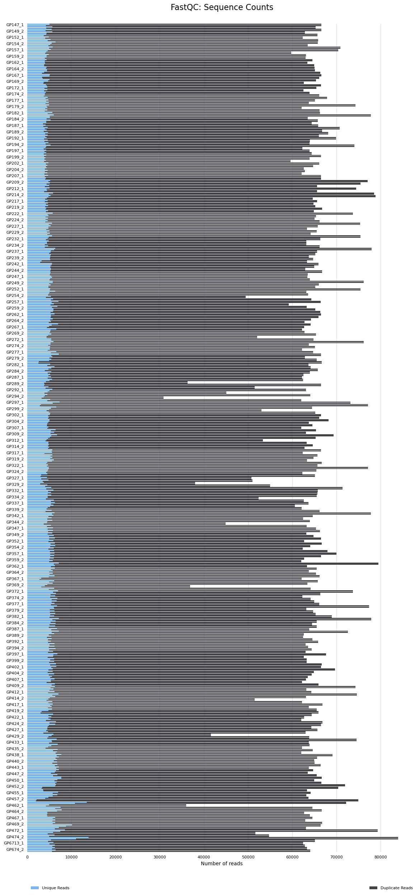
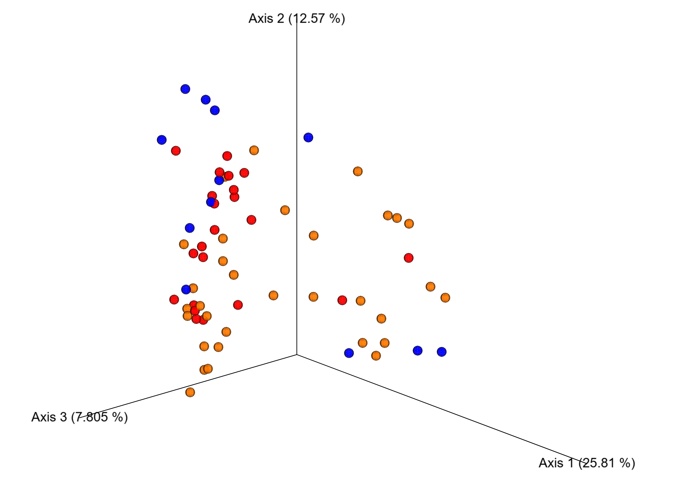
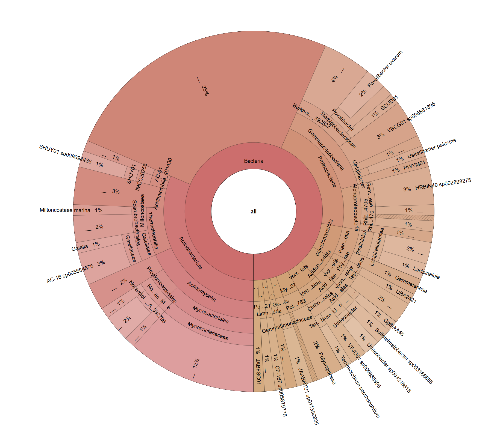

```{r custom-header, echo=FALSE, results='asis'}
# cat('
# <style>
# 
# body, .main-container {
#   max-width: 95%;
#   margin: 0 auto;
#   font-size: 1.05rem;
# }

# 
# .header-bar {
#   position: fixed;
#   top: 0;
#   left: 0;
#   width: 100%;
#   background-color: white;
#   color: #337ab7; 
#   display: flex;
#   align-items: center;
#   padding: 10px 20px;
#   z-index: 9999;
#   box-shadow: 0 2px 4px rgba(0,0,0,0.1);
#   font-size: 22px;
#   font-weight: bold;
# }


# .header-bar img {
#   height: 45px;
#   margin-right: 15px;
# }

# .header-text {
#   text-align: left;
# }

#
# body {
#   padding-top: 70px;
# }

# /* Responsive */
# @media (max-width: 768px) {
#   .header-bar {
#     font-size: 18px;
#     padding: 8px 10px;
#   }
#   .header-bar img {
#     height: 35px;
#     margin-right: 10px;
#   }
# }
# </style>

# <div class="header-bar">
#   
#   <div class="header-text">Restoring Resilient Ecosystems</div>
# </div>
# ')

```

```{r custom-page, echo=FALSE, results='asis'}
#cat('
#<style>
#.container-fluid {
#  max-width: 95% !important; 
#}
#</style>
#')
```


```{r setup, include=FALSE}
knitr::opts_chunk$set(echo = TRUE)
```


```{r dependencies, echo=FALSE, message=FALSE, warning=FALSE}
#loading the dependencies :
library(ggplot2)
library(plotly)
library(htmltools)
library(tidyverse)
library(dplyr)
library(jsonlite)
library(stringr)
library(tidyverse)
library(vegan)
library(readr)

```

## Project Background

**RestREco** is a research initiative that approaches ecological restoration with a focus on *resilience*, rather than returning ecosystems to its original state.

The **Dig Deeper** study explored how the *age of restoration*, *establishment type*, and *site management* influence **bacterial** and **fungal** communities in soil. This was achieved by analysing both **16S** and **ITS** sequencing data collected from 66 distinct sites. The analysis focused on three main aspects:

- **Alpha and beta diversity**
- **Taxonomic composition**
- **Functional diversity**

---

## Data Overview

### Approach

The sequencing data were processed using the **QIIME 2** bioinformatics platform — a widely used tool for microbiome analysis. Raw amplicon reads were **denoised** using the `DADA2` plugin, enabling accurate identification of *amplicon sequence variants (ASVs)* with single-nucleotide resolution. This method improves upon traditional OTU clustering by enhancing precision.

After **quality filtering** and **feature table construction**, the pipeline proceeded to:

- Generate **taxonomic classifications**
- Perform **alpha and beta diversity analyses**
- Create various **interactive visualisations** for exploring microbial community structure

Both **16S rRNA gene** sequencing (for *bacteria and archaea*) and **ITS sequencing** (for *fungi*) were included, providing a broad overview of microbial diversity across samples.

---

### Quality Control

You can explore the full **MultiQC report** by clicking the image below:

```{r QC,echo=FALSE, message=FALSE, warning=FALSE, results='asis'}

cat('
<div style="text-align: center;">
  <a href="data/multiqc_report.html" target="_blank">
    
  </a>
  <p style="font-style: italic;">Figure 5. MultiQC Plot</p>
</div>
')

```

This barplot presents the number of raw sequencing reads for each individual sample prior to any quality control or filtering.  
Most samples exhibit a relatively consistent sequencing depth. However, a few samples display notably lower read counts, which could potentially influence downstream analyses if not properly filtered or normalised.

---

### About the Sites {.tabset}

The dataset encompasses **66 distinct sites**, each contributing **five soil samples**. These sites span a wide age range — from **1 year** to **over 100 years** — providing a valuable gradient for ecological comparisons.

Each site's five samples:

- Share the same **establishment type**
- Are subject to the same **management practices**

In addition, soil **pH** and **electrical conductivity (EC)** were measured for every sample to help characterise environmental conditions.

There are:

- **3 establishment types**
- **4 management types**, which can be applied **individually or in combination**  

  → Some sites follow a single management approach, while others incorporate **two, three, or all four**.

---

#### Mean Soil pH Across Sites

Soil pH is a critical environmental parameter that influences microbial community structure, nutrient availability, and overall ecosystem function.  
This section summarises the average pH values for each sampled site, grouped by establishment type.

The bar chart below allows for easy comparison of mean pH across sites.  
Each bar is coloured according to the establishment method (e.g., seed mix, natural regeneration, green hay), and by hovering over a bar, the user can view the precise pH value for each site.

_Note: To improve clarity, site names have been removed from the x-axis, but full details are available via the interactive tooltip._

```{r samples, echo=FALSE, message=FALSE, warning=FALSE, fig.cap="Figure 2. pH Mean For Each Site"}


sample.data <- read.table('data/GP_metadata.txt', header = TRUE, sep = "\t")
sample.data$Establishment <- as.factor(sample.data$Establishment)
sample.data$Site <- as.factor(sample.data$Site)
#mean.ph <- aggregate(sample.data, pH~Site, FUN=mean)
mean.ph <- sample.data %>%
  group_by(Site) %>%
  summarise(pH = mean(pH, na.rm = TRUE),
            Establishment = first(Establishment), .groups = "drop")  # on garde le type

p <- ggplot(mean.ph, aes(x=Site, y=pH, fill = Establishment, text = paste0("Site: ", Site, "\npH: ", round(pH, 2)))) +
  geom_col() +
  scale_fill_manual(values = c(
    "seed_mix" = "rosybrown",
    "Natural_regen" = "goldenrod",
    "Green_hay/bush" = "darkseagreen"
  ))  +
  theme(axis.text.x = element_blank(),
        axis.ticks.x = element_blank())

b <- ggplotly(p, tooltip = "text")

# Wrap with centered div using htmltools
HTML("<p style='text-align: center; font-weight: bold;'>Figure 2. pH Mean For Each Site</p>")
htmltools::div(style = "text-align: center;", b)

```

#### Mean Electrical Conductivity

This section explores the **variation in electrical conductivity (EC)** across study sites.  
Electrical conductivity is a measure of the soil’s ability to conduct electricity, often reflecting **ion concentration and soil salinity**, which can influence microbial activity and nutrient availability.

The plots below allow users to examine how EC differs depending on either the **type of establishment** or the **age of the site**.

*Use the drop-down menu to switch between views. Hover over the bars for detailed site-specific values.*

```{r plot-switcher-ec, echo=FALSE, results='asis', warning=FALSE, message=FALSE}


cat('<label for="variable_selector_ec"><big>Select variable:</big></label>
    <select id="variable_selector_ec" onchange="switchPlotEC()">',
    '<option value="est">Establishment</option>',
    '<option value="age">Age</option>',
    '</select>')


mean.ec.est <- sample.data %>%
  group_by(Site) %>%
  summarise(
    EC = mean(EC, na.rm = TRUE),
    Establishment = dplyr::first(Establishment),
    .groups = "drop"
  ) %>%
  arrange(Establishment, Site)


sample.data <- sample.data %>%
  mutate(
    Age_numeric = ifelse(Age == ">100", 101, as.numeric(Age))
  )

mean.ec.age <- sample.data %>%
  group_by(Site) %>%
  summarise(
    EC = mean(EC, na.rm = TRUE),
    Age_original = first(Age),
    Age_numeric = first(Age_numeric),
    .groups = "drop"
  ) %>%
  arrange(Age_numeric)


gg_ec_est <- ggplot(mean.ec.est, aes(
  x = reorder(Site, EC),
  y = EC,
  fill = Establishment,
  text = paste0("Site: ", Site, "\nEC: ", round(EC, 2))
)) +
  geom_col() +
  scale_fill_manual(values = c(
    "seed_mix" = "rosybrown",
    "Natural_regen" = "goldenrod",
    "Green_hay/bush" = "darkseagreen"
  )) +
  theme(axis.text.x = element_blank(),
        axis.ticks.x = element_blank())

cat('<div id="plot_EC_est">')
ggplotly(gg_ec_est, tooltip = "text")
cat('<p style="margin-top: 20px;">This plot shows the variation in electrical conductivity across sites, sorted by electrical conductivity.</p>')
cat('</div>')


gg_ec_age <- ggplot(mean.ec.age, aes(
  x = reorder(Site, Age_numeric),
  y = EC,
  text = paste0("Site: ", Site, "\nEC: ", round(EC, 2), "\nAge: ", Age_original)
)) +
  geom_col(fill = "steelblue") +
  labs(title = "Mean EC per Site ",
       x = "Site (ordered by Age)",
       y = "Mean EC") +
  theme(axis.text.x = element_blank(),
        axis.ticks.x = element_blank())

cat('<div id="plot_EC_age" style="display:none;">')
ggplotly(gg_ec_age, tooltip = "text")
cat('<p style="margin-top: 20px;">This plot shows the variation in electrical conductivity across sites, sorted by increasing site age.</p>')
cat('</div>')


cat('<script>function switchPlotEC() {
  var val = document.getElementById("variable_selector_ec").value;
  document.getElementById("plot_EC_est").style.display = (val === "est") ? "block" : "none";
  document.getElementById("plot_EC_age").style.display = (val === "age") ? "block" : "none";
}</script>')
```


#### Site Management Practices

This section illustrates the **types of management practices applied at each site**, including **cutting**, **cattle grazing**, **sheep grazing**, and **ploughing**.  
Each coloured bar indicates the presence of one or more management strategies at a given site. Sites with multiple bars have undergone **combinations of practices**, highlighting the complexity and variation in land use across the study area.

*Hover over each bar in the interactive plot to see the site name.*

```{r site-management, echo = FALSE, message=FALSE, warning=FALSE, fig.cap="Figure 4. Management for each site"}


sample.data_long <- sample.data %>%
  pivot_longer(cols = c(Cutting, Cattle, Sheep, Plough),
               names_to = "management_type",
               values_to = "used") %>%
  filter(used == 1)

df_unique <- sample.data_long %>%
  distinct(Site, management_type)


p <- ggplot(df_unique, aes(x = Site, fill = management_type,text = Site)) +
  geom_bar(position = "stack") +
  scale_fill_manual(values = c(
    "Cutting" = "#4682B4",        # steelblue
    "Cattle" = "#1E90FF",         # dodgerblue
    "Sheep" = "#6CA6CD",          # skyblue3
    "Plough" = "#104E8B"          # deepskyblue4
  )) +
  labs(x = "Site",
       y = "Number of management type",
       fill = "Management type") +
  theme(axis.text.x = element_blank(),
        axis.ticks.x = element_blank())

c <- ggplotly(p, tooltip= "text")

HTML("<p style='text-align: center; font-weight: bold;'>Figure 4. Management type for each site</p>")
htmltools::div(style = "text-align: center;", c)

```

#### Influence of Management Practices

This section examines how different **management practices** — such as cutting, grazing by cattle or sheep, and ploughing — influence two key soil properties: **pH** and **electrical conductivity (EC)**.  
These soil characteristics can affect microbial communities by altering nutrient availability, pH balance, and soil structure.

The visualisations below display the overall effect of each management type **individually**. However, it is important to note that **potential interactions between management types** (e.g., cutting combined with grazing) are not accounted for here.  
Such interactions may play a significant role in shaping soil conditions but were beyond the scope of this visual summary.

Use the drop-down menu to explore how each management type affects pH or EC across all sampled sites.  
Black dots represent the mean values for each management category.

```{r plot-switcher-management, echo=FALSE, results='asis', warning= FALSE}
cat('
<label for="variable_selector_man">Select variable:</label>
<select id="variable_selector_man" onchange="switchPlot()">
  <option value="ph">pH</option>
  <option value="ec">Electric Conductivity</option>
</select>
') # creates a drop-down menu


summary_means_ph <- sample.data_long %>%
  group_by(management_type) %>%
  summarise(mean_val = mean(pH, na.rm = TRUE), .groups = "drop")

gg_ph <- ggplot(sample.data_long, aes(x = management_type, y = pH, fill = management_type)) +
  geom_boxplot() + scale_fill_manual(values = c(
    "Cutting" = "steelblue3",        # steelblue
    "Cattle" = "#1E90FF",         # dodgerblue
    "Sheep" = "#6CA6CD",          # skyblue3
    "Plough" = "#104E8B"          # deepskyblue4
  )) +
  geom_point(data = summary_means_ph,
             aes(x = management_type, y = mean_val,
                 text = paste0("Mean pH: ", round(mean_val, 2))),
             shape = 20, size = 3, color = "black", inherit.aes = FALSE) +
  labs(title = "pH Variation Depending on Management Type",
       x = "Management Type", y = "pH") +
  theme_minimal()

cat('<div id="plot_ph">')

ggplotly(gg_ph, tooltip = "text")

cat('</div>')

summary_means_ec <- sample.data_long %>%
  group_by(management_type) %>%
  summarise(mean_val = mean(EC, na.rm = TRUE), .groups = "drop")

gg_ec <- ggplot(sample.data_long, aes(x = management_type, y = EC, fill = management_type)) +
  geom_boxplot() +
  scale_fill_manual(values = c(
    "Cutting" = "#4682B4",        # steelblue
    "Cattle" = "#1E90FF",         # dodgerblue
    "Sheep" = "#6CA6CD",          # skyblue3
    "Plough" = "#104E8B"          # deepskyblue4
  ))+
  geom_point(data = summary_means_ec,
             aes(x = management_type, y = mean_val,
                 text = paste0("Mean EC: ", round(mean_val, 2))),
             shape = 20, size = 3, color = "black", inherit.aes = FALSE) +
  labs(title = "EC Variation Depending on Management Type",
       x = "Management Type", y = "EC") +
  theme_minimal()

cat('<div id="plot_ec" style="display:none;">')
ggplotly(gg_ec, tooltip = "text")
cat('</div>')

cat('
<script>
function switchPlot() {
  var val = document.getElementById("variable_selector_man").value;
  document.getElementById("plot_ph").style.display = (val === "ph") ? "block" : "none";
  document.getElementById("plot_ec").style.display = (val === "ec") ? "block" : "none";
}
</script>
')# displays the plot corresponding to the user's choice
```


## Diversity

### Alpha Diversity

Alpha diversity refers to the variety of organisms within a particular sample or environment. It reflects both **richness**—the number of distinct taxa—and **evenness**—how evenly individuals are distributed among those taxa. One of the most widely used measures for assessing alpha diversity is the **Shannon index**.

The Shannon index takes into account not only the number of species present, but also how evenly their abundances are distributed. A higher Shannon value generally indicates a more diverse and ecologically balanced community.

Another important metric is **Faith’s Phylogenetic Diversity (Faith PD)**, which measures the total branch length of the phylogenetic tree that spans the species in a sample. Unlike the Shannon index, Faith PD incorporates evolutionary relationships, providing a phylogenetic perspective on diversity.

In the interactive plots below, we examine how both the Shannon index and Faith PD vary across different environmental and experimental conditions, separately for the 16S (bacteria and archaea) and ITS (fungi) datasets.

#### From 16S Data


```{r type-plot-switcherBegin, echo=FALSE, message=FALSE, warning=FALSE, results='asis'}
#cat('
#<label for="variable_selector_type"><big>Select data type:</big></label>
#<select id="variable_selector_type" onchange="switchPlotType()">
#  <option value="bac">16S (bacteria & archaea)</option>
#  <option value="fun">ITS (fungi)</option>
#</select>
#')
```


```{r shannon-plot-switcher, echo=FALSE, message=FALSE, warning=FALSE, results='asis'}
#cat('<div id="section_16S">')
cat('
<label for="variable_selector_Alpha16S">Select variable:</label>
<select id="variable_selector_Alpha16S" onchange="switchPlotAlpha16S()">
  <option value="year_est">Year-Establishment</option>
  <option value="est">Establishment</option>
  <option value="age">Age</option>
</select>
') # creates a drop-down menu


df_shannon <- read_tsv("data/alpha_diversity_16S/s08_alpha_shannon_per_group/data/metadata.tsv", col_types = cols())
df_shannon <- df_shannon[-1, ]

df_faith <- read_tsv("data/alpha_diversity_16S/s08_alpha_faith_pd_per_group/data/metadata.tsv", col_types = cols())
df_faith <- df_faith[-1, ]

df_shannon$shannon_entropy <- as.numeric(df_shannon$shannon_entropy)
df_faith$faith_pd <- as.numeric(df_faith$faith_pd)


var <- "Year_est"
p <- ggplot(df_shannon, aes_string(x = var, y = "shannon_entropy")) +
  geom_boxplot(fill = "deepskyblue3") +
  theme_minimal() +
  labs(title = paste("Shannon Index by", var), x = var, y = "Shannon Index") +
  theme(axis.text.x = element_text(angle = 45, hjust = 1)) +
  scale_y_continuous(breaks = seq(floor(min(df_shannon$shannon_entropy, na.rm = TRUE)),
                                  ceiling(max(df_shannon$shannon_entropy, na.rm = TRUE)), 1))

pp <- ggplot(df_faith, aes_string(x = var, y = "faith_pd")) +
    geom_boxplot(fill = "deepskyblue3") +
    theme_minimal() +
    labs(title = paste("Faith PD by", var), x = var, y = "Faith PD") +
    theme(axis.text.x = element_text(angle = 45, hjust = 1)) +
  scale_y_continuous(breaks = seq(floor(min(df_faith$faith_pd, na.rm = TRUE)),
                                  ceiling(max(df_faith$faith_pd, na.rm = TRUE)), 1))


cat('<div id="plot_year_est">')

ggplotly(p, tooltip = "text")
ggplotly(pp, tooltip = "text")

cat('</div>')

var2 <- "Establishment"

g <- ggplot(df_shannon, aes_string(x = var2, y = "shannon_entropy")) +
  geom_boxplot(fill = "deepskyblue2") +
  theme_minimal() +
  labs(title = paste("Shannon Index by", var2), x = var2, y = "Shannon Index") +
  theme(axis.text.x = element_text(angle = 45, hjust = 1)) +
  scale_y_continuous(breaks = seq(floor(min(df_shannon$shannon_entropy, na.rm = TRUE)),
                                  ceiling(max(df_shannon$shannon_entropy, na.rm = TRUE)), 1))

gg <- ggplot(df_faith, aes_string(x = var2, y = "faith_pd")) +
    geom_boxplot(fill = "deepskyblue2") +
    theme_minimal() +
    labs(title = paste("Faith PD by", var2), x = var2, y = "Faith PD") +
    theme(axis.text.x = element_text(angle = 45, hjust = 1)) +
  scale_y_continuous(breaks = seq(floor(min(df_faith$faith_pd, na.rm = TRUE)),
                                  ceiling(max(df_faith$faith_pd, na.rm = TRUE)), 1))


cat('<div id="plot_est" style="display:none;">')
ggplotly(g, tooltip = "text")
ggplotly(gg, tooltip = "text")
cat('</div>')

var3 <- "Age"

q <- ggplot(df_shannon, aes_string(x = var3, y = "shannon_entropy")) +
  geom_boxplot(fill = "deepskyblue") +
  theme_minimal() +
  labs(title = paste("Shannon Index by", var3), x = var3, y = "Shannon Index") +
  theme(axis.text.x = element_text(angle = 45, hjust = 1)) +
  scale_y_continuous(breaks = seq(floor(min(df_shannon$shannon_entropy, na.rm = TRUE)),
                                  ceiling(max(df_shannon$shannon_entropy, na.rm = TRUE)), 1))

qq <- ggplot(df_faith, aes_string(x = var3, y = "faith_pd")) +
    geom_boxplot(fill = "deepskyblue") +
    theme_minimal() +
    labs(title = paste("Faith PD by", var3), x = var3, y = "Faith PD") +
    theme(axis.text.x = element_text(angle = 45, hjust = 1)) +
  scale_y_continuous(breaks = seq(floor(min(df_faith$faith_pd, na.rm = TRUE)),
                                  ceiling(max(df_faith$faith_pd, na.rm = TRUE)), 1))


cat('<div id="plot_age" style="display:none;">')
ggplotly(q, tooltip = "text")
ggplotly(qq, tooltip = "text")
cat('</div>')


cat('You can also directly go explore the plots on QIIME2:<br /><a href="data/alpha_diversity_16S/s08_alpha_shannon_per_group/data/index.html" target="_blank">Click here to explore the Shannon plots</a><br /><a href="data/alpha_diversity_16S/s08_alpha_faith_pd_per_group/data/index.html" target="_blank">Click here to explore the faith PD plots</a>
')


cat('<script>
function switchPlotAlpha16S() {
  var val = document.getElementById("variable_selector_Alpha16S").value;
  document.getElementById("plot_year_est").style.display = (val === "year_est") ? "block" : "none";
  document.getElementById("plot_est").style.display = (val === "est") ? "block" : "none";
  document.getElementById("plot_age").style.display = (val === "age") ? "block" : "none";
}
</script>')

#cat('</div>')


```


#### From ITS Data

Just as with the 16S data, we computed the **Shannon diversity index** for the ITS dataset to assess fungal alpha diversity. The resulting boxplots allow us to explore how fungal diversity varies across different environmental or experimental conditions, offering a parallel view to that of bacterial and archaeal communities.

This analysis provides valuable insights into how fungal communities respond to factors such as establishment method, site age, or land management, complementing the microbial diversity picture captured by the 16S data.

```{r funguilt-shannon, echo=FALSE, message=FALSE, warning=FALSE, results='asis'}

#cat('<div id="section_ITS" style="display:none;">')

cat('
<label for="variable_selector_AlphaITS">Select variable:</label>
<select id="variable_selector_AlphaITS" onchange="switchPlotAlphaITS()">
  <option value="year_est">Year-Establishment</option>
  <option value="est">Establishment</option>
  <option value="age">Age</option>
</select>
') # creates a drop-down menu


funguild <- read_tsv("data/funguild_input.guilds_matched.txt")

abundance_data <- funguild %>%
  select(matches("^[A-Za-z].*")) %>%
  select(-c(`OTU ID`, Taxonomy)) %>%
  mutate(across(everything(), as.numeric))

abundance_matrix <- as.data.frame(t(abundance_data))
colnames(abundance_matrix) <- funguild$`OTU ID`
abundance_matrix$Site <- rownames(abundance_matrix)

shannon_index <- abundance_matrix %>%
  select(-Site) %>%
  diversity(index = "shannon")

shannon_df <- tibble(
  Site = rownames(abundance_matrix),
  Shannon = shannon_index
)
shannon_df<- shannon_df %>% filter(
    !is.na(Shannon),
    !Site %in% c("Taxon", "Taxon Level", "Trophic Mode", "Guild", 
                 "Growth Morphology", "Trait", "Confidence Ranking", 
                 "Notes", "Citation/Source")
  )
metadata <- read_tsv("data/GP_metadata.txt")


shannon_merged <- left_join(shannon_df, metadata, by = "Site")

p1 <- ggplot(shannon_merged, aes(x = Year_est, y = Shannon, fill = Year_est)) +
  geom_boxplot(fill = "dodgerblue3") +
  theme_minimal() +
  labs(title = "Shannon Index by Year of Establishment",
       x = "Year_est",
       y = "Shannon Index") +
  theme(axis.text.x = element_text(angle = 45, hjust = 1))

cat('<div id="plot_year_estITS">')

ggplotly(p1, tooltip = "text")

cat('</div>')

p2 <- ggplot(shannon_merged, aes(x = Establishment, y = Shannon, fill = Establishment)) +
  geom_boxplot(fill = "dodgerblue2") +
  theme_minimal() +
  labs(title = "Shannon Index by establishment",
       x = "Establishment",
       y = "Shannon Index") +
  theme(axis.text.x = element_text(angle = 45, hjust = 1))


cat('<div id="plot_estITS" style="display:none;">')
ggplotly(p2, tooltip = "text")
cat('</div>')
p3 <- ggplot(shannon_merged, aes(x = Age, y = Shannon, fill = Age)) +
  geom_boxplot(fill = "dodgerblue") +
  theme_minimal() +
  labs(title = "Shannon Index by Age",
       x = "Age",
       y = "Shannon Index") +
  theme(axis.text.x = element_text(angle = 45, hjust = 1))


cat('<div id="plot_ageITS" style="display:none;">')
ggplotly(p3, tooltip = "text")
cat('</div>')


cat('<script>
function switchPlotAlphaITS() {
  var val = document.getElementById("variable_selector_AlphaITS").value;
  document.getElementById("plot_year_estITS").style.display = (val === "year_est") ? "block" : "none";
  document.getElementById("plot_estITS").style.display = (val === "est") ? "block" : "none";
  document.getElementById("plot_ageITS").style.display = (val === "age") ? "block" : "none";
}
</script>')

#cat('</div>')
```

```{r type-plot-switcherEnd, echo=FALSE, message=FALSE, warning=FALSE, results='asis'}
#cat('<script>
#function switchPlotType() {
#  var val = document.getElementById("variable_selector_type").value;
#  document.getElementById("section_16S").style.display = (val === "bac") ? "block" : "none";
#  document.getElementById("section_ITS").style.display = (val === "fun") ? "block" : "none";
#}
#</script>')
```

### Beta Diversity

To explore differences in microbial communities, we often rely on dimensionality reduction techniques such as *Principal Coordinates Analysis* (PCoA), visualised through **Emperor plots**. Two commonly used distance metrics in this context are **Bray-Curtis** and **Weighted UniFrac**.

While both metrics can reveal meaningful clustering and separation in microbial data, they capture complementary aspects of community structure.

#### From 16S Data

##### Bray-Curtis Emperor Plot

The **Bray-Curtis Emperor plot** is a 3D visualisation of microbial community dissimilarities between samples, based on the Bray-Curtis distance. This distance metric quantifies how different two samples are in terms of species abundance, taking into account both presence/absence and relative abundances. It does *not* incorporate evolutionary relationships between features.

Using **Principal Coordinates Analysis (PCoA)**, the high-dimensional Bray-Curtis distance matrix is projected into a lower-dimensional space—typically three axes—to capture the main patterns of variation across samples.

The Emperor plot is an **interactive 3D tool** developed for QIIME 2 that allows users to explore these PCoA results. Samples are represented as points in space, and their spatial proximity reflects ecological similarity:

- Samples that are closer together have more similar microbial communities.
- Samples that are further apart differ more strongly in community composition.

This type of plot is particularly useful for identifying clustering by experimental groups—such as treatment, site, or timepoint—and for detecting patterns or gradients in microbial diversity.


```{r emperor-plot-interactive, echo=FALSE, results='asis', message=FALSE, warning=FALSE}

json <- fromJSON("data/beta_diversity/s09_beta_bray_curtis_emperor_pcoa/data/emperor.json")

coords <- json$plot$decomposition$coordinates

coord_df <- as.data.frame(coords)

colnames(coord_df) <- paste0("PC", seq_len(ncol(coords)))
coord_df$SampleID <- json$plot$decomposition$sample_ids

# Extraire les métadonnées
metadata <- as.data.frame(json$plot$metadata, stringsAsFactors = FALSE)
colnames(metadata) <- json$plot$metadata_headers

# Joindre coordonnées + métadonnées
df <- left_join(coord_df, metadata, by = "SampleID")


plot_ly(
  df,
  x = ~PC1,
  y = ~PC2,
  z = ~PC3,
  color = ~Establishment,
  text = ~SampleID,
  type = "scatter3d",
  mode = "markers",
  marker = list(size = 4)
  
)

cat('Here is a link to the bray curtis emperor plot for more flexibility on QIIME2: <a href="data/beta_diversity/s09_beta_bray_curtis_emperor_pcoa/data/index.html" target="_blank">Bray-Curtis Emperor Plot (16S)</a>')


```


```{r emperor-plot, echo=FALSE, results='asis'}
#cat('
#<div style="text-align: center;">
#  <a href="data/beta_diversity/s09_beta_bray_curtis_emperor_pcoa/data/index.html" target="_blank">
#    
#  </a>
#  <p style="font-style: italic;">Figure 2. Beta diversity emperor plot</p>
#</div>
#')

```


##### Weighted UniFrac Emperor Plot

In contrast, **Weighted UniFrac** incorporates both species abundance and phylogenetic relationships. It measures the dissimilarity between microbial communities by accounting for how much evolutionary history is shared between them, weighted by the relative abundance of taxa.

This makes Weighted UniFrac particularly useful when the evolutionary context is important, as it highlights not only which organisms are present and in what quantities, but also how closely related they are.

As with Bray-Curtis, **Principal Coordinates Analysis (PCoA)** is applied to the distance matrix, and the results are displayed using an interactive **Emperor plot**. This allows for intuitive exploration of patterns in microbial composition, helping to reveal whether certain groups cluster together based on phylogenetic similarity and experimental conditions.


```{r weighted-plot-interactive, echo=FALSE, results='asis', message=FALSE, warning=FALSE}

json <- fromJSON("data/beta_diversity/s09_beta_weighted_unifrac_emperor_pcoa/data/emperor.json")

coords <- json$plot$decomposition$coordinates

coord_df <- as.data.frame(coords)

colnames(coord_df) <- paste0("PC", seq_len(ncol(coords)))
coord_df$SampleID <- json$plot$decomposition$sample_ids


metadata <- as.data.frame(json$plot$metadata, stringsAsFactors = FALSE)
colnames(metadata) <- json$plot$metadata_headers

df <- left_join(coord_df, metadata, by = "SampleID")


plot_ly(
  df,
  x = ~PC1,
  y = ~PC2,
  z = ~PC3,
  color = ~Establishment,
  text = ~SampleID,
  type = "scatter3d",
  mode = "markers",
  marker = list(size = 4)
  
)

cat('Here is a link to the weighted unifrac emperor plot for more flexibility on QIIME2: <a href="data/beta_diversity/s09_beta_weighted_unifrac_emperor_pcoa/data/index.html" target="_blank">Weighted Unifrac Emperor Plot (16S)</a>')

```

#### From ITS Data


## Taxonomy

### Krona Plots

To explore the composition of soil microbial communities, we used **Krona plots** — interactive, circular charts that display taxonomic abundances in a hierarchical manner.

These plots allow users to intuitively navigate from broader taxonomic levels (such as *Phylum*) to more specific ones (like *Genus*), while simultaneously comparing relative abundances across taxa.

In this study, Krona plots provide a powerful and user-friendly way to:

- Visualise which microbial groups dominate each site
- Identify taxonomic shifts between locations or treatments
- Explore the taxonomic diversity present in bacterial, archaeal, and fungal communities

You can click on the image below to access the Krona plots for each site.

```{r krona,echo=FALSE, message=FALSE, warning=FALSE, results='asis'}
cat('
<div style="text-align: center;">
  <a href="data/krona_by_site.html" target="_blank">
    
  </a>
  <p style="font-style: italic;">Figure 2. Krona Plot for Baltic_farm_1</p>
</div>
')
```

## Functional Diversity

In microbial ecology, a *guild* refers to a group of organisms that fulfil similar ecological roles, regardless of their taxonomic identity. Understanding functional guilds allows researchers to move beyond taxonomic profiles and assess the ecological roles that microbial communities may play in an environment.

### From 16S Data


### From ITS Data

To investigate the ecological roles of fungal communities, we used **FUNGuild**, a tool that assigns fungi to functional guilds based on curated databases and literature. These guilds represent ecological strategies such as:

- **Saprotrophs**: decomposers of organic matter  
- **Mycorrhizal fungi**: symbionts associated with plant roots  
- **Pathogens**: organisms that cause disease in plants or animals

This functional classification provides valuable insights into what fungi are likely *doing* in the ecosystem, beyond simply *who* they are.

The plot below highlights the top 20 most abundant fungal guilds identified using FUNGuild. To avoid clutter, the guild names are hidden on the axis; however, users can hover over each bar to reveal the full name, enabling interactive and detailed exploration of fungal functional diversity.


```{r its-fun-div, echo = FALSE, message=FALSE, warning=FALSE}

guild_counts <- funguild %>%
  filter(!is.na(Guild), `Confidence Ranking` %in% c("Probable", "Highly Probable")) %>%
  count(Guild, sort = TRUE) %>%
  slice_max(n, n = 20)

# Ajout de l'esthétique text pour tooltip
p <- ggplot(guild_counts, aes(x = reorder(Guild, n), y = n, text = Guild)) +
  geom_col(fill = "#66c2a5") +
  coord_flip() +
  labs(
    title = "Top 20 functional guilds",
    x = NULL,
    y = "Number of OTUs"
  ) +
  theme_minimal() +
  theme(axis.text.y = element_blank())

ggplotly(p, tooltip = "text")
```


## All External Link

Here you'll find all the content that was given throughout the report : 
</br><a href="data/beta_diversity/s09_beta_bray_curtis_emperor_pcoa/data/index.html" target="_blank">Bray-Curtis Emperor Plot (16S)</a></br>
<a href="data/beta_diversity/s09_beta_weighted_unifrac_emperor_pcoa/data/index.html" target="_blank">Weighted Unifrac Emperor Plot (16S)</a>


