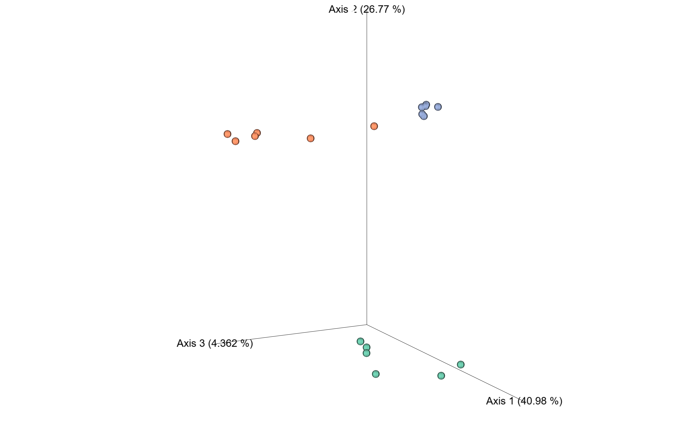

```{r setup, include=FALSE}
knitr::opts_chunk$set(echo = TRUE)
```

## About the project

RestREco approaches ecological restoration with resilience in mind rather than bringing ecosystems back to an initial or 'pristine' state.

Dig Deeper studied the impact of age of restoration, establishment and site management on bacterial and fungal communities in the soil by analysing 16S and ITS data collected from soil samples across 66 sites. The focuses of this study were diversity, taxonomy and functional diversity.

## About the samples {.tabset}

### pH

```{r samples, echo=FALSE}
library(ggplot2)

sample.data <- read.table('data/GP_metadata.txt', header = TRUE, sep = "\t")
sample.data$Establishment <- as.factor(sample.data$Establishment)
sample.data$Site <- as.factor(sample.data$Site)
mean.ph <- aggregate(sample.data, pH~Establishment, FUN=mean)

ggplot(mean.ph, aes(x=Establishment, y=pH)) + geom_col()

```

### Electrical conductivity

```{r sample-management, echo = FALSE}

mean.ec <- aggregate(sample.data, EC~Establishment, FUN=mean)
ggplot(mean.ec, aes(x=Establishment, y=EC)) + geom_col()
```

## Including Plots

You can also embed plots, for example:

```{r echo=FALSE}

```

Note that the `echo = FALSE` parameter was added to the code chunk to prevent printing of the R code that generated the plot.

Here is a link to an emperor plot: [emperor](data\s09_beta_bray_curtis_emperor_pcoa\735db07b-cc37-4076-8a39-f252ff2027b5\data\index.html)

## Including tables
```{r metadata-table, echo=FALSE}

knitr::kable(sample.data[,2:ncol(sample.data)], caption = 'Metadata for the samples')

```
