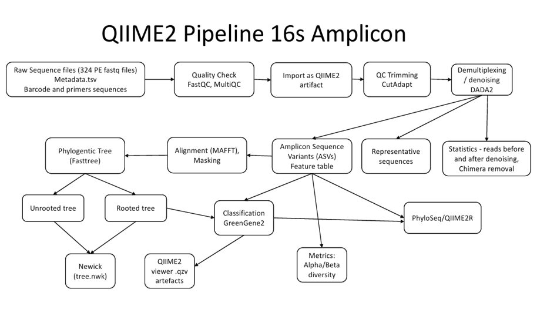

```{r title-centre, echo=FALSE, results='asis'}
cat('
<style>
h1.title {
  text-align: center;
}
</style>
')
```


```{r custom-header, echo=FALSE, results='asis'}
cat('
<style>

body, .main-container {
  max-width: 95%;
  margin: 0 auto;
  font-size: 1.05rem;
}


.header-bar {
  position: fixed;
  top: 0;
  left: 0;
  width: 100%;
  background-color: white;
  color: #3780AE; 
  display: flex;
  align-items: center;
  padding: 10px 20px;
  z-index: 9999;
  box-shadow: 0 2px 4px rgba(0,0,0,0.1);
  font-size: 22px;
  font-weight: bold;
}


.header-bar img {
  height: 45px;
  margin-right: 15px;
}


.header-text {
  text-align: left;
}


body {
  padding-top: 70px;
}


@media (max-width: 768px) {
  .header-bar {
    font-size: 18px;
    padding: 8px 10px;
  }
  .header-bar img {
    height: 35px;
    margin-right: 10px;
  }
}
</style>

<div class="header-bar">
  
  
  <div class="header-text">Dig Deeper - Microbial Community Analysis</div>
</div>
')
```


```{r setup, include=FALSE}
knitr::opts_chunk$set(echo = TRUE)
```


```{r dependencies, echo=FALSE, message=FALSE, warning=FALSE}
#loading the dependencies :
library(ggplot2)
library(plotly)
library(htmltools)
library(tidyverse)
library(dplyr)
library(jsonlite)
library(stringr)
library(tidyverse)
library(vegan)
library(readr)
library(DT)
library(FSA)
library(slickR)
library(glue)
```

## Project Background

Biodiversity loss, ecosystem degradation, and habitat destruction are increasingly linked to human-driven changes in land use, including **urbanisation**, **agriculture**, and the **exploitation of natural resources** (European Parliament, 2025; Jaureguiberry et al., 2022). In response, governments across Europe — including the EU — have introduced ambitious environmental strategies such as the **EU Biodiversity Strategy for 2030** (European Parliament, 2025) and the **30x30 target** (Markwick, 2023), which aims to protect *30% of land and sea* by the year 2030.

Ecological restoration plays a vital role in addressing these challenges. Rather than simply returning ecosystems to a previous state, modern approaches focus on **restoring ecological processes** and **enhancing ecosystem resilience** (Hicks, 2023).

### The **RestREco** Initiative

**RestREco** (*Restoring Resilient Ecosystems*) is a **NERC-funded** research project that adopts a *resilience-based* perspective on ecological restoration. The initiative brings together researchers from:

- **Cranfield University**  
- **University of Stirling**
- **UK Centre for Ecology & Hydrology**  
- **The National Trust**  
- **Forest Research**

Using a **natural experiment design**, RestREco studies a network of **133 ecological restoration sites** across **England and Scotland**. The project aims to identify key drivers of ecosystem development, such as:

- **Time since restoration began**  
- **Initial ecological conditions**  
- **Proximity to existing woodland and grassland**

The goal is to understand how these factors influence ecosystem **complexity**, **function**, and **resilience** to future pressures (RestREco, 2024).

### The **Dig Deeper** Study

As part of the RestREco initiative, the **Dig Deeper** study focused on how the *age of restoration*, *establishment type*, and *site management* affect **soil microbial communities**, specifically **bacteria** and **fungi**.

To explore this, high-throughput sequencing was conducted on:

- **16S rRNA gene** (for bacterial communities)  
- **ITS region** (for fungal communities)

A total of **330 soil samples** were collected for each marker. 

For the bacteria (16S), sequencing produced an average of approximately **65,000 reads per sample**, though this varied across the dataset:

- A small number of samples had **just over 30,000 reads**  
- A few reached up to **85,000 reads**

For the fungi (ITS), sequencing produced an average of approximately **65,000 reads per sample**, though this varied across the dataset:

- Two samples had **just over 10,000 reads** and a small number of samples had **just over 30,000 reads**  
- A few reached up to **90,000 reads**

Despite this variation, sequencing depth was generally sufficient to support robust microbial analyses.


The analysis focused on three main aspects:

- **Alpha and beta diversity**  
- **Taxonomic composition**  
- **Functional diversity**

These microbial assessments complement broader ecosystem-level measurements within the **RestREco project**, including **vegetation**, **invertebrates**, and ecosystem functions such as **litter decomposition**, **pollination services**, and **soil thermodynamic efficiency**.


### Pipelines

The sequencing data were processed using the **QIIME 2** bioinformatics platform — a widely used tool for microbiome analysis. Raw amplicon reads were **denoised** using the `DADA2` plugin, enabling accurate identification of *amplicon sequence variants (ASVs)* with single-nucleotide resolution. This method improves upon traditional OTU clustering by enhancing precision.

After **quality filtering** and **feature table construction**, the pipeline proceeded to:

- Generate **taxonomic classifications**
- Perform **alpha and beta diversity analyses**
- Create various **interactive visualisations** for exploring microbial community structure

Both **16S rRNA gene** sequencing (for *bacteria and archaea*) and **ITS sequencing** (for *fungi*) were included, providing a broad overview of microbial diversity across samples.

```{r 16S-pipeline, echo=FALSE, message=FALSE,warning=FALSE, results='asis'}

cat('
<div style="text-align: center;">
  
  <p style="font-weight: bold;">Figure 1. Pipeline (16S)</p>
</div>
')

```

---

## About the Data 

### About the Sites {.tabset}

The dataset encompasses **66 distinct sites**, each contributing **five soil samples**. These sites span a wide age range — from **1 year** to **over 100 years** — providing a valuable gradient for ecological comparisons.

Each site's five samples:

- Share the same **establishment type**
- Are subject to the same **management practices**

In addition, soil **pH** and **electrical conductivity (EC)** were measured for every sample to help characterise environmental conditions.

There are:

- **3 establishment types**
- **4 management types**, which can be applied **individually or in combination**  

  → Some sites follow a single management approach, while others incorporate **two, three, or all four**.

---

#### Mean Soil pH Across Sites

Soil pH is a critical environmental parameter that influences microbial community structure, nutrient availability, and overall ecosystem function.  
This section summarises the average pH values for each sampled site, grouped by establishment type.

The bar chart below allows for easy comparison of mean pH across sites.  
Each bar is coloured according to the establishment method (e.g., seed mix, natural regeneration, green hay), and by hovering over a bar, the user can view the precise pH value for each site.

_Note: To improve clarity, site names have been removed from the x-axis, but full details are available via the interactive tooltip._

```{r samples, echo=FALSE, message=FALSE, warning=FALSE, fig.cap="Figure 2. pH Mean For Each Site"}


sample.data <- read.table('data/GP_metadata.txt', header = TRUE, sep = "\t")
sample.data$Establishment <- as.factor(sample.data$Establishment)
sample.data$Site <- as.factor(sample.data$Site)
#mean.ph <- aggregate(sample.data, pH~Site, FUN=mean)
mean.ph <- sample.data %>%
  group_by(Site) %>%
  summarise(pH = mean(pH, na.rm = TRUE),
            Establishment = first(Establishment), .groups = "drop")  # on garde le type

p <- ggplot(mean.ph, aes(x=Site, y=pH, fill = Establishment, text = paste0("Site: ", Site, "\npH: ", round(pH, 2)))) +
  geom_col() +
  scale_fill_manual(values = c(
    "seed_mix" = "rosybrown",
    "Natural_regen" = "goldenrod",
    "Green_hay/bush" = "darkseagreen"
  ))  +
  theme(axis.text.x = element_blank(),
        axis.ticks.x = element_blank())


htmltools::div(style = "text-align: center;", ggplotly(p, tooltip = "text"))
HTML("<p style='text-align: center; font-weight: bold;'>Figure 2. pH Mean For Each Site</p>")


```

#### Mean Electrical Conductivity

This section explores the **variation in electrical conductivity (EC)** across study sites.  
Electrical conductivity is a measure of the soil’s ability to conduct electricity, often reflecting **ion concentration and soil salinity**, which can influence microbial activity and nutrient availability.

The plots below allow users to examine how EC differs depending on either the **type of establishment** or the **age of the site**.

*Use the drop-down menu to switch between views. Hover over the bars for detailed site-specific values.*

```{r plot-switcher-ec, echo=FALSE, results='asis', warning=FALSE, message=FALSE}


cat('<label for="variable_selector_ec"><big>Select variable:</big></label>
    <select id="variable_selector_ec" onchange="switchPlotEC()">',
    '<option value="est">Establishment</option>',
    '<option value="age">Age</option>',
    '</select>')


mean.ec.est <- sample.data %>%
  group_by(Site) %>%
  summarise(
    EC = mean(EC, na.rm = TRUE),
    Establishment = dplyr::first(Establishment),
    .groups = "drop"
  ) %>%
  arrange(Establishment, Site)


sample.data <- sample.data %>%
  mutate(
    Age_numeric = ifelse(Age == ">100", 101, as.numeric(Age))
  )

mean.ec.age <- sample.data %>%
  group_by(Site) %>%
  summarise(
    EC = mean(EC, na.rm = TRUE),
    Age_original = first(Age),
    Age_numeric = first(Age_numeric),
    .groups = "drop"
  ) %>%
  arrange(Age_numeric)


gg_ec_est <- ggplot(mean.ec.est, aes(
  x = reorder(Site, EC),
  y = EC,
  fill = Establishment,
  text = paste0("Site: ", Site, "\nEC: ", round(EC, 2))
)) +
  geom_col() +
  scale_fill_manual(values = c(
    "seed_mix" = "rosybrown",
    "Natural_regen" = "goldenrod",
    "Green_hay/bush" = "darkseagreen"
  )) +
  
  labs(x = "Site (ordered by EC)",
       y = "Mean EC") +
  theme(axis.text.x = element_blank(),
        axis.ticks.x = element_blank())

cat('<div id="plot_EC_est">')
htmltools::div(style = "text-align: center;", ggplotly(gg_ec_est, tooltip = "text"))
HTML("<p style='text-align: center; font-weight: bold;'>Figure 3. Mean EC per Site (by Establishment)</p>")

cat('<p style="margin-top: 20px;">This plot shows the variation in electrical conductivity across sites, sorted by electrical conductivity.</p>')
cat('</div>')


gg_ec_age <- ggplot(mean.ec.age, aes(
  x = reorder(Site, Age_numeric),
  y = EC,
  text = paste0("Site: ", Site, "\nEC: ", round(EC, 2), "\nAge: ", Age_original)
)) +
  geom_col(fill = "steelblue") +
  labs(x = "Site (ordered by Age)",
       y = "Mean EC") +
  theme(axis.text.x = element_blank(),
        axis.ticks.x = element_blank())

cat('<div id="plot_EC_age" style="display:none;">')
htmltools::div(style = "text-align: center;", ggplotly(gg_ec_age, tooltip = "text"))
HTML("<p style='text-align: center; font-weight: bold;'>Figure 4. Mean EC per Site (by Age)</p>")


cat('<p style="margin-top: 20px;">This plot shows the variation in electrical conductivity across sites, sorted by increasing site age.</p>')
cat('</div>')


cat('<script>function switchPlotEC() {
  var val = document.getElementById("variable_selector_ec").value;
  document.getElementById("plot_EC_est").style.display = (val === "est") ? "block" : "none";
  document.getElementById("plot_EC_age").style.display = (val === "age") ? "block" : "none";
}</script>')
```


#### Site Management Practices

This section illustrates the **types of management practices applied at each site**, including **cutting**, **cattle grazing**, **sheep grazing**, and **ploughing**.  
Each coloured bar indicates the presence of one or more management strategies at a given site. Sites with multiple bars have undergone **combinations of practices**, highlighting the complexity and variation in land use across the study area.

*Hover over each bar in the interactive plot to see the site name.*

```{r site-management, echo = FALSE, message=FALSE, warning=FALSE}


sample.data_long <- sample.data %>%
  pivot_longer(cols = c(Cutting, Cattle, Sheep, Plough),
               names_to = "management_type",
               values_to = "used") %>%
  filter(used == 1)

df_unique <- sample.data_long %>%
  distinct(Site, management_type)


p <- ggplot(df_unique, aes(x = Site, fill = management_type,text = Site)) +
  geom_bar(position = "stack") +
  scale_fill_manual(values = c(
    "Cutting" = "#4682B4",        # steelblue
    "Cattle" = "#1E90FF",         # dodgerblue
    "Sheep" = "#6CA6CD",          # skyblue3
    "Plough" = "#104E8B"          # deepskyblue4
  )) +
  labs(x = "Site",
       y = "Number of management type",
       fill = "Management type") +
  theme(axis.text.x = element_blank(),
        axis.ticks.x = element_blank())

htmltools::div(style = "text-align: center;", ggplotly(p, tooltip= "text"))
HTML("<p style='text-align: center; font-weight: bold;'>Figure 5. Management type for each site</p>")


```

#### Influence of Management Practices

This section examines how different **management practices** — such as cutting, grazing by cattle or sheep, and ploughing — influence two key soil properties: **pH** and **electrical conductivity (EC)**.  
These soil characteristics can affect microbial communities by altering nutrient availability, pH balance, and soil structure.

The visualisations below display the overall effect of each management type **individually**. However, it is important to note that **potential interactions between management types** (e.g., cutting combined with grazing) are not accounted for here.  
Such interactions may play a significant role in shaping soil conditions but were beyond the scope of this visual summary.

Use the drop-down menu to explore how each management type affects pH or EC across all sampled sites.  
Black dots represent the mean values for each management category.

```{r plot-switcher-management, echo=FALSE, results='asis', warning= FALSE}
cat('
<label for="variable_selector_man">Select variable:</label>
<select id="variable_selector_man" onchange="switchPlot()">
  <option value="ph">pH</option>
  <option value="ec">Electric Conductivity</option>
</select>
') # creates a drop-down menu


summary_means_ph <- sample.data_long %>%
  group_by(management_type) %>%
  summarise(mean_val = mean(pH, na.rm = TRUE), .groups = "drop")

gg_ph <- ggplot(sample.data_long, aes(x = management_type, y = pH, fill = management_type)) +
  geom_boxplot() + scale_fill_manual(values = c(
    "Cutting" = "steelblue3",        # steelblue
    "Cattle" = "#1E90FF",         # dodgerblue
    "Sheep" = "#6CA6CD",          # skyblue3
    "Plough" = "#104E8B"          # deepskyblue4
  )) +
  geom_point(data = summary_means_ph,
             aes(x = management_type, y = mean_val,
                 text = paste0("Mean pH: ", round(mean_val, 2))),
             shape = 20, size = 3, color = "black", inherit.aes = FALSE) +
  labs(x = "Management Type", y = "pH") +
  theme_minimal()


cat('<div id="plot_ph">')
htmltools::div(style = "text-align: center;", ggplotly(gg_ph, tooltip = "text"))
HTML("<p style='text-align: center; font-weight: bold;'>Figure 6. pH Variation Depending on Management Type</p>")
cat('</div>')

summary_means_ec <- sample.data_long %>%
  group_by(management_type) %>%
  summarise(mean_val = mean(EC, na.rm = TRUE), .groups = "drop")

gg_ec <- ggplot(sample.data_long, aes(x = management_type, y = EC, fill = management_type)) +
  geom_boxplot() +
  scale_fill_manual(values = c(
    "Cutting" = "#4682B4",        # steelblue
    "Cattle" = "#1E90FF",         # dodgerblue
    "Sheep" = "#6CA6CD",          # skyblue3
    "Plough" = "#104E8B"          # deepskyblue4
  ))+
  geom_point(data = summary_means_ec,
             aes(x = management_type, y = mean_val,
                 text = paste0("Mean EC: ", round(mean_val, 2))),
             shape = 20, size = 3, color = "black", inherit.aes = FALSE) +
  labs(title = "EC Variation Depending on Management Type",
       x = "Management Type", y = "EC") +
  theme_minimal()

cat('<div id="plot_ec" style="display:none;">')

htmltools::div(style = "text-align: center;", ggplotly(gg_ec, tooltip = "text"))
HTML("<p style='text-align: center; font-weight: bold;'>Figure 7. EC Variation Depending on Management Type</p>")
cat('</div>')

cat('
<script>
function switchPlot() {
  var val = document.getElementById("variable_selector_man").value;
  document.getElementById("plot_ph").style.display = (val === "ph") ? "block" : "none";
  document.getElementById("plot_ec").style.display = (val === "ec") ? "block" : "none";
}
</script>
')# displays the plot corresponding to the user's choice
```


---

### QC and Pre-Processing

#### MutliQC on raw data {.tabset}

##### Bacteria (16S)

You can explore the full **MultiQC report** by **clicking** the image below:

```{r QC,echo=FALSE, message=FALSE, warning=FALSE, results='asis'}

cat('
<div style="text-align: center;">
  <a href="data/16S/multiqc_report_16S.html" target="_blank">
    
  </a>
  <p style="font-style: bold;">Figure ??. MultiQC Plot (16S)</p>
</div>
')


```

##### Fungi (ITS)


You can explore the full **MultiQC report** by **clicking** the image below:

```{r QC-ITS,echo=FALSE, message=FALSE, warning=FALSE, results='asis'}

cat('
<div style="text-align: center;">
  <a href="data/ITS/multiqc_report.html" target="_blank">
    
  </a>
  <p style="font-style: bold;">Figure ??. MultiQC Plot (ITS)</p>
</div>
')


```

#### QC after denoising {.tabset}

##### Bacteria (16S)

```{r denoising-stats-table, echo=FALSE, message=FALSE, results='asis'}


df <- read.delim("data/16S/s04_stats_dada2/data/metadata.tsv", comment.char = "#")

cat('Here is a link to the **statistics after denoising** to view it on QIIME2 (16S) : <a href="data/16S/s04_stats_dada2/data/index.html" target="_blank">Statitics after denoising (16S)</a>')

datatable(
  df,
  options = list(
    pageLength = 10,
    scrollX = TRUE,
    autoWidth = TRUE,
    dom = 'tip',
    class = 'stripe hover row-border order-column'
  )
)

HTML("<p style='text-align: center; font-weight: bold;'>Figure ??. Statitics after denoising (16S)</p>")

```

##### Fungi (ITS)

```{r denoising-stats-table-ITS, echo=FALSE, message=FALSE, results='asis'}


df <- read.delim("data/ITS/dada2-stats-summ/data/metadata.tsv", comment.char = "#")

cat('Here is a link to the **statistics after denoising** to view it on QIIME2 (ITS) : <a href="data/ITS/dada2-stats-summ/data/index.html" target="_blank">Statitics after denoising (16S)</a>')

datatable(
  df,
  options = list(
    pageLength = 10,
    scrollX = TRUE,
    autoWidth = TRUE,
    dom = 'tip',
    class = 'stripe hover row-border order-column'
  )
)

HTML("<p style='text-align: center; font-weight: bold;'>Figure ??. Statitics after denoising (ITS)</p>")

```

---


## Alpha Diversity 

Alpha diversity refers to the variety of organisms within a particular sample or environment. It reflects both **richness**—the number of distinct taxa—and **evenness**—how evenly individuals are distributed among those taxa. One of the most widely used measures for assessing alpha diversity is the **Shannon index**.

The Shannon index takes into account not only the number of species present, but also how evenly their abundances are distributed. A higher Shannon value generally indicates a more diverse and ecologically balanced community.

Another important metric is **Faith’s Phylogenetic Diversity (Faith PD)**, which measures the total branch length of the phylogenetic tree that spans the species in a sample. Unlike the Shannon index, Faith PD incorporates evolutionary relationships, providing a phylogenetic perspective on diversity.

We also include **Pielou’s Evenness index**, which specifically quantifies how equally individual organisms are distributed across taxa. While Shannon integrates both richness and evenness, this metric isolates the evenness component, providing a complementary view of diversity patterns.

In the **interactive** plots below, we examine how the Shannon index, Faith PD and Evenness vary across different environmental and experimental conditions, separately for the 16S (bacteria and archaea) and ITS (fungi) datasets.


To allow interactive exploration of alpha diversity metrics across different environmental variables, we implemented a drop-down menu that dynamically displays the corresponding plots. Some variables, such as `pH category`, are only present in the ITS dataset, while others, like `Year group`, are specific to the 16S dataset. Internally, variables are mapped to their dataset-specific equivalents where needed (e.g. `Age group` in 16S becomes `Age category` in ITS). It is important to note, however, that these variables are not always directly comparable: for instance, `Age group` (16S) divides sites into multiple discrete intervals based on restoration age, while `Age category` (ITS) is a binary classification based on whether a site is above or below the median age. Despite these differences, the interface ensures that only available and relevant plots are shown for each selection.


For the ITS dataset, the alpha diversity was done per sample. In order to align it with the 16S analysis—where samples were already grouped by site—we aggregated the alpha diversity values by computing the **mean per site**. Categorical metadata was simplified using the most common (modal) value per site. This ensures consistency across datasets in the visual outputs. However, users interested in the original, unaggregated sample-level data can explore the **full QIIME 2 results** via the links provided under each section.


```{r alpha-plots, echo=FALSE, message=FALSE, warning=FALSE, results='asis'}
cat('<label for="variable_selector_Alpha16S">Select variable:</label>
<select id="variable_selector_Alpha16S" onchange="switchPlotAlpha16S()">
  <option value="Establishment" selected>Establishment</option>
  <option value="Cutting">Cutting</option>
  <option value="Cattle">Cattle</option>
  <option value="Sheep">Sheep</option>
  <option value="Plough">Plough</option>
  <option value="Year_group">Year group (16S only)</option>
  <option value="Age_group">Age group (16S) / Age category (ITS)</option>
  <option value="pH_category">pH category (ITS only)</option>
</select>')

read_and_clean <- function(path, column) {
  df <- read_tsv(path, col_types = cols())[-1, ]
  df[[column]] <- as.numeric(df[[column]])
  return(df)
}

# 16S data
df_shannon <- read_and_clean("data/16S/alpha_diversity/s08_alpha_shannon_per_group/data/metadata.tsv", "shannon_entropy")
df_faith   <- read_and_clean("data/16S/alpha_diversity/s08_alpha_faith_pd_per_group/data/metadata.tsv", "faith_pd")
df_even    <- read_and_clean("data/16S/alpha_diversity/s08_alpha_evenness_per_group/data/metadata.tsv", "pielou_evenness")


# ITS data
df_shannon_ITS <- read_and_clean("data/ITS/alpha_diversity/shannon_significance/data/metadata.tsv", "shannon_entropy")
df_even_ITS    <- read_and_clean("data/ITS/alpha_diversity/evenness_vector/data/metadata.tsv", "pielou_evenness")

df_shannon_ITS <- df_shannon_ITS[ , ! colnames(df_shannon_ITS) %in% c("site_code", "plot_number", "OS_location", "Lat_long")]

get_mode <- function(x) {
  ux <- na.omit(unique(x))
  ux[which.max(tabulate(match(x, ux)))]
}

df_shannon_ITS <- df_shannon_ITS %>%
  group_by(Site) %>%
  summarise(
    shannon_entropy = mean(shannon_entropy, na.rm = TRUE),
    pH_category = get_mode(pH_category),
    across(c(Establishment, Age_category, Cutting, Plough, Sheep, Cattle, Year_est), ~ first(.x)),
    .groups = "drop"
  )

df_even_ITS <- df_even_ITS[ , ! colnames(df_even_ITS) %in% c("site_code", "plot_number", "OS_location", "Lat_long")]
df_even_ITS <- df_even_ITS %>%
  group_by(Site) %>%
  summarise(
    pielou_evenness = mean(pielou_evenness, na.rm = TRUE),
    pH_category = get_mode(pH_category),
    across(c(Establishment, Age_category, Cutting, Plough, Sheep, Cattle, Year_est), ~ first(.x)),
    .groups = "drop"
  )

convert_var_ITS <- function(var) {
  case_when(
    var == "Age_group" ~ "Age_category",
    var == "Year_group" ~ NA_character_,  # Not available in ITS
    TRUE ~ var
  )
}

convert_var_16S <- function(var) {
  case_when(
    var == "pH_category" ~ NA_character_,     # n'existe pas en 16S
    TRUE ~ var
  )
}

vars <- c("Establishment", "Cutting", "Cattle", "Sheep", "Plough", "Year_group", "Age_group", "pH_category")


```

### Shannon Index Boxplot {.tabset}

The boxplot below illustrate differences in Shannon diversity across groups. This metric reflects both species richness and how balanced the community is in terms of species abundance.

#### Bacteria (16S)
```{r shannon-16S-plots, echo=FALSE, message=FALSE, warning=FALSE, results='asis'}
for (var in vars) {
  var_16S <- convert_var_16S(var)
  if (is.na(var_16S) || !(var_16S %in% names(df_shannon))) next
  display_style <- ifelse(var_16S == "Establishment", "block", "none")
  cat(paste0('<div id="plot_', var_16S, '_shannon" style="display:', display_style, ';">'))
  df1 <- df_shannon[!is.na(df_shannon$shannon_entropy) & !is.na(df_shannon[[var_16S]]), ]
  if (nrow(df1) > 0 && length(unique(df1[[var_16S]])) > 1) {
    p1 <- ggplot(df1, aes_string(x = var_16S, y = "shannon_entropy")) +
      geom_boxplot(fill = "deepskyblue3") +
      theme_minimal() +
      labs(x = var_16S, y = "Shannon Index (16S)") +
      theme(axis.text.x = element_text(angle = 45, hjust = 1))
    kw <- kruskal.test(df1$shannon_entropy ~ df1[[var_16S]])
    cat(as.character(htmltools::div(style = "text-align: center;", ggplotly(p1))))
    cat(paste0("<p style='text-align: center;'>Kruskal-Wallis p-value: ", signif(kw$p.value, 3), "</p>"))
  } else {
    cat("<p style='text-align: center;'>Kruskal-Wallis test not applicable (not enough groups)</p>")
  }
  cat('</div>')
}

cat('Here is a link to the **full QIIME2 results (16S)** : <a href="data/16S/alpha_diversity/s08_alpha_shannon_per_group/data/index.html" target="_blank">Shannon Index (16S)</a>')
```

#### Fungi (ITS)
```{r shannon-ITS-plots, echo=FALSE, message=FALSE, warning=FALSE, results='asis'}
for (var in vars) {
  var_ITS <- convert_var_ITS(var)
  if (is.na(var_ITS) || !(var_ITS %in% names(df_shannon_ITS))) next

  display_style <- ifelse(var_ITS == "Establishment", "block", "none")
  cat(paste0('<div id="plot_', var_ITS, '_shannon_ITS" style="display:', display_style, ';">'))

  df1 <- df_shannon_ITS[!is.na(df_shannon_ITS$shannon_entropy) & !is.na(df_shannon_ITS[[var_ITS]]), ]

  if (nrow(df1) > 0 && length(unique(df1[[var_ITS]])) > 1) {
    p1 <- ggplot(df1, aes_string(x = var_ITS, y = "shannon_entropy")) +
      geom_boxplot(fill = "deepskyblue4") +
      theme_minimal() +
      labs(x = var_ITS, y = "Shannon Index (ITS)") +
      theme(axis.text.x = element_text(angle = 45, hjust = 1))
    kw <- kruskal.test(df1$shannon_entropy ~ df1[[var_ITS]])
    cat(as.character(htmltools::div(style = "text-align: center;", ggplotly(p1))))
    cat(paste0("<p style='text-align: center;'>Kruskal-Wallis p-value: ", signif(kw$p.value, 3), "</p>"))
  } else {
    cat("<p style='text-align: center;'>Kruskal-Wallis test not applicable (not enough groups)</p>")
  }
  cat('</div>')
}

cat('Here is a link to the **full QIIME2 results (ITS)** : <a href="data/ITS/alpha_diversity/shannon_significance/data/index.html" target="_blank">Shannon Index (ITS)</a>')
```

### Faith PD Boxplot 

The following plots show Faith’s Phylogenetic Diversity, which integrates evolutionary relationships to capture how phylogenetically broad each microbial community is.

```{r faith-plots, echo=FALSE, message=FALSE, warning=FALSE, results='asis'}
for (var in vars) {
  var_16S <- convert_var_16S(var)
  if (is.na(var_16S) || !(var_16S %in% names(df_shannon))) next
  display_style <- ifelse(var_16S == "Establishment", "block", "none")
  cat(paste0('<div id="plot_', var_16S, '_faith" style="display:', display_style, ';">'))
  df2 <- df_faith[!is.na(df_faith$faith_pd) & !is.na(df_faith[[var_16S]]), ]
  if (nrow(df2) > 0 && length(unique(df2[[var_16S]])) > 1) {
    p2 <- ggplot(df2, aes_string(x = var_16S, y = "faith_pd")) +
      geom_boxplot(fill = "deepskyblue3") +
      theme_minimal() +
      labs(x = var_16S, y = "Faith PD (16S)") +
      theme(axis.text.x = element_text(angle = 45, hjust = 1))
    kw <- kruskal.test(df2$faith_pd ~ df2[[var_16S]])
    cat(as.character(htmltools::div(style = "text-align: center;", ggplotly(p2))))
    cat(paste0("<p style='text-align: center;'>Kruskal-Wallis p-value: ", signif(kw$p.value, 3), "</p>"))
  } else {
    cat("<p style='text-align: center;'>Kruskal-Wallis test not applicable (not enough groups)</p>")
  }
  cat('</div>')
}

cat('Here is a link to the **full QIIME2 results (16S)** : <a href="data/16S/alpha_diversity/s08_alpha_faith_pd_per_group/data/index.html" target="_blank"> Faith PD (16S)</a>')


```

### Evenness Boxplot {.tabset}

These boxplots display Pielou’s Evenness, highlighting how uniformly taxa are represented in each community. It allows us to isolate imbalance in dominance from richness effects.

#### Bacteria (16S)

```{r evenness-16S-plots, echo=FALSE, message=FALSE, warning=FALSE, results='asis'}
for (var in vars) {
  var_16S <- convert_var_16S(var)
  if (is.na(var_16S) || !(var_16S %in% names(df_shannon))) next
  display_style <- ifelse(var_16S == "Establishment", "block", "none")
  cat(paste0('<div id="plot_', var_16S, '_even" style="display:', display_style, ';">'))
  df3 <- df_even[!is.na(df_even$pielou_evenness) & !is.na(df_even[[var_16S]]), ]
  if (nrow(df3) > 0 && length(unique(df3[[var_16S]])) > 1) {
    p3 <- ggplot(df3, aes_string(x = var_16S, y = "pielou_evenness")) +
      geom_boxplot(fill = "deepskyblue3") +
      theme_minimal() +
      labs(x = var_16S, y = "Evenness (16S)") +
      theme(axis.text.x = element_text(angle = 45, hjust = 1))
    kw <- kruskal.test(df3$pielou_evenness ~ df3[[var_16S]])
    cat(as.character(htmltools::div(style = "text-align: center;", ggplotly(p3))))
    cat(paste0("<p style='text-align: center;'>Kruskal-Wallis p-value: ", signif(kw$p.value, 3), "</p>"))
  } else {
    cat("<p style='text-align: center;'>Kruskal-Wallis test not applicable (not enough groups)</p>")
  }
  cat('</div>')
}

cat('Here is a link to the **full QIIME2 results (16S)** : <a href="data/16S/alpha_diversity/s08_alpha_evenness_per_group/data/index.html" target="_blank">Pielou Evenness (16S)</a>')


```

#### Fungi (ITS)


```{r evenness-ITS-plots, echo=FALSE, message=FALSE, warning=FALSE, results='asis'}
for (var in vars) {
  var_ITS <- convert_var_ITS(var)
  if (is.na(var_ITS) || !(var_ITS %in% names(df_even_ITS))) next

  display_style <- ifelse(var_ITS == "Establishment", "block", "none")
  cat(paste0('<div id="plot_', var_ITS, '_even_ITS" style="display:', display_style, ';">'))

  df3 <- df_even_ITS[!is.na(df_even_ITS$pielou_evenness) & !is.na(df_even_ITS[[var_ITS]]), ]

  if (nrow(df3) > 0 && length(unique(df3[[var_ITS]])) > 1) {
    p3 <- ggplot(df3, aes_string(x = var_ITS, y = "pielou_evenness")) +
      geom_boxplot(fill = "deepskyblue4") +
      theme_minimal() +
      labs(x = var_ITS, y = "Evenness (ITS)") +
      theme(axis.text.x = element_text(angle = 45, hjust = 1))
    kw <- kruskal.test(df3$pielou_evenness ~ df3[[var_ITS]])
    cat(as.character(htmltools::div(style = "text-align: center;", ggplotly(p3))))
    cat(paste0("<p style='text-align: center;'>Kruskal-Wallis p-value: ", signif(kw$p.value, 3), "</p>"))
  } else {
    cat("<p style='text-align: center;'>Kruskal-Wallis test not applicable (not enough groups)</p>")
  }
  cat('</div>')
}

cat('Here is a link to the **full QIIME2 results (ITS)** : <a href="data/ITS/alpha_diversity/evenness_vector/data/index.html" target="_blank">Pielou Evenness (ITS)</a>')
```

```{r js-switcher, echo=FALSE, results='asis'}
cat('<script>
function switchPlotAlpha16S() {
  var val = document.getElementById("variable_selector_Alpha16S").value;\n')
for (v in vars) {
  var16S <- convert_var_16S(v)
  varITS <- convert_var_ITS(v)

  
  if (!is.na(var16S)) {
    cat(paste0("document.getElementById('plot_", var16S, "_shannon').style.display = (val === '", var16S, "') ? 'block' : 'none';\n"))
    cat(paste0("document.getElementById('plot_", var16S, "_faith').style.display = (val === '", var16S, "') ? 'block' : 'none';\n"))
    cat(paste0("document.getElementById('plot_", var16S, "_even').style.display = (val === '", var16S, "') ? 'block' : 'none';\n"))
  }

  
  if (!is.na(varITS)) {
    cat(paste0("document.getElementById('plot_", varITS, "_shannon_ITS').style.display = (val === '", v, "') ? 'block' : 'none';\n"))
    cat(paste0("document.getElementById('plot_", varITS, "_even_ITS').style.display = (val === '", v, "') ? 'block' : 'none';\n"))
  }
}
cat('}
</script>')

```


### Spearman test (Bacteria - 16S) {.tabset}


#### Summary Table

```{r spearman-16S, echo=FALSE, message=FALSE,warning=FALSE}
reduced_metadata <- read.delim("data/reduced_metadata.txt", row.names = 1, check.names = FALSE)


shannon <- read.delim("data/16S/alpha_diversity/alpha-diversity_shannon.tsv", row.names = 1)
faith   <- read.delim("data/16S/alpha_diversity/alpha-diversity_faith_pd.tsv", row.names = 1)
even    <- read.delim("data/16S/alpha_diversity/alpha-diversity_evenness.tsv", row.names = 1)

alpha_df <- data.frame(
  SampleID = rownames(shannon),
  Shannon = shannon$shannon_entropy,
  Faith_PD = faith$faith_pd,
  Evenness = even$pielou_evenness
)

metadata_df <- reduced_metadata %>% 
  rownames_to_column("SampleID")

data_corr <- left_join(alpha_df, metadata_df, by = "SampleID")


alpha_metrics <- c("Shannon", "Faith_PD", "Evenness")
env_vars <- c("pH", "Age")


corr_results <- data.frame()


for (alpha in alpha_metrics) {
  for (env in env_vars) {
    test <- cor.test(data_corr[[alpha]], data_corr[[env]],method = "spearman")
    
    corr_results <- rbind(corr_results, data.frame(
      Alpha_Diversity = alpha,
      Environmental_Variable = env,
      Spearman_rho = round(test$estimate, 3),
      p_value = signif(test$p.value, 3)
    ))
  }
}


datatable(corr_results, options = list(pageLength = 6), caption = "Spearman correlation results")
```

#### Correlation Plots

```{r correlation-slider, results='asis', echo=FALSE, message=FALSE, warning=FALSE, fig.align='center'}
library(slickR)
imgs <- list.files("images/corr_plots", full.names = TRUE)
slickR(imgs, slideType = 'img') + settings(arrows = TRUE, dots = TRUE, infinite = FALSE)
cat('<br /><br />')
```


## Beta Diversity

To explore differences in microbial communities, we often rely on dimensionality reduction techniques such as *Principal Coordinates Analysis* (PCoA), visualised through **Emperor plots**. Two commonly used distance metrics in this context are **Bray-Curtis** and **Jaccard**.

While both metrics can reveal meaningful clustering and separation in microbial data, they capture complementary aspects of community structure.

### Bacteria (16S) {.tabset}

#### Bray-Curtis Emperor Plot

The **Bray-Curtis Emperor plot** is a 3D visualisation of microbial community dissimilarities between samples, based on the Bray-Curtis distance. This distance metric quantifies how different two samples are in terms of species abundance, taking into account both presence/absence and relative abundances. It does *not* incorporate evolutionary relationships between features.

Using **Principal Coordinates Analysis (PCoA)**, the high-dimensional Bray-Curtis distance matrix is projected into a lower-dimensional space—typically three axes—to capture the main patterns of variation across samples.

The Emperor plot is an **interactive 3D tool** developed for QIIME 2 that allows users to explore these PCoA results. Samples are represented as points in space, and their spatial proximity reflects ecological similarity:

- Samples that are closer together have more similar microbial communities.
- Samples that are further apart differ more strongly in community composition.

This type of plot is particularly useful for identifying clustering by experimental groups—such as treatment, site, or timepoint—and for detecting patterns or gradients in microbial diversity.


```{r emperor-plot-interactive, echo=FALSE, results='asis', message=FALSE, warning=FALSE}

json <- fromJSON("data/16S/beta_diversity/s09_beta_bray_curtis_emperor_pcoa/data/emperor.json")

coords <- json$plot$decomposition$coordinates

coord_df <- as.data.frame(coords)

colnames(coord_df) <- paste0("PC", seq_len(ncol(coords)))
coord_df$SampleID <- json$plot$decomposition$sample_ids


metadata <- as.data.frame(json$plot$metadata, stringsAsFactors = FALSE)
colnames(metadata) <- json$plot$metadata_headers


df <- left_join(coord_df, metadata, by = "SampleID")


b <- plot_ly(
  df,
  x = ~PC1,
  y = ~PC2,
  z = ~PC3,
  color = ~Establishment,
  text = ~SampleID,
  type = "scatter3d",
  mode = "markers",
  marker = list(size = 4)
  
)
htmltools::div(style = "text-align: center;", b)
HTML("<p style='text-align: center; font-weight: bold;'>Figure 17. Bray-Curtis Emperor Plot</p>")

cat('Here is a link to the **Bray-Curtis Emperor Plot** for more flexibility on QIIME2: <a href="data/16S/beta_diversity/s09_beta_bray_curtis_emperor_pcoa/data/index.html" target="_blank">Bray-Curtis Emperor Plot (16S)</a>')


```


```{r emperor-plot, echo=FALSE, results='asis'}
#cat('
#<div style="text-align: center;">
#  <a href="data/beta_diversity/s09_beta_bray_curtis_emperor_pcoa/data/index.html" target="_blank">
#    
#  </a>
#  <p style="font-style: bold;">Figure 2. Beta diversity emperor plot</p>
#</div>
#')

```


#### Jaccard Emperor Plot

The **Jaccard Emperor plot** provides a 3D visualisation of microbial community dissimilarities based on the **Jaccard distance**. Unlike *Bray-Curtis*, the Jaccard metric considers **only the presence or absence** of features (e.g., microbial taxa) in each sample, ignoring their relative abundances.

This makes the Jaccard distance particularly suited for assessing *community membership* rather than *abundance structure*—focusing on **which species are present**, regardless of how abundant they are.

Using **Principal Coordinates Analysis (PCoA)**, the high-dimensional **Jaccard distance matrix** is projected into a lower-dimensional space—usually three principal axes—to reveal major patterns in sample composition.

As with *Bray-Curtis*, the **Emperor plot** allows for *interactive exploration* of these ordinations:

- Samples **positioned closely** together share *more taxa in common* (i.e., similar membership).
- Samples **far apart** have *fewer shared taxa*, reflecting *greater differences* in species presence.

The **Jaccard plot** is useful when exploring factors that influence *community membership*, such as **habitat type**, **land use**, or **environmental filtering**—especially in studies where *presence/absence patterns* are more meaningful than *relative abundances*.


```{r jaccard-plot-interactive, echo=FALSE, results='asis', message=FALSE, warning=FALSE}

json <- fromJSON("data/16S/beta_diversity/s09_beta_jaccard_emperor_pcoa/data/emperor.json")

coords <- json$plot$decomposition$coordinates

coord_df <- as.data.frame(coords)

colnames(coord_df) <- paste0("PC", seq_len(ncol(coords)))
coord_df$SampleID <- json$plot$decomposition$sample_ids


metadata <- as.data.frame(json$plot$metadata, stringsAsFactors = FALSE)
colnames(metadata) <- json$plot$metadata_headers

df <- left_join(coord_df, metadata, by = "SampleID")


b <- plot_ly(
  df,
  x = ~PC1,
  y = ~PC2,
  z = ~PC3,
  color = ~Establishment,
  text = ~SampleID,
  type = "scatter3d",
  mode = "markers",
  marker = list(size = 4)
  
)

htmltools::div(style = "text-align: center;", b)
HTML("<p style='text-align: center; font-weight: bold;'>Figure 18. Jaccard Emperor Plot</p>")


cat('Here is a link to the **Jaccard Emperor Plot** for more flexibility on QIIME2: <a href="data/16S/beta_diversity/s09_beta_jaccard_emperor_pcoa/data/index.html" target="_blank">Jaccard Emperor Plot (16S)</a>')

```

### Fungi (ITS) {.tabset}

#### Bray-Curtis Emperor Plot


```{r emperor-plot-16S, echo=FALSE, results='asis', message=FALSE, warning=FALSE}

json <- fromJSON("data/ITS/beta_diversity/s09_beta_bray_curtis_emperor_pcoa/data/emperor.json")

coords <- json$plot$decomposition$coordinates

coord_df <- as.data.frame(coords)

colnames(coord_df) <- paste0("PC", seq_len(ncol(coords)))
coord_df$SampleID <- json$plot$decomposition$sample_ids


metadata <- as.data.frame(json$plot$metadata, stringsAsFactors = FALSE)
colnames(metadata) <- json$plot$metadata_headers


df <- left_join(coord_df, metadata, by = "SampleID")


b <- plot_ly(
  df,
  x = ~PC1,
  y = ~PC2,
  z = ~PC3,
  color = ~Establishment,
  text = ~SampleID,
  type = "scatter3d",
  mode = "markers",
  marker = list(size = 4)
  
)
htmltools::div(style = "text-align: center;", b)
HTML("<p style='text-align: center; font-weight: bold;'>Figure 17. Bray-Curtis Emperor Plot</p>")

cat('Here is a link to the **Bray-Curtis Emperor Plot** for more flexibility on QIIME2: <a href="data/ITS/beta_diversity/s09_beta_bray_curtis_emperor_pcoa/data/index.html" target="_blank">Bray-Curtis Emperor Plot (ITS)</a>')


```


#### Jaccard Emperor Plot

```{r jaccard-plot-ITS, echo=FALSE, results='asis', message=FALSE, warning=FALSE}

json <- fromJSON("data/ITS/beta_diversity/s09_beta_jaccard_emperor_pcoa/data/emperor.json")

coords <- json$plot$decomposition$coordinates

coord_df <- as.data.frame(coords)

colnames(coord_df) <- paste0("PC", seq_len(ncol(coords)))
coord_df$SampleID <- json$plot$decomposition$sample_ids


metadata <- as.data.frame(json$plot$metadata, stringsAsFactors = FALSE)
colnames(metadata) <- json$plot$metadata_headers

df <- left_join(coord_df, metadata, by = "SampleID")


b <- plot_ly(
  df,
  x = ~PC1,
  y = ~PC2,
  z = ~PC3,
  color = ~Establishment,
  text = ~SampleID,
  type = "scatter3d",
  mode = "markers",
  marker = list(size = 4)
  
)

htmltools::div(style = "text-align: center;", b)
HTML("<p style='text-align: center; font-weight: bold;'>Figure 18. Jaccard Emperor Plot</p>")


cat('Here is a link to the **Jaccard Emperor Plot** for more flexibility on QIIME2: <a href="data/ITS/beta_diversity/s09_beta_jaccard_emperor_pcoa/data/index.html" target="_blank">Jaccard Emperor Plot (ITS)</a>')

```

---

## Taxonomy Composition

To explore the composition of soil microbial communities, we used **Krona plots** — interactive, circular charts that display taxonomic abundances in a hierarchical manner.

These plots allow users to intuitively navigate from broader taxonomic levels (such as *Phylum*) to more specific ones (like *Genus*), while simultaneously comparing relative abundances across taxa.

### Bacteria (16S)

#### Krona Plots


In this study, Krona plots provide a powerful and user-friendly way to:

- Visualise which microbial groups dominate each site
- Explore the taxonomic diversity present in bacterial, archaeal, and fungal communities

You can **click on the image** below to access the **Krona plots** for each site.

```{r krona,echo=FALSE, message=FALSE, warning=FALSE, results='asis'}
cat('
<div style="text-align: center;">
  <a href="data/16S/krona_by_site_16S.html" target="_blank">
    
  </a>
  <p style="font-style: bold;">Figure 19. Krona Plot for Baltic_farm_1 (16S)</p>
</div>
')
```


### Fungi (ITS)

#### Krona Plots

You can **click on the image** below to access the **Krona plots** for each site.

```{r krona-ITS,echo=FALSE, message=FALSE, warning=FALSE, results='asis'}
cat('
<div style="text-align: center;">
  <a href="data/ITS/krona_by_site_ITS.html" target="_blank">
    
  </a>
  <p style="font-style: bold;">Figure 19. Krona Plot for Baltic_farm_1 (ITS)</p>
</div>
')
```


---

## Functional Diversity

In microbial ecology, a *guild* refers to a group of organisms that fulfil similar ecological roles, regardless of their taxonomic identity. Understanding functional guilds allows researchers to move beyond taxonomic profiles and assess the ecological roles that microbial communities may play in an environment.

### Bacteria (16S)

#### Top Predicted Functional Pathways

The plot below displays the top 20 predicted KEGG pathways (or alternatively MetaCyc pathways) across all samples. These pathways reflect high-level metabolic functions such as amino acid metabolism, carbohydrate degradation, or environmental information processing.


### Fungi (ITS)

To investigate the ecological roles of fungal communities, we used **FUNGuild**, a tool that assigns fungi to functional guilds based on curated databases and literature. These guilds represent ecological strategies such as:

- **Saprotrophs**: decomposers of organic matter  
- **Mycorrhizal fungi**: symbionts associated with plant roots  
- **Pathogens**: organisms that cause disease in plants or animals
- **Ectomycorrhizal**: symbionts that assist plant roots by enhancing nutrient and water uptake, especially nitrogen and phosphorus, while contributing to carbon cycling and soil nutrient mobilisation
- **Arbuscular Mycorrhizal**: symbionts that contribute to nutrient uptake
- **Endophyte**: microorganisms that promote the growth and development of the plants
- **Lichenized**: fungi that form symbiotic associations with algae or cyanobacteria, creating lichens that can survive in harsh environments by combining structural support and photosynthetic ability
- **Parasites**: fungi that live on or inside a host organism, extracting nutrients and often causing harm
- **Symbiotrophs**: fungi that engage in mutually beneficial relationships with host organisms, typically exchanging nutrients for resources like carbon or protection

This functional classification provides valuable insights into what fungi are likely *doing* in the ecosystem, beyond simply *who* they are.


This section explores the functional roles of fungi within each site, based on guild-level annotations provided by **FUNGuild**. Fungal guilds reflect ecological functions such as **saprotrophy**, **symbiosis** (e.g., mycorrhizal fungi), or **pathogenicity**. This approach provides insight into how fungal communities may contribute to ecosystem processes, complementing traditional taxonomic analyses.

#### Top 20 Most Abundant Fungal Guilds

The plot below highlights the top 20 most abundant fungal guilds identified using **FUNGuild**. To avoid clutter, the guild names are hidden on the y-axis; however, users can **hover over each bar to reveal the full name**, enabling interactive and detailed exploration of fungal functional diversity.

```{r its-fun-div, echo = FALSE, message=FALSE, warning=FALSE}
funguild <- read_tsv("data/ITS/funguild_input.guilds_matched.txt")

guild_counts <- funguild %>%
  filter(!is.na(Guild), `Confidence Ranking` %in% c("Probable", "Highly Probable")) %>%
  count(Guild, sort = TRUE) %>%
  slice_max(n, n = 20)

p <- ggplot(guild_counts, aes(x = reorder(Guild, n), y = n, text = Guild)) +
  geom_col(fill = "#3780AE") +
  coord_flip() +
  labs(x = NULL,
       y = "Number of OTUs") +
  theme_minimal() +
  theme(axis.text.y = element_blank())

htmltools::div(style = "text-align: center;", ggplotly(p, tooltip = "text"))
HTML("<p style='text-align: center; font-weight: bold;'>Figure 20. Top 20 functional guilds</p>")
```

#### Fungal Guild Abundance Across Sites

The figure below shows the total abundance of fungal OTUs across sites, aggregated by **functional guild**. This provides an overview of how **guild-level composition** varies between locations, which may reflect differences in land use, soil conditions, or restoration histories.

```{r abundance_guild_ITS, echo=FALSE, message=FALSE, warning=FALSE, fig.width=12, fig.height=6}
# Read data 
df <- read.delim("data/ITS/funguild_input.guilds_matched.txt", check.names = FALSE)

# Identify site columns
site_cols <- names(df)[3:(which(names(df) == "Taxon") - 1)]

# Extract Guild information between pipes 
df$Guild_Extracted <- str_extract(df$Guild, "\\|[^|]+\\|") %>%
                      str_replace_all("\\|", "") %>%
                      trimws()

# Reshape and aggregate data
guild_data <- df %>%
  pivot_longer(cols = all_of(site_cols), names_to = "Site", values_to = "Abundance") %>%
  filter(Abundance > 0) %>%
  group_by(Site, Guild_Extracted) %>%
  summarise(Abundance = sum(Abundance), .groups = "drop")

# Plot
ggplot(guild_data, aes(x = Site, y = Abundance, fill = Guild_Extracted)) +
  geom_bar(stat = "identity") +
  theme_minimal() +
  theme(
    axis.text.x = element_text(angle = 90, hjust = 1, vjust = 0.5),
    legend.text = element_text(size = 8),
    legend.title = element_text(size = 9)
  ) +
  labs(
    title = "Fungal Guild Abundance by Site",
    x = "Site",
    y = "Abundance",
    fill = "Guild"
  )

```


---

## Appendix

