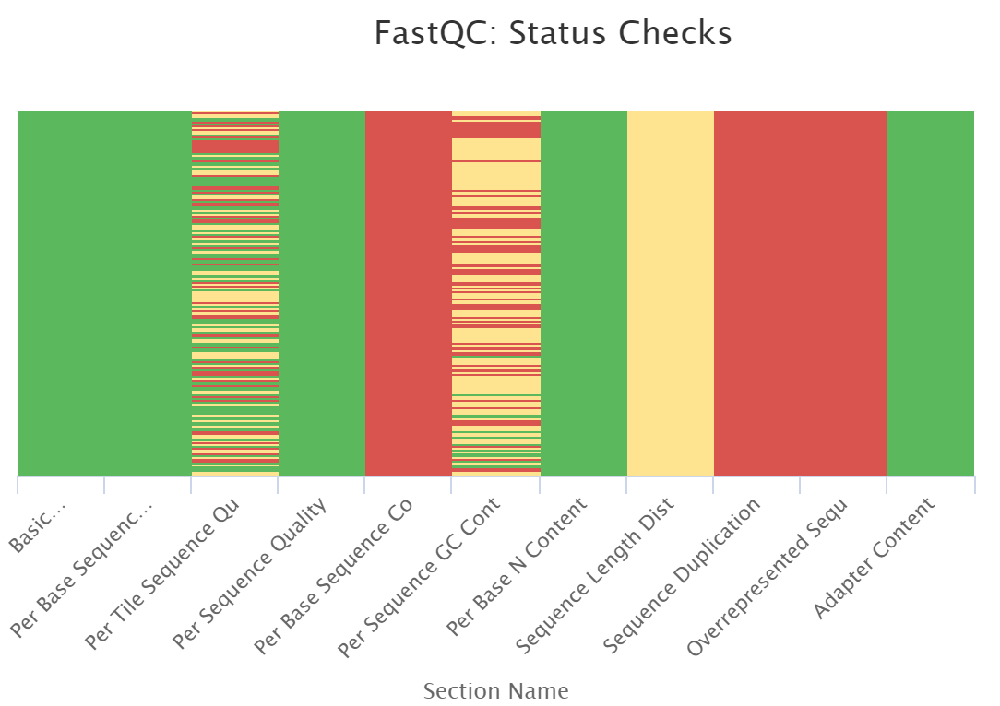

```{r setup, include=FALSE}
knitr::opts_chunk$set(echo = TRUE)
```

## About the project

RestREco approaches ecological restoration with resilience in mind rather than bringing ecosystems back to an initial or 'pristine' state.

Dig Deeper studied the impact of age of restoration, establishment and site management on bacterial and fungal communities in the soil by analysing 16S and ITS data collected from soil samples across 66 sites. The focuses of this study were diversity, taxonomy and functional diversity.

## About the samples {.tabset}


### MutliQC on raw data

```{r QC,echo=FALSE, message=FALSE, warning=FALSE, results='asis'}
cat('<div style="text-align: center;">')

cat('</div>')
```


Here is a link to the mutliQC plots: [MutliQC](data\multiqc_report.html)

### pH

```{r samples, echo=FALSE, message=FALSE, warning=FALSE}

library(ggplot2)
library(plotly)
sample.data <- read.table('data/GP_metadata.txt', header = TRUE, sep = "\t")
sample.data$Establishment <- as.factor(sample.data$Establishment)
sample.data$Site <- as.factor(sample.data$Site)
mean.ph <- aggregate(sample.data, pH~Site, FUN=mean)

p <- ggplot(mean.ph, aes(x=Site, y=pH)) + geom_col() +
  theme(axis.text.x = element_blank(),
        axis.ticks.x = element_blank())
ggplotly(p)

```

### Electric Conductivity 

```{r sample-management, echo = FALSE}

mean.ec <- aggregate(sample.data, EC~Establishment, FUN=mean)
ggplot(mean.ec, aes(x=Establishment, y=EC)) + geom_col()
```

### Management Type

```{r site-management, echo = FALSE, message=FALSE, warning=FALSE}
library(tidyverse)


sample.data_long <- sample.data %>%
  pivot_longer(cols = c(Cutting, Cattle, Sheep, Plough),
               names_to = "management_type",
               values_to = "used") %>%
  filter(used == 1)

df_unique <- sample.data_long %>%
  distinct(Site, management_type)


p <- ggplot(df_unique, aes(x = Site, fill = management_type,text = Site)) +
  geom_bar(position = "stack") +
  labs(title = "Management type for each site",
       x = "Site",
       y = "Number of management type",
       fill = "Management type") +
  theme(axis.text.x = element_blank(),
        axis.ticks.x = element_blank())

ggplotly(p, tooltip= "text")


```

### Management Influence

#### Choose variable

```{r plot-switcher, echo=FALSE, results='asis', warning= FALSE}
cat('
<select id="variable_selector" onchange="switchPlot()">
  <option value="ph">pH</option>
  <option value="ec">Electric Conductivity</option>
</select>
') # creates a drop-down menu


summary_means_ph <- sample.data_long %>%
  group_by(management_type) %>%
  summarise(mean_val = mean(pH, na.rm = TRUE), .groups = "drop")

gg_ph <- ggplot(sample.data_long, aes(x = management_type, y = pH, fill = management_type)) +
  geom_boxplot() +
  geom_point(data = summary_means_ph,
             aes(x = management_type, y = mean_val,
                 text = paste0("Mean pH: ", round(mean_val, 2))),
             shape = 20, size = 3, color = "black", inherit.aes = FALSE) +
  labs(title = "pH Variation Depending on Management Type",
       x = "Management Type", y = "pH") +
  theme_minimal()

cat('<div id="plot_ph">')

plotly::ggplotly(gg_ph, tooltip = "text")

cat('</div>')

summary_means_ec <- sample.data_long %>%
  group_by(management_type) %>%
  summarise(mean_val = mean(EC, na.rm = TRUE), .groups = "drop")

gg_ec <- ggplot(sample.data_long, aes(x = management_type, y = EC, fill = management_type)) +
  geom_boxplot() +
  geom_point(data = summary_means_ec,
             aes(x = management_type, y = mean_val,
                 text = paste0("Mean EC: ", round(mean_val, 2))),
             shape = 20, size = 3, color = "black", inherit.aes = FALSE) +
  labs(title = "EC Variation Depending on Management Type",
       x = "Management Type", y = "EC") +
  theme_minimal()

cat('<div id="plot_ec" style="display:none;">')
plotly::ggplotly(gg_ec, tooltip = "text")
cat('</div>')

cat('
<script>
function switchPlot() {
  var val = document.getElementById("variable_selector").value;
  document.getElementById("plot_ph").style.display = (val === "ph") ? "block" : "none";
  document.getElementById("plot_ec").style.display = (val === "ec") ? "block" : "none";
}
</script>
')# displays the plot corresponding to the user's choice
```

## Diversity

### Alpha Diversity

### Beta Diversity

#### Bray Curtis Emperor Plot

```{r emperor-plot, fig.cap="Figure 1. Beta diversity emperor plot", echo=FALSE}
knitr::include_graphics('images/bray_curtis_emperor.png')
```


Here is a link to this emperor plot for more flexibility: [emperor](data\s09_beta_bray_curtis_emperor_pcoa_SZ\64a27d7f-de80-4223-8942-3b552420354a\data\index.html)


## Krona Plots 

Here is a link to the Krona plots: [Krona](data\krona_by_site.html)

## Including tables
```{r metadata-table, echo=FALSE}

knitr::kable(sample.data[,2:ncol(sample.data)], caption = 'Metadata for the samples')

```
